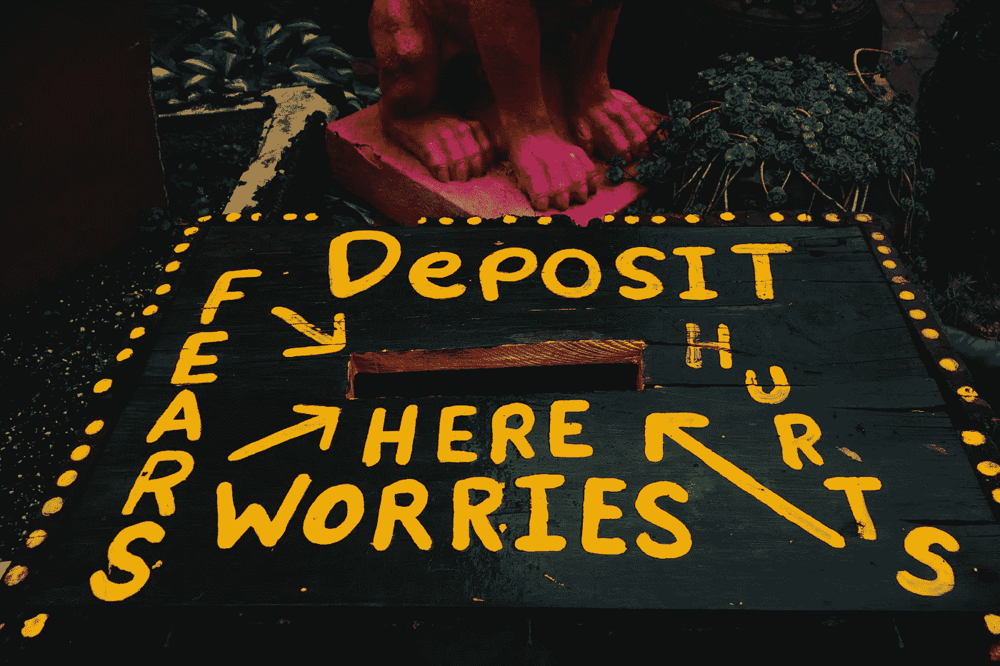

# 傻瓜才会生活在工作狂的恐惧中

> 原文：<https://medium.com/hackernoon/living-with-workaholic-fear-is-for-chumps-29cc8c9c2a9b>

Photo Credit: [Sandra Chile](https://unsplash.com/search/fear?photo=M5-v6gGwoj4)

我非常害怕到了老年会发现自己只是生命中的一个过客，一个乞求玩耍的世界的批评家。发明的负担几乎可以肯定是发明家花了多少时间在他们头脑中生活在不存在的世界里。我担心如果我不够努力，我会被困在这里——作为一名乘客和评论家——淹没在梦想的海洋中，永远无法成长为艺术。

这是一种糟糕的生活方式。这让我选择在周日下午沉浸在塞尔达的世界中，或者在周六享受与朋友在一起的时光、烧烤和啤酒，感觉就像是为了好玩而拍卖 T2 的未来。你知道吗？也许我是。但我也可能在周一被卡车撞，永远看不到我所有的劳动成果。

我不仅很难相信[忽视你的家庭和健康](https://m.signalvnoise.com/trickle-down-workaholism-in-startups-a90ceac76426)对于成功创造持久的东西是必要的，我认为值得冒险去证明另一条道路是否存在。

所以，我打算每天花一天时间做一些我认为我们都会真正受益的事情，随心所欲地利用周末，和我爱的人在一起。也许以后我会改变主意，因为这样做的结果会很差，但我打赌不会。

🎉 🍻❤️ —安迪

如果你不认为这篇文章是垃圾，如果你点击💚以便其他人可以找到它—谢谢！

> [黑客中午](http://bit.ly/Hackernoon)是黑客如何开始他们的下午。我们是 [@AMI](http://bit.ly/atAMIatAMI) 家庭的一员。我们现在[接受投稿](http://bit.ly/hackernoonsubmission)并乐意[讨论广告&赞助](mailto:partners@amipublications.com)机会。
> 
> 如果你喜欢这个故事，我们推荐你阅读我们的[最新科技故事](http://bit.ly/hackernoonlatestt)和[趋势科技故事](https://hackernoon.com/trending)。直到下一次，不要把世界的现实想当然！

