# 在 React Native 中本地化应用程序名称

> 原文：<https://medium.com/hackernoon/localize-an-application-name-in-react-native-c36c4b2be7c3>

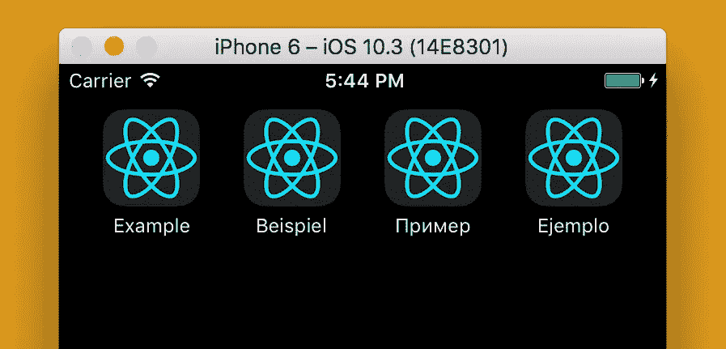

一个 [React Native](https://hackernoon.com/tagged/react-native) 项目和一个 Native 项目中的应用名称的[本地化](https://hackernoon.com/tagged/localization)是一个类似的过程。

## 本地化 iOS 应用程序名称

在 XCode 的根文件夹中创建一个新文件`InfoPlist.string`:

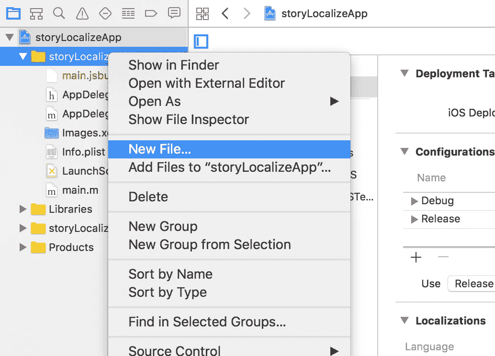

Creating InfoPlist.string in Xcode

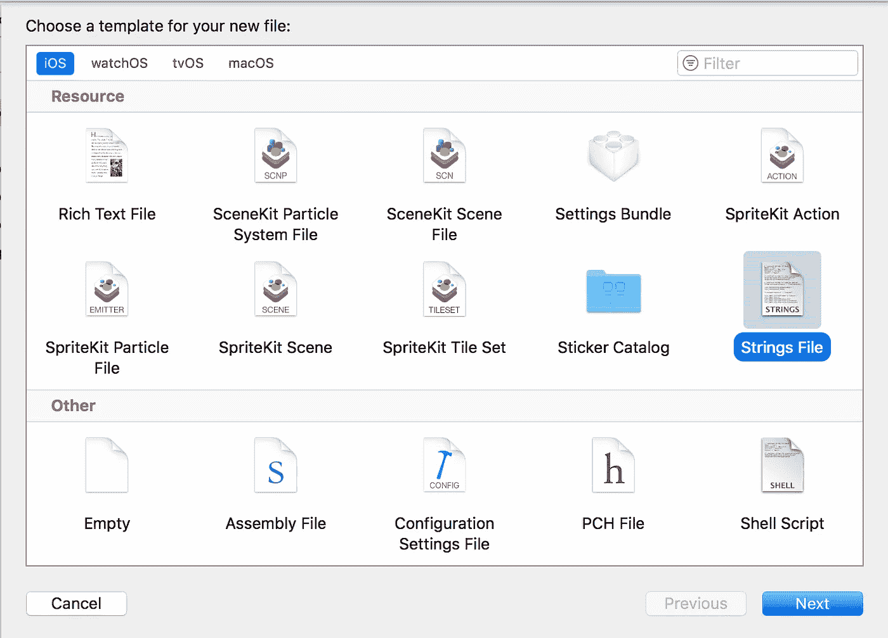

向文件中添加一个默认的应用程序名称，如下所示:

```
"CFBundleDisplayName" = "Example Application Name";
"CFBundleName" = "Example Application Name";
```

其中“示例应用程序名称”是您的应用程序名称。

选择文件，然后按右侧的“本地化…”按钮。

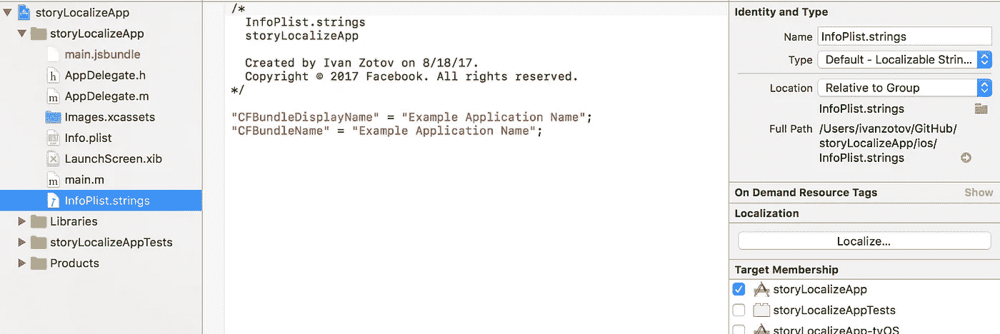

然后按弹出菜单中的“本地化”来添加当前文件作为基本语言。

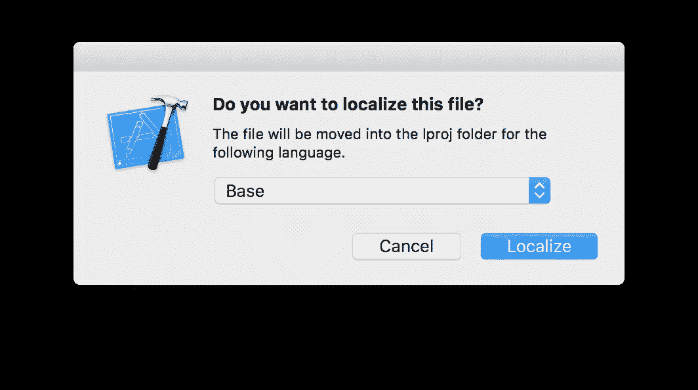

还要更改显示名称，因为最新的 iOS 版本使用它作为备用语言，而不是基本语言:

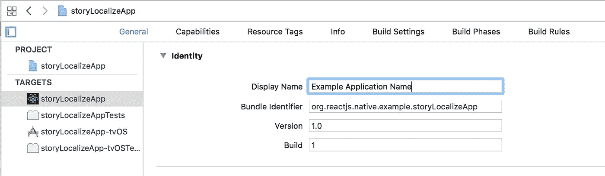

现在，在 XCode 中添加您想要本地化应用程序名称的语言。在项目信息选项卡的“本地化”中按“+”。

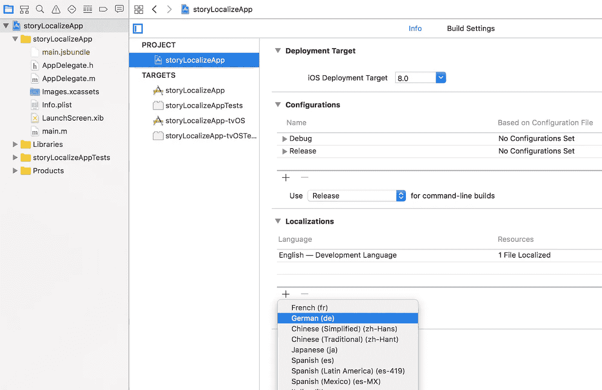

Adding new language in XCode

并选择`InfoPlist.string`文件进行本地化。

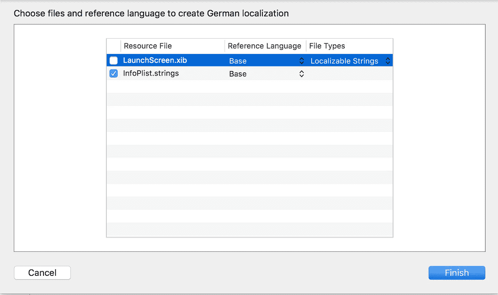

对于您添加的每种语言，XCode 都会为 InfoPlist.strings 创建一个文件。更改本地化文件的内容:

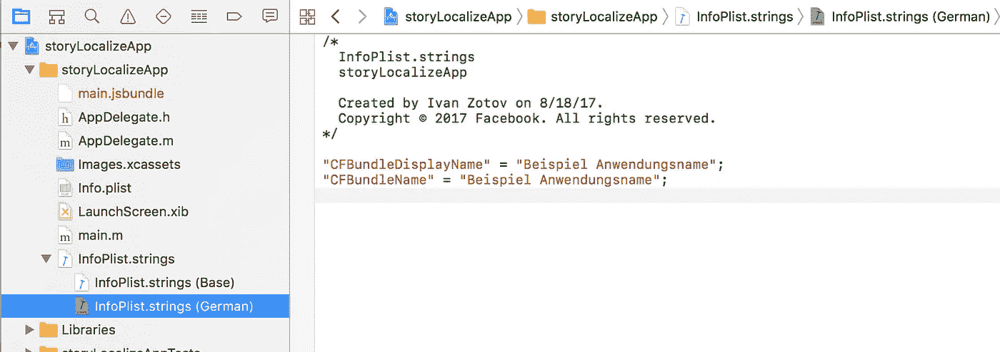

仅此而已！

## 本地化 Android 应用程序名称

默认情况下，Android 应用程序名在 strings.xml 文件中`./android/app/src/main/res/values/strings.xml`:

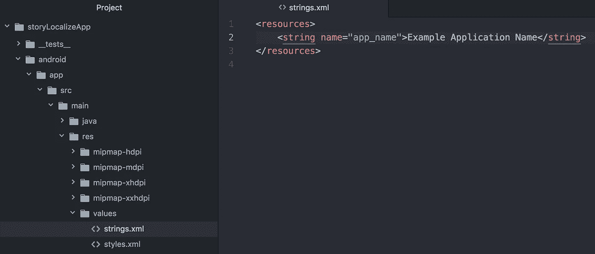

与 iOS 类似，我们将本地化`strings`文件。让我们在`res`中创建一个新文件夹，名称类似于`values-de`，其中`de`是您想要本地化的语言，在我们的例子中是德语([完整代码列表](http://www.loc.gov/standards/iso639-2/php/code_list.php))。

将`strings.xml`复制到文件夹，并更改应用程序名称。

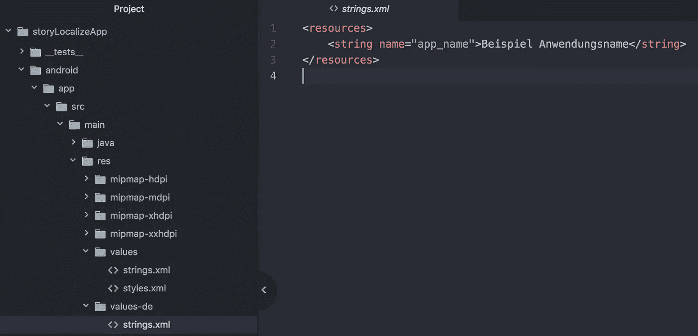

完成了。[关于 Android 本地化的更多信息](https://developer.android.com/training/basics/supporting-devices/languages.html)

谢了。