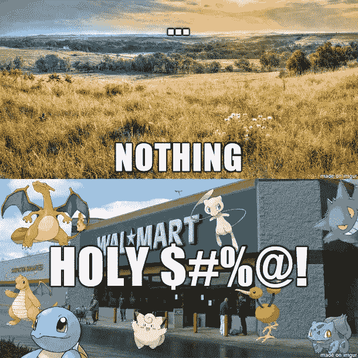
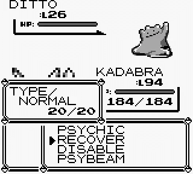

# 基于位置的神奇宝贝——一个“内部人士”的观点

> 原文：<https://medium.com/hackernoon/location-based-pok%C3%A9mon-an-insiders-view-d64385e80a6d>

Early concept art for Geomon in 2011

"*你熟悉*神奇宝贝*吗？这是一个基于从世界各地捕捉和收集宠物的游戏。现在，想象一下，如果这些动物被绘制到我们真实的环境中——在沙滩上玩耍，你会发现一只海龙；探索北极苔原，你会发现一只雪狼。我和我的朋友们基本上是在重新创造神奇宝贝……但是在现实生活中！”*

我在 2010 年为一款受神奇宝贝启发、基于地理位置的 iOS 游戏 Geomon 数千次提出了这个前提。我们筹集了风险投资资金，推出了游戏，并建立了一个强大的全球社区，在我们的日常生活中发现和捕捉虚拟怪物。

这也恰好是 [Pokémon Go](http://www.pokemongo.com/en-us/) 的前提，这是一款风靡全球的病毒游戏，在头 24 小时内在两家应用商店都达到了 [#1。我和我的联合创始人花了数年时间考虑如何将神奇宝贝带到现实世界。我们面临着艰难的决定，如何平衡玩家在这样一个现实中的沉浸感与原始游戏的机械和故事天才。自从 Niantic 宣布开发 Pokémon Go 以来，我一直很好奇他们会如何应对我们面临的这些挑战；他们还必须不辜负人们的期望，为世界上最受喜爱的角色之一谱写新的篇章。在过去的几天里，我捕获了超过 100 个小精灵，12 个 Eevees 和一个超大的 Arcanine，我想分享一下最初的反应，即将到来的障碍，以及我认为游戏将如何从这里发展。](https://www.appannie.com/apps/ios/app/1094591345/)

TL；博士；医生

1.  基于位置的游戏非常棒，但是会变得乏味和重复，尤其是当你的环境没有太大变化的时候。
2.  我正在寻找战斗和交易机制的重大进展。除了收集机制之外，游戏机制作为一个整体是缺乏的。
3.  这款游戏是我童年(和创业)梦想的体现，但我真的希望看到游戏的更多深度，以防止这种狂热消失。

## 我的玉米煎饼里有小拉达

走在市中心的街道上，不可能错过新授权的神奇宝贝训练员挤在一起，跟踪附近的一个慢吞吞的人或在最近的敌人健身房有目的地行走。鼠兔热再次点燃了这个世界，我热爱它的每一分钟。这是一个无与伦比的手机游戏现象，至少部分是因为 Niantic 选择要求用户冒险前往我们现实世界中的兴趣点。之前的热门手机游戏——神庙逃亡、画点什么等等。—经常让用户在家里舒适地玩游戏，依偎在沙发上。Pokémon Go 对于我这样的玩家来说，在家是不能玩的；附近没有名胜古迹，神奇宝贝似乎也没有兴趣去逛逛。所以很多游戏时间都在户外，而且非常显眼。这增加了社会压力，迫使人们加入进来，看看所有的宣传是关于什么的。

2000+ people show up for a Pokemon Go walk in Sydney. Photo credit to Twitter user [@YugSTAR](https://twitter.com/YugSTAR)

我为 Niantic 创造了让游戏玩家活跃起来的东西而喝彩。我观察过训练者停下来互相帮助，给其他爱好者指出一个罕见的神奇宝贝的位置。在技术方面，我认为收集我们周围所有微妙兴趣点的数据库不是一件容易的事。当我发现自己站在一对石狮雕像前时，我有一种奇妙的感觉，我每天在上班的路上都会经过这一对石狮雕像，以前我从未注意过它们。

另一方面，这个重大的游戏决策有着重大的影响。在 Geomon 早期，我们注意到用户 90%的时间都在家里和工作/学校度过。内陆玩家很少看到水怪，许多年轻玩家没有在公园玩的数据计划。没有人愿意等 6 个月来等待雪(以及相应的冰怪)的到来。对于 Geomon，我们的核心价值观是不断利用您的环境来确定出现的怪物。水怪应该只出现在水体和雨中。其他怪物只会出现在游乐园或博物馆。我们选择通过引入交易来“解决”有限选择的问题。这极大地提高了我们的参与度，因为用户开始积极地相互联系来交易怪物。

Balancing Pokémon availability for realism vs. pragmatism is difficult. Photo credit to Reddit user [/u/latorn](https://www.reddit.com/user/latorn)

Pokémon Go 有几个不同的选择，有不同的权衡。他们可以制造更多的怪物，让冰怪在夏天出现。这可能会让一些兴奋地参观国家公园的玩家失望，他们只是发现了和在家里看到的一样的鱼叉和毛虫。他们也可以引入交易，但平衡随之而来的行为变化可能会变得非常棘手。一些玩家可能会选择成为专家“农民”，他们可以转身向那些宁愿呆在家里的人出售稀有的怪物。游戏中的经济和公共发现感可能会失控。如果你仍然怀疑球员会用时间和努力换取金钱补偿，请注意[企业家已经提出以每小时 25 美元的价格为狂热的教练开车。无论做出什么决定，Pokémon Go 最微妙的决定都会影响社会的行为。](http://gizmodo.com/entrepreneurs-are-offering-uber-style-rides-for-pokemon-1783453321)

## 卡比兽…使用超光束！

战斗是最初神奇宝贝游戏的核心机制。有人可能会说这是游戏的核心机制——我们花了 80%的时间与野生怪物和其他训练者战斗。这场战斗在战略上引人入胜，可以说相当平衡。当我还是个孩子的时候，我有很多授权的决定要做，关于我要优化的元素，我要寻找什么怪物来充实我的团队，以及教他们什么技能。

也有大量的发现。单个神奇宝贝背后隐藏的数据允许最专注的训练者在野外找到最强壮的，并训练他们发挥出全部潜力。其他假设不太有效([按下 B 实际上对神奇宝贝捕获](http://kotaku.com/the-pokemon-superstition-that-will-never-die-1695615871)没有帮助)，但理论化同样有趣。

Remarkably simple graphics and options, yet the battle permutations were virtually endless. Good luck, Ditto!

到目前为止，Pokémon Go 中的战斗一直……令人困惑。我的许多朋友都曾试图挑战当地的健身房，但都放弃了，回去继续抓最可爱/最酷的神奇宝贝。敲击变得单调乏味；战斗的回报或好处不明确，不会立即令人满意；很少有人能做出决定来增加你获胜的机会。当被捕获时，每个神奇宝贝的动作都被锁定——老怪物不能学习新的技巧。此外，游戏的“后来者”会怎么样？新诞生的 5 级选手如何在早期采用者停放了 1000+CP snor lakes 的健身房中竞争？几乎没有努力赶上的动力。以狂热爱好者的努力程度，这甚至是不可能的。

有很多成功的手机游戏的例子都是[实现了令人满意的核心游戏循环](http://askagamedev.tumblr.com/post/101776602061/progression-or-skill-tree-systems-the-type-you)。一些人[认为](https://techcrunch.com/2016/07/11/the-brilliant-mechanics-of-pokemon-go/)神奇宝贝 [Go 已经有了出色的机制](https://techcrunch.com/2016/07/11/the-brilliant-mechanics-of-pokemon-go/)；虽然围绕这款游戏的病毒式传播和早期参与有一些强有力的、无可争议的观点，但我不认为这款游戏在目前的情况下有长期保持能力。随着时间的推移，玩家将开始充实他们的收藏，并寻找与他们的神奇宝贝有关的事情。这不是一件容易的事情——有了这种程度的成功，用户群非常多样化。一个成功的游戏机制必须吸引高度策略性的玩家以及更多的普通玩家。Niantic 可以增加更多后代的神奇宝贝，但这只会在有限的时间内延长对游戏的兴趣。开发者添加内容不是一个可扩展的长期策略。一个好的游戏展示了一套广泛的工具，并允许玩家找到使用它们的方法。如果不增加游戏的深度，我担心 Pokémon Go 的寿命。

## 杂念

Comic Credit to [owlturd.com](http://owlturd.com/post/147090507219/we-have-arrived-image-twitter-facebook#notes)

我想简单介绍一下*增强现实*的使用。关于 AR 在 Pokémon Go 成功中的作用的文章已经满天飞[左](https://www.engadget.com/2016/07/12/pokemon-go-augmented-reality/)右[右](http://venturebeat.com/2016/07/12/pokemon-go-proves-investors-were-clueless-about-augmented-reality/)。许多人预言这将是科技行业长期以来预言的顶峰。这是一个很强的特点，强调了神奇宝贝世界和我们自己世界之间的联系。或许更重要的是，这是社交媒体分享的一个非常成功的功能。但是我们不要过分夸大相对简单的技术。现在，这是你相机上的数字标签…非常有趣！但这是一个有趣的支持功能，而不是成功的关键因素。

我还想提一下强大的商业潜力。除了已经达到应用商店的最高票房，并从应用内购买中获得 160 万美元的日收入，还有其他明显的赚钱方式。许多人已经抓住了本地化游戏热点的潜力。[精明的企业主已经开始向那些在他们商店放置诱饵的人提供折扣](https://www.reddit.com/r/pokemongo/comments/4sd0hm/this_is_quickly_becoming_the_trend_downtown/)，吸引附近的神奇宝贝和附近的驯兽师。当地企业会很高兴赞助一个扑克桌或健身房(我注意到我的邻居 Target 明显缺少一个扑克桌)。如果游戏继续繁荣，赚钱的道路是一个既定的。

最后，作为一个 PM 吹毛求疵者，让我们*请*修复教程。这个 app 出来的第一天我就兴奋的下载了。我花时间定制了我的游戏角色，并仔细挑选了我的名字。我抓到了我的第一个首发！(当然是杰尼龟。)然后……*什么都没有*。附近没有神奇宝贝，也没有神奇宝贝出现在我的雷达上。我又让游戏开了 15 分钟，然后就放弃了。这款游戏的病毒式传播证明，尽管如此，很多人还是坚持了下来，但增加几个学习步骤来让一名新教练轻松进入游戏应该不难。

## 我希望看到这种发展的方式

Pokémon Go 是一款革命性的游戏。Niantic 很好地捕捉到了神奇宝贝围绕着我们的本能感觉。当有机会在附近的 Target 看到胖丁时，每周一次的杂货店购物会变得更加令人兴奋。图形很棒，怀旧情绪很强烈。我从未见过另一个游戏如此突然地改变社会。

但是我想要更多。作为一个社会，我们花了无数的时间扔愤怒的小鸟。我们压碎了这么多糖果。没有一款手游是永恒的。但是如果没有更深层次的游戏，我担心这将成为另一个 Flappy Bird 或 [Draw Something](http://www.recode.net/2016/7/13/12176474/pokemon-go-bandwagon-fad-games-draw-something-candy-crush) ，而不是这个有潜力成为的永恒的替代世界。一旦训练者们装满了他们的袋子，进化出了他们的 Gyrados，我希望在另一边找到更多的事情做。我个人很乐意看到同伴之间的争斗和合作繁殖。有如此多的领域有待充实，如此多的地方有待探索。我迫不及待地想知道接下来会发生什么。与此同时，你仍然会发现我在当地公园漫步，捕捉它们。

PS # teamsquirtle #神秘

> [黑客中午](http://bit.ly/Hackernoon)是黑客如何开始他们的下午。我们是 [@AMI](http://bit.ly/atAMIatAMI) 家庭的一员。我们现在[接受投稿](http://bit.ly/hackernoonsubmission)，并乐意[讨论广告&赞助](mailto:partners@amipublications.com)机会。
> 
> 如果你喜欢这个故事，我们推荐你阅读我们的[最新科技故事](http://bit.ly/hackernoonlatestt)和[趋势科技故事](https://hackernoon.com/trending)。直到下一次，不要把世界的现实想当然！

