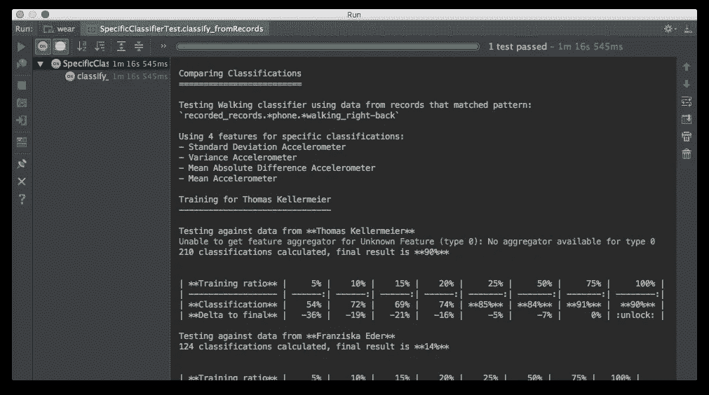
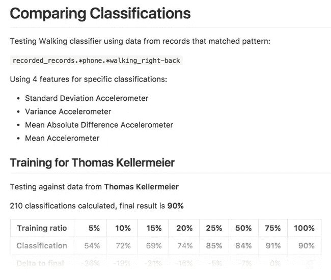
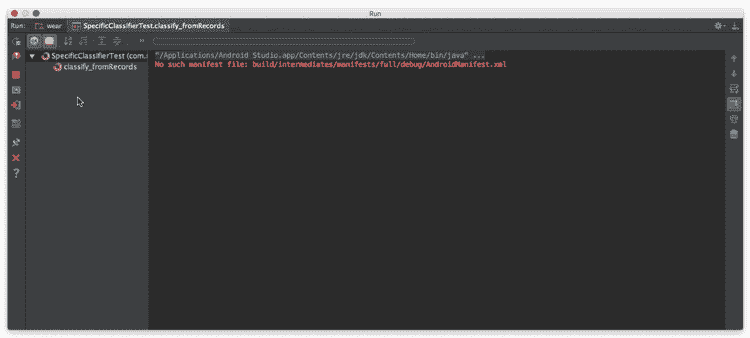

# 用 Java 记录降价

> 原文：<https://medium.com/hackernoon/logging-markdown-with-java-d661226cb527>

test output with markdown formatting

记录可能是一件痛苦的事。阅读日志可能是更大的痛苦。尤其是当你花大量时间分析系统行为的时候。

我经常发现自己处于一种避免浏览现有日志文件的情况。只是因为他们太丑了，我找不到动力开始从他们身上提取有价值的信息。

# 为什么降价？

首先，markdown [语法](https://github.com/adam-p/markdown-here/wiki/Markdown-Cheatsheet)超级简单易学，易于阅读。它看起来很漂亮，即使只显示为等宽文本(例如，在 CI 服务器的控制台中)。如果导出并呈现(例如，在您的版本控制系统中)，您可以按原样将其交给您的主管。

上例中的[测试输出](https://gist.github.com/Steppschuh/0e79c87f49eae49ad170f3851fe3f7f9)看起来像是手工制作的性能报告:

test output rendered by GitHub

# 为什么所有的努力？

因为创建可读日志所花费的时间将减少实际读取这些日志所花费的时间。类似于重构经济学的。

别担心，你不必摆弄一堆语法字符串来创建有效的降价。Java Markdown Generator 库包含了我们项目中经常用到的助手类，它们会为你做所有的艰苦工作。大多数元素可以内嵌创建:

你可以使用这个库来创建标题、链接、图片、引号、代码、列表甚至表格。所有这些 markdown 元素的示例代码可以在 [GitHub 库](https://github.com/Steppschuh/Java-Markdown-Generator)中找到。

## 奖金

如果你想全力以赴，你可以让你自己的类实现*markdowserializable*接口。这对于用一行代码序列化整个对象(例如序列化为 markdown 表的自定义矩阵实例)很方便。

test output being generated

> [黑客中午](http://bit.ly/Hackernoon)是黑客如何开始他们的下午。我们是阿妹家庭的一员。我们现在[接受投稿](http://bit.ly/hackernoonsubmission)并乐意[讨论广告&赞助](mailto:partners@amipublications.com)的机会。
> 
> 如果你喜欢这个故事，我们推荐你阅读我们的[最新科技故事](http://bit.ly/hackernoonlatestt)和[趋势科技故事](https://hackernoon.com/trending)。直到下一次，不要把世界的现实想当然！

