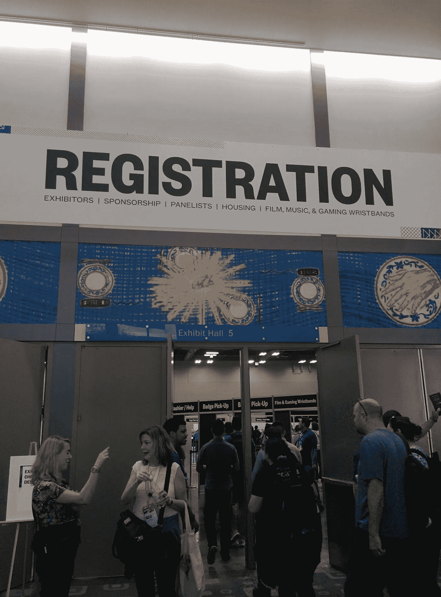
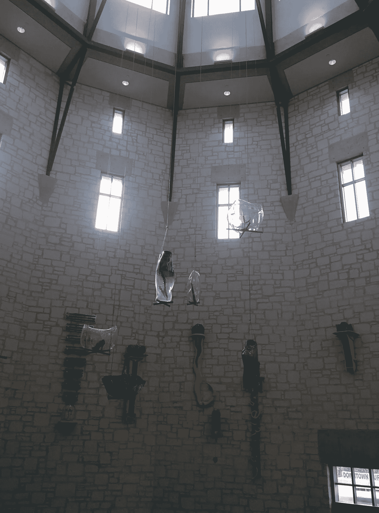
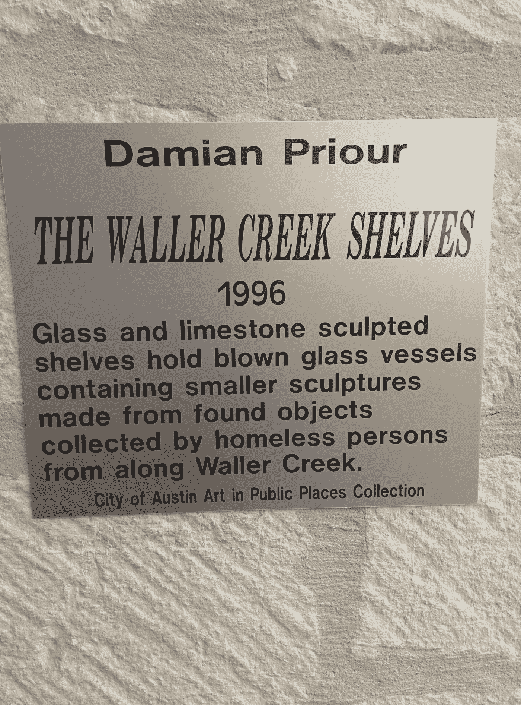
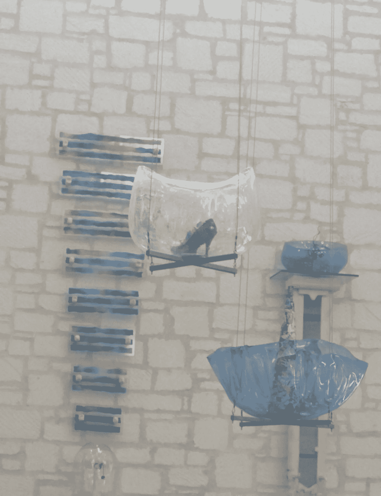
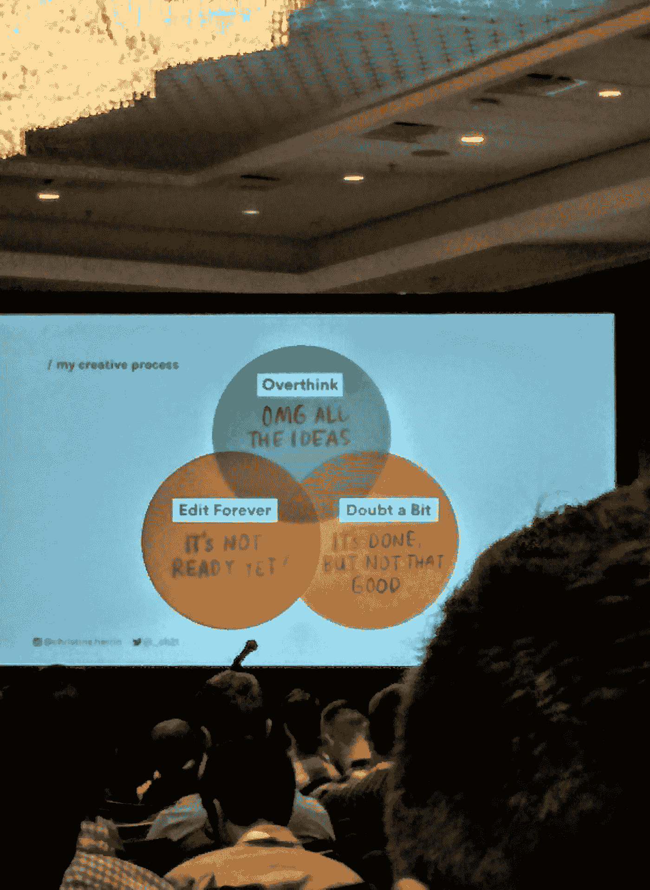
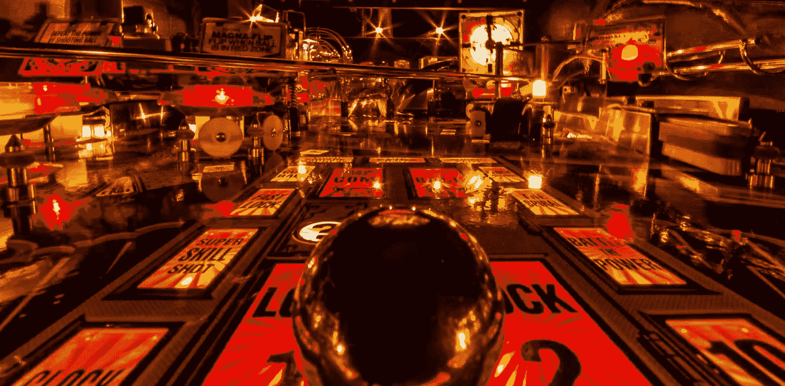
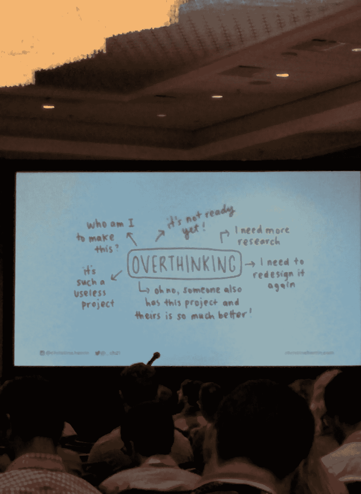
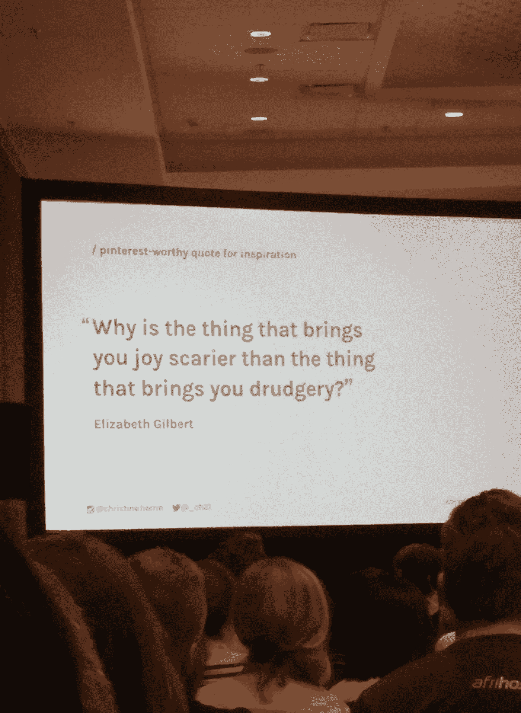

# 长长的队伍、拥挤的人群和丰富的信息

> 原文：<https://medium.com/hackernoon/long-lines-big-crowds-and-information-galore-875ade2065d>

> 虽然我最初打算在每天快结束时写博客，但我意识到时间限制与我的目标不符。相反，我会张贴一个相应的从前一天。

随着旅程的第二天，也就是我参加会议的第一天，我发现自己很敬畏。简而言之，在这个南部市区收集到的知识量是惊人的。

不过，在我们深入讨论这些之前，我相信你正在寻找脚部情况的最新消息。我很高兴地告诉大家，我的脚肿得很小，几乎看不出来。我将不提供图片作为证明，但下面会有更多有趣的照片。

让我们从早上开始。我和我的同事在睡了一觉后到达了会议中心。前一天的旅行让人筋疲力尽，昨晚我们谁也不想离开舒适的酒店房间去市区旅行。相信我，在晚餐时，我们每个人都试图想出一个坚实的理由，为什么我们可以跳过那天晚上得到我们的徽章，而是今天早上得到它们。当然，我们都知道得更清楚，我们去了。当我们走进徽章室时，我们所看到的是制造迷宫的支柱，今天的与会者将通过它们来浏览他们参加会议的能力。当我们到达那里时，那里几乎空无一人，迷宫的巨大和复杂程度让我们无法想象第二天早上会有多少人蜂拥而至。

今天早上，我们到了，我们都想看到我们避开的人群。毕竟，在大约 16 个小时的旅行后，为了让我们在前一天晚上获得徽章而排出的能量是需要回报的。它的回报是。离会议开始还有 15 分钟时，街上空无一人；我们觉得我们来早了。然而，一进入会议中心，嗯…瞠目结舌几乎无法形容。我们期望看到满员的房间不见了。与会者的队伍一直延伸到视线所及之处。因此，出于好奇，我们步行去寻找尽头，但它走得更远。难怪外面没有人。很明显，所有存在的人都在这栋楼里。

对前一天晚上的选择感到满意，我们漫步穿过不同的建筑和街道，以找到我们的方向。

I’m a sucker for any circular or tubular space. This installation, within the convention center, has a beautifully powerful message.

Looking, you can see a single shoe within one of the hanging pieces.

时间一到，我们(阿曼达、丹、简和我)就分成四个不同的方向去参加我们的第一次会议。

这是我第一次失望的地方。整整四个有趣的与设计相关的会议同时被安排。我只能选一个。我要说的是，在我第一次尝试之后，我意识到了这个时间表背后的智慧。根本没有办法让所有的设计爱好者聚在一个房间里。因此，当您由于容量原因从一个引导时，其他选项可能仍然可行。

我选择了“还没准备好:完美主义者的奋斗”，鼓舞人心的 Adobe 创意常驻 Christine Herrin 没有让人失望！

在日常工作生活中，我和其他设计师说话很少。此外，虽然我不会低估我与同事之间的关系所带来的美妙的创造力和鼓励，但我喜欢被一大群说“我的语言”的人围绕着。

作为一名内部设计师，我自己与创作过程相关的内心对话可能是孤立的。是不是所有的设计师都和我一样有很多自我怀疑？结果发现这很常见。克里斯汀以真正的设计师风格诠释了它。

是的，这就是我在大多数项目中的大多数日子的感受。尽管简单地阅读这张图片似乎有点令人沮丧，但图片却让位于一屋子的笑声。毕竟——当那是你内心的对话时——最好从中找到幽默。

随着 Christine 继续讲下去，我开始真正地问自己关于我自己的设计过程。看过那些老式的弹球街机游戏吗？你知道，在那些游戏中，你的目标是通过将球击过一点点障碍来得分——这是一个非常精力充沛且经常是暴力的过程。

我认为这是总结我自己的创造性思维的最好方式:新的想法以闪电般的速度四处跳跃，直到不可避免的最终确定。

在追求完美主义的过程中，Christine 清晰地阐述了她如何确定自己过程中的缺陷可能会阻碍生产力。听着她走过的旅程，我很容易开始识别自己的成功和机遇。

## 想多了…是的，我可能还有一些空间来做这件事。

## 我从未想过恐惧会影响我的创造力。

从那以后，更多的会议、聚会和一生一次的谈话占据了我的一天。虽然我在我的职业领域周围学到了很多，但我也学到了一些随机的新手-SXSW 的东西:

*   当你试图与一个人见面时，非常明确你将在哪里是非常重要的。(这是给 UMD Viz 实验室的 Lisa Fitzpatrick 的——对不起，我不是故意要站在离你四英尺远的地方 20 分钟，同时给你发短信，看看我们是否在同一个地方。)
*   如果你打算写博客，当你站在长长的队伍中希望进入下一个环节时，你最好花时间写。
*   不要对你的包太有信心。一个东西适合，不代表它的重量可以支撑。(这是一个不错的包；我们玩得很开心。)
*   我对项目符号列表有种奇怪的痴迷。
*   不要在乘坐自动扶梯时猛拍，不管这看起来多么有效率。
*   不要试图进入新闻发布室。即使是意外，他们也不喜欢那样。

会议第二天已经很有希望了。请继续关注，直到明天——它甚至可能会为你提供另一张足部图片。

> [黑客中午](http://bit.ly/Hackernoon)是黑客如何开始他们的下午。我们是 [@AMI](http://bit.ly/atAMIatAMI) 家庭的一员。我们现在[接受投稿](http://bit.ly/hackernoonsubmission)，并乐意[讨论广告&赞助](mailto:partners@amipublications.com)机会。
> 
> 如果你喜欢这个故事，我们推荐你阅读我们的[最新科技故事](http://bit.ly/hackernoonlatestt)和[趋势科技故事](https://hackernoon.com/trending)。直到下一次，不要把世界的现实想当然！

