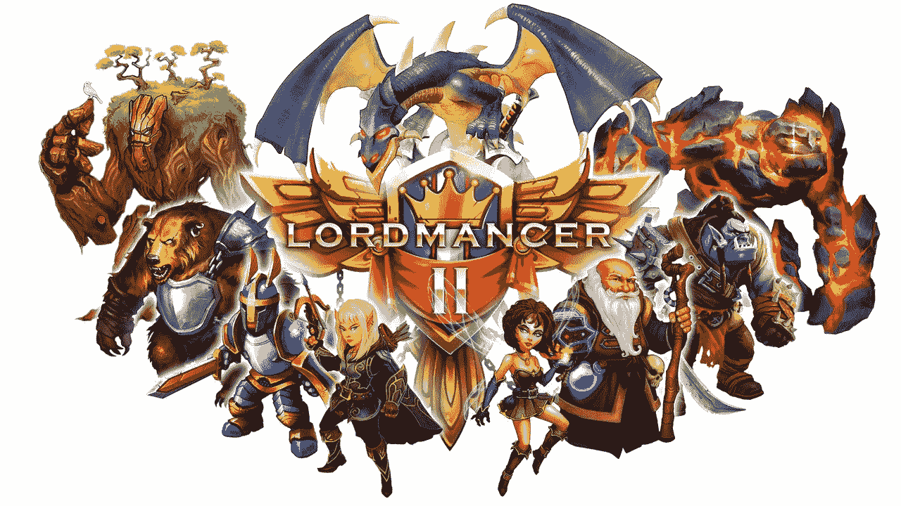
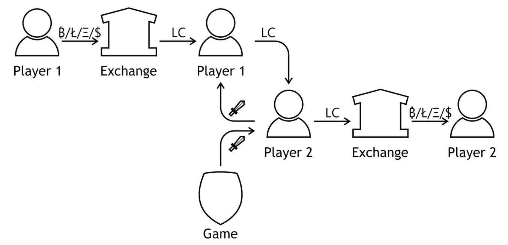

# Lord mancer II——一款移动 MMORPG，承诺让玩家在游戏时开采加密货币

> 原文：<https://medium.com/hackernoon/lordmancer-ii-a-mobile-mmorpg-promising-to-let-its-players-mine-cryptocurrency-while-playing-698a7de2d092>

玩家想在玩游戏的同时赚钱的愿望并不新鲜。

游戏中的真实货币交易一直是非法的，或者至少是被大多数游戏开发者强烈反对的，尤其是在 MMORPGs 中。巧合的是，在 MMORPG，真实货币交易最常见，因为这些游戏总是有虚拟经济，游戏“黄金”和其他资源有一些真实的价值。真钱交易可能是一笔大交易，已知最贵的一笔交易是在一款名为“宇宙熵”的游戏中花费 600 万美元！

Lordmancer II 是一款适用于运行 Android 和 iOS 的手机和平板电脑的 MMORPG。游戏基本可以出货了。它目前正在俄罗斯试运行。还有很多游戏内容需要添加，但是游戏的框架已经存在了。留存和支付指标看起来已经不错了。

Lordmancer II 试图通过引入加密货币令牌作为第二种“硬通货”，使通常“非法”的游戏项目市场合法化。这款游戏有两种“硬货币”和一种软货币，“黄金”，分别被称为“金币”和“水晶”。最稀有和珍贵的武器和物品只能用贵族币购买，贵族币本质上是一种基于以太坊的加密货币代币。

Scheme of Token turnover

Lordmancer II 鼓励其玩家在游戏中“耕种”稀有珍贵的武器和神器，并出售给其他玩家，在此过程中赚取 LC。这些信用证随后将在一个密码交易所为 BTC 或瑞士联邦理工学院出售。此外，玩家将被鼓励“培养”出售的角色。

为了让那些不熟悉加密货币的人不那么复杂，Lordmancer II 将提供在游戏内外直接用法定货币购买 LordCoins 的方法。通过这种方式，准备在游戏物品上花很多钱的有钱玩家(“鲸鱼”)将有一种方便的方式来购买稀有物品，而那些愿意赚点钱的玩家将有机会在不违反游戏政策的情况下，以公开、公平、受支持和透明的方式来购买稀有物品。

随着 LCs 的每一次交易，游戏会消耗掉一部分相关的代币。这将导致市场上可用的信用证数量不断减少，进而推高剩余信用证的价格。

Lordmancer II 已经在俄罗斯进行公开测试，并将于 2018 年在全球推出。

8 月 Lord mancer II pre-ICO 5 天售罄。

ICO 主赛于 10 月 23 日开始。

更多关于游戏及其 ICO 的信息，请点击这里:[http://lordmancer2.io/](http://lordmancer2.io/)

关注[推特](https://twitter.com/LordmancerI)，加入[脸书](https://www.facebook.com/Lordmancer2)、 [Reddit](https://www.reddit.com/r/Lordmancer2/) ，或[电报](https://t.me/lm2ico)讨论项目。