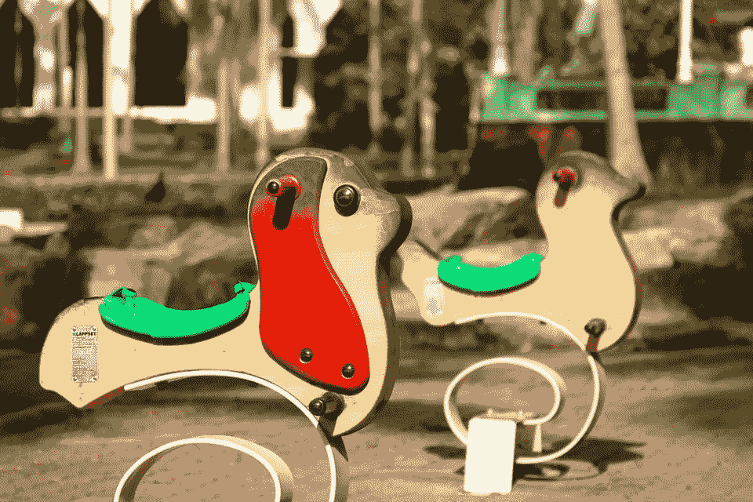

# 迷失男孩想要一只独角兽

> 原文：<https://medium.com/hackernoon/lost-boys-want-a-unicorn-4d91ed5d302f>

想着黑进系统来摆脱所有无聊的责任？我有好消息告诉你。通往梦幻岛的秘密通道已经打开。

一旦你完成高等教育，生活就会变得无聊。突然之间，你要变得…成熟。找份工作。还清你的学生贷款。可恶。哪个聪明、大胆的 20 多岁的年轻人会想要这个呢？我们能做点什么吗？

很高兴你这么问。欢迎来到创业世界。

我们喜欢称这个地方为迷失男孩最大的梦想。这里我们有巨大的操场，慷慨地装备着啤酒喷泉、乒乓球桌和其他无用的东西。你的大叔叔们为你提供所有你需要的钱，魔法仙女们照顾你生活中每一个无聊的部分(想想:洗衣，会计，官僚。他们甚至倒垃圾和更换厕所纸卷！)你需要做的就是玩:写代码，设计闪亮的图形，在社交媒体上制造一些轰动。每天下午比萨饼将被直接送到你的办公桌上。

过程中不用担心擦伤膝盖。你所有的失败都会被原谅；毕竟，这是一个冒险的游戏。如果你跌倒了，那里，那里，再拿些钱，你就可以重新开始。

好得难以置信？我们已经看到很多小男孩成功了，所以我们想推广这个模式。来加入我们吧，生活可以是童话！

但请记住，这一切都是为了快速取胜。你的成功需要立竿见影，否则就不算数。你的不公平优势是什么？告诉我你的电梯推销。你将如何智胜你的竞争对手？什么，你还在想？Pff，松一点！我已经领先三个想法了！快点，给我答案！把数字给我！现在！快点！更多！要么变大，要么变快，要么马上滚蛋！

等等，你被烧坏了？抑郁？不想玩了？哦，好吧。努力工作，尽情玩耍。英年早逝。这些是规则。

所以，请记住:如果你与众不同，如果你不够积极，不够专注，不够自虐，甚至不要试图冒险进入这个巨大的游乐场。你会退学的。你会看起来很傻。你是一个试图筹集投资者资金的女人吗？对不起，你的想法不够孩子气。你已经三十多岁了吗？抱歉，你穿男孩短裤不好看。如果你不是一个小男孩，不要试图成为一个。你不能在迷失的男孩自己的游戏中打败他们。

这是下一件大事的秘诀:建造一个巨大的游乐场，让一些渴望、好斗、顽强的小男孩进来，看他们玩耍。有些人会摔断腿或抓破鼻子。有些人会偷其他男孩的玩具，然后据为己有。有些会掉进一个巨大的水坑里淹死。那很好。最强的将生存下来。他们的血汗和泪水将召唤下一只独角兽。这只神奇的野兽最终将成为一个时髦的噱头，一个奇特的玩具。毕竟，这将是小男孩的创作。

然而，小男孩会喜欢这种安排。迷恋创造大的和破坏性的东西的可能性(毕竟，他们喜欢打破东西！)，他们会仰望他们的大叔叔们，梦想着有一天他们也能像他们一样:创造出令人惊叹的游乐场。让其他小男孩永远长不大。

如果你想在宇宙中有所作为，不要以创业为目标。不要再为新潮的千禧一代建立另一个很酷的照片分享/社交媒体/狗屎点播应用程序。把操场留给小男孩，做点有意义的事。拿出点勇气，开创真正的事业。时髦会消失，时尚永远不会。

当然，你可能永远也登不上黑客新闻的头条。可持续的增长和稳定的利润并不像一夜成名那样吸引人。但是创新企业一直都在创造。聪明、有创造力的人不一定要去游乐场才能建造出真正伟大的东西。

所以不要试图成为一种感觉。停止追逐独角兽——成长，他妈的，向上。创业，而不是创业。

> [黑客中午](http://bit.ly/Hackernoon)是黑客如何开始他们的下午。我们是 [@AMI](http://bit.ly/atAMIatAMI) 家庭的一员。我们现在[接受投稿](http://bit.ly/hackernoonsubmission)，并乐意[讨论广告&赞助](mailto:partners@amipublications.com)机会。
> 
> 如果你喜欢这个故事，我们推荐你阅读我们的[最新科技故事](http://bit.ly/hackernoonlatestt)和[趋势科技故事](https://hackernoon.com/trending)。直到下一次，不要把世界的现实想当然！

