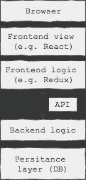
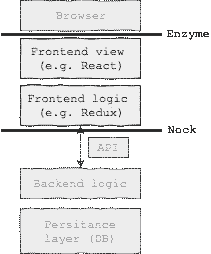

# 低努力，高价值。Redux 应用中的集成测试。

> 原文：<https://medium.com/hackernoon/low-effort-high-value-integration-tests-in-redux-apps-d3a590bd9fd5>

## tldr 您可以通过在 node 中呈现 Redux 应用程序、模拟用户交互并验证状态和标记的变化来测试它。这些测试相对容易编写，运行速度快，并且给人很多信心。

编写高效的软件测试是一项棘手的平衡工作。关于效率，我不是指执行速度或资源消耗，而是指在编写测试所付出的努力和它们所提供的价值之间找到平衡点。

这不是一个新的或未知的问题。许多聪明人在过去思考过这个问题，并建立了可以帮助开发人员解决这个问题的指导方针。我非常相信[测试金字塔](https://martinfowler.com/bliki/TestPyramid.html)，它规定了一个健康的测试套件中不同类型测试的相对数量，单元测试是坚实的基础，单独覆盖每一段代码。

## 单元测试和冗余

Redux 鼓励的结构使得编写单元测试变得轻而易举。你可以要求应用程序的不同模块(想想 reducers、action creators、containers 等等。)隔离，并像测试任何其他纯函数一样测试它们——测试数据输入，断言数据输出，不需要模拟。[Redux 文档中的测试指南](http://redux.js.org/docs/recipes/WritingTests.html)列出了每个模块的单元测试方法。

按照这个指南，你可以通过繁琐的从 reducer 到 reducer，从 action creator 到 action creator 的复制粘贴测试来获得一个完整的单元测试覆盖...但是一旦所有的工作都完成了，测试金字塔就会反击。由于只是单元测试，测试套件仍然没有回答最基本的问题——应用程序实际上能工作吗？

## 攀登金字塔

在 webapp 的上下文中，有几种方法可以解释测试金字塔的上层。顶部的端到端(e2e)层可以使用 Selenium 实现，例如使用 [webdriver.io](http://webdriver.io/) 。这些测试是技术不可知的，所以即使你移植你的应用程序使用不同的框架，它们仍然有效。然而，它们需要很长时间来实现和运行，很难调试，而且经常是易变的。通常一个项目可以并且应该只负担相对较少的一部分。

单元测试和 e2e 测试之间的那一层呢？一般来说，这些被称为集成测试，因为它们验证了应用程序中的不同模块如何协同工作。集成测试的范围很广。例如，有人可能会说，如果 reducers 的测试使用动作创建者来分派动作，那么它已经不仅仅是一个单元测试了。另一方面，e2e 测试可以被看作是集成测试的最极端的例子。

似乎可以尝试在 Redux 中找到集成测试的最佳点。理想情况下，它们应该足够快，可以作为开发流程的一部分运行，它们应该使用与单元测试相同的测试基础设施，并且它们应该对 Redux 管理的 webapp 的整个部分按预期工作有足够的信心。

## 寻找界限

找出测试边界的位置是一个很好的起点。大多数 webapps 的结构可以表示如下:

Typical high-level structure of a webapp

系统的某些部分需要被模拟，以实现测试的期望特征。从顶部看，最大的限制因素是浏览器。启动一个浏览器实例(甚至是一个无头浏览器)来运行测试将比在 node 中运行一些代码花费更长的时间。从根本上说，我们不想等待真正的请求完成。[网络](https://hackernoon.com/tagged/network)层也是一个定义明确的接口，很容易被模仿。

## 嘲笑边界

假设该应用程序使用 React 和 Redux，那么很容易编写它，使它在测试期间可以在 node 中平稳运行(或者如果在服务器端进行渲染，甚至可以在生产中运行)。这意味着可以使用优秀的 [Jest](https://facebook.github.io/jest/) 测试框架来运行测试，也可以使用 [enzyme](https://github.com/airbnb/enzyme) 来渲染部分或全部应用程序，并与它进行交互，而不需要实际的浏览器环境。

Enzyme 提供了一个`mount`函数，可以用来渲染任何 React 组件并与之交互，比如一个完整的 Redux app。为了减少每个测试的样板文件，编写一个简单的实用函数是很有用的，这个函数用给定的状态呈现应用程序，并返回酶的包装器对象，以及 Redux store 对象(这在断言中会很方便)。

Utility for rendering Redux application with arbitrary state, and an example of usage

在 node 中运行测试还可以为网络层启用一些干净的模拟解决方案，例如 [nock](https://github.com/node-nock/nock) 库。Nock 使得在运行特定测试之前声明网络请求的响应数据和代码以及错误变得很容易。模仿成功的 GET 请求可能是这样的:

Example of mocking a network request with nock

有了这个设置，运行集成测试的便利性和速度应该不会比单元测试差太多。剩下的就是实施了…

Mocked boundaries for Redux integration tests

## **考什么？**

对应用程序的正确运行最有信心的集成测试是那些从用户角度出发的测试。目标是验证一旦用户通过点击按钮、填充表单元素等与应用程序交互。，应用程序通过修改自身或执行预期的副作用来做出响应。

让我们考虑一个提交表单的简单场景。我们使用已经填充的数据呈现应用程序，并模拟用户单击提交按钮。我们还确保对我们的应用程序要调用的 API 端点的请求会成功。

Boilerplate for the integration test with Jest

## 什么时候测试？

在深入实现断言之前，还有一个问题需要解决:何时运行它们。在一个简单的例子中，当应用程序中的所有更改同步发生时，您可以在模拟用户操作后直接运行断言。然而，你的应用程序最有可能使用 Promises 来处理代码的异步部分，例如网络请求。即使请求被模拟为同步解析，成功承诺处理程序也将严格在位于`submitButton.simulate('click')`行正下方的任何代码之后运行。在我们开始断言之前，我们需要等待我们的应用程序“完成”。

Jest 提供了几种处理异步代码的方法，但是它们要么需要一个指向 promise 链的直接句柄(在这个例子中没有),要么需要模拟计时器(不能处理基于 promise 的代码)。你可以使用`setTimeout(() => {}, 0)`，这迫使我们使用 [Jest 的异步回调特性](https://facebook.github.io/jest/docs/asynchronous.html#callbacks)，但是这将使测试代码不那么优雅。

然而，这个问题有一个很好的解决方案，它是一个一行的实用函数，创建一个在事件循环的下一个节拍解决的承诺。我们可以使用 Jest 的内置支持来从测试中返回一个承诺:

Elegant solution to running assertions for Promise based code without handle to the Promise chain

## 怎么考？

有哪些选项可以验证应用程序是否正确响应了用户交互？

**加价。**您可以检查页面的标记，以检查 UI 是否被正确修改，例如使用 [Jest 的快照功能](https://facebook.github.io/jest/docs/snapshot-testing.html)。注意:为了进行下面的测试，您需要设置一个 Jest 快照序列化程序，例如使用 [enzyme-to-json 包](https://github.com/adriantoine/enzyme-to-json#serializer)。

Using Jest’s snapshot feature to verify markup changes

这种断言非常容易编写，但是使用它们的测试往往不够集中。应用程序标记的快照可能会经常改变，使你看似不相关的测试失败。他们也不记录预期的行为，只验证它。

**国家。**检查对应用程序状态的修改。这在具有集中式存储的 Redux 应用程序中很容易，如果状态是分布式的，可能会更棘手。在这种情况下，也可以使用快照，但我更喜欢对象文字的明确性。

Verifying changes in Redux store state

这种类型的断言不太以用户为中心，因为存储状态位于应用程序的“底层”。然而，像这样的测试不太容易受到由设计驱动的标记变化引起的剥落的影响。

**副作用。**根据您的应用，您可能需要检查其他副作用(例如网络请求、对`localStorage`的更改)。例如，您可以使用 nock 的`[isDon](https://github.com/node-nock/nock#isdone)e` [方法来验证所创建的请求模拟已经被使用。](https://github.com/node-nock/nock#isdone)

**调度动作。**这种方法利用了 Redux 最强大的特性之一，即动作的可序列化日志。我们可以使用它来断言分派给商店的动作序列，例如，借助于有用的 [redux-mock-store](https://github.com/arnaudbenard/redux-mock-store) 库。首先，需要修改`renderAppWithState`方法以使用 Redux store 的模拟版本，这样 store 就公开了一个`getActions`方法。

Verifying the sequence of actions dispatched to the store

这种类型的断言对于更复杂的异步流尤其有用。它还提供了应用程序在测试场景中的预期行为的清晰概述，作为文档。

## **寻找平衡**

引入这种类型的集成测试不应该意味着跳过单元测试。大多数部分，尤其是应用程序的逻辑密集型部分(如 Redux 应用程序中的 reducers 或选择器)仍然需要进行彻底的单元测试。金字塔仍然适用！然而，集成测试是对测试工具箱的有效补充，应该有助于构建一个健康的测试套件，尽可能减少痛苦，并允许更有信心的部署。

软件测试是业界最固执己见的话题之一。在回顾这篇文章时，我的一个同事指向了一篇名为“[集成测试是一个骗局](http://blog.thecodewhisperer.com/permalink/integrated-tests-are-a-scam)”的文章。作者提出的一些观点是有道理的，但在我看来事情并不是非黑即白的。你怎么想呢?

> [黑客中午](http://bit.ly/Hackernoon)是黑客如何开始他们的下午。我们是 [@AMI](http://bit.ly/atAMIatAMI) 家庭的一员。我们现在[接受投稿](http://bit.ly/hackernoonsubmission)并乐意[讨论广告&赞助](mailto:partners@amipublications.com)机会。
> 
> 要了解更多信息，[请阅读我们的“关于”页面](https://goo.gl/4ofytp)，[在脸书上点赞/给我们发消息](http://bit.ly/HackernoonFB)，或者简单地说， [tweet/DM @HackerNoon。](https://goo.gl/k7XYbx)
> 
> 如果你喜欢这个故事，我们推荐你阅读我们的[最新科技故事](http://bit.ly/hackernoonlatestt)和[趋势科技故事](https://hackernoon.com/trending)。直到下一次，不要把世界的现实想当然！