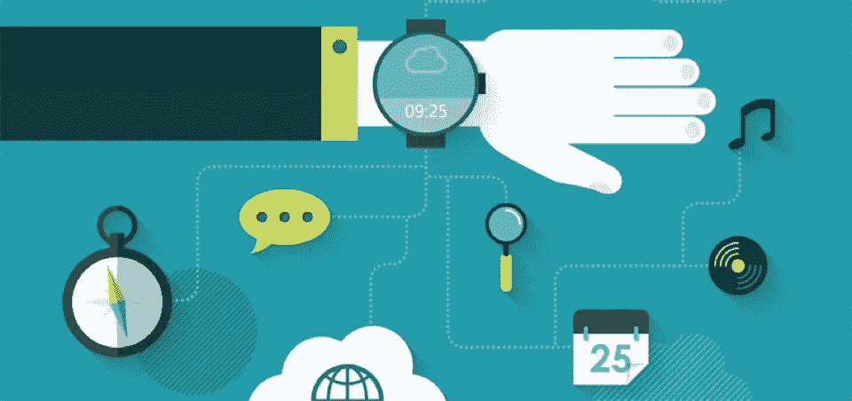
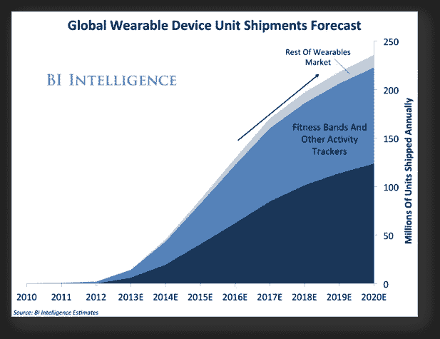
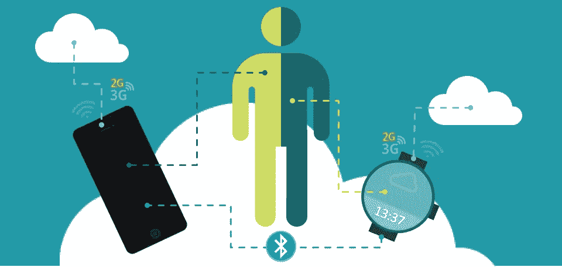

# 低端中国物联网可穿戴设备——隐私和安全问题的探讨

> 原文：<https://medium.com/hackernoon/low-end-chinese-iot-wearables-a-dive-into-privacy-and-security-concerns-54bb0deeb954>

在过去几年中，“可穿戴设备”市场呈指数级增长，为一种新的经济形式和一场工业“革命”(又称工业 4.0)的兴起树立了许多预期。

“可穿戴”设备不再只是一个有远见的时髦词，而是大量存在于我们的日常生活中，有时我们并没有意识到这种无处不在。

企业研究和市场洞察表明，最相关的市场份额现在由智能手表和活动追踪器品牌占据，如下所示。

让我们来看看“可穿戴”生态系统，以及其表面之下是什么。我们为这个永远相连的世界付出的隐性成本是什么？

这些设备中的大多数无孔不入，已经在我们的日常生活中，但哪些网络安全威胁隐藏在幕后？我们的隐私受到威胁？

我们正在集体开始用“酷”、可用性和低价来换取我们的网络隐私和安全吗？不幸的是，最新的 DNI 报告一点也不令人放心:

“智能”设备在日常生活中的广泛应用正在改变人和机器之间以及与周围世界的互动方式，这通常会提高效率、便利性和生活质量。它们的部署也在它们支持和依赖的基础设施以及它们指导的流程中引入了漏洞。网络参与者已经使用物联网设备进行分布式拒绝服务(DDoS)攻击，我们估计他们将继续这样做。未来，国家和非国家行为者可能会使用物联网设备来支持情报行动或国内安全，或者访问或攻击目标计算机网络。”

我们将于 2017 年 6 月 23 日至 24 日在[电子隐私 2017 —夏季版](http://e-privacy.winstonsmith.org/)上讨论物联网网络安全威胁和隐私问题

> [黑客中午](http://bit.ly/Hackernoon)是黑客如何开始他们的下午。我们是 [@AMI](http://bit.ly/atAMIatAMI) 家庭的一员。我们现在[接受投稿](http://bit.ly/hackernoonsubmission)并乐意[讨论广告&赞助](mailto:partners@amipublications.com)机会。
> 
> 如果你喜欢这个故事，我们推荐你阅读我们的[最新科技故事](http://bit.ly/hackernoonlatestt)和[趋势科技故事](https://hackernoon.com/trending)。直到下一次，不要把世界的现实想当然！

