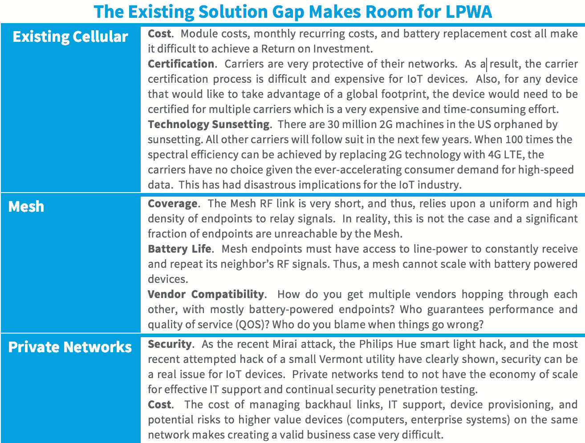
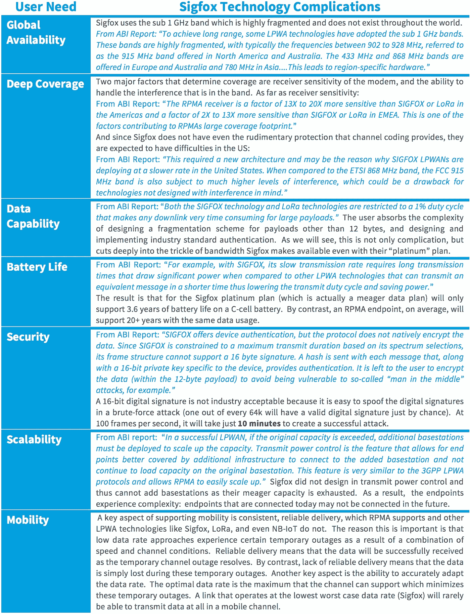
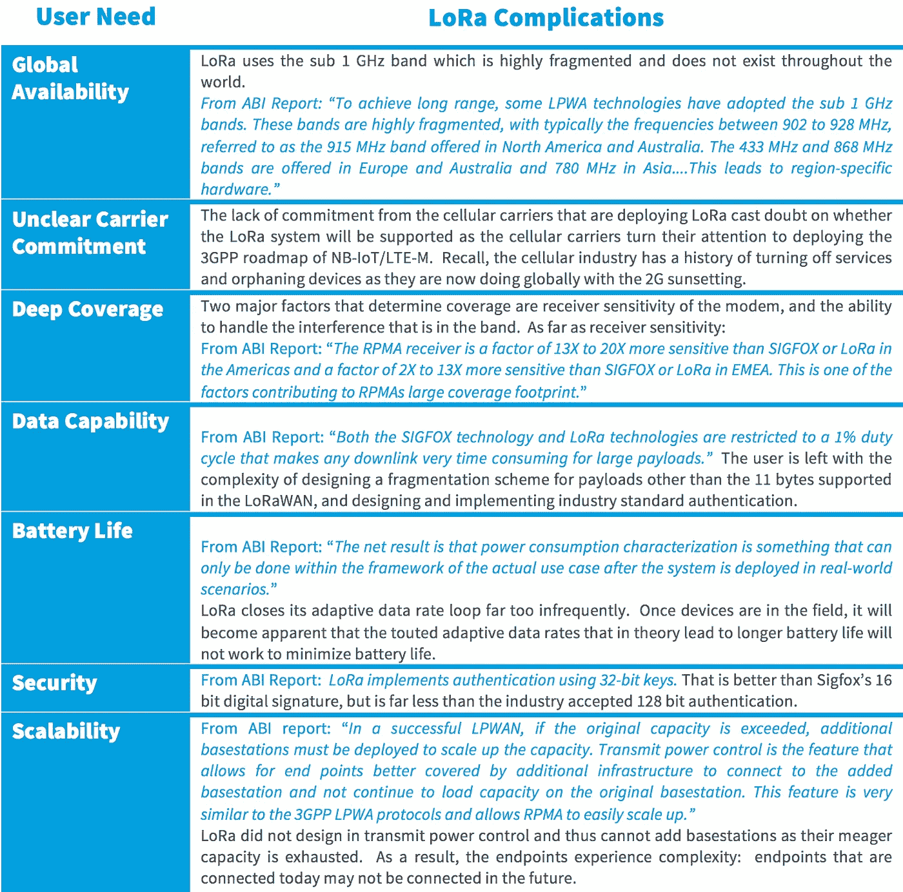
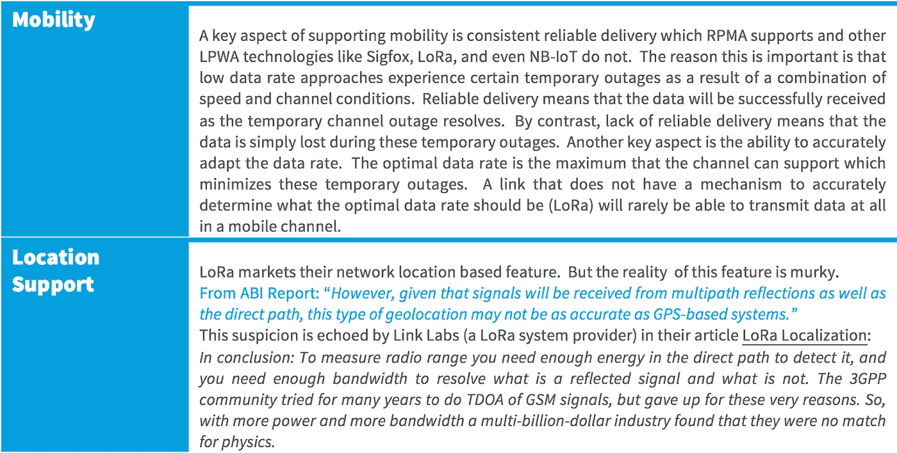
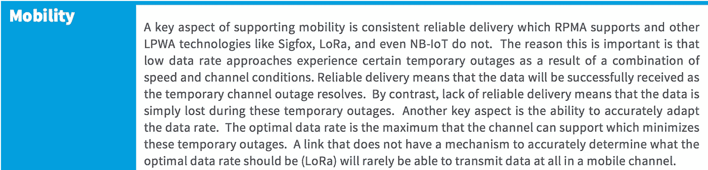
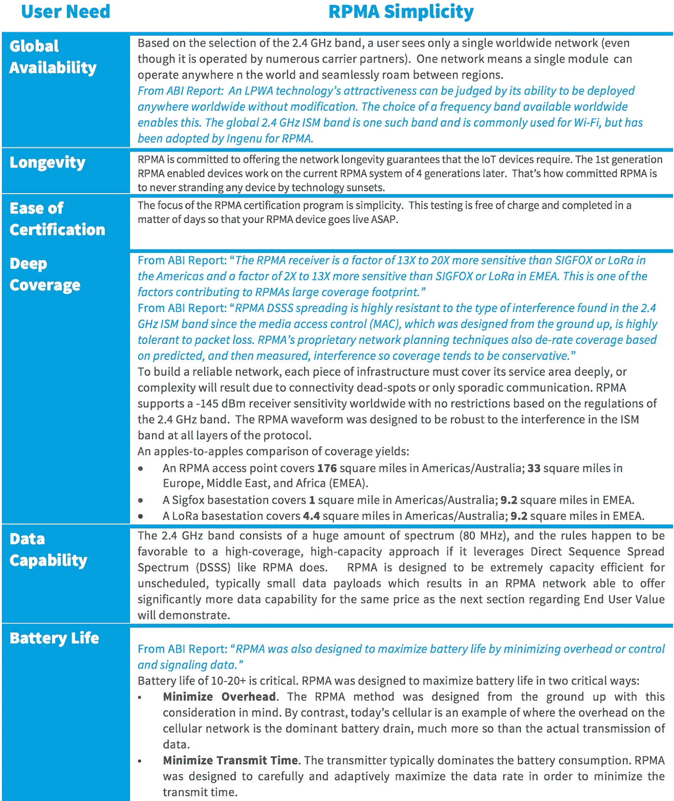
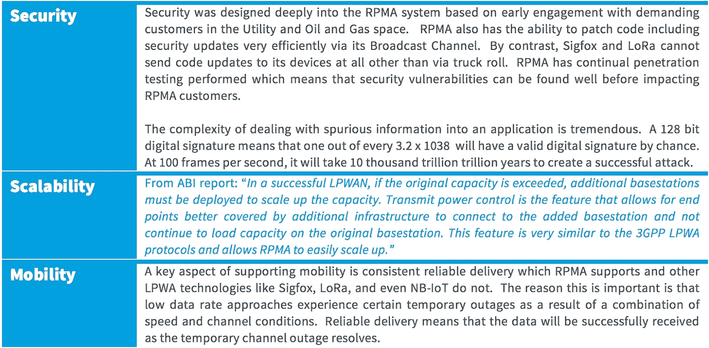
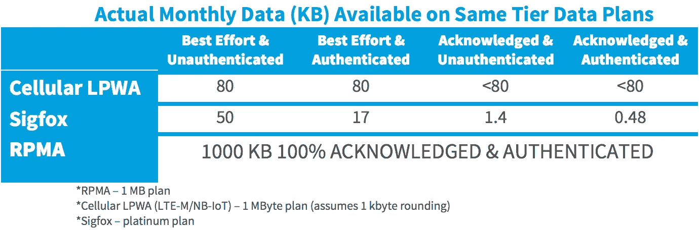
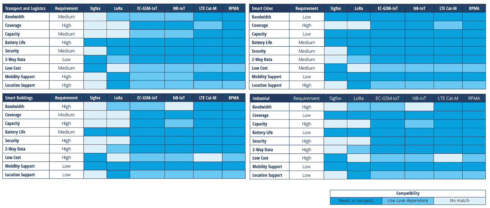

# LPWA 物联网技术创客分析

> 原文：<https://medium.com/hackernoon/lpwa-iot-technology-makers-analysis-c8ff8ec20b0c>

## **深入了解各种低功耗广域技术如何简化或复杂化物联网设备制造商的工作**

To make devices that meet your customers’ needs, IoT device makers need wireless technologies that meet their needs. This article will reveal how various technologies do or don’t do what they should to make it simple for IoT device makers to meet their customers’ needs.

**由** [**泰德·迈尔斯**](https://www.linkedin.com/in/ted-myers-0933795) **，Ingenu** 的 CTO 兼联合创始人

市场对低功耗广域(LPWA)连接有着明确的需求。LPWA 提供安全、无处不在、电池高效、专业管理的开箱即用连接的价值主张，为数十亿至数千亿台物联网(IoT)设备释放巨大价值。这些设备需要可靠、低成本的连接，不会过时。它们是自己独特的设备类别，正如我们将看到的，独特的先进技术是满足其特殊需求所必需的。

低功耗广域(LPWA)市场已经得到了众多不同的重要参与者的认可。看看 Sigfox 的估值，参与 LoRa 生态系统的合作伙伴数量，以及蜂窝标准机构为赶上来所付出的努力，以便有一天他们可以提供自己的 LPWA 解决方案。第三方分析公司也同意这一观点，玛奇纳研究公司等公司的报告称，到 2023 年，LPWA 的联网设备总数将超过 2B。每个人都认为 LPWA 有机会，但是什么技术最适合抓住这个机会呢？这就是本文要回答的问题。

# **正确的先进技术的重要性**

物联网设备在以下方面与任何其他联网设备没有什么不同:技术进步将允许使用前几代设备无法实现的功能。正如不断进步的硅技术自 20 世纪 90 年代以来已将 Wi-Fi 速度提高了 7000 倍，或者先进的硅技术如何将 20 世纪 90 年代的纯语音手机演变为功能齐全的 iPhone 或 Android 设备，技术也将推动物联网的发展。但是，正如我们将看到的那样，确定正确的先进技术来实现物联网往往很困难，因为这些技术的营销宣传往往与现实不符。

在本文中，我们支持所有 LPWA 参与者坚信的论点:在解决物联网的现有技术领域存在差距。接下来，我们来看看每一种主要的 LPWA 方法(Sigfox、LoRa、Cellular LPWA 和 RPMA)的营销主张，并根据它们提供的技术的现实来权衡它们。然后，我们探索每种 LPWA 方法对最终用户产生的复杂性的细节。ABI 是一家非常著名的分析公司，它发布了一份名为[lpwan 的最佳使用案例](http://www.ingenu.com/portfolio/best-fit-use-cases-for-lpwans/)的报告，这份 ABI 研究报告肯定了这种复杂性。

基于这种研究方法，我们证明了 Ingenu 的 RPMA 是物联网的正确先进技术。RPMA 考虑到用户的简单性以及所提供功能的极端价值。正如 ABI 报告所探讨的，这关系到技术在各种垂直领域的适用性。

# **差距:现有解决方案未能为物联网设备带来必要的简单性**

起初，一些解决方案似乎可以满足数十亿物联网设备的连接需求。然而，这些现有解决方案的深层基本限制使得网状网络、现有蜂窝(2G、3G、4G LTE)或专用网络无法解决这一问题。这是所有 LPWA 参与者(包括手机行业)都同意的。

> ***有时候要向前迈出一大步，你必须完全改变方向……***

以上是苹果用来宣传其新 Mac Pro 的短语，但它同样适用于许多其他重大的技术进步。这就是为什么我们有汽车而不是更快的马，为什么我们有灯泡而不是更亮的蜡烛。

下表解释了以下解决方案在物联网连接方面的深层基本缺陷，这些问题已经到了需要全新方向的程度:

**Mesh** 本有机会提供物联网所需的公共广域连接，但却失败了。智能电表应用似乎最适合 mesh(每个家庭中强制的、通电的智能电表端点)，但即使如此，结果也令人失望。出于各种技术和商业原因，mesh 永远不会扩展到连接大量的物联网设备。

**现有的蜂窝**非常适合手机，但会使大多数物联网设备的连接变得复杂。因此，尽管物联网的存在令人生畏，但它在解决物联网方面取得的成功却微乎其微。至于那些蜂窝电话设法连接的设备，它们最近因 2G 频谱的衰落而成为孤儿。蜂窝行业积极加入，试图创建自己的 LPWA 解决方案，这是承认需要一种新的方法，并且当前的蜂窝系统(2G、3G、4G LTE)不能满足物联网设备的要求。

**专用网络**描述了到家庭/企业网关的短程连接。Zigbee、Wi-Fi、蓝牙以及某些情况下的 LoRa 等技术是专用网络的典型无线连接机制。除了与成本和复杂性相关的问题之外，安全性也是这种连接的一个关键问题。正如最近的 Mirai 未来组合攻击和对佛蒙特州一家小型公用事业公司的黑客攻击所显示的那样，小型专用网络缺乏规模经济性来抵御不断出现的复杂安全攻击。

# **Sigfox:再利用技术**

由于 Sigfox 在技术开发方面起步较晚，并且没有资金或团队来开始密集的技术开发，他们决定推出一种基于现有技术的系统，称为超窄带(UNB)。Sigfox 做了其他公司没有做过的事情，那就是非常有效地营销 LPWA 连接的愿景。这让市场对该公司给予了很高的估值。这证明了 LPWA 市场的规模和兴奋程度，一项适用性相对较小的技术(正如我们将展示的那样)会有这样的估值。

## **营销宣传**

简单是 Sigfox 的一个关键信息。你在他们的营销信息中随处可见，在他们的标语中也是如此:“*在简单性的驱动下，我们释放出物联网的力量，赋予物理世界以生命。”听起来真不错。谁不欣赏简单？*

Sigfox 认为“*大多数物联网设备不会发送巨大的数据负载:它们可以使用超窄带技术运行良好*。”例如，他们对物联网设备和 iPhone 进行了有效的区分，并得出结论认为，在匹配这些设备的需求方面，UNB“技术”(已经存在了几十年，很难认为它是一种技术)比手机做得更好。这种区别是有价值的，但是蜂窝电话是正确的技术比较点吗？

## **技术现实**

史蒂夫·乔布斯花了大部分时间来赞美 iPhone 的技术简单性，还是鼓吹 iPhone 带来的用户简单性？显然，iPhone 代表了用户的简单性，这通常是通过复杂的技术实现的。提供简单、增强的用户体验的技术通常一点也不简单。

至于蜂窝技术的 Sigfox 框架产生了太多的复杂性，这一论点相当于反对技术的聪明的稻草人论点。蜂窝电话从未被设计为支持这些物联网设备。我知道我能跑得过割草机，但这不应该成为所有机动车辆的控诉。声称更复杂的技术总体上不能推进物联网设备，只是因为蜂窝(错误的技术适合)不能，这同样是似是而非的。正确的比较是针对实际上旨在解决物联网设备的技术。我们将继续展示正确的技术是 RPMA。

## **最终用户复杂性**

那么 Sigfox 短路任何真实技术发展的结果是什么呢？受到影响的一个重要方面是安全性。部分由于 Mirai 未来组合袭击事件，物联网设备的安全性正受到越来越多的关注。Sigfox 在这个问题上采取了漫不经心的态度，声称他们的目标设备不需要非常强的安全性，或者他们会随着时间的推移解决这个问题。我认为大多数人认为所有终端的安全性都至关重要，因为总的来说，数十亿或数千亿台设备代表着巨大的攻击空间。至于“随着时间的推移搞清楚”，这有点像美国宇航局用阿波罗 11 号将宇航员送上月球，然后将注意力转向解决如何让他们返回地球的问题，或“返回问题”相比之下，RPMA 已经解决了“回归问题”。

如下表所示，Sigfox 最终未能达到几项指标，这些指标对于使用 LPWA 无线连接的设备制造商非常重要。其中之一是电池寿命。具有讽刺意味的是，Sigfox 声称，因为他们的方法如此简单，所以他们的电池寿命更长。但正如 ABI 报告在下表的电池寿命条目中总结的那样，先进的技术实际上可以显著延长电池寿命。如表所示，由于 Sigfox 解决方案带来的用户复杂性，Sigfox 只能处理一小部分受益于 LPWA 连接的设备。

# **劳拉:技术不够**

Semtech 以大约 500 万美元的价格从法国小型创业公司 Cycleo 手中收购了 LoRa 技术[。Semtech 随后围绕该技术进行了强大的营销努力，包括创建 LoRa 联盟，以促进其他公司参与 LoRa 生态系统。一些蜂窝运营商正在部署 LoRa 作为广域网。](http://investors.semtech.com/releasedetail.cfm?ReleaseID=655335)

## **营销宣传**

与 Sigfox 不同，Semtech 有一种通过 LoRa 波形的新方法，他们将其作为 LPWA 的一种引人注目的技术进行营销。此外，Semtech 试图声称他们的标准化活动为竞争和合作创新提供了机会。随着各种蜂窝运营商将 LoRa 添加到他们的产品中，Semtech 声称 LoRa 技术具有显著的吸引力。

## **技术现实**

尽管 LoRa 的市场营销很好，Semtech 最终将一种啁啾扩频(CSS)版本商业化，这种版本与现有的低技术方法相比，性能优势很小，如 Sigfox 的 UNB，详见[啁啾扩频:非相干多进制调制的果冻](http://www.ingenu.com/2016/07/chirp-spread-spectrum-the-jell-o-of-non-coherent-m-ary-modulation/)。从根本上说，LoRa 波形有足够的容量用于局域网(LAN)，但[将面临支持成功的广域网(WAN)](http://eprints.lancs.ac.uk/81674/4/lora_scalability_r254.pdf) 的挑战。此外，围绕 LoRa 波形的选择性存在显著的问题，这可能导致公共和私有 LoRa 网络之间的不良交互。

部署 LoRa 的大多数运营商并不过度担心这些可扩展性问题，因为他们倾向于致力于 NB-IoT/LTE-M 路线图。

Orange 副总裁吕克·布雷托尼斯说，

> 说到底，不知道 LoRa 还能有多少年，才会有正规的网络接手。
> …通过 NB-IoT，我们将从与 LoRa 的合作中吸取经验。

换句话说，大多数将 LoRa 部署为公共网络的运营商只是将其作为在 LPWA 市场保持相关性的权宜之计，而不是作为他们将长期致力于的一项技术。至于标准化的吸引力，LoRa 联盟中肯定有许多参与者倾向于开放生态系统的概念。然而，由于只有一家 LoRa 硅供应商(例如 Semtech)，LoRa 联盟看起来像一个标准机构，但实际上是一个封闭的生态系统。

## **最终用户复杂性**

那么 Semtech 适度投资技术开发的结果是什么呢？与 Sigfox 类似，下表中提到的各种复杂性意味着只有一小部分物联网设备可以受益于 LoRa 连接。此外，[缺乏来自各种蜂窝运营商的承诺](http://www.lightreading.com/iot/lora-may-not-be-for-long-haul-at-orange/d/d-id/721971)令人怀疑随着蜂窝运营商将注意力转向部署 NB-IoT/LTE-M 的 3GPP 路线图，是否会支持 LoRa 系统。

# **蜂窝 LPWA:令人印象深刻，但技术不匹配**

LTE 是最新、最先进的无线技术，可为智能手机等消费类设备提供无与伦比的宽带速度。这也是蜂窝行业试图利用来抓住物联网机遇的技术。但蜂窝技术，更具体地说是 LTE，并不是为了支持物联网设备而设计的。因此，为物联网发展 LTE 会导致不完美的解决方案，最终不适合物联网设备。这类似于采用最新、最先进的跑车，并试图以此为基础制造长途半挂卡车。

## **营销宣传**

蜂窝网络已经存在了很多年。蜂窝技术非常成熟。运营商是稳定的公司。只需轻轻一按开关，现有的基础设施将能够为任何地方的物联网设备提供服务。

## **技术现实**

蜂窝行业能够为物联网设备提供的价值受到限制，这有多种制度原因:

**出于知识产权(IPR)方面的考虑，技术限制**迫使 LTE 成为主要发展方向。这意味着相关公司将牺牲用户需求来实现他们的底线。LTE 是 FDD 频谱中的调度协议，这是高数据速率蜂窝链路的正确方法，但是 TDD 频谱中的非调度协议(例如 RPMA)是 LPWA 设备的最佳技术选择。

**物联网优先级限制**意味着语音/数据限制导致物联网设备的日落和优先级损失。物联网设备无法与蜂窝网络上的语音和数据收入竞争。因此，改善向客户交付高速数据的决策往往会以牺牲物联网设备为代价。这就是我们今天所看到的，例如，重新规划 2G 频谱以满足 4G 需求，仅在美国就已经有 3000 万台设备成为孤儿。

## **最终用户复杂性**

结果是，就 LPWA 而言，移动运营商和供应商正在做对他们来说很简单的事情，与其他 LPWA 竞争对手竞争。最终用户不是主要的考虑因素，因此会受到大量复杂性的影响。正如下表所总结的，蜂窝 LPWA 继承了许多相同的问题，这些问题使物联网设备无法在现有蜂窝网络上实现任何历史预测。

# **RPMA:正确的先进技术**

Ingenu(前身为 On-Ramp Wireless)在 2008 年开始了密集的技术开发，以先于任何其他 LPWA 提供商提供安全、极低成本、低功耗、功能丰富且稳定的连接。RPMA 是唯一一款专为物联网设备打造的技术，其设计初衷是在自由频谱中运行，同时为定义物联网空间的小型频繁数据交易提供巨大容量。RPMA 只有一个目标:让我们的客户满意。我们在开发一项技术方面有着不可逾越的 8 年和 400 人年的领先优势，该技术为物联网市场提供了所需的简单性。

## **营销宣传**

很长一段时间里，Ingenu 都没有市场宣传。Ingenu 忙于开发 RPMA 和解决我们苛刻的客户的问题。显然，Ingenu 确实受益于围绕简单有效地传达其信息。最大的区别在于，最终用户会受益，因为 RPMA 确实提供了独特而有吸引力的价值主张。

## **技术现实**

RPMA 的优势在于早期部署了要求高但耐心的客户。反馈和经验教训导致了 RPMA 技术的发展。公用事业和石油天然气领域的最初客户参与推动了技术的成熟，这种成熟只有通过在现实世界中快速失败并在每次迭代中改进才有可能实现。因此，RPMA 与其他 60 家设备合作伙伴一起，融入了国内和国际的几个电表家族。如今，RPMA 公共网络 Machine Network 正以极快的速度建设，目前已覆盖 30 个美国市场，到 2017 年底将覆盖 100 个市场。

## **最终用户简单性**

如下表所示，RPMA 提供了合适的技术，使物联网设备制造商能够轻松满足客户的需求。RPMA 是真正的技术，为物联网设备制造商带来真正的简单性。

## **最终用户价值**

由于 RPMA 是为解决物联网设备而从头设计的先进技术，因此有一些属性使 RPMA 系统能够提供比竞争对手 LPWA 系统更大的价值。

一个至关重要的有利方面是 RPMA 网络的容量，它允许以非常低的连接成本使用大量数据。使用真实条件和 32 字节消息的基准:

一个 RPMA 接入点每小时可以接收 **535，117** 条消息。

一个 Sigfox 基站每小时可以接收 **523** 条消息。

一个 LoRa 基站每小时可以接收**2645**条消息。

基于这一点和该技术的其他支持方面，RPMA 是唯一能够提供物联网设备权利法案的公司。物联网设备可能不是高吞吐量设备，但我们坚信，它们拥有某些不可剥夺的权利，而这些权利是 RPMA 独有的。任何设备都不能访问这些权限:

## 物联网设备权利法案

**双向数据**。根据我们的经验，单向系统几乎没有商业价值，下行链路容量是 LPWA 系统的一个非常重要的特性。

**可靠交付**。如果一个数据事务不能被确认，那么这个事务就不是特别有用。RPMA 对每个数据事务执行*确认。*

**灵活的包装尺寸**。我们很快意识到，将事务限制在很小的有效负载(比如 12 字节)对我们当时与之交谈的所有客户都没有吸引力。

**网络响应能力。**考虑您希望在特定时间启动的开关，等待潜在的几个小时直到节点轮询网络以触发该开关是不合适的。

**认证**。发送恶意数据是一种标准攻击，恶意代理可以利用这种攻击在系统中制造巨大的问题。为了防止这种情况发生，需要一种行业标准的“数字签名”，只有该数据的合法创建者才能提供这种签名。

**广播能力。**对于一个特定的工厂预装固件映像来说，20 多年的时间太长了。我们接触过的所有客户都要求能够下载固件，这对于本来就不支持高数据速率的 LPWA 系统来说尤其具有挑战性。广播信道好处的其他例子包括在高峰需求期间向大量街灯(例如，打开)或公用事业减载设备发送同时命令，以同时关闭数十万个游泳池泵和热水器。

## **比较价值:Sigfox、LTE-M/NB-IoT、RPMA**

我们研究了与当前或即将启用 RPMA 的 30 个应用程序相关的数据模型。平均事务大小约为 60 字节。[注意，3GPP 模型平均为 32 字节，这使得下表中的有效结果更不理想]。我们与 Sigfox 进行了比较，并根据一些市场研究预测了 LTE-M/NB-IoT 的定价。根据我们对定价的理解，以下 3 个计划的价格类似，约为每月 1 美元:Sigfox Platinum、RPMA @每月 1 兆字节、LTE-M/NB-IoT @每月 1 兆字节。这些假设如下:

Sigfox 的数字似乎是每月约 1 美元，他们的最高端白金计划是每天 140 x 12 字节的消息，只有 4 条下行消息。

LTE-M/NB-IoT 的接入费用预计与 LTE M2M 计划的类似，为每月 1 美元。

基于 3GPP 中针对 NB-IoT/LTE-M 进行的分组聚合模拟，我们将 LTE 的现有千字节舍入计费策略也应用到 NB-IoT/LTE-M 中。

显然，根据表格中的数字，RPMA 提供了令人难以置信的相对价值。关于上表中的数字，请注意以下几点:

此表进行比较，根据数据类型有 4 列。特别是对于 Sigfox 来说，构建一个行业标准认证方案是很复杂的。白金计划中也有每天下载次数的限制，这个数字是 4。

对于蜂窝 LPWA，模拟只有 50%的上行链路流量得到确认。除了更复杂的定价，很难想象他们是如何执行的，这就是为什么我们输入"<80” for reliable traffic.

• RPMA has a very simple pricing model that offers a symmetric link that is acknowledged and authenticated at every tier.

• For the large majority of LPWA devices that do not need the large 1 MByte RPMA data plan, cheaper plans are available.

# **它的意思:基于简单和价值，RPMA 比任何其他 LPWA 技术都有更广泛的适用性**

ABI 报告[lpwan 的最佳使用案例](http://www.ingenu.com/portfolio/best-fit-use-cases-for-lpwans/)——ABI 研究开始着手用户体验的细节。下图显示了各种 LPWA 方法对四个垂直行业的适用性:运输和物流(左上)、智能城市(右上)、智能建筑(左下)和工业(右下)。这些行是各种各样的用户需求，当这些需求被满足时，就提供了简单性和价值。深蓝色单元格表示“符合或超过”，中蓝色表示“取决于用例”，最亮蓝色表示“不符合”。正如你所看到的，RPMA(最右边的一栏)明显比其他 LPWA 方法更蓝。这意味着，对于数十亿到数千亿的物联网设备中的绝大多数来说，RPMA 将是正确的 LPWA 解决方案。

# 想了解更多？

[下载我们的免费电子书](http://www.ingenu.com/portfolio/how-rpma-works-the-making-of-rpma/)(公平警告，这是在一张表格后面)，它对领先的 LPWA 协议进行了广泛的技术审查和比较。

想要将 RPMA 集成到您的物联网应用中吗？在 info@ingenu.com[联系我们](mailto:info@ingenu.com)

# 如果这对你有一点点的帮助，请表达你的爱，点击心形推荐给其他人。谢谢大家！

> [黑客中午](http://bit.ly/Hackernoon)是黑客如何开始他们的下午。我们是 [@AMI](http://bit.ly/atAMIatAMI) 家庭的一员。我们现在[接受投稿](http://bit.ly/hackernoonsubmission)并乐意[讨论广告&赞助](mailto:partners@amipublications.com)机会。
> 
> 如果你喜欢这个故事，我们推荐你阅读我们的[最新科技故事](http://bit.ly/hackernoonlatestt)和[趋势科技故事](https://hackernoon.com/trending)。直到下一次，不要把世界的现实想当然！

