# 有限公司-第 3 周(第 1 部分)|第 9 天–11 天| 12 月 14 日–16 日

> 原文：<https://medium.com/hackernoon/ltd-week-3-day9-11-14-17-dec-part-1-38efba2786b6>

这真是充实的一周，所以我将分两部分来思考第三周。

我将分两部分来做这个，因为我没有时间在事情发生的那一周每天做一个。那个星期发生了很多事情，我想在这个项目中呆了三个星期后，我开始意识到我到底在做什么。到目前为止真的很激烈，而且还会更激烈！

在第三周，我心中有一个目标:在圣诞节假期前完成我的移情采访。

周末的时候我已经筋疲力尽了，然后进入了圣诞假期，众所周知，这是一个非常繁忙的季节，所以直到今天我才能够写一篇文章。但是明天，我们将回到节目的第四周。所以现在是我写第三周反思日记的时候了。

我将用不同的格式来写这篇文章，只写当天的亮点来总结我们的活动，而不是像我平时写日常帖子的方式。我已经决定这样做，因为在接下来的几周里，我们会变得更忙，所以我不太可能能够跟上我的每日反思日记条目。

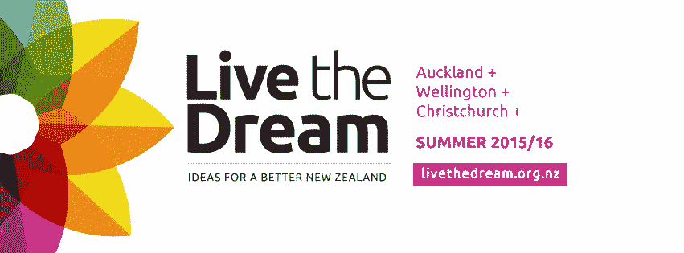

> [活出梦想是一个针对 18-30 岁新西兰人的为期 9 周的速成项目。发展你的社会企业家精神和企业能力，为一个更美好的世界发展你的想法。](http://livethedream.org.nz/)

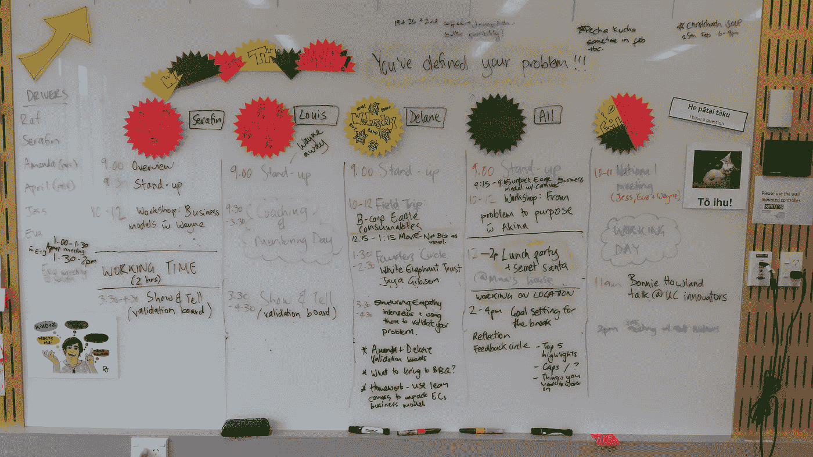

What we were in for in Week 3

# 12 月 9 日至 10 日| 14 日至 15 日

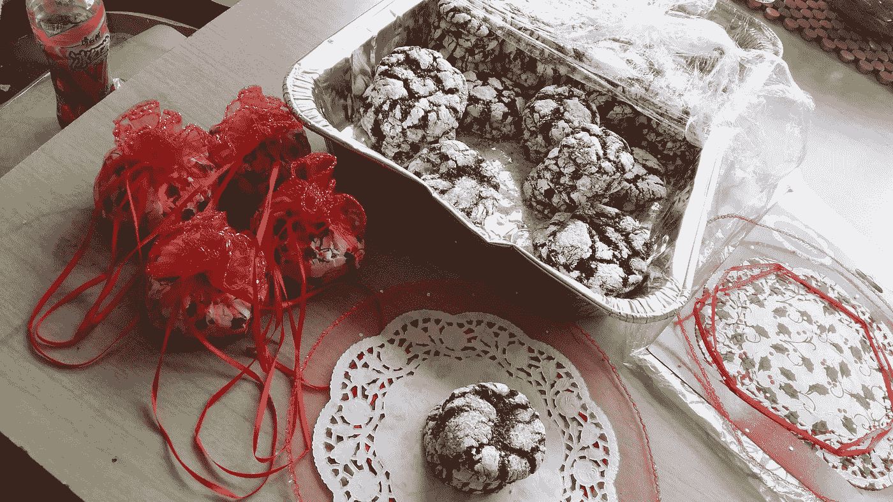

Preparing Christmas treats for the team!

我在 2015 年的最后一周为这一章中的每个人带来了我们的家庭秘方圣诞蛋糕。只是过节的一点心意！

## 第 9 天 Wayne 的商业模式研讨会

我们以通常的概述+起立开始了这一天，继续在我们的 Scrum 板上报告的习惯。然后我们和 Wayne 一起去了这周的第一个工作室。

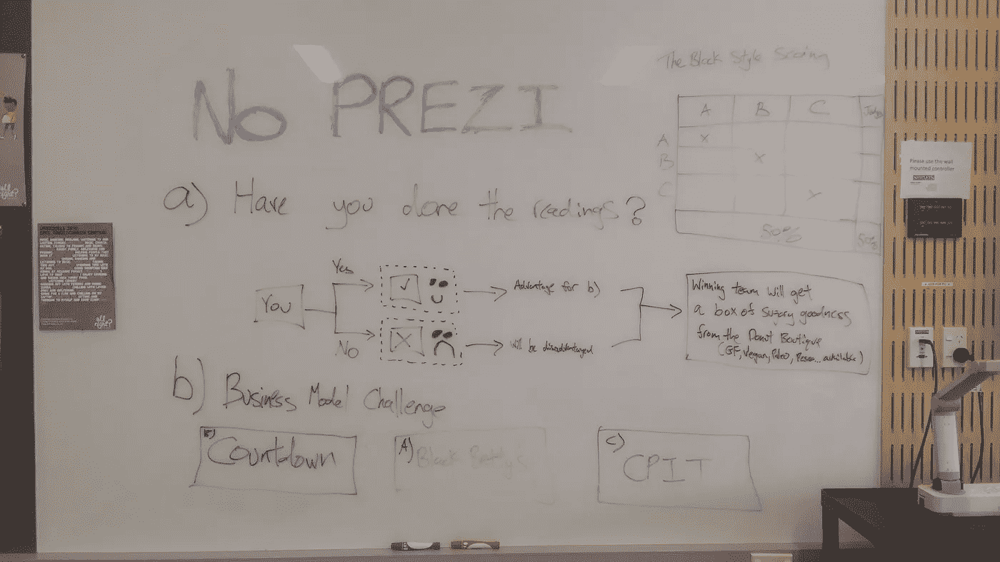

他给我们发了一些准备研讨会的阅读材料，只有 April，Kate 和 Patience 真的读过。我们其他人调皮，没看材料。所以韦恩把他们放在一个队里，让他们选择多一个队友。我上过商学院，对商业模式非常熟悉，所以他们选择我作为他们的第四个团队成员。

研讨会被设计成一个竞赛，我们被分成三个小组，我们必须写商业模式。这三个小组被分配到倒计时(一家超市)、CPIT(一家高等教育机构)或黑贝蒂(一家咖啡馆)。我们选择了黑贝蒂。

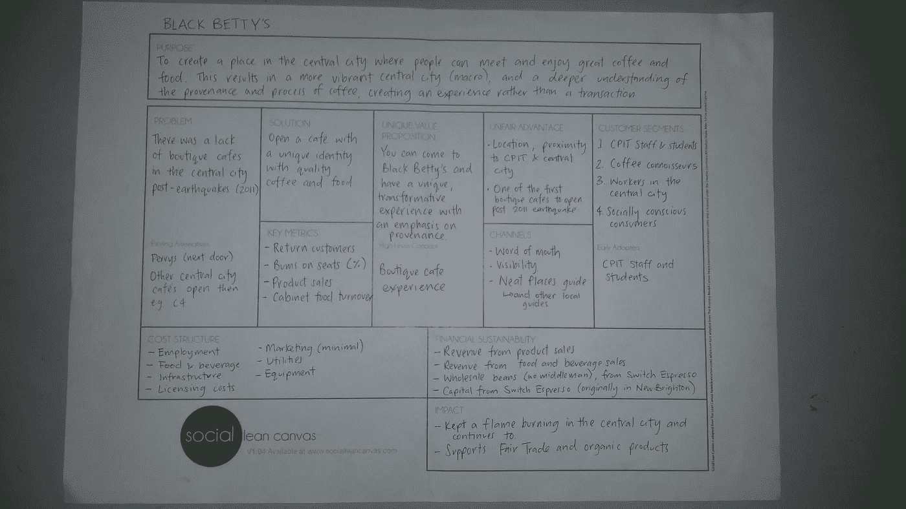

然后我们必须展示我们的发现，获胜者将被称为 Winnie Bagoes 午餐。由于我所在的团队实际上已经掌握了商业模式，所以我们占据了上风并取得了胜利。

韦恩还没有喊我们去温妮巴格斯吃午饭。(咳咳！)

## 移情访谈

那天剩下的时间和第 10 天的时间都花在了与自由职业者和企业家的同理心访谈上。这两天挤满了会议，因为我有一个相当大的自由职业者和企业家的网络，我可以访问来做我的研究，所以填充我的日子很容易。

**第 10 天**我会见了一位名叫丹尼斯的自由摄影师，开始了我的早晨，他的工作地点离我家很近，所以我们在当地的一家咖啡馆见了面。之后，我还与 April 和 Robbie 共进午餐，我们讨论了我们的项目重叠的地方，我们如何在研究中相互帮助，以及随着项目的进展，我们继续定期会面将如何有用。

在那之后，我在威尔逊路上会见了 XCHC 的创意企业家，然后穿过城镇去会见了另外几个人，结束了我的下午，然后我在总部展示了我的验证板。

在我的研究中，一些关于自由职业者和企业家努力奋斗的关键主题开始浮现。有趣的是，关键的一点是韦恩在他的一个研讨会上讨论过的:

*   自由职业者和企业家倾向于为自己做一切事情，所以许多人纠结的是他们不喜欢做但不得不做的事情。有些人纠结于行政管理，有些人纠结于营销自己或他们的产品，有些人纠结于网络。

其他主题包括:

*   自由职业者和企业家努力使收支平衡，尤其是在开始阶段。
*   自由职业者和企业家希望他们知道如何对他们刚开始做的事情进行货币价值评估。

## 验证板

*我回到总部，在那里我们必须报告我们的验证板。*

**验证板**是一个表格，显示*客户假设、问题假设和解决方案假设*，然后您的研究基于验证无效的*核心假设*将您引向*支点*。这是一个非常好的工具，可以用来验证你的想法是否值得追求，基于它是否真的解决了人们实际存在的问题。

下面是路易斯做报告的照片，在他身后的左手边是塞拉芬的蜂群会议。

群体会议是团队一起工作来帮助完成验证板的元素。实际上，这是一个团队对任何人需要反馈的任何事情发表意见的会议。

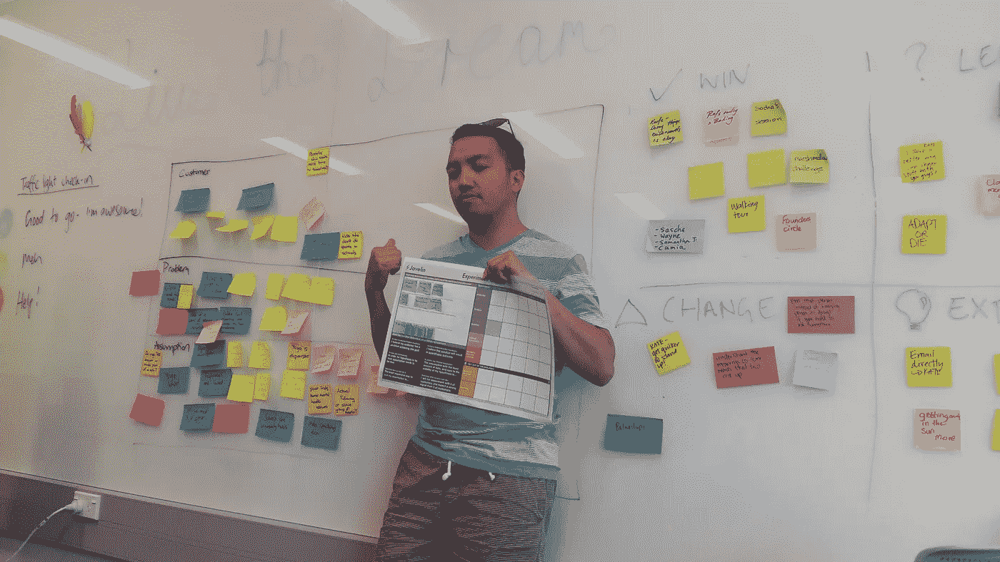

Sorry, Louis! You are the chosen model for my photos!

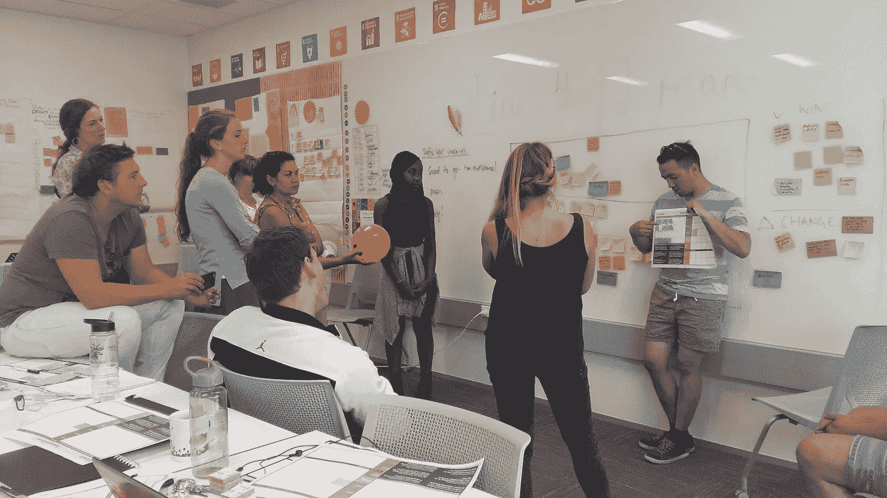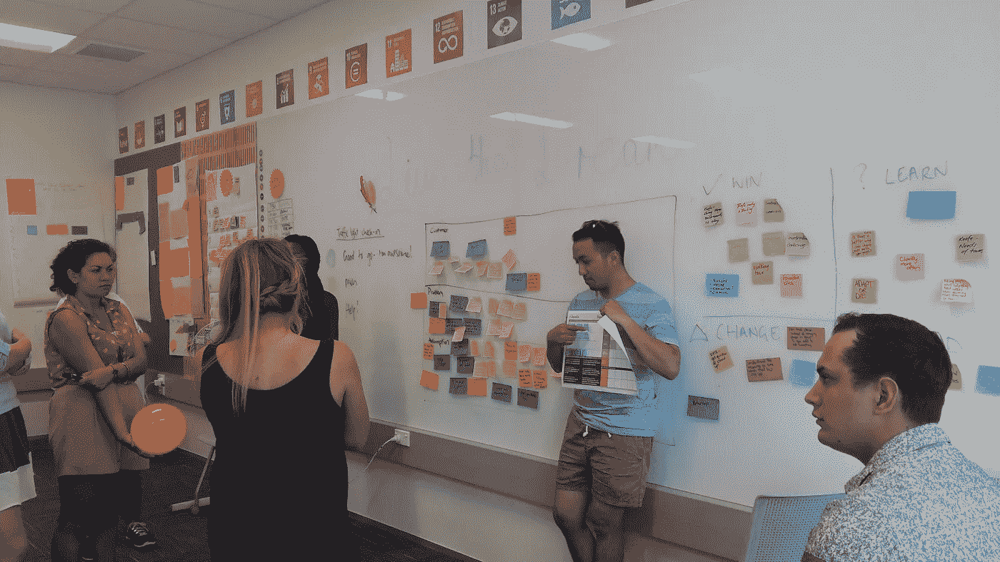

我没有展示我的验证板，我觉得我还没准备好。但我确实让团队和我一起讨论了我的研究发现:

***金融素养。***

我在想……如果我们在离开学校之前就被教授金融知识，也许我们会做出不同的选择？如果我们真的知道有多少收入来自税收和政府强制征税，也许我们会在如何就业或如何创造收入方面做出不同的(可能更明智的)选择？

如果在我们离开家之前，我们了解并被教导租金、账单、保险以及我们所有的日常开支是如何运作的，这些开支是我们在享受我们所赚的钱之前需要或应该支付的，也许我们会做出不同的选择？

我刚刚开始围绕这个问题展开讨论，因为这是许多企业家和自由职业者希望他们更早掌握的一大部分内容。

> 正常是穿上你为工作买的衣服，开着你还在付钱的车穿过交通——为了去工作，你需要支付衣服和车的费用，还有你整天空置的房子，这样你就能住得起了。**-艾伦·古德曼**

# 第 11 天| 12 月 16 日

## 实地考察 Eagle 消耗品公司

又一轮起立鼓掌，然后我们前往新西兰第一家 B-Corp—**Eagle consumers**进行实地考察。

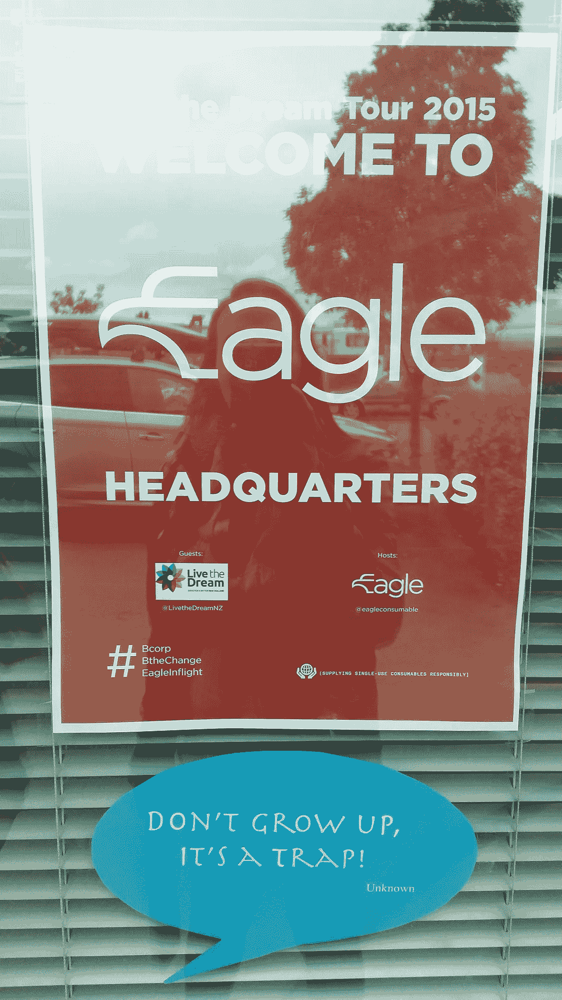

我们的任务是做一份关于 Eagle Consumables 商业模式的报告，所以我非常关注讨论的内容。创始人史蒂夫·阿达格欢迎我们，并带我们参观了他们的建筑。

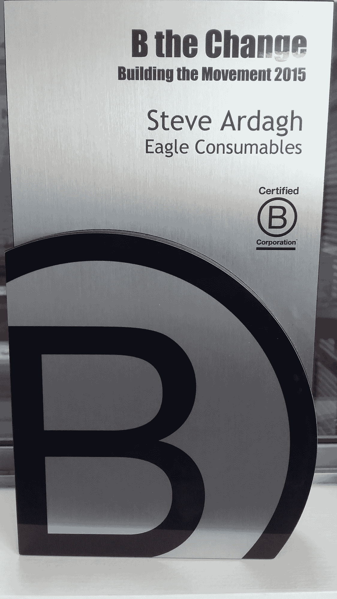

参观结束后，他把我们带到他的办公室，开始了他的课程，给我们上了一些非常好的课。

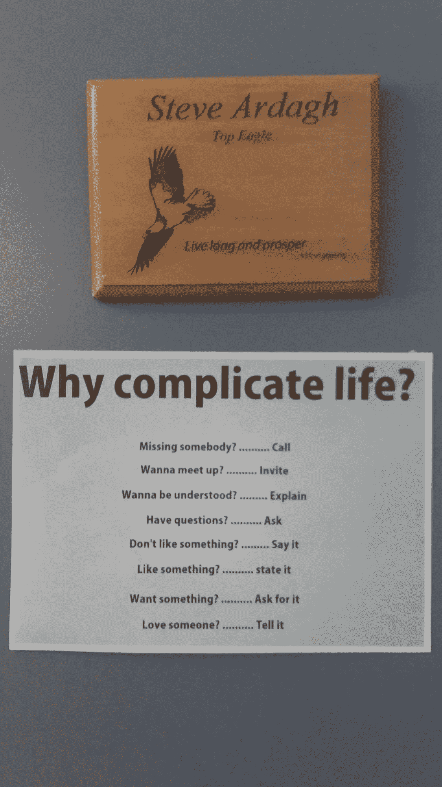

真正引起共鸣的是他给出的关于解决一个真正的问题和真正理解我们试图解决的问题的建议。在该计划中，这就是我们目前的状况，因此他的建议与我们当时的工作非常相关。

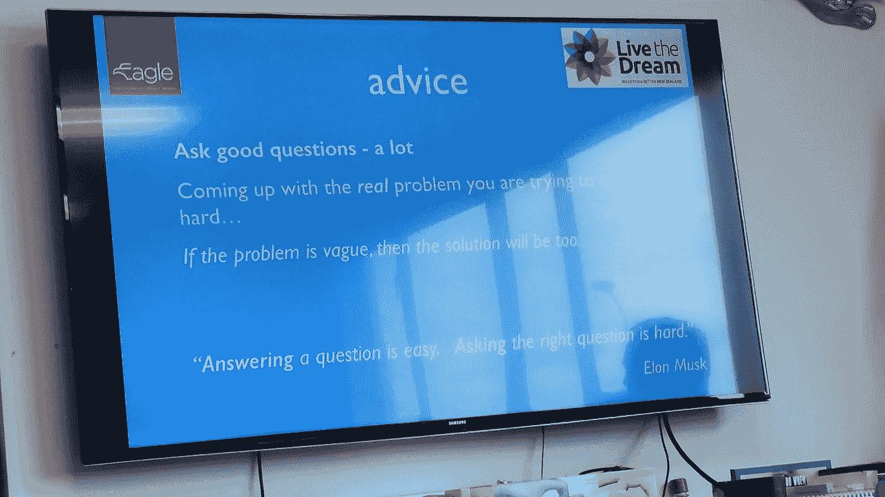

他接着讨论了 Eagle 消耗品公司的愿景和目标。他们把生意做好，这就是他们选择成为 B 公司的原因。

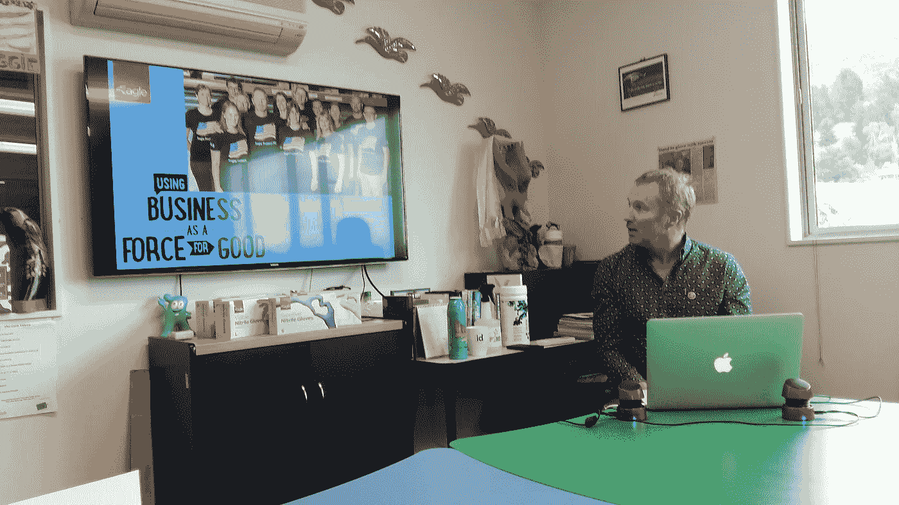

Eagle Consumables 是新西兰的第一家 B-Corp，但现在全国有几家 B-Corp，主要在南岛。

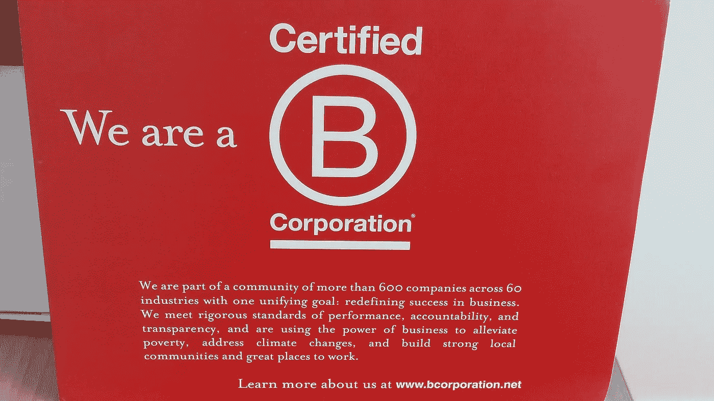

但是什么是 B 公司呢？

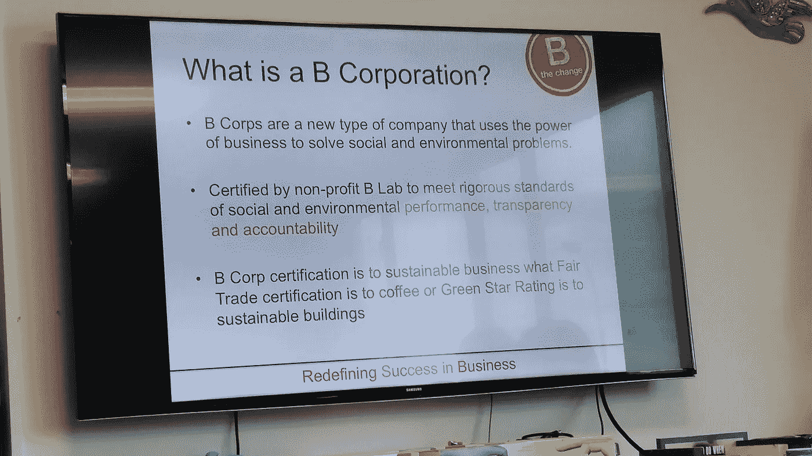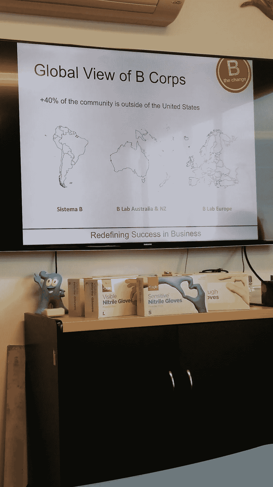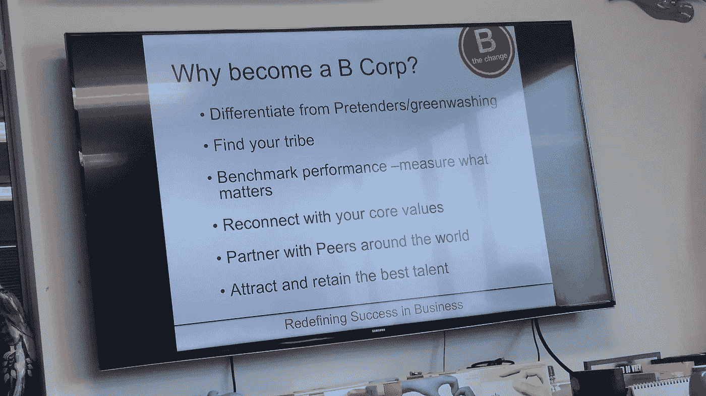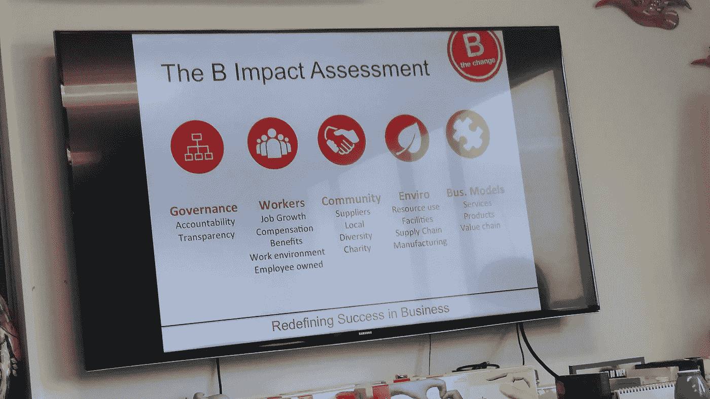

这真的很有趣，知道在这个时代 B-Corps 正在成为一件事。这是鼓舞人心的，当我建立自己的社会企业时，我希望获得这种地位。鹰耗材和他们的创始人真的很令人钦佩，这是一次令人惊叹的实地考察。他们甚至为我们准备了午餐！

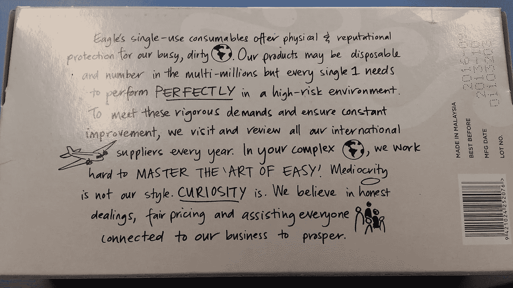

## 与贾亚·吉布森和迈克·菲尔德的创始人圈

关于这两位创始人，我不会说太多细节，但如果说我们从与他们的对话中学到了什么，那就是关于失败的教训，以及失败是可以接受的。

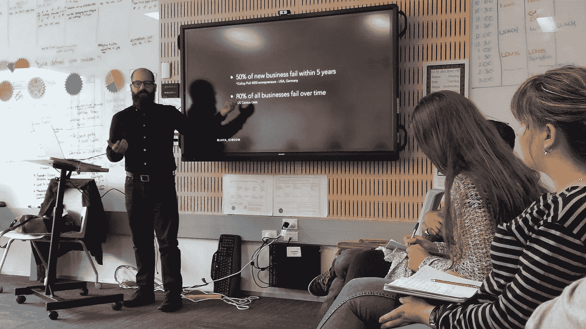

Jaya Gibson

有趣的是，我实际上申请了白象信托公司(White Elephant Trust)的首席执行官，迈克·菲尔德(Mike Field)的职位，当他到来时，这让我想到*“伙计，我本来可以成为这个小组的发言人”*，因为我已经有了他职位的最后 3 或 4 名候选人。诚然，如果我是内森(当时雇用迈克的白象公司的首席执行官)，我也会完全雇用他而不是我，因为这家伙实在太棒了！

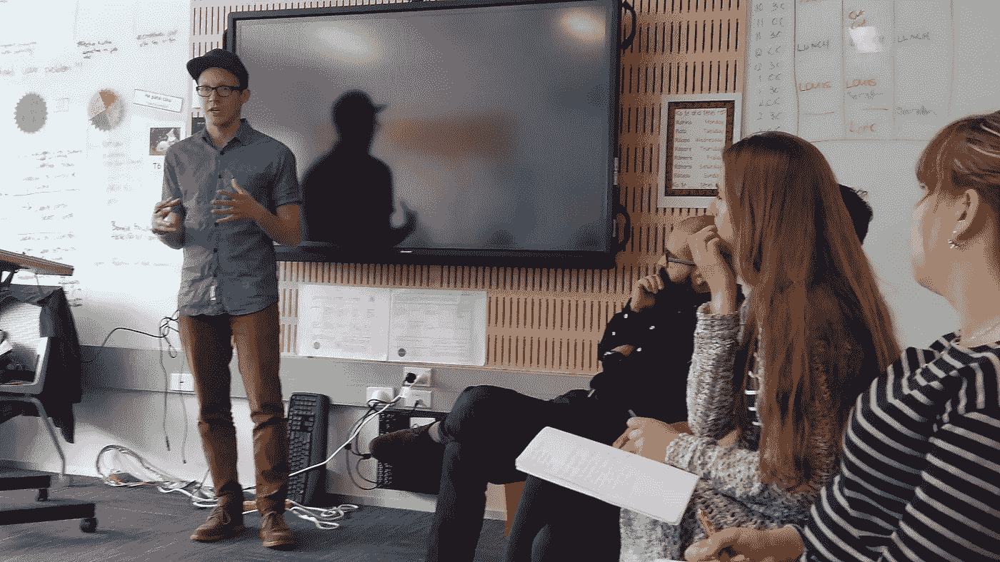

White Elephant Trust CEO Mike Field

*未完待续……*

> [黑客中午](http://bit.ly/Hackernoon)是黑客如何开始他们的下午。我们是 [@AMI](http://bit.ly/atAMIatAMI) 家庭的一员。我们现在[接受投稿](http://bit.ly/hackernoonsubmission)并乐意[讨论广告&赞助](mailto:partners@amipublications.com)机会。
> 
> 如果你喜欢这个故事，我们推荐你阅读我们的[最新科技故事](http://bit.ly/hackernoonlatestt)和[趋势科技故事](https://hackernoon.com/trending)。直到下一次，不要把世界的现实想当然！

