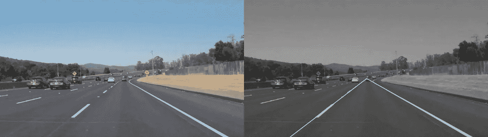

# M2M 第 186 天:这个练习让我意识到了一些事情。我关注错了。

> 原文：<https://medium.com/hackernoon/m2m-day-186-this-exercise-helped-me-realize-something-im-focusing-on-the-wrong-thing-128d99c18f22>

> 这篇文章是为期 12 个月的加速学习项目[月掌握](/@maxdeutsch/m2m-day-1-completing-12-ridiculously-hard-challenges-in-12-months-9843700c741f)的一部分。今年五月，[我的目标是打造无人驾驶汽车的软件部分](/@maxdeutsch/m2m-day-182-attempting-to-build-a-self-driving-car-809fab9e4723)。

[昨天](/towards-data-science/m2m-day-185-my-attempt-to-intuitively-explain-how-this-self-driving-car-algorithm-works-7422eb2b135e)，我解构了一段识别道路前向图像中车道线的代码。

像这样…

也许比图片更有趣的是，这段代码仅使用非常基本的数学运算(本质上是一串寻找加权平均值的函数)生成车道线的[数学](https://hackernoon.com/tagged/mathematical)表示:

**车道线 1** =坡度:-0.740605727717；截距:6640 . 666866666667

**车道线 2**= Coef:-0.740605727717；截距:664.075746144。

经历[这种锻炼](/towards-data-science/m2m-day-185-my-attempt-to-intuitively-explain-how-this-self-driving-car-algorithm-works-7422eb2b135e)帮助我更好地直觉自动驾驶汽车的基本机制，这似乎不再那么神秘了。

根据我迄今为止的实验，创建自动驾驶汽车软件似乎有两个主要步骤:

**步骤 1:** 将输入图像处理成一组驾驶[环境](https://hackernoon.com/tagged/environment)的有用数字表示(即车道线、其他汽车、交通标志、行人等)。)

**步骤 2:** 将这个世界的数字表示输入到一个函数中，该函数根据这些输入计算出正确的转向角和加速度。

我怀疑随着步骤 2 中功能的改进(随着未来计算能力的增加)，步骤 1 中的预处理和对象分类变得越来越不重要。

因此，看起来我应该将注意力从主要关注物体识别和数字化的第一步转移开，而是将我的大部分注意力集中在第二步的*功能*，该功能将来自世界的输入映射成驾驶指令。我将把这个函数称为“神奇函数”。

这似乎是一个合理的计划，特别是因为我昨天描述的图像处理技术是几十年前发明的，而神奇的功能似乎只是最近才变得可行。

我不确定这个分析是否正确，或者这条路是最优的，但这是我目前的直觉，基于我到目前为止的研究和过去几天的练习。

从明天开始，我将开始探索一个神奇的功能是如何工作的，以及我如何能够构建它。

> 阅读[下一篇](/@maxdeutsch/m2m-day-187-two-hours-later-and-my-computer-still-isnt-cooperating-cd58f719fb10)。看了[以前的帖子](/towards-data-science/m2m-day-185-my-attempt-to-intuitively-explain-how-this-self-driving-car-algorithm-works-7422eb2b135e)。

## [马克斯·多伊奇](http://max.xyz)是一名痴迷的学习者、产品建造者、为期[个月以掌握](http://MonthToMaster.com)的试验品，以及 [Openmind](http://OpenmindLearning.com) 的创始人。

## 如果你想跟随 Max 长达一年的加速学习项目，请确保跟随[这个媒介账户](/@maxdeutsch)。