# 我最喜欢的命令行工具

> 原文：<https://medium.com/hackernoon/macbook-my-command-line-utilities-f8a121c3b019>

## **我是如何不再担心 GUI 并学会爱上终端的**

# 介绍

之前我已经谈过[我对 MacOS 的初步体验。虽然我仍然喜欢笔记本电脑和它的工作性能，但我最喜欢的应用程序与苹果的生态系统没有什么关系——它们中的大多数都是命令行应用程序，与大多数 UNIX/Linux 世界共享。](/@vitalyb/this-windows-developer-just-got-a-macbook-c9f703ed8abb#.u41edavka)

在我的大部分互动中采用终端让我更有效率——我可以处理多个项目、任务，并轻松切换上下文和文件夹。

以下是我目前最喜欢的一些 CLI 应用程序。

# **哦-我的-zsh (zsh)**

oh-my-zsh 是一个令人惊叹的 zsh 配置集合，它装载了多种功能，增强了终端的一般用途。这些是我经常使用的:

*   更实用的自动完成—可视化和箭头导航自动完成

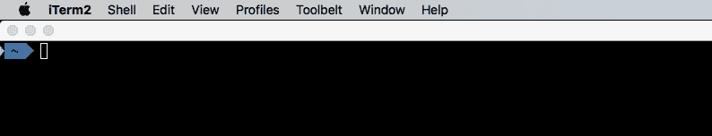

*   从一个字母自动完成目录-完成像`cd ~/d/y` 这样的目录并直接带你到`cd ~/Downloads/YouTube`

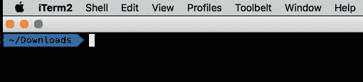

*   用`cd -`回到你的目录历史

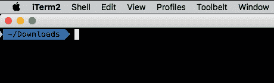

*   git 中的自动完成——使用快速选项卡在分支之间跳转

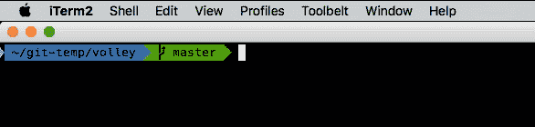

除了 zsh 的核心功能，还有大量的插件可供选择。

[history-substring-search](https://github.com/zsh-users/zsh-history-substring-search)允许你开始输入一个命令，然后按 up 搜索所有以此开头的命令。

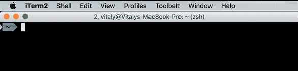

如果你发现你的颜色太单调，安装[语法高亮](https://github.com/zsh-users/zsh-syntax-highlighting)插件。现在，您可以在运行命令之前发现语法错误:

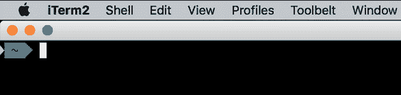

为了让你的终端更漂亮，有一个强大的提示。除了美观之外，它还可以让你很容易地看到你当前的 git 状态和分支。这里是[矿](https://github.com/vitalybe/agnoster-zsh-theme)的样子:

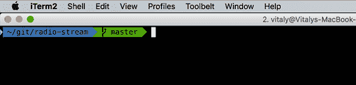

# 将输出复制到剪贴板(不用鼠标)

使用终端的部分好处是，你不需要鼠标…直到你需要复制一些东西。这里有一些无鼠标复制的选项。

## 美国人

用[猛拉](https://github.com/mptre/yank)你需要复制的只是把它的输出重定向到它，就像这样:


## pbcopy (MacOS) / xclip (Linux)

这两个命令都会复制通过管道传输给它们的内容:

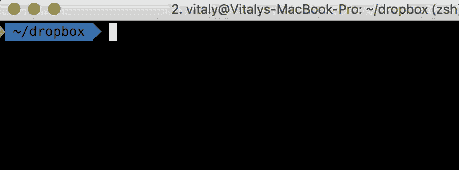

## iTerm2 集成

[iTerm2](https://www.iterm2.com/) 拥有丰富的特性，让它成为我最喜欢的终端外壳。它的集成特性允许您在[和其他](https://www.iterm2.com/documentation-shell-integration.html)中轻松选择和复制最后一个命令的输出:

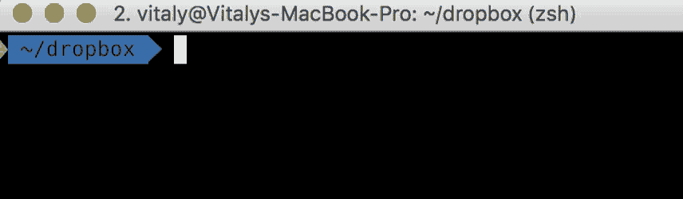

# fasd

在命令行中工作时，我最初的痛苦之一是:“我如何到达我的项目文件夹？写`cd ~/my/very/long/path`肯定会很快老去吧？”。

幸运的是 [fasd](https://github.com/clvv/fasd) 可以在这方面提供帮助(以及更多)。一旦安装和配置完毕，它会静静地聆听你对不同文件夹的 cd 播放。然而，一旦你这样做了，它就会记住它的路径，让你下次做得更快。

在下面的例子中，我手动进入一个目录。然后回到它，我只是使用 fasd 的`z`命令并切换回来。

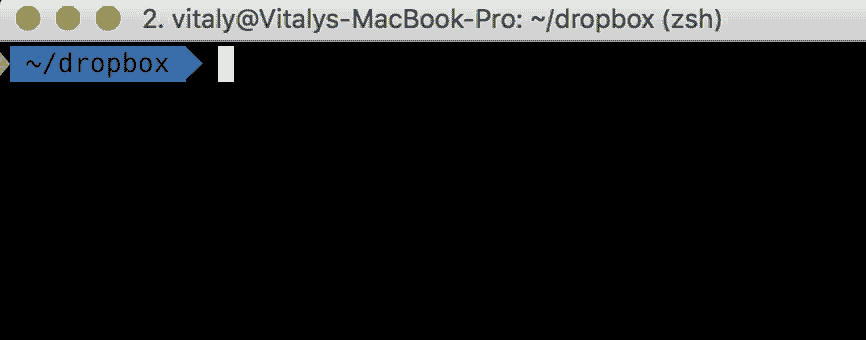

除了更改目录之外，您还可以使用 fasd 的快捷方式通过逗号(，)命令进行其他操作，例如:

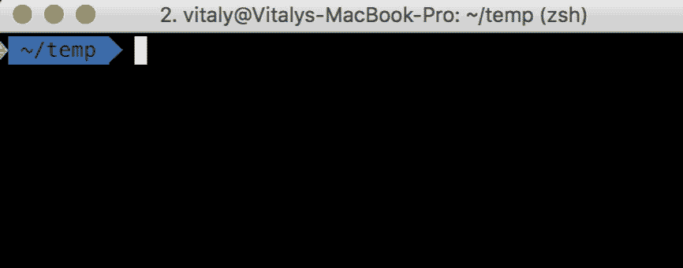

# lnav

我发现 lnav 是处理日志文件的最好方法之一。事实上，它也在 CLI 中，这使得它更容易使用。它毫不费力地加载一个文件或整个文件夹的多个日志文件，并允许您过滤，搜索和跟踪它非常迅速。

在这里，我在 lnav 中打开一个文件夹，其中有许多日志文件，并过滤以获得我想要的特定行:

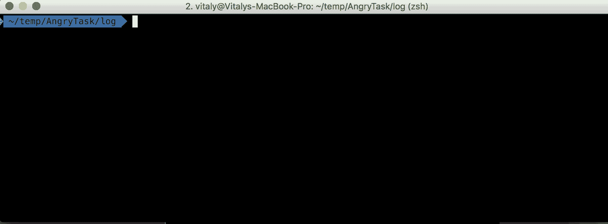

# peco

[peco](https://github.com/peco/peco) 用于快速过滤命令输出。就当是《T2》的互动版吧。

例如，让我们搜索我的命令行历史来提醒我`git merge-base`的语法:

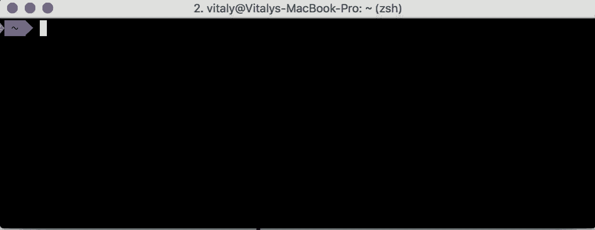

请注意，peco 返回了选中的行，这意味着您可以在其他应用程序中使用它。例如，让我们用前面提到的`yank`将 Evernote 的 pid 放到剪贴板上:


# 捉人游戏

我已经开始在一个合适的 GUI 客户机上使用 git。然而，随着时间的推移，我发现终端对于许多常见的操作更快更好:结帐/拉取/合并。

但是，有些操作确实需要交互性。当我查看 git 的日志时，我希望在提交之间自由移动，并且在提交时，我希望能够选择我希望存放的文件。然而，使用合适的 GUI 客户端会分散注意力——它会使您脱离终端，中断常规命令的流程。tig 会帮你的。

## git 日志

要查看历史记录，只需在目录中运行`tig`——您将能够查看每个提交、受影响的文件和相关的差异。

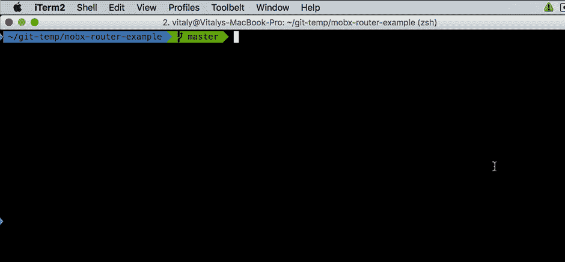

## git 提交

通过运行`tig status` ,很容易存放您想要提交的文件，甚至是特定的行(块)

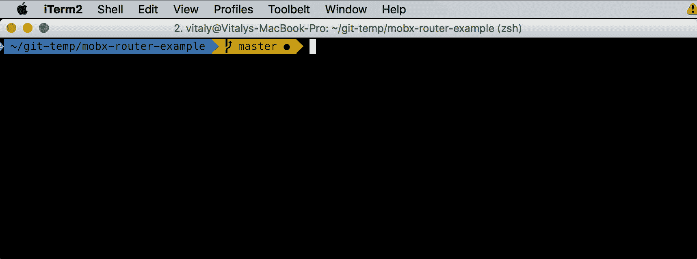

## **git difftool**

仅仅因为你处于文本模式，特别是 tig，并不意味着你必须依赖于文本模式的差异。如果你是一个合适的 diff/merge 工具(例如 Beyond Compare)的粉丝，那么配置 tig 来打开它是很容易的。只需将以下内容添加到您的**中。tigrc** 文件:

```
bind status <F4> !sh -c “git difftool -y \”$(git rev-parse — show-toplevel)/%(file)\”"
```

现在只需选择一个已更改的文件并按下 **F4**

# 骑警

即使你对终端感到舒适，一些动作仍然是一件苦差事。快速浏览多个目录，通过选择将多个复制到另一个文件夹，等等。

举个简短的例子，下面是我如何用 [ranger](https://github.com/ranger/ranger) 复制一些文件:

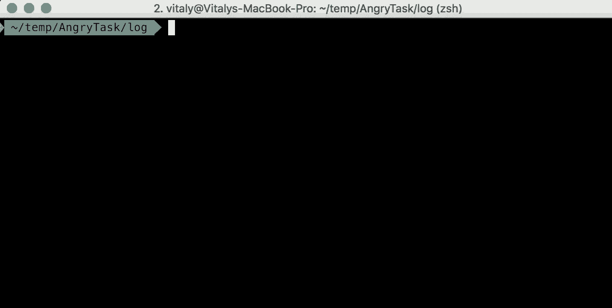

# 真实路径

如果需要将终端中的某个文件提供给一个打开的 GUI 应用程序，该怎么做？举个例子，如果你想获取一张照片到你的照片编辑程序的路径？

您可以做`pwd`，获取当前目录，然后在其中添加文件名。但是有一个更简单的方法。

[**realpath**](http://blog.ivansiu.com/blog/2014/05/01/os-x-get-full-path-of-file-using-realpath/) 给你任何文件的真实的、绝对的路径，像这样:

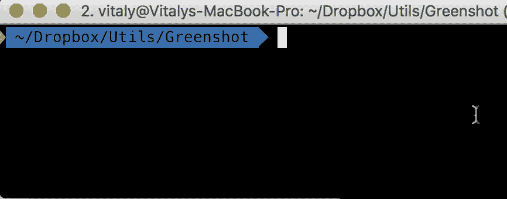

# 麦凯普

那么您已经配置了您的应用程序。一旦你的电脑报废或被替换，会发生什么？mackup 是一种非常简单的将你的配置备份到 Dropbox 或者其他云存储的方法。

它的方法很巧妙——不需要制作副本和时间表，它所做的只是将文件复制一次到你的 Dropbox，并用符号链接替换原来的文件。

应用程序继续照常使用它们的配置，但它们实际上是在你的 Dropbox 上修改它们。现在，您所做的每一项配置更改都会立即被您的云存储备份。

值得强调的是——与其他备份应用程序不同，您只需运行 mackup **一次**。

# ncdu

这个存储分析器回答了“到底是什么在占用我的硬盘空间？!"。它很简单也很有用，我发现它甚至比 GUI 替代品更好。是的，你也可以直接从中删除内容。

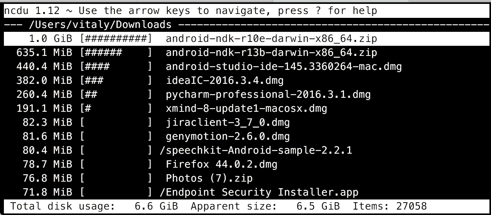

# 说说你的吧！

我很乐意听听你最喜欢的命令行应用程序以及你是如何使用它们的。

# 根据您的评论

评论里有不少建议。我会提到我喜欢的，但我不会提到所有的。按我可能使用它们的次数排序:

*   咖啡因——仅适用于 MacBook 用户(内置)。这个简单的命令允许你运行一个长时间运行的命令，而不用担心你的计算机会中途休眠，例如:`caffeinate sleep 5`
*   [Hub](https://hub.github.com/) —避免去 GitHub 进行拉取请求和分叉！从命令行舒适地执行 GitHub 的大部分操作。
*   [Tmux](https://tmux.github.io/) —终端的多路复用器，[非常有用](https://justin.abrah.ms/dotfiles/tmux.html)如果你在远程计算机上工作，并且想要在不关闭环境和进程的情况下使用多个标签、窗格和断开连接。
*   [SCM _ breeze](http://madebynathan.com/2011/10/19/git-shortcuts-like-youve-never-seen-before/)—如果 tig 对你来说是太多的 UI，这可能是一个更好的选择——这个应用程序用数字快捷键取代了状态中的长文件路径，并允许你选择文件到`git add`而无需键入长路径。
*   [Fzf](https://github.com/junegunn/fzf) —模糊查找器，类似于 peco。同时，你可能还想检查一下 [fzy](https://github.com/jhawthorn/fzy) 。还有很多其他的，虽然，我不确定有什么不同。
*   [Mdlt](https://github.com/metadelta/mdlt) —命令行的计算器，也可以积分和衍生。

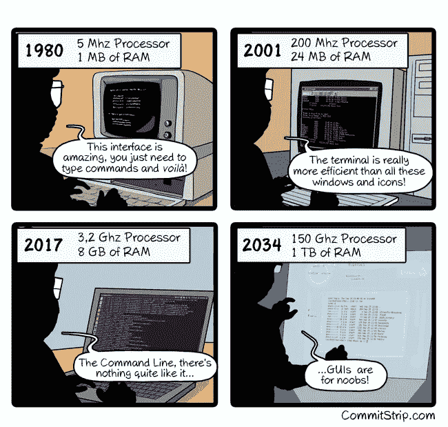[](http://bit.ly/HackernoonFB)[](https://goo.gl/k7XYbx)[](https://goo.gl/4ofytp)

> [黑客中午](http://bit.ly/Hackernoon)是黑客如何开始他们的下午。我们是 AMI 家庭的一员。我们现在[接受投稿](http://bit.ly/hackernoonsubmission)并乐意[讨论广告&赞助](mailto:partners@amipublications.com)机会。
> 
> 如果你喜欢这个故事，我们推荐你阅读我们的[最新科技故事](http://bit.ly/hackernoonlatestt)和[趋势科技故事](https://hackernoon.com/trending)。直到下一次，不要把世界的现实想当然！

