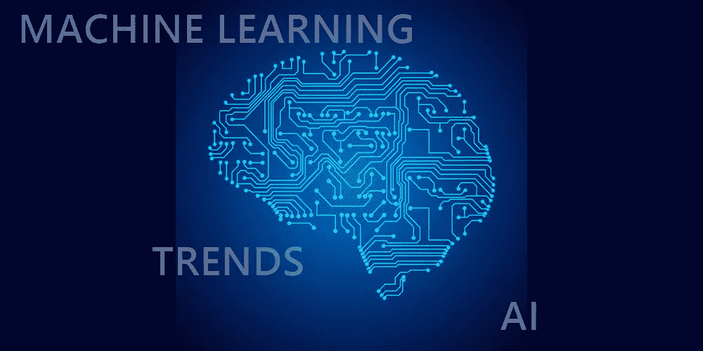
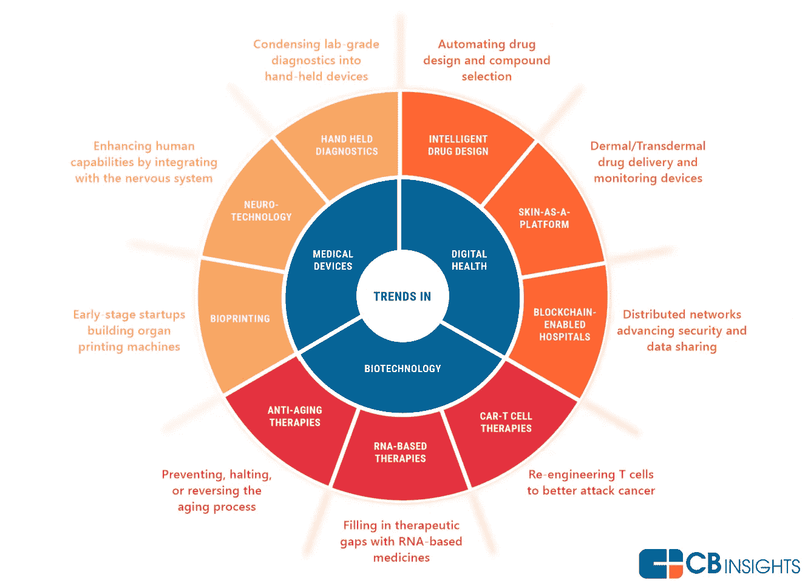
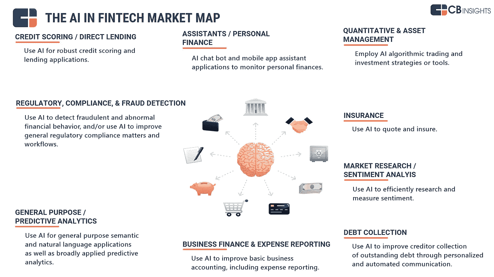
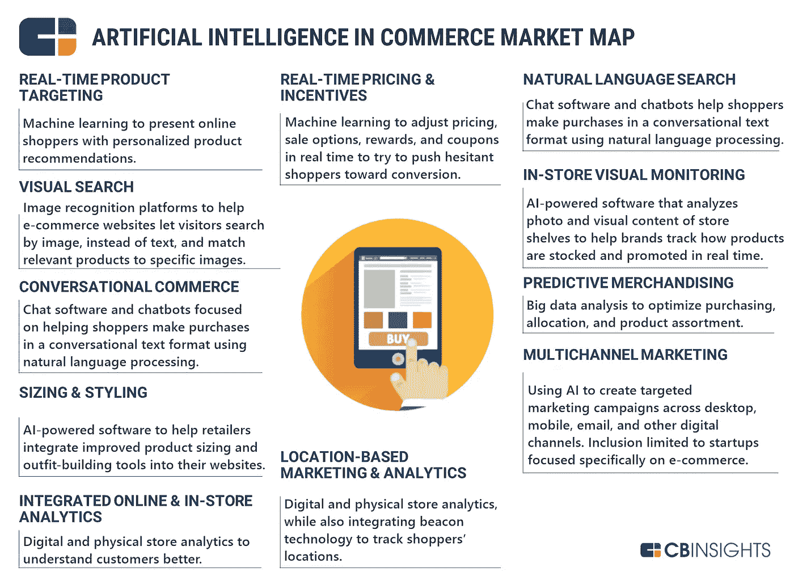
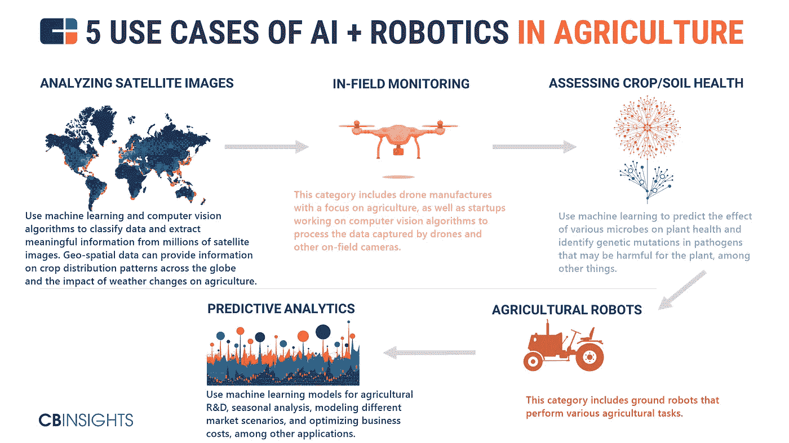
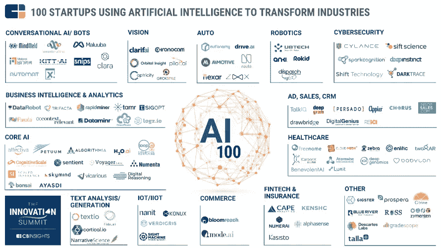

# 2018 年机器学习和人工智能趋势:期待什么？

> 原文：<https://medium.com/hackernoon/machine-learning-and-ai-trends-for-2018-what-to-expect-96d3d74596ce>

似乎我们已经看到了比我们准备好的更多的虚拟现实在视频游戏中的应用， [IoT](https://hackernoon.com/the-most-promising-internet-of-things-trends-for-2018-10a852ccd189) 在医学和智能城市中的应用。我们真的很接近生活在某种科幻小说中，所以看看即将到来的 2018 年最有可能和最有前途的[机器学习和人工智能趋势](https://hackernoon.com/web-development-trends-2017-387421cf9c23)并问问我们自己是否准备好了，这是一个好主意。

# 医疗保健行业:太多的事情正在发生，一切都令人惊讶

[医疗保健](https://dashbouquet.com/blog/web-development/the-change-of-healthcare-industry-and-modern-it-trends-where-do-we-stand-now)是世界上最大和最重要的行业之一，所以难怪它是大量使用最新技术的行业——因为这是生死攸关的问题。首先，由于人工智能和大数据，科学家将很快有机会预防某些疾病，如癌症。这可以通过分析患者的历史和所有记录来完成，因此人工智能将能够理解疾病的机制，从而使医生能够积极主动，而不是被动反应。其次，越来越多的智能假体涌现出来，这也为医生和患者提供了大量的机会。这种假体能够区分图像、光、压力等。已经是一个很大的突破。

最后，我们不要忘记人工智能和机器人——它们一起构成了机器人助手。它们可以有多种形式——智能手机中的虚拟护士能够识别警告信号并呼救，或者真正的机器人能够监控病人，向医生发出警报并在需要时发送通知。

总的来说，人工智能对全世界的科学家来说是一个惊人的机会，可以让医疗系统对医务工作者和患者来说更加有效。因为机器出错的几率比人类出错的几率小得多，医学的状态真的会转移到一个全新的层面。

# 金融行业:风险更低，准确性更高

众所周知，当谈到大数据、分析和机器可以执行的日常任务时，机器学习和人工智能非常棒。人工智能将错误的可能性降至最低，并能够根据之前的数据建立预测——当人们想要防止欺诈或任何类似行为时，这些预测模型被用于预测分析。此外，预测分析可以帮助公司在未来最小化风险，估计发展等等。这是任何公司都应该感兴趣的事情，因为它是:

*   省钱
*   与人工分析相比，效率更高
*   更加准确，能够从大数据中构建大型复杂报告

当然，某些流程仍将由人来执行——然而，AI 的应用将使[金融行业](https://dashbouquet.com/blog/artificial-intelligence/iot-and-ai-and-finances-how-modern-technologies-affect-one-of-the-strongest-industries-in-the-world)更加稳定和高效。

# 个人助理和更好的客户体验

我们都知道 Siri 或 Cortana，现在是时候在我们的日常生活中获得更多的个人助理了。其中最简单的是聊天机器人的例子，它们变得越来越复杂和智能。由于数据分析，系统将能够学习关于客户行为及其模式的一切，它还将学习个人偏好，并且基于所有这些数据，助理将能够提供更好的服务。

这样的助理对于营销专业人员来说是完美的，因为他们将允许在产品和用户之间建立更强的联系，并将提供可用于建立更有效的营销活动的有价值的信息。

# 机器人技术的兴起

如上所述，我们将在 2018 年看到机器人的更多使用，不仅仅是在医学领域。智能无人机，制造设施中的机器人——机器人化旨在让我们的生活变得更轻松，因此这是我们可以预期的近期最热门的趋势之一。尽管有人担心机器人可能会取代工作中的人，但总会有操作员和制造这些机器人的人，所以没有必要恐慌——但开始学习机器人化可能是一个好主意，特别是如果你在 IT 行业工作。

综上所述，人工智能和机器学习致力于简化我们的生活和工作流程，并改善某些行业对我们有利。很明显，现在和将来都会有一些担忧(比如网络安全)，但总而言之，就新技术及其应用而言，2018 年有望成为真正令人兴奋的一年。

回望 2017 年查看 [CBinsights AI 100 2017](https://s3-us-west-2.amazonaws.com/cbi-content/research-reports/CB-Insights_AI-100-2017.pdf) 。

[*德米特里·武科写的*](https://www.linkedin.com/in/dmitrybudko/\)