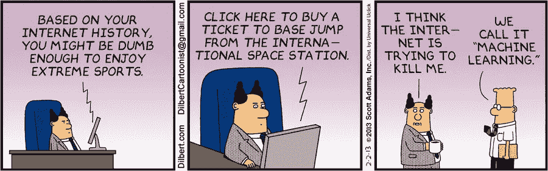

# 机器学习和产品经理

> 原文：<https://medium.com/hackernoon/machine-learning-and-product-managers-930b691b1b37>

在接下来的几十年里，机器学习将比任何其他 T2 技术更能改变世界。为了利用机器学习革命，我们(也就是产品经理)应该迅速行动起来，用必要的工具装备自己。否则，我们将会迷失在默默无闻的竞争中，因为许多顶尖的技术公司已经在利用 ML 来创造新的商业机会。

正如马克·库班最近指出的:

> “人工智能、深度学习、机器学习——不管你在做什么，如果你不懂，就去学吧。因为否则你会在三年内变成恐龙。”

这就是为什么我认为每个产品经理都应该了解机器学习，以及他们如何才能在这方面有所突破。

# 为什么？

暂停一下，想想你日常使用的所有产品。我打赌他们都在他们的产品中使用一些机器学习的味道。下面是一些我猜我们几乎每天都会用到的:

1.  谷歌，试图用最好的结果回答你的问题？这是一个**排名**问题——帮助用户在搜索时找到*正确的东西。*
2.  网飞或 Spotify 向客户推荐他们可能感兴趣的电影或歌曲？这是一个**推荐**问题——给用户*他们可能感兴趣的东西*，而不需要他们明确地搜索。
3.  Zillow 预测你的房价？这是一个**回归**问题——预测一个事物的*数值。*
4.  Gmail 将电子邮件标记为垃圾邮件/非垃圾邮件？这是一个**分类**问题——弄清楚*某物是哪种东西*。
5.  脸书照片检测人脸？这也是一个**分类**的问题。
6.  亚马逊全球著名的“买了这个的顾客也买了这个”？这就是**集群**的作用——把*相似的东西放在一起。*

这个清单还可以继续下去，但我想你明白我的意思了。机器学习无处不在。机器学习将颠覆工业和你的产品。如果我可以更进一步，它将是下一个大型技术平台，在这个平台上，现有者将被颠覆，新的领导者将出现(如果你认为 ML 是一种时尚，那就去问问在 1998 年认为 web 是一种时尚，或在 2008 年认为移动是一种时尚的人)。因此，作为产品经理，我们需要了解机器学习的现状，以及深度学习等机会和技术为改造您的产品和取悦您的用户提供的机会和技术。

我所说的“理解机器学习”并不是指你对 ML 算法有深入的了解，你应该能够为算法提出模型(如果你能，那将是很好的，但这是题外话)。

但是，您应该知道足够的信息来回答以下问题:

*   机器学习会给你的产品增加多少价值？
*   机器学习能为你的产品实现什么，执行它需要什么(更多的数据，更好的算法等等)——从技术角度来说
*   从机器学习中识别炒作和真实可实现的事物之间的差异。

然后，当你在开发一个使用机器学习的产品时(这是很常见的)，你应该确保理解:

*   机器学习有很多方法可以在错误的时候创造出正确的假象——学会抓住这一点。
*   需要多少数据样本才能使你的预测在现实世界中成立。
*   这种数据准备将占用开发人员 80-90%的时间

# 怎么做？

在谷歌上简单搜索一下“初学者机器学习”，你会得到 100 多万个结果。为了让事情变得更容易，在亚马逊的一些朋友的帮助下，我整理了一份学习机器学习 esp 的最佳资源列表。面向产品经理

书

*   托比·塞格兰的《集体智慧编程》
*   [大师级算法](https://www.amazon.com/Master-Algorithm-Ultimate-Learning-Machine/dp/0465065708/ref=sr_1_1?ie=UTF8&qid=1491937585&sr=8-1&keywords=master+algorithm)作者 Pedro Domingos
*   [机器学习简介](http://robotics.stanford.edu/people/nilsson/MLBOOK.pdf)作者尼尔斯·尼尔森
*   伊恩·惠顿的数据挖掘
*   [福斯特·普罗沃斯特的商业数据科学](https://www.amazon.com/Data-Science-Business-Data-Analytic-Thinking/dp/1449361323/ref=pd_bxgy_14_img_2?_encoding=UTF8&pd_rd_i=1449361323&pd_rd_r=YTBGS2079W1RTNWSTK56&pd_rd_w=BIpsX&pd_rd_wg=EdjeA&psc=1&refRID=YTBGS2079W1RTNWSTK56)
*   [神经网络和深度学习](http://neuralnetworksanddeeplearning.com/index.html)迈克尔·尼尔森著
*   塔里克·拉希德[制作自己的神经网络](https://www.amazon.co.uk/gp/product/1530826608/ref=oh_aui_search_detailpage?ie=UTF8&psc=1)

课程

*   [吴恩达的《机器学习入门》](https://www.coursera.org/learn/machine-learning)(强烈推荐)
*   [机器学习工程师](https://www.udacity.com/course/machine-learning-engineer-nanodegree--nd009)由 Udacity
*   [机器学习很有趣！亚当·盖特基](/@ageitgey/machine-learning-is-fun-80ea3ec3c471#.obai1m7ar)
*   [如何使用 Tensorflow 进行分类](https://www.youtube.com/watch?v=4urPuRoT1sE)Siraj Raval
*   丹尼尔·杰弗里斯如果你数学很差，就学习人工智能
*   杰森·布朗利的《机器学习掌握》
*   佐治亚理工学院(Udacity)的机器学习

必读:

*   WTF 是人工智能
*   [产品经理的机器学习](https://www.kennorton.com/newsletter/2016-07-27-bringing-the-donuts.html)作者肯·诺顿
*   人工智能、深度学习和机器学习:一本入门书
*   [人工智能是新电](https://www.youtube.com/watch?v=21EiKfQYZXc)作者吴恩达
*   机器学习的现状
*   史蒂文·利维:[谷歌如何将自己重塑为“机器学习第一”的公司](https://backchannel.com/how-google-is-remaking-itself-as-a-machine-learning-first-company-ada63defcb70)
*   多里安·派尔(麦肯锡)机器学习高管指南
*   机器学习时代的体验设计杨奇煜·吉拉尔丁
*   Sam DeBrule 的《人类机器学习指南》
*   [每个经理都应该知道的机器学习知识](https://hbr.org/2015/07/what-every-manager-should-know-about-machine-learning)作者:麦克·约曼斯
*   [机器学习理论及其应用简介](https://www.toptal.com/machine-learning/machine-learning-theory-an-introductory-primer)作者尼克·麦克雷
*   本·哈姆纳的《机器学习陷阱》

其他:

*   [机器人人工智能工作自动化](http://www.motherjones.com/media/2013/05/robots-artificial-intelligence-jobs-automation)凯文·德拉姆

这绝不是一个详尽的列表，当我遇到更多有价值的资源时，我会不断更新它。所有产品经理，我想知道你们对 ML 的看法，以及它对你们产品的影响。请在下面留下评论。

> [黑客中午](http://bit.ly/Hackernoon)是黑客如何开始他们的下午。我们是阿妹家庭的一员。我们现在[接受投稿](http://bit.ly/hackernoonsubmission)并乐意[讨论广告&赞助](mailto:partners@amipublications.com)机会。
> 
> 如果你喜欢这个故事，我们推荐你阅读我们的[最新科技故事](http://bit.ly/hackernoonlatestt)和[趋势科技故事](https://hackernoon.com/trending)。直到下一次，不要把世界的现实想当然！

