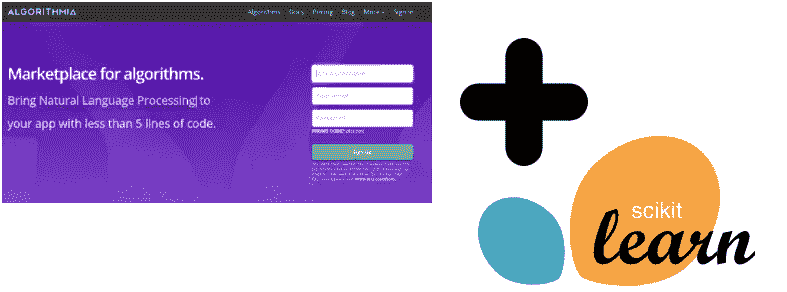
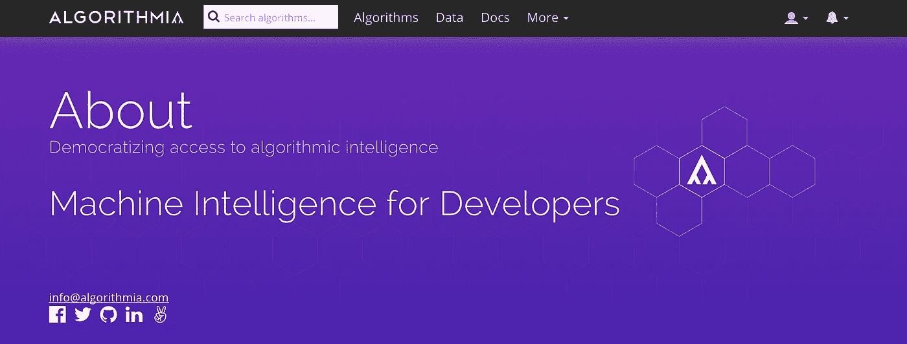
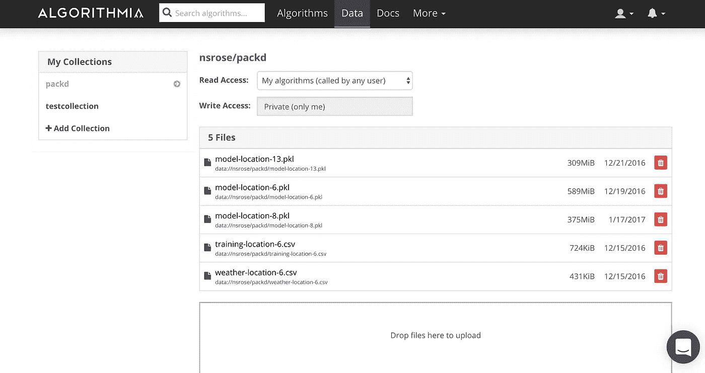
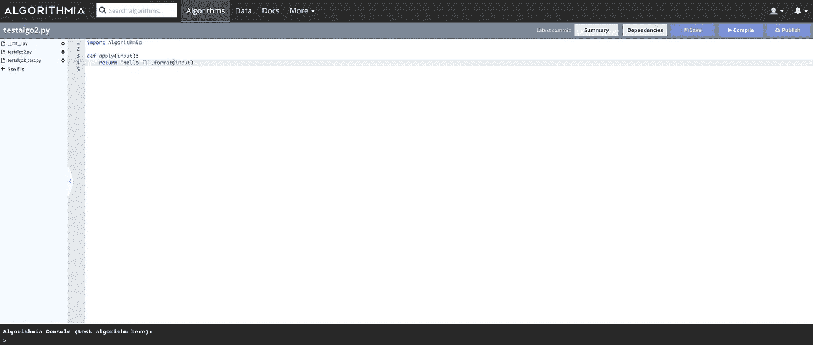
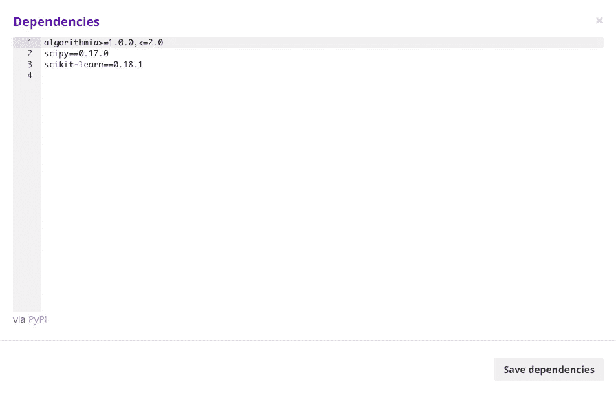
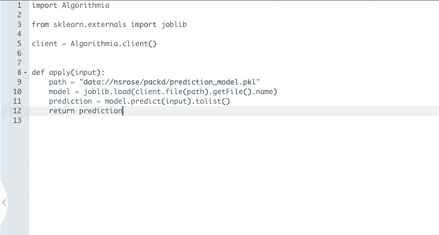
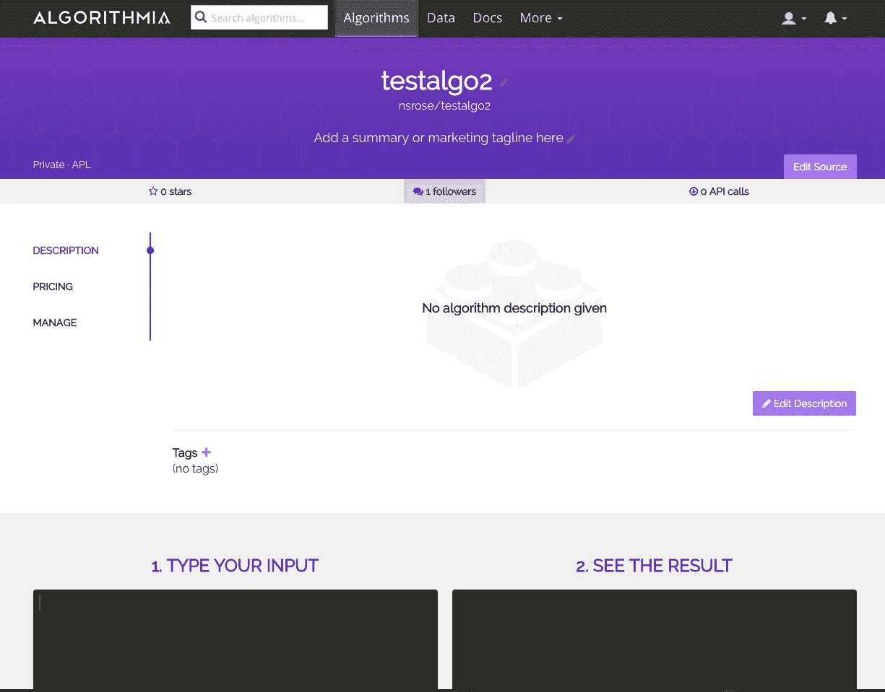

# 使用 Sklearn 和 Algorithmia 的机器学习即服务(MLaaS)

> 原文：<https://medium.com/hackernoon/machine-learning-as-a-service-mlaas-with-sklearn-and-algorithmia-7299fbaed584>



我最近的[帖子](/@nicksrose72/training-with-weights-machine-learning-at-the-gym-356c643b402f#.2ivh4748z)是关于去年使用[机器](https://hackernoon.com/tagged/machine) [学习](https://hackernoon.com/tagged/learning)分析我的大学体育馆拥挤情况的，引起了很多很好的反响——包括:

1.  多么整洁！我一直想找个借口再也不去 RSF(我们的健身房)了。
2.  *您能为我们的其他校园场所也这样做吗？*
3.  *我如何自己做这样的事情？*

首先，我很抱歉你对健身房有这样的感觉，我真诚地希望即将到来的新年决心浪潮不会彻底粉碎你永远健身的梦想。

第二，是的。我正在为其他十个校园位置 [Packd](http://packd.org/) tracks 创建更多预测模型。机器学习需要大量数据，因此在模型准备好进行训练之前，可能需要一些时间。

最后，问得好！在我的上一篇文章中，我暗示了你自己可以怎样做:

> 我已经在 Algorithmia 上部署了随机森林回归器，以 API 调用的形式生成预测。

我意识到这需要更多的解释，这也是这篇文章的主题。我的过程可能不是最好的，但希望通过举例说明，我可以从我的错误中吸取教训，并给你一个起点。这篇文章的其余部分假设你有机器学习的基本知识，你知道 Python，你熟悉 API。在本教程中，我们将使用 [scikit-learn](http://scikit-learn.org/) 。

## 在本地开发模型

第一步是在本地(在你的电脑上)创建一个机器学习模型来进行测试。这方面的数据位于[这里](https://www.kaggle.com/nsrose7224/crowdedness-at-the-campus-gym)下载。您需要安装:

*   数量(pip 安装数量)
*   熊猫(pip 安装熊猫)
*   软件(pip 安装软件)
*   Scikit-learn (pip 安装 Scikit-learn)

我们需要用这些数据建立一个预测模型。以下内容摘自我在 [Kaggle](https://www.kaggle.com/nsrose7224/d/nsrose7224/crowdedness-at-the-campus-gym/random-forest-regressor-accuracy-0-89) 的内核:

```
**import** **numpy** **as** **np** *# linear algebra*
**import** **pandas** **as** **pd** *# data processing, CSV file I/O (e.g. pd.read_csv)*

**from** **sklearn.ensemble** **import** RandomForestRegressor
**from** **sklearn.model_selection** **import** train_test_split
**from** **sklearn.preprocessing** **import** StandardScalerdf = pd.read_csv("data.csv") # or wherever your data is located*# Extract the training and test data*
data = df.values
X = data[:, 1:]  *# all rows, no "number_people"*
y = data[:, 0]  *# all rows, "number_people" only*
X_train, X_test, y_train, y_test = train_test_split(X, y, test_size=0.25, random_state=42)*# Scale the data to be between -1 and 1*
scaler = StandardScaler()
scaler.fit(X_train)
X_train = scaler.transform(X_train)
X_test = scaler.transform(X_test)# Create your prediction model
model = RandomForestRegressor(n_estimators=140)
model.fit(X_train, y_train)
```

让我们暂停一下。我浏览了上面代码中的一些重要细节。首先，我不需要修改任何数据(比如将“是/否”的列值转换为 1/0)，因为我已经在后台完成了这一部分。第二，选择正确的模型不是一件小事，我好像凭空扯出了随机森林回归量。(我真的没有，详情查看我的[第一帖](/@nicksrose72/training-with-weights-machine-learning-at-the-gym-356c643b402f#.2ivh4748z))。最后，为什么我将 n_estimators 设置为 140？通常我们想要在我们的超参数上做一个[网格搜索](http://scikit-learn.org/stable/modules/grid_search.html)来找到最优的 n _ 估计量，但是我已经在幕后做了艰苦的工作(这需要一些时间)。

最后一行是最重要的——它实际上执行了算法的学习部分。它改变变量**模型的状态。**从现在开始，我们可以向模型中加入新数据来进行预测:

```
test_output = model.predict(X_test) # predicted values
score = model.score(X_test, y_test) # accuracy score, around 0.90
print(test_output)
```

以下是测试数据的预测人数:

```
array([ 44.92142857,  54.22142857,  45.35714286, ...,  47.95714286,
        63.27142857,  40.22142857])
```

太好了！这还不能真正预测未来——测试数据实际上是原始历史数据的四分之一([更多关于测试/训练数据分割](http://stats.stackexchange.com/questions/19048/what-is-the-difference-between-test-set-and-validation-set))。如果我们想真正预测未来，我们需要做更多的工作。

为了预测未来健身房会有多拥挤，我们需要一个新的列值数组，其中除了目标标签 **number_people** 之外的所有内容都被填充。如何填写这些内容的细节可能会在另一篇文章中介绍，但总的想法是在未来创建几个 datetimess，并为每个 datetime 添加每个特征值(时间戳、星期几、是不是周末、是不是假日、是不是学期开始，等等)。对于天气特征值，我使用了[黑暗天空](https://darksky.net/) API 进行预测。

假设你现在有一个未来时间的数组，你想预测体育馆会有多拥挤。你可以这样做:

```
X_predict = generate_prediction_data() # your special call here
scaler = StandardScaler()
X_predict = scaler.fit_transform(X_predict)
predictions = model.predict(X_predict)
```

恭喜你！**预测**变量现在保存未来每个日期的预测人数。现在，如果你愿意，你可以为今年剩下的时间，或者这个世纪，或者任何时候，生成预测，并且称之为你的预测值。然而，这看起来会占用大量的内存，并且在未来可能会不太准确。最好是*存储*我们创建的模型，只在我们想做预测的时候才拿出来。以下是在 sklearn 中的做法:

```
**from** sklearn.externals **import** joblib# How to save the model:
joblib.dump(model, "prediction_model.pkl")# You can quit your Python process here, even shut off your computer.# Later, if you want to load the saved model back into memory:
model = joblib.load("prediction_model.pkl")
```

在 scikit-learn 中存储已经训练好的模型很容易。当然，你的用户不可能每次需要预测时都打电话给你，所以你可以在你的电脑上生成预测。他们需要对您提供的服务进行某种 API 调用来进行预测。

## 将您的模型存储在云中

您可以将 **prediction_model.pkl** 文件存储在您的服务器上，并在有人请求预测时加载该文件，但是加载该文件会占用大量内存。对我来说，比我的托管公司分配的还要多。最好把你的机器学习模型放在完全不同的服务器上。你可以从大公司那里得到一些选择，包括[谷歌](https://cloud.google.com/ml/)、[微软](https://azure.microsoft.com/en-us/services/machine-learning/)和[亚马逊](https://aws.amazon.com/machine-learning/)。


然而，我决定去一家规模较小、知名度较低的公司试一试。



Algorithmia 是一家相对较新的公司，位于西雅图，专注于“算法即服务”。该平台的用户可以创建代码片段，并将它们托管在 Algorithmia 上，并将它们的代码作为 API 调用。此外，这些开发者可以向其他使用他们代码的用户收费。这是一个有趣的商业想法，我渴望看到它是如何工作的，但现在我只是使用托管服务的想法。

创建帐户后，您需要将您的 **prediction_model.pkl** 上传到数据部分。这里，我有几个预测模型，每个都以。pkl 扩展:



上传就像拖放一样简单，如果您有较大的预测模型(> 500 MiB)，只需几分钟。下一步是创建一个使用你的数据进行预测的算法。

## 作为服务呼叫进行预测

在 Algorithmia 顶部的“更多”标签下，你会找到“添加算法”按钮。


接下来你需要填写你的算法如何运作的细节。


我启用了“完全访问互联网”和“可以调用其他算法”以防万一。这意味着我的算法可以调用外部 web APIs，如[黑暗天空](https://darksky.net/)天气 API，并调用*我在 Algorithmia 上创建的其他*算法。

Algorithmia 提供了一个在线代码编辑器供您编辑您的算法。一旦你创建了你的算法，你将被带到这里:



每个算法都由一个**应用**方法组成，该方法接受一个输入，方便地命名为**输入**。**输入**变量是您定义的任何东西，因为您将是调用算法的人。通常， **input** 将是您的特征的二维数组，其中每一行都缺少您想要预测的列。对我来说，那就是**号 _ 人**。这里有一个**输入**的例子:

```
input = [
    [
        1.072308379173353,
        0.772801541291309,
        0.0,
        0.0,
        0.24191249808036538,
       -0.36311268827583276,
        0.0,
        0.0,
        0.0,
        1.034839680120056
    ],
    ...]
```

如果我们将**输入**扔向我在本地创建的**模型**，我们将得到每个特性行的预测**数量 _ 人数**的列表，就像我们想要的那样。剩下的唯一一件事就是将这种行为映射为服务调用。让我们完成 Algorithmia 上的代码。

在继续之前，请确保向代码中添加了正确的依赖项。因为我们使用 sci-kit learn，所以我们需要添加以下内容:



完成源代码后，我们得到了这个:



虽然很短，但是这个可以。当一个新的格式正确的**输入**传递给这个算法时，代码会找到我们之前上传的 **prediction_model.pkl** 文件的路径，使用 joblib 将其加载到内存中，最后进行预测并返回。点击“保存”、“编译”，然后“发布”来完成你的算法。

你会在这一页结束，这是完成的结果。



如果你向下滚动到“使用这个算法”并点击 Python 选项卡，你会发现调用你的算法是多么容易。

```
**import** Algorithmia input = <INPUT> 
client = Algorithmia.client(<Your Algorithmia Key here>) 
algo = client.algo('nsrose/testalgo2/') 
**print** algo.pipe(input)
```

这将在任何地方工作，从任何安装了 Python 和 Algorithmia 的计算机(pip 安装 algorithmia)。你所要做的就是确保你的**输入**格式正确！

# 为什么这是一件好事？

1.  从你的应用程序的其余部分中分离出 ML 关注点:通过调用和预测 API 调用，你的应用程序可以摆脱机器学习机制的关注。它需要做的就是创建正确格式化的输入。
2.  **缓解内存消耗**:加载*。pkl 文件存储到内存中是一项繁重的任务，可能不适合有限服务器上的小型应用程序。将这项工作外包给 Algorithmia 是一个不错的选择。
3.  **源码控制你的 ML 代码** : Algorithmia 最近增加了对 Git repos 的支持，所以你可以离线编辑你的代码，并推送修改。

# 改进建议

*   向在线代码编辑器添加调试工具
*   添加集成(当有人使用您的算法时，可能会发出松弛通知)

感谢 Algorithmia 的人们帮助回答了我的问题。我认为你有一个很好的产品，我希望它起飞！

[](http://bit.ly/HackernoonFB)[](https://goo.gl/k7XYbx)[](https://goo.gl/4ofytp)

> [黑客中午](http://bit.ly/Hackernoon)是黑客如何开始他们的下午。我们是 [@AMI](http://bit.ly/atAMIatAMI) 家庭的一员。我们现在[接受投稿](http://bit.ly/hackernoonsubmission)，并乐意[讨论广告&赞助](mailto:partners@amipublications.com)机会。
> 
> 如果你喜欢这个故事，我们推荐你阅读我们的[最新科技故事](http://bit.ly/hackernoonlatestt)和[趋势科技故事](https://hackernoon.com/trending)。直到下一次，不要把世界的现实想当然！

