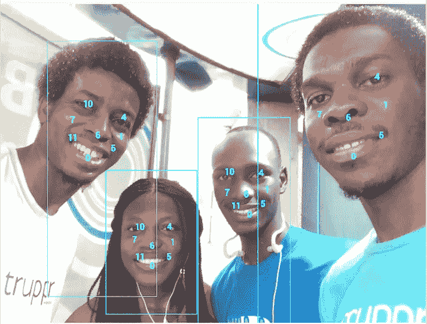

# 使用移动视觉 API 的 Android 开发人员的机器学习—第 1 部分—人脸检测

> 原文：<https://medium.com/hackernoon/machine-learning-for-android-developers-with-the-mobile-vision-api-part-1-face-detection-e7e24a3e472f>

机器学习是计算机科学中一个非常有趣的领域，很长一段时间以来一直排在我的学习清单的前列。有这么多来自 RxJava、测试、 [Android](https://hackernoon.com/tagged/android) N、Android Studio 和其他 Android 好东西的更新，我还没有时间去学习它。Udacity 甚至还有一门关于机器学习的纳米学位课程。唷。

我非常兴奋地发现，现在任何人都可以在基于谷歌移动视觉 API 的 Android 应用中实现机器学习，而无需事先了解该领域的知识。你只需要知道如何使用 API。

在云和移动设备上有很多用于机器学习的 API，但在这个系列中，我将只关注移动视觉 API，因为它们是专门为 Android 开发人员创建的。移动视觉 API 目前包括三种:人脸检测 API、条形码检测 API 和文本 API。我们将在本文中讨论人脸检测，其余两种将在后续文章中讨论。

# 人脸检测 API

该 API 用于检测和跟踪图像或视频中的人脸，但它还不提供人脸识别功能。它允许检测面部标志，并提供面部分类。地标是面部中的兴趣点，例如眼睛、鼻子和嘴。面部分类用于检查某些特征的标志，例如笑脸或闭眼，这是目前唯一支持的分类。API 还检测不同角度的人脸，并报告**欧拉 Y** 和**欧拉 Z** 角度。

# 入门指南

我们将创建一个名为 **printf("%s Story "，yourName)** 的应用程序，带有两个过滤器。请注意，这篇文章的目的只是展示 API 的使用，所以这段代码的初始版本不会有测试或遵循任何特定的架构。还要注意，所有的处理最好在 UI 线程之外完成。Github 上的[代码将会更新以反映这一点。](https://github.com/moyheen/face-detector)

开始了…

*   在 Android Studio 中创建新项目。
*   将用于移动视觉 API 的 Google Play Services SDK 导入到您的应用程序级 build.gradle 文件中。在撰写本文时，最新版本是 9.6.1。这里要特别小心，因为如果您导入整个 SDK 而不是您需要的特定 SDK(play-services-vision ),您肯定会达到 65k 的方法限制。

```
compile 'com.google.android.gms:play-services-vision:9.6.1'
```

*   要使可用库能够用于人脸检测，请将此元数据添加到您的清单文件中。

```
<meta-data
    android:name="com.google.android.gms.vision.DEPENDENCIES"
    android:value="face"/>
```

*   接下来，你需要添加一个 *ImageView* 和一个*按钮*到你的布局中。该按钮通过选择图像、处理图像并将其显示在*图像视图*中来启动图像处理。图像可以通过相机或图库从设备中加载。为了节省时间，我只是把一张图片保存到我的 drawable 文件夹中并使用它。
*   在按钮的点击动作中，创建一个新的 *BitmapFactory。Options* 对象并将 *inmutable* 设置为 true。这是为了确保位图是可变的，以便我们能够以编程方式对其应用效果。

```
BitmapFactory.Options bitmapOptions = new BitmapFactory.Options();
bitmapOptions.inMutable = true;
```

*   接下来，使用 BitmapFactory 类中的 *decodeResource* 方法创建一个新的位图。您将使用 drawable 文件夹中的图像和上一步中创建的 *BitmapOptions* 对象作为该方法的参数。

```
Bitmap defaultBitmap = BitmapFactory.*decodeResource*(getResources(), R.drawable.*image*, bitmapOptions);
```

*   创建一个*绘制*对象，并将样式设置为笔画。这确保了形状不会被填充，因为我们希望看到头部的哪些部分形成了矩形。

*注意*:如果你在做一个叫 ***的游戏！(认出我)*** 当你需要遮挡图像中的人脸，让你的玩家猜测是谁时，你可能会想要设置填充样式，就像这样*绘画。样式填充*。

```
Paint rectPaint = new Paint();
rectPaint.setStrokeWidth(5);
rectPaint.setColor(Color.*CYAN*);
rectPaint.setStyle(Paint.Style.*STROKE*);
```

*   我们需要一个画布来显示我们的位图。我们将首先用临时位图创建画布。这个临时位图将与原始位图具有相同的尺寸，但这是相似之处的终点。我们稍后将在同一画布上绘制原始位图。

```
Bitmap temporaryBitmap = Bitmap.*createBitmap*(defaultBitmap.getWidth(), defaultBitmap
        .getHeight(), Bitmap.Config.*RGB_565*);

Canvas canvas = new Canvas(temporaryBitmap);
canvas.drawBitmap(defaultBitmap, 0, 0, null);
```

*   最后，我们到达使用 *FaceDectector* API 的地方。跟踪被禁用，因为我们使用的是静态图像。应该为视频启用它。

```
FaceDetector faceDetector = new FaceDetector.Builder(this)
        .setTrackingEnabled(false)
        .setLandmarkType(FaceDetector.*ALL_LANDMARKS*)
        .build();
```

*   检查面部检测器是否已经运行。有可能第一次不会成功，因为需要将一个库下载到设备上，当您需要使用它时，它可能没有及时完成。

```
if (!faceDetector.isOperational()) {
            new AlertDialog.Builder(this)
            .setMessage("Face Detector could not be set up on your device :(")
            .show();

    return;
}
```

*   接下来，我们使用默认位图创建一个帧，并调用人脸检测器来获取人脸对象。

```
Frame frame = new Frame.Builder().setBitmap(defaultBitmap).build();
SparseArray<Face> sparseArray = **faceDetector.detect(frame)**;
```

*   在这一步中，矩形绘制在面上。我们只能从每个面得到左边和上边的位置，但是我们还需要右边和下边的尺寸来画矩形。为了解决这个问题，我们将宽度和高度分别添加到左侧和顶部位置。

```
for (int i = 0; i < sparseArray.size(); i++) {
    Face face = sparseArray.valueAt(i);

    float left = face.getPosition().x;
    float top = face.getPosition().y;
   ** float right = left + face.getWidth();
    float bottom = top + face.getHeight();**
    float cornerRadius = 2.0f;

    RectF rectF = new RectF(left, top, right, bottom);

    canvas.drawRoundRect(rectF, cornerRadius, cornerRadius, rectPaint);
}
```

*   然后，我们用临时位图创建一个新的 *BitmapDrawable* ，并在我们布局的 ImageView 上设置它，之后我们释放人脸检测器。

```
imageView.setImageDrawable(new BitmapDrawable(getResources(), temporaryBitmap));

faceDetector.release();
```

这些步骤刚好够在每个面上画出矩形。如果你想突出每个面上的地标，你需要做的就是修改最后两步的循环。现在，您将遍历每个面的界标，获得界标的 x 和 y 位置，并在每个面上画一个圆，如下所示。

```
for (int i = 0; i < sparseArray.size(); i++) {
    Face face = sparseArray.valueAt(i);

    float left = face.getPosition().x;
    float top = face.getPosition().y;
    float right = left + face.getWidth();
    float bottom = top + face.getHeight();
    float cornerRadius = 2.0f;

    RectF rectF = new RectF(left, top, right, bottom);
    canvas.drawRoundRect(rectF, cornerRadius, cornerRadius, rectPaint);

   ** for (Landmark landmark : face.getLandmarks()) {
        int x = (int) (landmark.getPosition().x);
        int y = (int) (landmark.getPosition().y);
        float radius = 10.0f;** **canvas.drawCircle(x, y, radius, rectPaint);
    }**
}
```

Picture with facial landmarks highlighted

我很好奇地标是如何表示的，所以我使用了*landmark . gettype()；*找出答案。原来每个地标都有特定的数字。

```
for (Landmark landmark : face.getLandmarks()) {

    int cx = (int) (landmark.getPosition().x);
    int cy = (int) (landmark.getPosition().y);

    // canvas.drawCircle(cx, cy, 10, rectPaint);

    **String type = String.*valueOf*(landmark.getType());
    rectPaint.setTextSize(50);    
    canvas.drawText(type, cx, cy, rectPaint);**
}
```



当我们想要相对于特定的面部标志在屏幕上定位对象时，这种知识是有用的。如果我们要构建我们的 **printf("%s Story "，yourName)** app **，**我们所要做的就是相对于一个地标的位置定位一个图像，因为我们现在知道它被表示为什么数字。下面让我们继续做吧…

假设我们是海上的海盗，我们想通过一个非常酷的 **printf("%s Story "，yourName)** 应用过滤器来描绘这个场景，我们需要在左眼上戴一个眼罩。眼罩位图的位置是相对于左眼绘制的。

```
for (Landmark landmark : face.getLandmarks()) {

    int cx = (int) (landmark.getPosition().x);
    int cy = (int) (landmark.getPosition().y);

    // canvas.drawCircle(cx, cy, 10, rectPaint);

    // String type = String.valueOf(landmark.getType());
    // rectPaint.setTextSize(50);
    // canvas.drawText(type, cx, cy, rectPaint); **// the left eye is represented by 4** 
    **if (landmark.getType() == 4) {
        canvas.drawBitmap(eyePatchBitmap, cx - 270, cy - 250, null);
    }**
}
```

以下是来自 **printf("%s Story "，yourName)** 应用程序的更多内容…

这个 API 还有很多内容要介绍。我们可以更新应用程序来跟踪视频中的人脸，并允许过滤器随着头部移动。本文的代码是 Github 上的[这里是](https://github.com/moyheen/face-detector)。在这里阅读本系列的第二篇文章。

参考资料:

[](https://developers.google.com/vision/detect-faces-tutorial) [## 检测照片中的面部特征|移动视觉|谷歌开发者

### 第一次在设备上安装使用 Face API 的应用程序时，GMS 会将原生库下载到…

developers.google.com](https://developers.google.com/vision/detect-faces-tutorial) [](https://codelabs.developers.google.com/codelabs/face-detection/index.html) [## 使用移动视觉 API 进行人脸检测

### 随着 Google Play 服务 7.8 的发布，您现在可以使用新的移动视觉 API，它提供了新的人脸检测功能…

codelabs.developers.google.com](https://codelabs.developers.google.com/codelabs/face-detection/index.html) [](https://github.com/moyheen/face-detector) [## 莫伊亨/面部检测器

### 在 GitHub 上创建一个帐户，为人脸检测器的开发做出贡献。

github.com](https://github.com/moyheen/face-detector) 

***以为这就了不起了？请不要忘记“推荐”和“分享”。***

[](http://bit.ly/HackernoonFB)[](https://goo.gl/k7XYbx)[](https://goo.gl/4ofytp)

> [黑客中午](http://bit.ly/Hackernoon)是黑客如何开始他们的下午。我们是 T21 家庭的一员。我们现在[接受投稿](http://bit.ly/hackernoonsubmission)并乐意[讨论广告&赞助](mailto:partners@amipublications.com)机会。
> 
> 如果你喜欢这个故事，我们推荐你阅读我们的[最新科技故事](http://bit.ly/hackernoonlatestt)和[趋势科技故事](https://hackernoon.com/trending)。直到下一次，不要把世界的现实想当然！

[](https://goo.gl/Ahtev1)