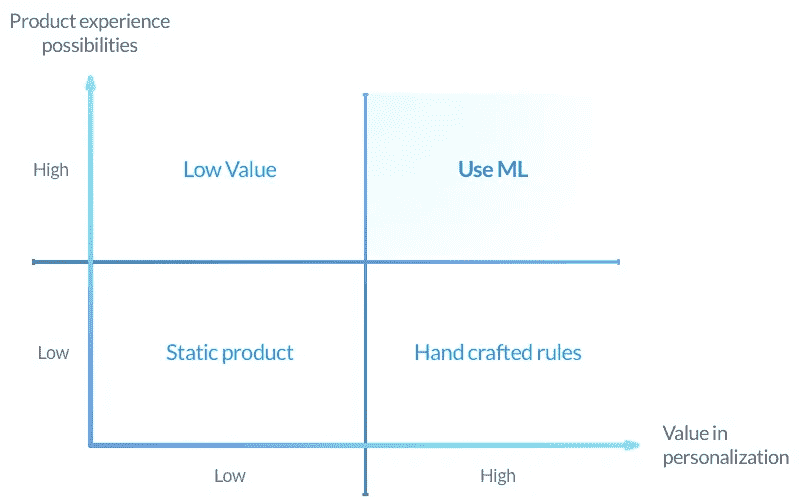
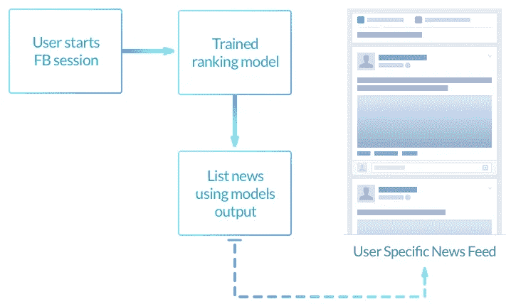

# 核心产品体验的机器学习

> 原文：<https://medium.com/hackernoon/machine-learning-for-core-product-experience-970ce4352e0f>

所有产品都有一个核心体验。这就在用户和产品之间建立了基本的联系——挂钩。例如，在网飞，这是看电影或电视节目。在亚马逊上，这是购买产品。在像糖果粉碎这样的游戏中，这是通过一个级别来玩的。产品中的所有其他活动和功能都支持这种核心产品体验。没有核心，产品就不存在了。

产品的每个实例可能会对用户产生不同的影响。例如，糖果粉碎级别的起始配置改变了用户的核心产品体验。如果有很多这样的可能性，产品团队会深入思考应该向用户展示哪些可能性。在大多数产品中，产品设计意味着产品设计师/经理类型的人提出一套手工制作的产品行为规则。如果用户还没有打开游戏内商店，当他们达到 5 级时，给他们一个免费的助推器。规则的数量随着产品行为的可能性数量呈指数级增长。

在这种情况下，个性化的核心产品体验会带来更好的用户体验，最终提高参与度和忠诚度。机器学习可以在这方面有所帮助。当个性化价值很高，产品体验有大量可能性时，机器学习效果最好。ML 可以做出更好的产品决策，如果我们知道如何很好地使用它，并将其深入整合到我们的产品中。

# M **与 ML 一起做产品体验决策**

让我们想想脸书。新闻提要有一套机器学习模型，从脸书的所有可用内容中提取最相关的内容进行排序。新闻提要试图 [*平衡多个标准*](https://techcrunch.com/2016/09/06/ultimate-guide-to-the-news-feed/) *、*你可能评论的帖子、你将观看的视频、广告收入等。这些新闻模型的行为形成了你对脸书产品的看法。我们都有过这样的例子，当我们在新闻提要中看到一些东西，然后说‘脸书，你为什么给我看这个？’。我个人从来没说过 WTF，新闻 Feed 排名模型，干嘛给我看这个’。

新闻提要机器学习模型影响了脸书的核心产品体验。新闻提要产品团队做出影响 ML 模型的决策，然后模型决定用户的产品体验。ML 现在是产品经理手中的武器。这用于间接影响新闻源产品体验，以实现产品目标并提高新闻源视频参与度等指标。

当 ML 用于推动核心产品体验时，产品管理的原则保持不变。然而，由于产品经理通过 ML 来实现产品目标，因此需要新的技术。

更多关于机器学习和产品体验的文章:

*   [*如何利用机器学习建立动态花园*](/towards-data-science/how-to-build-a-dynamic-garden-using-machine-learning-d589468f7c04)
*   [*喔喔喔！ML 现在知道什么好玩了？*](/dynamic-game-difficulty/whoa-whoa-ml-knows-whats-fun-now-95b219b9ff3b)
*   [*人工智能、人性与产品设计的未来*](https://hackernoon.com/ai-humanity-and-the-future-of-product-design-4dc566be372e)
*   [机器学习:防止意外后果](https://hackernoon.com/machine-learning-preventing-unintended-consequences-d568207796ce)

在 [*产品 ML*](http://www.productml.com) ，我们相信未来所有的产品都将是动态的。我们正在建立一个平台，重新定义产品管理和用户体验，从使用机器学习的游戏中的动态难度开始。