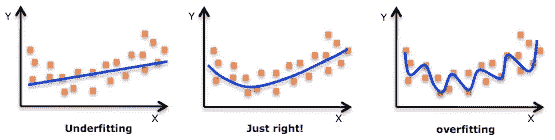
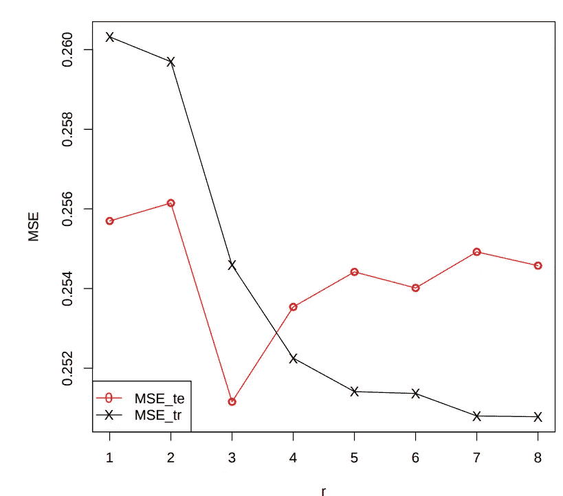
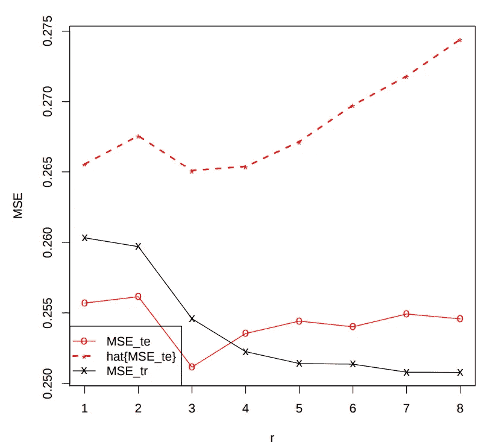
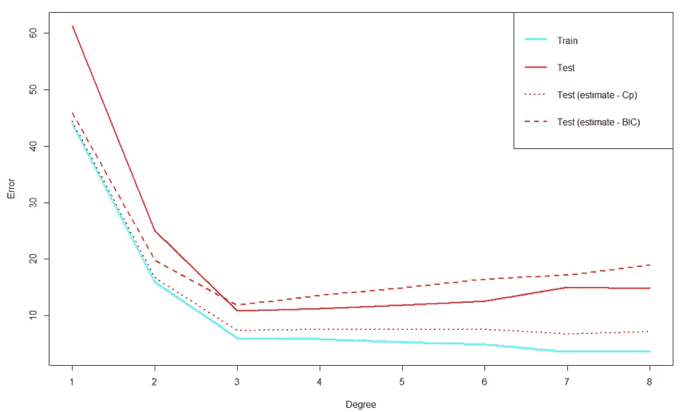
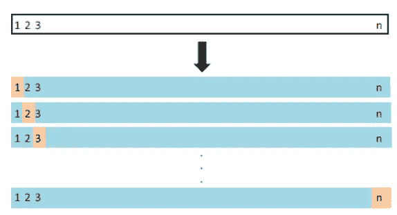
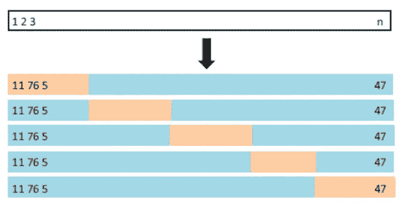
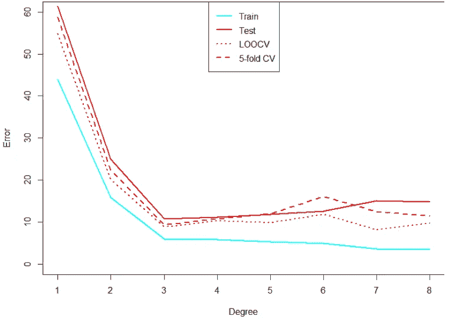

# 黑客的机器学习:模型比较和选择

> 原文：<https://medium.com/hackernoon/machine-learning-for-hackers-model-comparison-and-selection-84fa910fcd42>


[作为科技企业家](https://codingstartups.com/)，机器学习无处不在。训练机器来学习和产生未来预测模型的科学被广泛使用，这并不是没有意义的。为了更好地解决我们的问题，引入了不太复杂的代码和更高级的学习算法和统计方法。

正如我在关于[机器学习 101 和线性回归的帖子中广泛讨论的那样，](https://codingstartups.com/practical-machine-learning-ridge-regression-vs-lasso/)我们试图使用机器学习解决的问题可以分为两种主要类型:有监督的机器学习和无监督的机器学习。受监督的学习者从标记的数据中学习，例如，也包含房价的关于房屋特征的数据，用于房价预测。换句话说，监督机器学习学习标记的数据点，并预测未来的标签。

另一方面，无监督学习从不标记的数据中学习，并且不能预测未来数据点的标记。它通常用于数据的降维、数据聚类等。

在这篇文章中，我们将讨论监督学习的相关问题、模型和方法。我假设你已经熟悉一些机器学习方法，如[线性回归、岭回归和 Lasso](https://codingstartups.com/practical-machine-learning-ridge-regression-vs-lasso/) ，知道如何使用这些方法训练模型。

这篇文章被称为黑客的机器学习，目的是强调开发人员可以训练模型和使用机器学习，并充分利用它，而不是专业的数据科学家。尽管有大量的工具和库可以用不到 10 行代码来训练机器学习模型，但作为一名数据黑客，你需要熟悉的不仅仅是训练模型。您需要知道如何评估、比较和选择最适合您的特定数据集的方法。

通常，当使用给定的数据集处理机器学习问题时，我们会尝试不同的模型和技术来[解决优化问题](https://codingstartups.com/practical-machine-learning-ridge-regression-vs-lasso/)并拟合最准确的模型，该模型既不会过拟合也不会欠拟合。



在处理现实世界的问题时，我们的数据集中通常有几十个要素。其中一些可能是非常描述性的，一些可能是重叠的，一些甚至可能给我们的数据增加更多的噪声而不是信号。

使用我们所在行业的先验知识来选择特征是很好的，但有时我们需要分析工具的帮助来更好地选择我们的特征，并在使用不同算法训练的模型之间进行比较。

我的目标是向您介绍最常用的技术和标准，用于比较您训练的模型，以便为您的问题选择最准确的模型。

特别是，我们将看到如何在用相同算法训练的不同模型之间进行选择。假设我们有一个数据集，每个数据点有一个要素，我们希望使用线性回归进行拟合。我们的目标是从 8 个不同的假设中选择拟合模型的最佳多项式次数。

# 问题(和数据集)

我们被要求只根据面积来预测房价。提供给我们的数据集包含纽约市 1，200 所房屋的尺寸和价格。我们希望尝试使用线性回归来拟合一个模型，以预测未来的房价，前提是我们已经获得了关于模型备选方案的一些假设的先验知识:

```
Ŷ1 = β0+β1X
Ŷ2 = β0+β1X+β1X2
Ŷ3 = β0+β1X+β2X2+β3X3
Ŷ4 = β0+β1X+β2X2+β3X3+β4X4
Ŷ5 = β0+β1X+β2X2+β3X3+β4X4+β5X5
Ŷ6 = β0+β1X+β2X2+β3X3+β4X4+β5X5+β6X6
Ŷ7 = β0+β1X+β2X2+β3X3+β4X4+β5X5+β6X6+β7X7
Ŷ8 = β0+β1X+β2X2+β3X3+β4X4+β5X5+β6X6+β7X7+β8X8
```

其中 X 代表房子的大小。

给定 8 个模型选项，我们被要求使用一些标准来比较这些模型，并选择最适合我们的数据集的多项式次数来预测未来的房价。

正如我在之前的文章中所描述的，复杂的模型往往会过度拟合。因此，我们在选择模型时需要小心，这样它不仅能为当前数据集，还能为未来数据点提供良好的预测。

# 什么是训练/测试分割，为什么我们需要它

当处理真实世界的机器学习问题时，我们的数据集的大小是有限的。对于相对较小的数据集，我们希望训练我们的模型，并评估它的准确性。这就是训练/测试分割派上用场的地方。

训练/测试分割是一种将数据集分成两组的方法，一组是用于训练模型的数据点训练组，另一组是用于测试模型的测试组。我们通常倾向于拆分 it 不等式，因为训练模型通常需要尽可能多的数据点。

对于培训/测试，常见的拆分是 70/30 或 80/20。

# 如何不比较模型

评估经过训练的机器学习模型的最基本的指标是 MSE。MSE 代表均方误差，由误差平方的平均值给出。换句话说，MSE 是预测值和真实值之间的差异，因此我们希望在训练模型时将其最小化:

```
MSE = ∑( Ŷi- Yi)2/n
```

其中 n 是数据点的数量。

MSE **应谨慎使用。**其原因是 MSE 可以在训练数据点或测试数据点上计算。如果您现在还没有猜到，使用 MSE 评估您的模型的正确方法是使用我们的训练数据集训练我们的模型，并使用我们的**测试**数据集计算 MSE。

如果没有对我们的数据进行训练/测试分割，我们将被迫在用于训练模型的同一数据集上计算 MSE。这种情况会立即导致过度拟合。为什么？

假设我们没有将数据集分为训练和测试，训练了 8 个模型(如上所述)并计算了每个模型的 MSEtrain。哪种型号将为我们提供最低的 MSEtrain？最有可能是模型#8，因为它是最复杂的模型，它过度拟合数据而不是学习数据。

因为我们使用完全相同的数据集来训练和测试模型，所以当我们使用更复杂的模型来更好地拟合训练数据时，MSEtrain 将会更低(不要忘记，我们试图解决的优化问题是最小化预测和地面事实之间的误差)。



因此，我们了解到，在分割数据集后，我们最好使用 MSE 来测试数据集。但是有更高级的标准来评估我们的模型(基于 MSE ),我们通常不仅仅使用 MSE。

# 我们可以使用哪些标准

在意识到为什么我们需要将数据分为训练和测试，以及 MSE 的含义后，我们将讨论比较 8 个不同模型的 3 个主要标准。这些标准知道如何处理过度拟合，以及如何为我们的数据集选择最佳模型。

# #1:锦葵的 Cp

Cp 是 Mallows 在 1973 年提出的一种统计方法，用于计算偏差的期望值。假设我们有一个非常小的数据集，将其分为训练和测试没有意义，我们可以使用 Cp，以便使用训练数据集上计算的 MSEtrain 来估计 MSEtest。

MSEtest 的 Cp 标准或估计量由下式给出:

```
Cp = MSEtrain + 2σ2P/n
```

其中σ2 是基于完整模型(8 号模型)的误差方差，P 是预测值的数量。

为了使用 Mallows 的 Cp 在我们的模型之间进行比较，我们需要在完整的数据集上训练每个模型，为每个训练的模型计算 Mallows 的 Cp 估计量，并选择具有最低 Cp 结果的模型。



正如我们可以看到的，虽然 MSEtrain 随着多项式次数的增加而减少(更复杂的模型),这不能表明我们应该选择哪个模型，但 MSEtest 和 Mallows 的 Cp 标准都选择模型#3 作为基于我们数据集的最佳模型。

**注意:** Mallows 的 Cp 不是用来评估没有使用线性回归训练的模型的。因此，您不能将它用于使用其他机器学习算法训练的模型。

# 第二名:BIC

我们已经提到，在拟合模型时，添加参数并使模型更加复杂会导致过度拟合。BIC 是一个统计标准，试图通过在模型中引入一个参数数量的惩罚项来解决这个问题。

BIC 代表贝叶斯信息准则，它假设在建议的模型中有一个正确的模型，其目标是选择它。

数学形式与 Mallows 的 Cp 非常相似，由下式给出:

```
BIC = MSEtrain + log(n)σ2P/n
```

具有最低 BIC 的模型是优选的。



撇开 MSEtrain 的值不谈，所有其他标准一致选择模型#3 来最佳拟合数据。

**注:**当我们不确定某个建议的模型是否正确时，BIC 会以一种意想不到的方式行事。因此，在现实问题中，我们应该谨慎使用它。

# #3:交叉验证——可能是最流行的标准

处理机器学习问题需要对交叉验证(或 CV)有很好的理解。交叉验证在机器学习中以许多不同的方式使用，当它们都与参数和模型的比较和选择相关时。

交叉验证基本上是训练/测试分割方法的扩展。不过，它的优势在于，它会多次随机划分数据集，每次都会在略有不同的数据集上训练测试模型。

通过这样做，我们确保不会根据异常值或不能正确代表信号的数据来评估模型的误差。然后，我们对每个分割的 msest 进行平均，以评估基于多个训练/测试分割的模型:

```
CV(n) = ∑MSEi,test/n
```

优选的模型将是具有最低 CV(n)的模型。这里需要理解一个关键点——使用交叉验证比较模型时存在嵌套迭代——对于每个模型，我们随机分割数据集，计算 MSEi，进行测试，然后将它们平均到一个 CV 指标中。因此，我们为每个模型提出了一个 CV 指标，在此基础上我们选择了首选模型。

交叉验证分割有两种主要实施方式:

1.  遗漏一个交叉验证
2.  k 倍交叉验证(最流行的)

**留一个 CV** 对数据集进行迭代，每次迭代取出一个数据点，该数据点不会包含在训练集中，而是用于测试模型的性能。



**K-fold CV** 获得一个 K 参数作为输入，将数据集分成 K 个部分，对这些部分进行迭代，对于每次迭代，将第 K 个部分排除在训练之外，并将其用作测试集。



选择 K 参数(折叠次数)有时会很棘手，因为它会影响我们数据的偏差-方差权衡。经验法则是选择 5 或 10(取决于数据集的大小)。

交叉验证是机器学习和统计学中广泛使用的一个非常好的工具。在下面的图表中，我们可以看到不同的指标如何估计模型的误差。



与 Cp 或 BIC 不同，交叉验证对大多数机器学习算法都很有效，并且不假设存在一个正确的模型。

我鼓励你在下一个机器学习项目中，当你被要求在模型之间进行比较，以找出最适合你的特定情况的模型时，尝试并绘制这些估计器。

在现实世界的问题中，我们通常被要求在具有多个特征的模型之间进行比较，这种比较可以用我们在这篇文章中提到的完全相同的方法来完成。

我鼓励你也试试[套索法](https://codingstartups.com/practical-machine-learning-ridge-regression-vs-lasso/)。Lasso 有一个内置的正则化机制，可以从我们的模型中删除不必要的特征，这是我们在比较不同模型时通常想要实现的。

[](https://hackernoon.com/@OfirChakon) [## Ofir Chakon - Hacker Noon

### 阅读《黑客正午》中 Ofir Chakon 的文章。数据黑客|企业家|工程师| kitesurfer | https:…

hackernoon.com](https://hackernoon.com/@OfirChakon) 

> 机器学习不需要只被科学家使用。查看 [CodingStartups](https://codingstartups.com/) 为技术企业家和数据黑客提供的更多有见地的帖子。
> 
> 如果你觉得这个帖子有用，请鼓掌表示感谢！
> 
> 最初发表于 CodingStartups.com 的