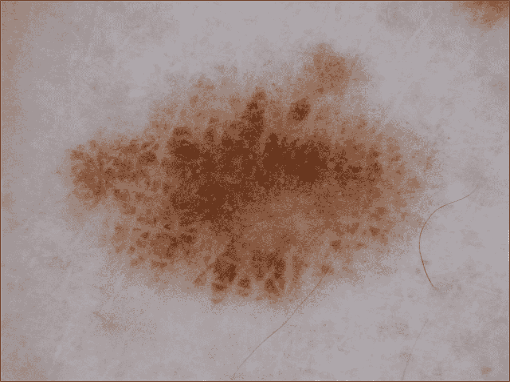
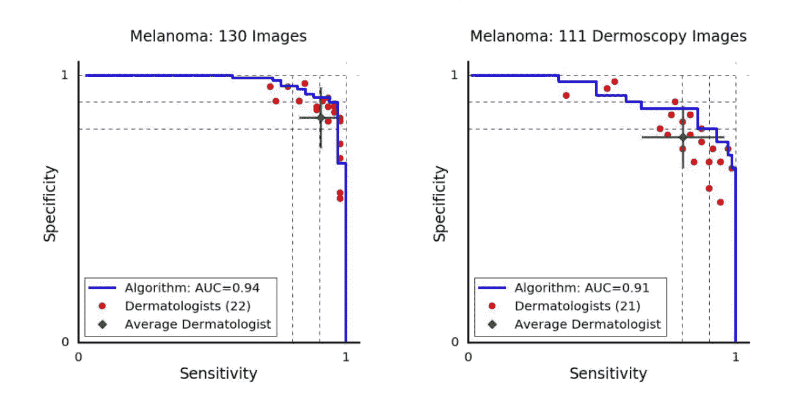
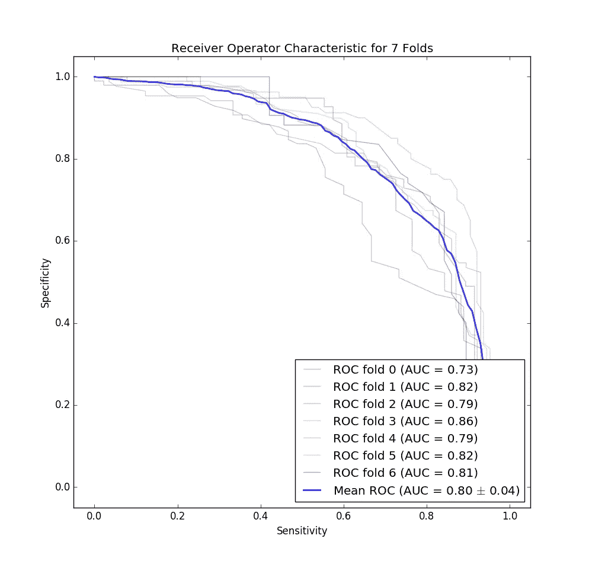
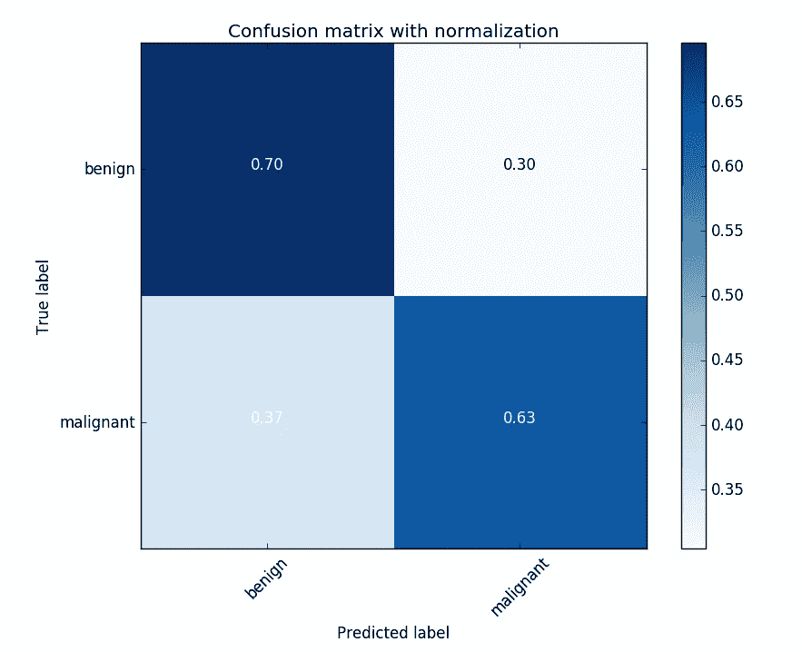

# ISIC 皮肤癌分类挑战的机器学习

> 原文：<https://medium.com/hackernoon/machine-learning-for-isic-skin-cancer-classification-challenge-part-1-ccddea4ec44a>

***这是我的 ISIC 癌症分类系列的第 1 部分。你可以在这里找到 part 2*******。****

*基于计算机视觉的黑色素瘤诊断已经是我断断续续近 2 年的一个附带项目，所以我计划将此作为关于该主题的一系列简短帖子的第一篇。这篇文章旨在为那些具有基本机器学习经验的人提供快速/翔实的阅读，这些人正在寻找 ISIC 问题的介绍，以及那些刚刚结束第一次或第二次机器学习/数据挖掘课程的人，他们希望用一个简单的问题来解决问题。*

*不同疾病的早期诊断工具是机器学习今天让许多人兴奋的一个主要原因。这些创新的过程是漫长的:需要建立标记数据集，需要培训工程师和数据科学家，每个问题都有自己的一组边缘案例，这些案例通常使建立鲁棒的分类器非常棘手(即使对于专家来说)。在这里，我将着重于构建一个分类器。首先，我将向您展示一个简单的分类器，然后讨论我们如何衡量它的成功，以及如何改进它。*

*我将在这里探讨的早期诊断挑战被称为 [ISIC](http://isdis.net/isic-project/) 挑战。以下是他们问题陈述的摘录:*

> *国际皮肤成像合作:黑色素瘤项目是一个学术界和工业界的合作项目，旨在促进数字皮肤成像的应用，以帮助降低黑色素瘤死亡率。当在最早阶段得到识别和治疗时，黑色素瘤是容易治愈的。皮肤损伤的数字图像可用于教育专业人员和公众识别黑色素瘤，以及通过远程皮肤病学、临床决策支持和自动诊断直接帮助诊断黑色素瘤。*

*我想我会分享这个问题的一个简单分类系统的一些细节，这个系统可以只从早期机器学习课上实现的东西中构建。这里没有[深度学习](https://hackernoon.com/tagged/deep-learning)或者前沿研究论文；这篇文章的目标只是构建和分析一个性能适中的分类器，演示如何判断你自己进入 ISIC 挑战。代码都在 [Github](https://github.com/evankozliner/simple-classifier) 上，所以我的很多工作都可以被对这个问题感兴趣的人重用。*

*我们将使用 PCA(主成分分析)来降低数据集的维度，一旦维度变小，我们将在其上训练一个随机森林分类器。然后，我们将对分类器进行一些分析，看看如何对其进行改进，并收集 ISIC 挑战的一些重要指标，如 AUC(曲线下面积)、ROC 曲线和混淆矩阵。如果您对这些术语中的任何一个都不熟悉，或者不要担心，我将在相应的部分简要概述它们，并为进一步的研究提供参考。*

# *数据集*

**

*A malignant lesion from the ISIC dataset*

*我不会深入研究数据集的细节，因为 ISIC [解释了这一切](https://challenge.kitware.com/#phase/5840f53ccad3a51cc66c8dab)，但在这篇文章中，我们将重点关注挑战的二元分类部分，而不是病变分割或皮肤镜特征提取。在二元分类挑战中，要求您区分黑色素瘤图像与脂溢性角化病和良性肿瘤，以及脂溢性角化病图像与黑色素瘤和良性肿瘤。我将只关注黑色素瘤与其他部分，因为这样做的任何工作都可以很容易地被替换掉，以完成脂溢性角化病的挑战。同样重要的是要知道数据集的分布是 374 个黑色素瘤图像，254 个脂溢性角化病，以及另外 1372 个良性图像(也称为痣)。更多关于这种偏态分布将如何影响我们以后如何判断我们的分类器。*

# *主成分分析降维*

*在图像分类任务中，单个像素是你的特征，所以降维是关键。一个典型的 500x500 RGB 图像有 750，000 (500*500*3)个特征，这对于任何数以千计的数据集来说都是难以处理的，因此我们需要采用降维技术。*

*我们将使用主成分分析来降低维度。PCA 将在我们的数据集中找到最大方差的向量，我们将使用这些向量作为我们的特征(而不是大量的单个像素)。您可以选择想要用于数据集的向量数量，在我们的示例中，我们将使用 20 个。如果你是机器学习的新手，并且有一些本科线性代数技能，实现 PCA 是学习细节的一个很好的练习。但是如果你没有几个小时的空闲时间，可以把 PCA 想象成一种操作，它将把我们从一个 *MxN* 矩阵带到一个 *Mx20* 矩阵，同时保留我们数据集中的大部分信息(在我们 20 个特征的例子中，保留了 80%的方差)。以更长的预处理时间为代价，我们总是可以增加特征的数量来解释更多的数据方差，直到我们有了 *N* 个特征。*

*以上是我在这个分类器中使用的 PCA 代码的一小段。[这里需要增量 PCA](http://scikit-learn.org/stable/auto_examples/decomposition/plot_incremental_pca.html) ，因为图像有些大；它稍微增加了代码的大小/复杂性，但是在 ISIC 数据集上，上面的代码仍然可以在我的笔记本电脑上用 20 分钟左右完成(您的里程可能会有所不同；我用的是 2.9gHz i9 和 16g 内存的 Macbook。同样值得注意的是，图像需要调整大小，以便在输入 PCA 时保持一致。*

*现在我们的数据集变小了，让我们在上面训练一个分类器！*

# *分类*

*为此，我选择了一个屡试不爽的经典:随机森林。这种分类器的要点是建立一定数量的决策树，每个决策树使用特征空间的随机子集进行训练。然后(像在其他集成分类器中一样),使用个体树对新样本的类别进行投票。*

*我真的只选择了随机森林，因为它往往是一个强大的开箱即用的分类器，训练速度很快。ISIC 挑战的顶级论文倾向于利用卷积神经网络；这些在图像上使用卷积和汇集操作，以便在将图像运行到简单的神经网络中之前降低它们的维数。有些论文甚至系综卷积网络！我希望在另一篇博文中发布一些关于如何有效应对 ISIC 挑战的细节:)*

*我选择在这篇文章中不包括分类的代码，因为它相当琐碎(只是一个即插即用的 sklearn 分类器)。你可以在 Github 页面[这里](https://github.com/evankozliner/simple-classifier)找到分类文件。*

# *分析我们的结果*

*ISIC 分类竞争分数基于您的分类器的 ROC(受试者操作者特征)曲线的 AUC(曲线下面积)。如果你不熟悉这些术语，ROC 曲线是我们的分类器在不同分类阈值下的真阳性率和假阳性率的曲线图。ROC 很方便，因为它让我们看到为了更高的特异性我们会牺牲多少灵敏度。在黑色素瘤诊断中，低假阳性率(也称为高特异性)是关键，因为任何黑色素瘤检测都表明需要对病变进行侵入性活检。通过改变分类阈值，我们总是可以为了特异性而放弃敏感性，反之亦然；ROC 图只是向我们展示了权衡。*

*AUC 是评判您提交的 ISIC 挑战的主要标准。AUC 是不平衡数据集的关键指标，因为高准确度通常仅表示分类器猜测主导标签的能力。使用 ROC 及其 AUC，我们可以避开任何误导性的准确性百分比。*

*你将下载的 ISIC 数据集的黑色素瘤例子比脂溢性角化病和痣少得多。只有大约 20%的默认 ISIC 数据集是恶性的，总共 374 个图像。偏斜分布对我们如何判断我们的分类器以及如何训练它有很大的影响。*

*首先，80%的准确率在初始数据集上不会给人留下深刻印象，因为我们可以通过简单地猜测到处都是“良性”来获得它。任何这样做的分类器都将以低特异性结束，并且看起来像是在 ROC 曲线上“猜测”(ROC 曲线上的线性线意味着随机猜测，这会损害 AUC)。*

*不平衡数据集的另一个问题是，您的分类器通常被构建为最小化一些损失函数，因此不平衡数据集将“欺骗”分类器，使其仅猜测主导类；即使它可以基于除了主导阶级的先验概率之外的东西来做出预测。为了补救偏斜分布，我们将对数据集进行欠采样。在我下面提到的斯坦福大学的论文中，我在他们的分类中看到良性病变的百分比是 60%，所以我继续进行欠采样，直到我得到 60/40 的分布。欠采样是随机的，也就是说我只是丢弃了随机的良性图像(这不是最好的方法)，但稍后会有更多的介绍。欠采样显著提高了我们构建的 PCA 到随机森林模型的 AUC。*

*在我们进入分类器的精确度、灵敏度等之前。我们需要确定什么是好成绩。我们将通过与今天皮肤科医生的评分进行比较来判断我们的分类器。下面是一些受欢迎的《自然》杂志(Nature)论文中的 ROC 曲线，该论文今年发表，题为[“深度神经网络皮肤癌的皮肤科医生级分类”](https://www.nature.com/articles/nature21056)。*

**

*The melanoma vs. all ROC curve for dermatologists in the paper mentioned above. The orientation is different than I’m personally used to because paper actually plots the sensitivity (true positive rate) vs the specificity (true negative rate). Most ROC curves plot the sensitivity on the y-axis and the false-positive rate on the x-axis, but this representation is equivalent. The difference between the two graphs is the way the photo was taken: dermoscopy images are taken with a special device called a dermoscope, and the others were taken in a normal clinical setting.*

**

*The ROC curve for our classifier for each fold of our cross validation. Note that this is for both dermoscopy and non-dermoscopy images. I decided to flip this curve to match the one provided in the Stanford paper for easier comparison.*

*向左看，你会震惊地发现我们的表现不如斯坦福大学的一个博士团队……然而，我们的图表对于第一次尝试来说还不错。请注意，由于数据集的规模较小，我们的分类器在现实世界中的表现也可能会更差(不像上面提到的斯坦福大学的论文，其中有两个数量级以上的数据)。*

*在完成并运行分类器后，我在恶性肿瘤检测任务的 7 个折叠中获得了 75%的平均准确度、73%的平均灵敏度和 71%的平均精度，因为我们进行了 60/40 的分割，这似乎表明我们的分类器正在学习一些东西！[根据国际标准行业分类](https://arxiv.org/abs/1710.05006)，皮肤科医生倾向于在没有皮肤镜成像帮助的情况下获得 60%的准确性，在成像技术的帮助下获得 75%-84%的准确性。因此，我们的分类器在皮肤镜的帮助下几乎与皮肤科医生一样准确，并且可能比肉眼更好(假设用于获得这种准确性的数据集具有与我们相似的分布)。*

**

*The confusion matrix for one of the K-folds trials. The 60/40 imbalance in the dataset likely contributes to the higher misclassification rate for melanomas.*

*我们的黑素瘤相对 all 的 AUC 平均为 80%。顶级论文倾向于黑色素瘤与所有 AUC 的比值在 90%左右(其他 AUC 在 90%左右)，所以我们还有很长的路要走。*

# *改进我们的分类器*

## *从归档中添加更多数据*

*ISIC 提供了额外数据的[档案，您可以使用 REST API 查询这些数据](https://isic-archive.com/#images)[。以这种方式获得更多的恶性数据，这样你就不需要欠采样，这可能是提高你刚刚读到的分类器性能的最简单的方法。](https://isic-archive.com/api/v1)*

## *更好的取样技术*

*数据集的一个核心问题是黑色素瘤的代表性不足。如果我们使用由 80%非恶性数据组成的数据集来训练分类器，我们的分类器会有很大的偏差，从而导致非常差的性能(您可以很容易地自己做这个实验，随着分类器的灵敏度变弱，AUC 下降到大约 65%)。为了减轻这种偏斜的分布，我们目前对良性图像进行了欠采样，然而更好的方法可能是对带有一些噪声的恶性图像进行过采样。有一些非常复杂的过采样技术，如 [SMOTE](http://contrib.scikit-learn.org/imbalanced-learn/stable/generated/imblearn.over_sampling.SMOTE.html) ，它创建自己的“合成”示例，而不是简单地复制现有的少数类。*

## *分割/阈值处理*

*这实际上是 ISIC 挑战中的另一个完全独立的子类别，但我们可以使用它来将图像裁剪为仅存在病变的部分，然后在这些区域进行训练。这可以通过去除背景“噪声”来提高分类精度。然而选择正确的分割技术是很棘手的，因为许多技术会失败，并使整个图像变得模糊。实际上，我在 Github 库中包含了一些代码，如果你想看，请告诉我。我很乐意再发一个帖子，或者指导你完成它。*

## *利用相关元数据*

*ISIC 还提供图像上的年龄和性别信息，看看这些信息是否会影响你的分类器的 AUC。在我读过的论文中，我看到这些特征在脂溢性角化病分类中对卷积神经网络的性能有影响，但在黑色素瘤中并不总是如此。*

# *结束语*

*如果你已经做到这一步，我希望它是有帮助的！你可以在这里找到第二部。*

*最初我打算在这篇文章中使用卷积网络，但是我意识到这篇文章的分析部分太冗长了(我做了一点工作来保持 2000 字左右)，所以我建立了一个简单的分类器，这样指南可以主要集中在分析上。*

*如果你发现任何错误，一定要让我知道！此外，代码是以一种有点仓促的方式编写的，所以如果你想自己重用代码作为练习，但你遇到了麻烦，只需给我发消息，我可以指导你完成。再次感谢:)*

*编辑:小的语法错误，增加了第二个教程*