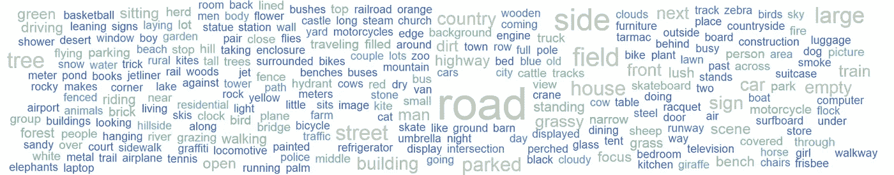
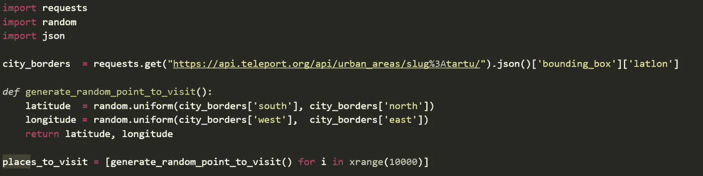
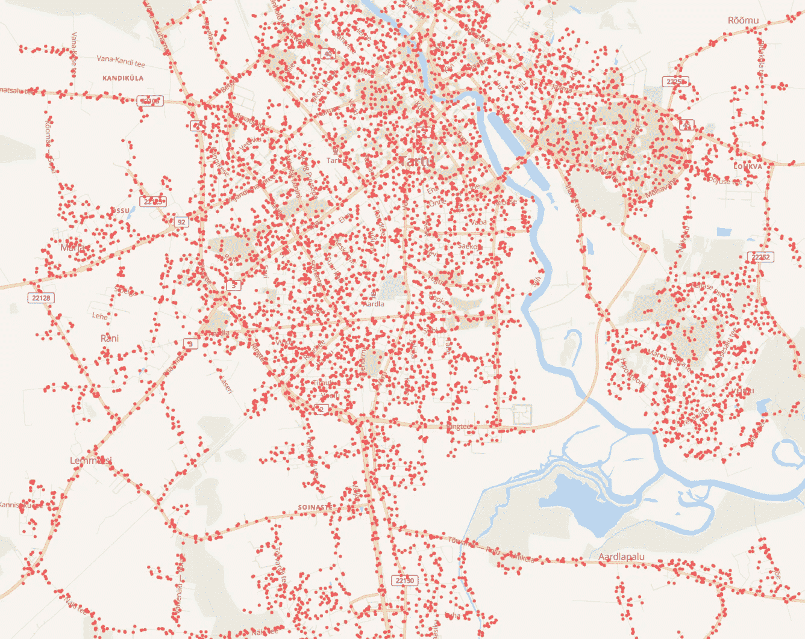
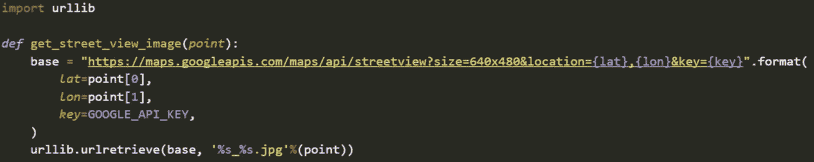
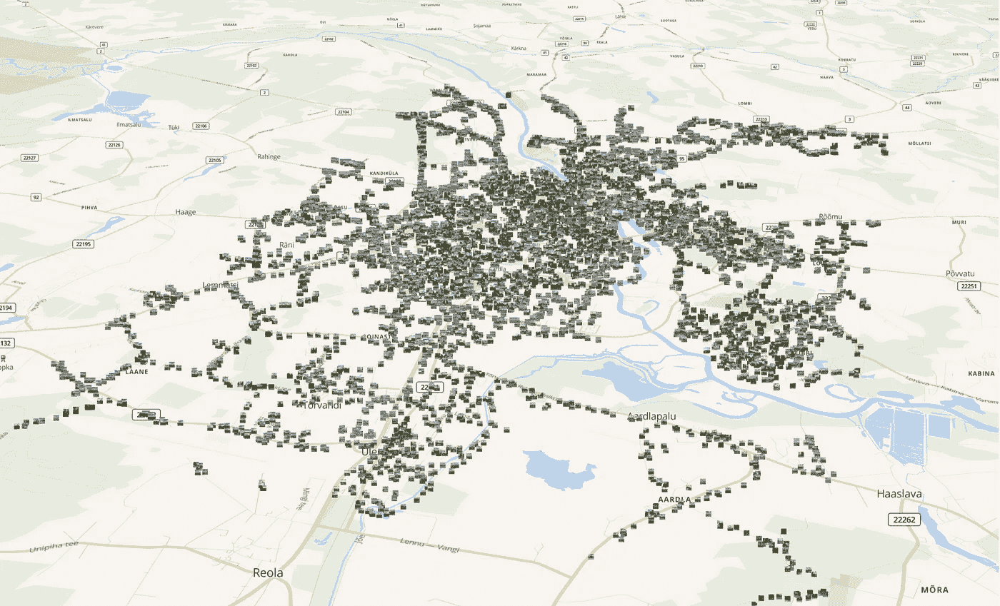
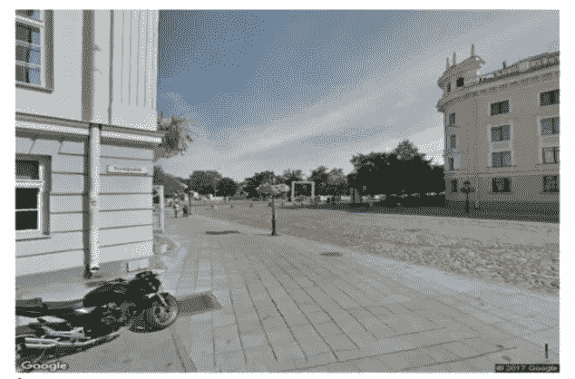
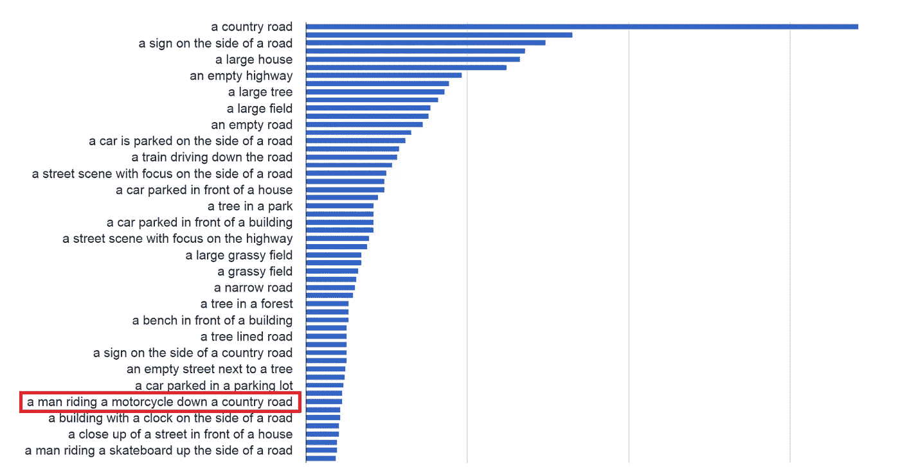
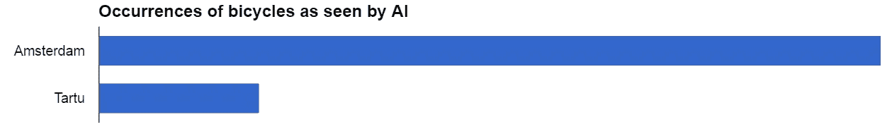
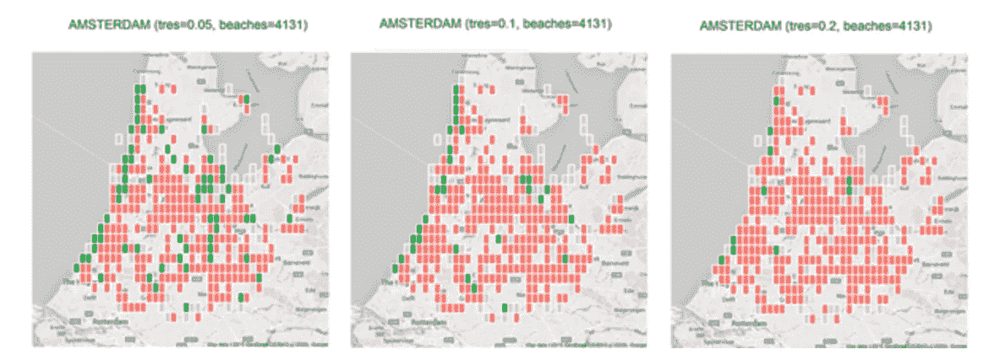
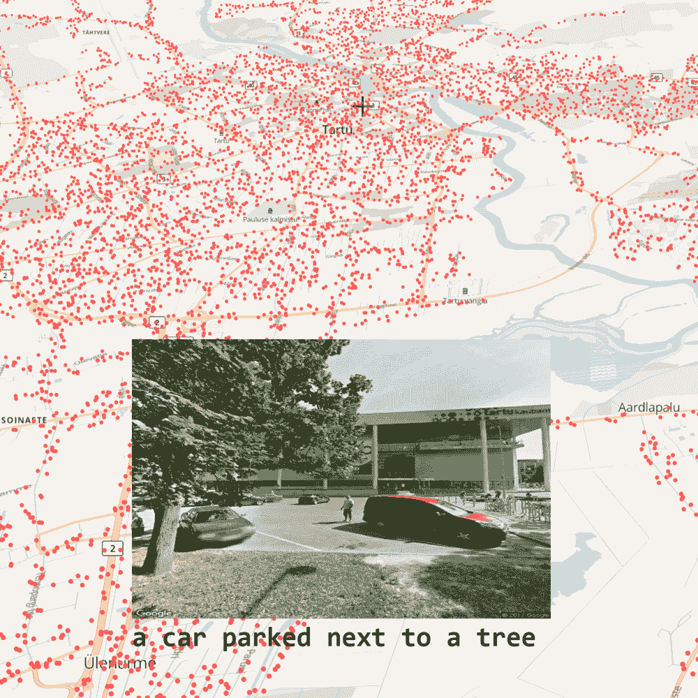

# 人工智能可以帮助你选择住在哪里

> 原文：<https://medium.com/hackernoon/machine-learning-our-cities-617ce005ba27>

Machine vision captured tag cloud from the city of Tartu, Estonia

**如何** [**瞬移**](http://teleport.org?utm_source=medium&utm_campaign=city_quant) **利用机器视觉窥视每一个街角**

我以前曾经取笑过我的读者人工智能将如何重组人类群体。就像在线约会网站让人工智能决定谁和谁生孩子一样，我们也让人工智能决定谁搬到哪里。所以…

> 如今，我们到底是如何决定什么是好城市的？

我们看新闻，听朋友说好话，看照片和视频，从那里得到最好的工作机会，而且经常，我们只是去看看这个城市。

我不打算深入探讨人工智能是如何**已经**参与决定我们可以看到哪些新闻、朋友的帖子、视频或城市的照片，但我将阐明我们如何在[传送](https://teleport.org/?utm_source=medium&utm_campaign=city_quant)到[帮助](https://hackernoon.com/tagged/help)你**更客观地看到城市**。既然我痴迷于说服每个孩子开始编写代码，那么我将用简单的代码示例来演示这个过程，以说明用现有的所有工具开始玩 AI 是多么容易。

以下想法主要是受麻省理工学院 [StreetScore 项目](/mit-media-lab/streetscore-1b8f846ff13d#.2pqzimk7m)的启发。

## 艾眼中的城市

使用软件访问地点的一个显而易见的好处是，牛顿在软件机器人上没有任何优势，它们可以在一次心跳中加速通过数千个地点，而不用担心它们的质量(以防你不知道——*心跳*是国际单位制下一个众所周知的时间单位)。

所以让我们从[传送开发者 API](http://developers.teleport.org/api/?utm_source=medium&utm_campaign=city_quant) 中抓取爱沙尼亚塔尔图(我的大学城)的边界，生成 **10 000** 随机地理坐标进行访问。你可能会问，为什么是 10K？因为*理科*！

这种在地理上的均匀分布当然会让我们对城市的看法产生很大的偏差，因为大多数时候我们会在树林里或屋顶上几乎看不到任何东西。但幸运的是，在[谷歌地图 API](https://developers.google.com/maps/) 的帮助下，我们可以将那些不知名的随机地点偏离出来，得到类似这样的东西:

正如你所看到的，我们计划参观的地点(红点)或多或少位于道路和街道上，我们希望在那里看到更多的行动，而不是看树木生长。

现在我们已经有了我们的位置，是时候进入**看**位和熟悉[谷歌街景图像 API](https://developers.google.com/maps/documentation/streetview/) 了。本质上，我用我的坐标调用他们的 API，并将结果图像保存在本地。

经过一些反向地理编码魔法和对谷歌 API 配额的虔诚遵循，我实际上获得了每个坐标的返回照片(而不是*“对不起，我们这里没有图像。”*你会得到的只是均匀分布)。

下面是我的代码无需离开房间(或我的电脑)就可以访问的 Tartu 的数千张图片。).

## 哈尔，图像上有什么？

这就是人工智能的用武之地。为了简单起见，我通过公开可用的**机器视觉 API**运行我们的图像集。有很多选择，比如

*   [微软计算机视觉应用编程接口](https://www.microsoft.com/cognitive-services/en-us/computer-vision-api)
*   [谷歌云视觉 API](https://cloud.google.com/vision/)
*   [IBM 视觉识别 API](http://www.ibm.com/watson/developercloud/visual-recognition.html)
*   [云视线 API](http://www.cloudsightapi.com/)
*   克拉里菲
*   等等。

但是在这个例子中，我选择了微软的牛津项目。我一直对微软研究机构印象深刻，老实说，他们的 API 免费使用条款是最优惠的。他们甚至很友好地提供了用 Python 编写的快速入门代码。

本质上，你只需上传一张图片到他们的 API，然后得到一行描述场景的文本。下面是一个来自 Tartu 的图像示例，以及来自 MS Vision API 的输出文本。

> **描述:*一辆摩托车停在一栋楼前***

## 压缩就是智能

通过他们的 API，我将 Tartu 中 8.5GB 的原始图像像素数据映射为 255KB 的文本数据(对象空间)。如果你曾经研究过[压缩和智能](https://www.quora.com/Information-Theory-What-is-the-relationship-between-intelligence-and-data-compression-algorithms)之间的关系，那么也许这个 **35294x** 大小的减少很有意义。

无论如何，现在我们终于有了对场景的自然语言描述，我们可以开始研究统计数据，看看我们是否能找到一些可能影响某人搬家决定的东西。

27 of 1528 most frequent terms of machine vision based analysis of 10K images of Tartu, Estonia

我看着单子差点睡着了，直到读到“摩托车”。摩托车的数量，或者更具体地说，它们占人口的比例，在很大程度上说明了一个城市对摩托车的友好程度，这也是我个人的共鸣(我拥有两辆摩托车)。

当然，还有其他来源可以找到不同城市的摩托车统计数据，但请记住，这些数据通常来自不同国家的不同来源，并且需要大量的工作来采集和标准化数百个主要城市地区的数据。谷歌街景的美妙之处在于它作为单一数据源覆盖大城市的能力，以及它捕捉图像中可见知识的能力。前提是…

> 如果你能看到它，那么 AI 就能看得更清楚

如果不是今天，那么肯定是明天。*“活在未来，然后建造所缺少的东西”*正如保罗·格拉厄姆曾雄辩地[说过的](http://paulgraham.com/startupideas.html)。人工智能的进步，更具体地说，深度神经网络的进步每周都让我们感到惊讶，如果你仍然怀疑它们从图像中提取更多信息的潜力，那么考虑一下最近人工智能击败人类的成就列表:

*   谷歌的人工智能赢了第五局，也是最后一局，对手是围棋天才李·塞多尔
*   [卡内基梅隆人工智能击败顶级扑克职业选手](https://www.cmu.edu/news/stories/archives/2017/january/AI-beats-poker-pros.html)
*   [微软人工智能在语音识别上击败人类](http://www.technewsworld.com/story/84013.html)
*   等等。

摩托车当然只是我个人关心的东西的一个玩具例子，但不难想象从图像中提取人类可以看到(或者甚至没有注意到)的任何知识。在谷歌捕获的数百万张图片中，隐藏着许多描述生活质量的客观指标的线索。

这里有一个快速的方法来检查这个想法是否有价值，通过检查一些我们知道是正确的东西。为阿姆斯特丹拍摄另一张 10K 图片，并计算图片标签中自行车的出现次数:

不考虑人口密度(或实际计算每张图片上有多少辆自行车)，至少一般的直觉似乎是有效的。

从清点自行车和儿童数量到绘制有破败建筑和涂鸦的社区地图，将这一海量图像数据来源转化为塑造我们行动的想法**的机会很多。**

## 离开街道

当然，并不是所有我们关心的东西在街上都是可见的。有时候你不得不去越野。下面是 Tanel PNA MAA 在 Teleport 实习时做的一些工作的例子，他从 Flickr 上拍摄了一组公共地理标记照片，并使用机器视觉标记来识别**海滩**。有趣的是，当只限制机器视觉输出的信号时，他有很多桑迪高尔夫球场出现。

Beaches as identified by AI in Flickr photos by Tanel Pärnamaa

更重要的是，随着 Planet 刚刚[发射了 88 颗卫星](https://www.planet.com/pulse/record-breaking-88-satellites/)进入轨道，我们有了另一个惊人的图像来源，我们可以让 AI 放松一下。数据量呈指数级增长，我们对城市生活质量的理解也是如此。

## 选择你的工作，选择你的城市，选择你的生活！

我们的一位投资者[说](http://www.inc.com/lisa-calhoun/marc-andreessen-predicts-only-two-types-of-jobs-in-the-future-which-one-will-you.html)*“计算机和互联网的普及将把工作分成两类:告诉计算机做什么的人，和被计算机告诉做什么的人。”*

我已经看到我们领域的现任者在实地团队上花钱，以捕捉一些可以用**代码**完成的事情。我确信通过[机器学习](https://hackernoon.com/tagged/machine-learning)和众包获得的效率正在给我们带来实质性的竞争优势，我渴望看到这一切从长远来看是如何进行的。

同时，对于那些更倾向于**告诉计算机做什么的人**，这里有一些上述方法的挑战示例:

*   如何在地理上分布您的代理/探测器，同时最小化各种偏差(由城市面积大小、人口密度等引起)
*   如何标准化跨城市区域的捕获数据，以促进公平的比较
*   如何避免重复计算近距离场景中出现的物体？
*   如何减少天气、季节、白天等因素的影响？在所说的统计中？
*   如何优化观察方向、采样或组合每个坐标中的图像，以利用 360 度视图？
*   如何以从图像中提取生活质量数据为特定目标来构建/训练模型(上面举例说明的通用分类器只能让你到此为止，更多的是作为启发性的例子)？

最后**你能想到哪些酷的东西**可以从公共图像数据中捕捉到，与生活质量相关联，并可能影响你搬到某个地方的决定？来在[推特](https://twitter.com/keskkyla/status/831083187002564608)上分享你的想法吧！

如果你喜欢你读到的内容，不要忘记点击下面的心形图标或在社交网站上分享

[推特上的西尔弗·凯库拉](https://twitter.com/keskkyla/status/831083187002564608)

使用传送找到你最喜欢的城市

> [黑客中午](http://bit.ly/Hackernoon)是黑客如何开始他们的下午。我们是 [@AMI](http://bit.ly/atAMIatAMI) 家庭的一员。我们现在[接受投稿](http://bit.ly/hackernoonsubmission)并乐意[讨论广告&赞助](mailto:partners@amipublications.com)机会。
> 
> 如果你喜欢这个故事，我们推荐你阅读我们的[最新科技故事](http://bit.ly/hackernoonlatestt)和[趋势科技故事](https://hackernoon.com/trending)。直到下一次，不要把世界的现实想当然！

