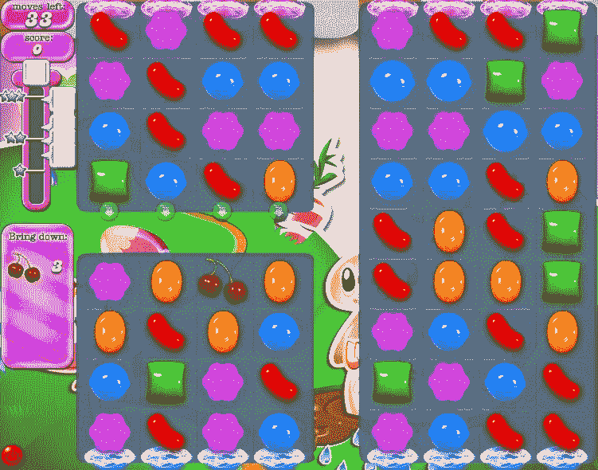

# 机器学习:防止意想不到的后果

> 原文：<https://medium.com/hackernoon/machine-learning-preventing-unintended-consequences-d568207796ce>

TGIF，下班回家，期待周末。我在火车上找到一个座位，咬了一口三明治，打开了糖果粉碎。从周一开始就没玩过了。我一直卡在 76 级，已经放弃了。

我开始玩，有三种情况会发生:

> 1.这一艰难且一度具有挑战性的关卡现在很容易通过第一次尝试
> 
> 2.是的，还是很难。我连续输了三次
> 
> 3.我玩一次就输了。第二次，就简单多了，我赢了，哇！

第一种情况，感觉规则变了。因为我输了几次，所以当我回来的时候“他们让事情变得更容易”以便我继续玩这个游戏。

第二个，要么等级配置无解(即使完美发挥)要么等级*可解*我不玩完美游戏。不管怎样，我都有点沮丧。

第三种情况与第一种类似，胜率梯度不断增加。我每次玩这个关卡都变得更容易——我觉得被骗了。

玩家很清楚，这是一个游戏，别人来定规则。然而，他们可能不太乐意看到“他们”在扰乱游戏。

当使用机器学习[动态改变游戏难度](/dynamic-game-difficulty/whoa-whoa-ml-knows-whats-fun-now-95b219b9ff3b)时，可能会出现难度的剧烈变化。确保一个好的，一致的玩家体验是咳咳..难。

## 合同

游戏和玩家有一个隐性契约。玩家知道他们是在别人的规则手册中操作的——通常是游戏设计者的——游戏不会滥用这种信任。这在像赌场游戏和第三场比赛这种天生具有概率性的游戏中尤其棘手。游戏设计师需要在呈现给玩家的“正确”难度和保持玩家信任之间进行艰难的平衡。

动态游戏难度可以感觉像改变游戏规则。这种规则的改变会破坏玩家的信任，影响玩家的忠诚度，而这正是《T4》动态游戏难度的初衷。没有人喜欢被操纵。

> 难度变化剧烈导致用户体验不好。

试图预测非预期的模型行为并试图改变模型本身来迎合这种行为是很有诱惑力的。这可以通过在训练数据中省去不期望的行为来实现。一般来说，这不是一个好主意，因为这可能会在其他预测中导致意想不到的后果，而这些后果更加难以察觉。

## 策略层

一种方法是引入一个包含规则的策略层来防止这种情况。防止难度大幅度变化的策略可以是:

> '不要在 7 天内为用户改变超过 10%的胜率'

策略层仅用于防止不良用户体验，它不能替代模型预测。如果模型的输出违反了策略，则输出将被丢弃，而使用回退。政策层可能会觉得自己像是一个王国的枯燥哨兵，一有威胁迹象就拉起吊桥。然而，检测策略层给了我们重要的信息。衡量违反政策的情况以及导致每次违反的情况有助于为未来的产品决策和政策提供信息。

模型与策略层一起，告知[核心产品体验](/dynamic-game-difficulty/machine-learning-for-core-product-experience-970ce4352e0f)，并负责满足产品目标，如留存和货币化。策略层和模型相互独立，可以单独更新。这为我们控制产品行为提供了额外的灵活性。

> 政策对产品决策进行编码。

保持策略层的轻便很重要。策略层可以很快转化为一组复杂的手工规则，在您知道之前，策略层负责大多数产品决策，而不是模型。

政策层是咖啡师递给你卡布奇诺时脸上的微笑。咖啡来自机器学习。微笑让顾客感觉良好，但咖啡才是你的核心产品。你需要在这两者之间找到一个健康的平衡，才能留住回头客。

更多关于机器学习和产品体验的文章:

*   [*如何利用机器学习建立动态花园*](/towards-data-science/how-to-build-a-dynamic-garden-using-machine-learning-d589468f7c04)
*   [*喔喔喔！ML 现在知道什么好玩了？*](/dynamic-game-difficulty/whoa-whoa-ml-knows-whats-fun-now-95b219b9ff3b)
*   [*面向核心产品体验的机器学习*](/dynamic-game-difficulty/machine-learning-for-core-product-experience-970ce4352e0f)

在 [*产品 ML*](http://www.productml.com) ，我们相信未来所有的产品都将是动态的。我们正在建立一个平台，重新定义产品管理和用户体验，从使用机器学习的游戏中的动态难度开始。