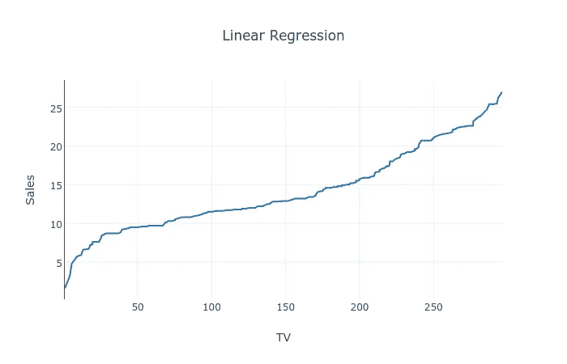

# JavaScript 机器学习:第 1 部分

> 原文：<https://medium.com/hackernoon/machine-learning-with-javascript-part-1-9b97f3ed4fe5>

你认为这不容易



Linear Regression Plot using [plot.ly](http://plot.ly)

> *这是正在进行的系列*用 JavaScript 进行机器学习*的第 1 部分。下面是* [第二部分。](https://hackernoon.com/machine-learning-with-javascript-part-2-da994c17d483)

JAVASCRIPT？！我不应该用 Python 吗？我是不是疯了，才尝试用 JavaScript 进行那些繁重的计算？我是不是在用一种不是 Python 或者 R 的语言来装酷？scikit-learn 连 JavaScript 都不行？简短回答:**没有，我没醉。**

长话短说:有可能，实际上我很惊讶开发者没有给予它应有的关注。就`scikit-learn`而言，JS 的人已经做了他们自己的一套库来对抗它，我也要用一个。但是首先，关于机器学习。请随意登上这艘火箭🚀然后跳到代码上。


[unsplash.com](http://unsplash.com)

根据亚瑟·塞缪尔的说法，**机器学习**为计算机提供了无需明确编程就能学习的能力。换句话说，它赋予计算机自主学习和执行正确指令的能力，无需你为它们提供方向。

它已经存在很长时间了，谷歌从移动优先战略转向人工智能优先战略。

# 为什么 JavaScript 不和 ML 一起提？

1.  慢点。( ***神话！？！*** )
2.  矩阵操作很难。(有库，比如`**math.js**`)
3.  只关心 Web 开发。(在外面的某个地方， **Node.js** 在笑。)
4.  库通常是为 Python 制作的。(JS 的人也不落后)

JavaScript 中有一些带有预制机器学习算法的库，比如线性回归、支持向量机、朴素贝叶斯等等。这是其中的一些，

1.  [brain.js](https://github.com/harthur-org/brain.js) (神经网络)
2.  [突触](https://github.com/cazala/synaptic)(神经网络)
3.  [自然](https://github.com/NaturalNode/natural)(自然语言处理)
4.  [卷积神经网络](http://cs.stanford.edu/people/karpathy/convnetjs/)
5.  [mljs](https://github.com/mljs) (一组具有多种功能的子库)
6.  [neaptic](http://DNN Execution Framework o)(神经网络)
7.  [Webdnn](https://github.com/mil-tokyo/webdnn) (深度学习)

我们将使用 mljs 的回归库来执行一些线性回归魔法。所有代码都在 Github 上:[带 js 的机器学习](https://github.com/abhisheksoni27/machine-learning-with-js)

**第一步。**安装库

```
$ yarn add ml-regression csvtojson
```

或者如果你喜欢`npm`

```
$ npm install ml-regression csvtojson
```

`ml-regression`顾名思义。

`csvtojson`是 node.js 的快速 csv 解析器，允许加载`csv`数据文件并将其转换为`JSON`。

## 第二步。初始化库并加载数据

下载数据文件(。csv)并将其放入您的项目中。

假设您已经初始化了一个空的 npm 项目，打开您的`index.js`文件并输入以下内容。(如果你愿意，你可以复制/粘贴，但为了更好地理解，我更喜欢自己打出来。)

我把文件放在项目的根目录下，所以，如果你把它放在其他地方，确保你同样更新了`csvFilePath`变量。

很漂亮，是吧？

现在我们将使用`csvtojson`的`fromFile`方法来加载我们的数据文件。

## 第三步。整理数据，为执行做好准备

我们在`csvData`中保存的 JSON 对象是很好的对象，我们需要一个输入数据点和输出数据点的数组。我们将通过一个将填充我们的`X`和`y`变量的`dressData`函数来运行我们的数据。

## 第四步。训练你的模型并开始预测

既然我们的数据已经被成功地穿戴好了，那么是时候训练我们的模型了。

为此，我们将编写一个`performRegression`函数:

`regressionModel`有一个方法`toString`，它接受一个名为 precision 的浮点输出参数。

`predictOutput`功能允许您输入输入值，并将预测输出输出到您的控制台。

下面是它的样子:(注意，我使用的是 Node.js 的 readline 实用程序)

下面是添加阅读用户输入的代码:

## 第五步。万岁！你做到了。拍拍自己的背。

如果您遵循了这些步骤，您的 index.js 应该是这样的:

转到您的终端并运行`node index.js`，它将输出如下内容:

```
$ node index.jsf(x) = 0.202 * x + 9.31
Enter input X for prediction (Press CTRL+C to exit) : 151.5
At X = 151.5, y =  39.98974927911285
Enter input X for prediction (Press CTRL+C to exit) :
```

恭喜你。您刚刚用 JavaScript 训练了您的第一个线性回归模型。(你注意到速度了吗？)

如果你很兴奋，去看看[第二部](https://hackernoon.com/machine-learning-with-javascript-part-2-da994c17d483)。

> **PS:** 我准备用`*ml*`和其他库(以上列出！)在各种数据集上执行流行的机器学习算法。留意我的资料，或者你可以放自己一马，跟着我。:)

**感谢阅读**！如果你喜欢，点击**绿色** **按钮**让其他人知道 **JS** 有多强大，以及为什么在机器学习方面*不应该落后于*。

[](http://bit.ly/HackernoonFB)[](https://goo.gl/k7XYbx)[](https://goo.gl/4ofytp)

> [黑客中午](http://bit.ly/Hackernoon)是黑客如何开始他们的下午。我们是阿妹家庭的一员。我们现在[接受投稿](http://bit.ly/hackernoonsubmission)并乐意[讨论广告&赞助](mailto:partners@amipublications.com)机会。
> 
> 如果你喜欢这个故事，我们推荐你阅读我们的[最新科技故事](http://bit.ly/hackernoonlatestt)和[趋势科技故事](https://hackernoon.com/trending)。直到下一次，不要把世界的现实想当然！

