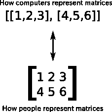
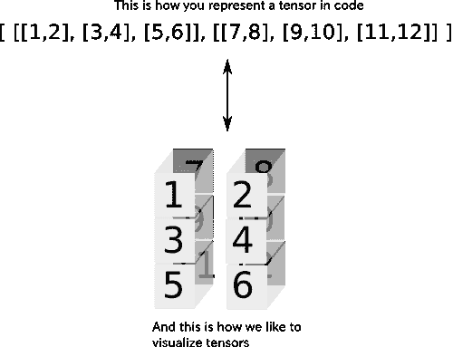
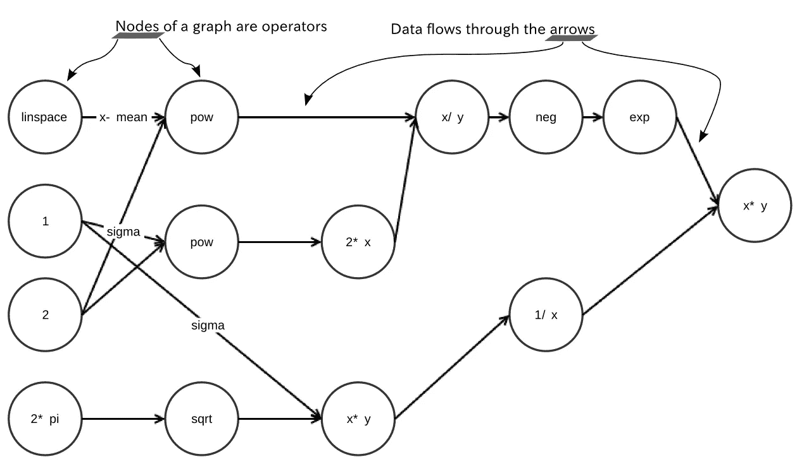
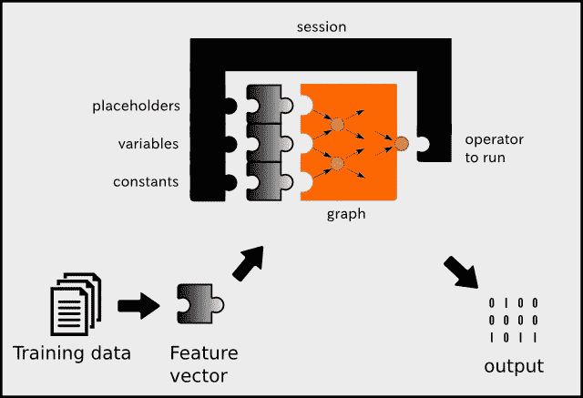

# 了解张量流

> 原文：<https://medium.com/hackernoon/machine-learning-with-tensorflow-8873fdee2b68>

*本文摘自* [*用 TensorFlow 进行机器学习*](https://manning.com/books/machine-learning-with-tensorflow?a_aid=TensorFlow&a_bid=042443a4) *。*


在进入[机器学习](https://hackernoon.com/tagged/machine-learning) [算法](https://hackernoon.com/tagged/algorithms)之前，你应该先熟悉如何使用这些工具。本文涵盖了 TensorFlow 的一些基本优势，让您相信它是机器学习库的首选。

作为一个思想实验，让我们想象一下，当我们在没有方便的计算库的情况下编写 Python 代码时会发生什么。这就像使用一部新的智能手机而不安装任何额外的应用程序一样。手机仍然工作，但如果你有正确的应用程序，你会更有效率。

> **考虑以下情况…** *你是一名跟踪销售流程的企业主。你想计算你销售产品的收入。您的库存包括 100 种不同的产品，您用一个名为* prices *的向量来表示每种价格。另一个大小为 100 的向量称为* amounts *表示每个商品的库存数量。您可以编写清单 1 所示的 Python 代码来计算销售所有产品的收入。请记住，这段代码没有导入任何库。*

**Listing 1\. Computing the inner product of two vectors without using any library**

仅仅是计算两个向量的内积(也称为*点积*)就有很多代码。想象一下更复杂的事情需要多少代码，比如解线性方程或计算两个向量之间的距离。

通过安装 TensorFlow 库，您还安装了一个著名的健壮的 Python 库 NumPy，它有助于 Python 中的数学操作。使用 Python 而不使用它的库(例如 NumPy 和 TensorFlow)就像使用没有自动对焦的相机一样:你获得了更多的灵活性，但是你很容易犯粗心的错误。在机器学习中犯错误已经很容易了，所以让我们保持相机自动对焦，并使用 TensorFlow 来帮助自动化一些繁琐的软件开发。

清单 2 展示了如何使用 NumPy 简洁地编写相同的内积。

**Listing 2\. Computing the inner product using NumPy**

Python 是一种简洁的语言。幸运的是，这意味着你不会看到一页又一页的神秘代码。另一方面，Python 语言的简洁性意味着每一行代码背后都发生了很多事情，您应该在工作中仔细熟悉这些事情。

> **顺便说一下……**关于 Python 和 TensorFlow 的 c++ API 的各种函数的详细文档可在 https://www.tensorflow.org/api_docs/index.html[获得](https://www.tensorflow.org/api_docs/index.html)。

本文旨在使用 TensorFlow 进行计算，因为机器学习依赖于数学公式。浏览完示例和代码清单后，您将能够使用 TensorFlow 完成一些任意任务，比如计算大数据的统计数据。这里的重点将完全是关于如何使用 TensorFlow，而不是一般的机器学习。

机器学习算法需要大量的数学运算。通常，一个算法归结为一个简单函数的组合，迭代直到收敛。当然，您可以使用任何标准的编程语言来执行这些计算，但是可管理和高性能代码的秘密在于使用编写良好的库。

听起来是个温和的开始，对吧？**事不宜迟，让我们编写第一个张量流代码吧！**

# ***保证张量流工作***

首先，我们需要确保一切正常运行。检查你汽车的油位，修理你地下室的保险丝，确保你的信用余额为零。

开玩笑，我说的是 TensorFlow。

继续为我们的第一段代码创建一个名为 *test.py* 的新文件。通过运行以下脚本导入 TensorFlow:

```
import tensorflow as tf
```

这个单一的进口准备 TensorFlow 为您的投标。如果 Python 解释器没有抱怨，那么我们就准备开始使用 TensorFlow 了！

> **有技术难度？**在这一步出现错误的一个常见原因是，如果您安装了 GPU 版本，库无法搜索 CUDA 驱动程序。记住，如果你用 CUDA 编译库，你需要用 CUDA 的路径更新你的环境变量。查看 TensorFlow 上的 CUDA 说明。(详见[https://www . tensor flow . org/versions/master/get _ started/OS _ setup . html # optional-Linux-enable-GPU-support](https://www.tensorflow.org/versions/master/get_started/os_setup.html#optional-linux-enable-gpu-support))。

## **坚持张量流惯例**

TensorFlow 库通常用 *tf* 限定名导入。一般来说，用 *tf* 限定 TensorFlow 是一个与其他开发者和开源 TensorFlow 项目保持一致的好主意。您可以选择不对其进行限定或更改限定名，但是在您自己的项目中成功重用他人的 TensorFlow 代码片段将是一个复杂的过程。

## ***代表张量***

现在我们知道了如何将 TensorFlow 导入到 Python 源文件中，让我们开始使用它吧！描述现实世界中的物体的一种简便方法是列出它的属性或特征。例如，您可以通过颜色、型号、发动机类型和里程数来描述汽车。一些特征的有序列表被称为*特征向量*，这正是我们将在 TensorFlow 代码中表示的内容。

特征向量是机器学习中最有用的设备之一，因为它们简单(它们是数字列表)。每个数据项通常由一个特征向量组成，一个好的数据集即使没有几千个特征向量，也有几千个。毫无疑问，你经常会同时处理多个向量。一个*矩阵*简洁地表示一个向量列表，其中矩阵的每一列都是一个特征向量。

在 TensorFlow 中表示矩阵的语法是向量的向量，每个向量的长度都相同。图 1 是一个两行三列的矩阵的例子，比如[[1，2，3]，[4，5，6]]。注意，这是一个包含两个元素的向量，每个元素对应于矩阵的一行。



Figure 1\. The matrix in the lower half of the diagram is a visualization from its compact code notation in the upper half of the diagram. This form of notation is a common paradigm in most scientific computing libraries.

我们通过指定矩阵的行和列索引来访问矩阵中的元素。例如，第一行和第一列表示第一个左上角的元素。有时使用两个以上的索引会很方便，例如在彩色图像中不仅通过像素的行和列，还通过其红/绿/蓝通道来引用像素时。*张量*是通过任意数量的索引来指定元素的矩阵的推广。

> **张量的例子…** 假设一所小学强制给学生分配座位。你是校长，而且你记不住名字。幸运的是，每个教室都有一个座位网格，你可以很容易地根据学生的行列索引给他们起绰号。
> 
> 有多个教室，不能说“早上好 4，10！继续努力。”您还需要指定教室，“您好，4，10 来自教室 2。”与一个矩阵只需要两个指数来指定一个元素不同，这个学校的学生需要三个数。它们都是三阶张量的一部分！

张量的语法甚至是嵌套的向量。例如，一个 2 乘 3 乘 2 的张量是[[[1，2]，[3，4]，[5，6]]，[[7，8]，[9，10]，[11，12]]，可以认为是两个矩阵，大小都是 3 乘 2。因此，我们说这个张量的秩为 3。一般来说，张量的秩是指定一个元素所需的指数数。TensorFlow 中的机器学习算法作用于张量，理解如何使用它们很重要。



Figure 2\. This tensor can be thought of as multiple matrices stacked on top of each other. To specify an element, you must indicate the row and column, as well as which matrix is being accessed. Therefore, the rank of this tensor is three.

很容易迷失在表示张量的许多方法中。直观地说，清单 3 中接下来的三行代码都试图表示相同的 2 乘 2 矩阵。这个矩阵代表两个二维的特征向量。例如，它可以表示两个人对两部电影的评价。每个人，由矩阵的行索引，分配一个数字来描述他或她对电影的评论，由列索引。运行代码，查看如何在 TensorFlow 中生成矩阵。

**Listing 3\. Different ways to represent tensors**

第一个变量( *m1* )是一个列表，第二个变量( *m2* )是 NumPy 库中的一个 *ndarray* ，最后一个变量( *m3* )是 TensorFlow 的*张量*对象。TensorFlow 中的所有操作符，比如 *neg* ，都是设计用来操作张量对象的。一个方便的函数是*TF . convert _ to _ tensor(…)*，我们可以在任何地方使用它来确保我们处理的是张量，而不是其他类型的张量。TensorFlow 库中的大多数函数已经执行了该功能(冗余)，即使您忘记了。使用*TF . convert _ to _ tensor(…)*是可选的，但我在这里展示它是因为它有助于揭开整个库中正在处理的隐式类型系统。前面提到的清单 3 三次产生以下输出:

```
<class ‘tensorflow.python.framework.ops.Tensor’>
```

让我们再来看看在代码中定义张量。导入 TensorFlow 库后，我们可以使用清单 4 中的常量操作符。

**Listing 4\. Creating tensors**

运行清单 4 会产生以下输出:

```
Tensor( “Const:0”,
        shape=TensorShape([Dimension(1), 
                           Dimension(2)]),
        dtype=float32 )Tensor( “Const_1:0”,
        shape=TensorShape([Dimension(2), 
                           Dimension(1)]),
        dtype=int32 )Tensor( “Const_2:0”,
         shape=TensorShape([Dimension(2), 
                            Dimension(3), 
                            Dimension(2)]),
         dtype=int32 )
```

从输出中可以看到，每个张量都由名副其实的*张量*对象表示。每个*张量*对象都有一个唯一的标签(*名称*)、一个维度(*形状*)来定义其结构，以及数据类型(*数据类型*)来指定我们将操作的值的种类。因为我们没有明确提供名称，所以库自动生成了它们:“Const:0”、“Const_1:0”和“Const_2:0”。

## **张量类型**

注意*矩阵 1* 的每个元素都以小数点结尾。小数点告诉 Python 元素的数据类型不是整数，而是浮点数。我们可以传入显式的 *dtype* 值。与 NumPy 数组非常相似，张量采用的数据类型指定了我们将在张量中操作的值的种类。

TensorFlow 还为一些简单的张量提供了一些方便的构造函数。例如， *tf.zeros(shape)* 创建一个张量，其所有值在特定形状的零处初始化。类似地， *tf.ones(shape)* 创建一个特定形状的张量，所有值初始化为 1。shape 参数是一个类型为 *int32* (整数列表)的一维(1D)张量，描述了张量的维数。

# ***创建操作符***

现在我们已经有了一些可以使用的初始张量，我们可以应用更多有趣的运算符，比如加法或乘法。考虑一个矩阵中的每一行，代表与另一个人之间的货币交易(正值)和货币交易(负值)。否定矩阵是表示对方资金流向的交易历史的一种方式。让我们从简单开始，对清单 4 中的*矩阵 1* 张量运行求反运算。对矩阵求负会将正数变成相同大小的负数，反之亦然。

否定是最简单的运算之一。如清单 5 所示，求反只接受一个张量作为输入，并生成一个每个元素都被求反的张量——现在，尝试自己运行代码。如果你掌握了如何定义否定，它将提供一个垫脚石，把这个技巧推广到所有其他张量流运算。

> **先不说…** *定义*一个运算，比如否定，不同于*运行*它。

**Listing 5 Using the negation operator**

清单 5 生成以下输出:

```
Tensor(“Neg:0”, shape=(1, 2), dtype=int32)
```

## **有用的张量流算子**

官方文档仔细地列出了所有可用的数学运算:[https://www.tensorflow.org/api_docs/Python/math_ops.html](https://www.tensorflow.org/api_docs/Python/math_ops.html)。

常用运算符的一些具体示例包括:

```
tf.add(x, y) 
Add two tensors of the same type, x + ytf.sub(x, y) 
Subtract tensors of the same type, x — ytf.mul(x, y) 
Multiply two tensors element-wisetf.pow(x, y) 
Take the element-wise power of x to ytf.exp(x) 
Equivalent to pow(e, x), where e is Euler’s number (2.718…)tf.sqrt(x) 
Equivalent to pow(x, 0.5)tf.div(x, y) 
Take the element-wise division of x and ytf.truediv(x, y) 
Same as tf.div, except casts the arguments as a floattf.floordiv(x, y) 
Same as truediv, except rounds down the final answer into an integertf.mod(x, y) 
Takes the element-wise remainder from division
```

> **练习…** 使用我们学过的张量流运算符生成高斯分布(也称为正态分布)。参见图 3 中的提示。作为参考，你可以在网上找到正态分布的概率密度:[https://en.wikipedia.org/wiki/Normal_distribution.](https://en.wikipedia.org/wiki/Normal_distribution.)

大多数数学表达式如“*”、“-”、“+”等。是它们的张量流等价的快捷方式。高斯函数包括许多运算，使用如下的简写符号会更清楚:

```
from math import pimean = 1.0
sigma = 0.0(tf.exp(tf.neg(tf.pow(x — mean, 2.0) /
               (2.0 * tf.pow(sigma, 2.0) ))) *
(1.0 / (sigma * tf.sqrt(2.0 * pi) )))
```



Figure 3\. The graph represents the operations needed to produce a Gaussian distribution. The links between the nodes represent how data flows from one operation to the next. The operations themselves are simple, but complexity arises in how they intertwine.

如你所见，张量流算法很容易可视化。它们可以用流程图来描述。流程图的技术术语(更正确的术语)是*图*。流程图中的每个箭头被称为图的*边*。此外，流程图的每个状态被称为一个*节点*。

# ***执行带会话的运算符***

会话是软件系统的环境，描述代码行应该如何运行。在 TensorFlow 中，会话设置硬件设备(如 CPU 和 GPU)如何相互通信。这样，你就可以设计你的机器学习算法，而不用担心对它运行的硬件进行微观管理。当然，您可以稍后配置会话来更改其行为，而无需更改一行机器学习代码。

要执行操作并检索其计算值，TensorFlow 需要一个会话。只有注册的会话可以填充张量对象的值。为此，您必须使用 *tf 创建一个会话类。Session()* 并告诉它运行一个操作符(清单 6)。结果将是一个值，您可以在以后用于进一步的计算。

Listing 6\. Using a session

恭喜你！您刚刚编写了第一个完整的张量流代码。虽然它所做的只是对一个矩阵求反以产生[[-1，-2]]，但核心开销和框架与 TensorFlow 中的其他一切都是一样的。

## ***会话配置***

您还可以将选项传递给 tf.Session。例如，TensorFlow 会根据可用的设备，自动确定将 GPU 或 CPU 设备分配给操作的最佳方式。在创建会话时，我们可以传递一个额外的选项，*log _ device _ placements = True*，如清单 7 所示。

Listing 7\. Logging a session

这将输出关于每个操作的会话中使用了哪些 CPU/GPU 设备的信息。例如，运行清单 6 会产生如下所示的输出跟踪，以显示哪个设备用于运行求反操作:

```
Neg: /job:localhost/replica:0/task:0/cpu:0
```

会话在 TensorFlow 代码中是必不可少的。你需要召集一次会议来真正“运行”数学。图 4 描绘了 TensorFlow 上的不同组件如何与机器学习管道进行交互。会话不仅运行图形操作，还可以将占位符、变量和常量作为输入。到目前为止，我们已经使用了常量，但是在后面的章节中，我们将开始使用变量和占位符。下面是这三种价值观的简要概述。

*   **占位符**:一个未赋值的值，但是无论会话在哪里运行都会被初始化。
*   **变量:**可以变化的值，机器学习模型的这样一个参数。
*   **常量:**不变的值，如超参数或设置。



Figure 4\. The session dictates how the hardware will be used to most efficiently process the graph. When the session starts, it assigns the CPU and GPU devices to each of the nodes. After processing, the session outputs data in a usable format, such as a NumPy array. A session optionally may be fed placeholders, variables, and constants.

# ***渴望更多？***

到此为止，我希望你已经成功地熟悉了 TensorFlow 的一些基本工作原理。如果这篇文章让你渴望更多美味的 TensorFlow 花絮，请前往**下载使用 TensorFlow** 进行机器学习的 [**的第一章，并查看这个**](https://www.manning.com/books/machine-learning-with-tensorflow?a_aid=TensorFlow&a_bid=042443a4)**[幻灯片演示](http://www.slideshare.net/ManningBooks/machine-learning-with-tensorflow)以了解更多信息(以及一个**折扣代码**)。**

[](http://bit.ly/HackernoonFB)[](https://goo.gl/k7XYbx)[](https://goo.gl/4ofytp)

> [黑客中午](http://bit.ly/Hackernoon)是黑客如何开始他们的下午。我们是阿妹家庭的一员。我们现在[接受投稿](http://bit.ly/hackernoonsubmission)并乐意[讨论广告&赞助](mailto:partners@amipublications.com)机会。
> 
> 如果你喜欢这个故事，我们推荐你阅读我们的[最新科技故事](http://bit.ly/hackernoonlatestt)和[趋势科技故事](https://hackernoon.com/trending)。直到下一次，不要把世界的现实想当然！

[](https://goo.gl/Ahtev1)