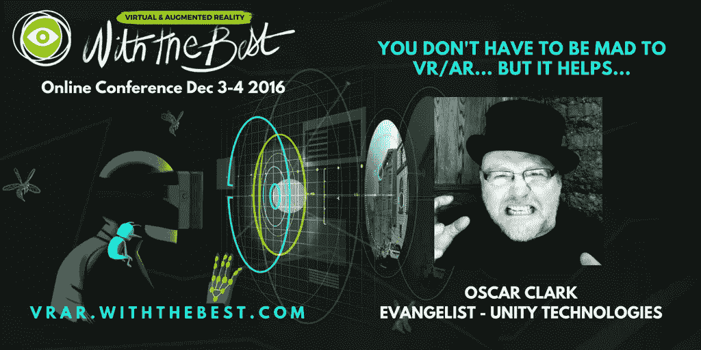

# 在虚拟现实和现实中疯狂

> 原文：<https://medium.com/hackernoon/mad-as-a-hatter-in-vr-ar-bfada22f0780>

采访来自 Unity 3D 的奥斯卡·克拉克

多年来，Unity Technologies 的游戏设计师、顾问和布道者奥斯卡·克拉克(Oscar Clark)一直用他在游戏性最佳实践方面的专业知识鼓励开发人员，帮助他们改进开发，打造杀手级体验。他身兼数职，是在线、移动和主机游戏服务的资深人士，也是一名商业化专家和数据大师——查看他的*分析&玩家生命周期* [帖子和网络研讨会](https://blogs.unity3d.com/2016/05/03/analytics-the-player-lifecycle/)——我们采访了他:

作为 Unity Technologies 的布道者，你帮助开发人员克服他们可能面临的新兴技术变革的障碍。是否有一个潜在的主题会阻止潜在的成功？

关键是要关注你的观众；但这变得更加复杂，因为现在我们的球员也有自己的观众。社交联系对游戏来说非常重要，无论是直接与你的游戏朋友，还是间接与游戏的视频分享。

Q 个人觉得今天的 VR & AR 最让你兴奋的是什么？

这是探索新的游戏和讲故事方式的潜力。想想“*保持通话，没有人爆炸*”如何提供完全吸引人的体验，同时还允许我与房间里的其他人交流；或者伊芙·瓦尔基里的方式让我觉得我是一个真正的星舰飞行员，在现场与其他真正的玩家战斗。此外还有叙事作品，如 *Allumette* 将一个美丽动人的立体布景组合在一起，既有剧院的感觉，又有电影的动画效果。正如阿尔·乔尔森曾经说过的“你还什么都没看到！”

问 你创作了*游戏即服务*——并鼓励开发者创造免费游戏设计——这一策略的核心是什么？

基本上，这是关于认识到我们应该专注于从游戏内部为我们的玩家建立效用(价值);让他们继续玩下去的理由，希望他们也能和我们一起花钱，让每个人的游戏变得更有趣。谁更擅长销售你的游戏？每天有 500 多个新游戏的 Appstore 还是你作为设计师？更重要的是,“游戏即服务”意味着我们认识到我们正在与玩家建立长期关系，并希望让他们继续玩下去(希望他们观看自愿加入的广告，并为他们看重的东西付费！).

然而，这个模型也是关于规模的，AR/VR 还不在那个领域。就目前而言，我们更有可能看到专注于了解该平台能为观众提供什么的游戏，这些观众可能会成为推动市场增长的倡导者。这通常意味着建立令人惊叹的一次性体验，忠实粉丝会喜欢并提前付费。这也意味着，每当一款游戏发布时，如果它让某些人感到不适，或者以其他方式损害了他们的体验，它就会拖累我们所有人，推迟游戏的采用。质量很重要，我相信这是 AR/VR 应用商店绝对欣赏的东西。

Q 你最近的约旦之旅让你参加了国际移动游戏大奖(IMGA)的评选，你在这次活动中最大的收获是什么？

我学到了两件重要的事情(除了乔丹对我们的欢迎之外)。首先，阿拉伯市场潜力巨大，而且在很大程度上是不值得的。然而，这不仅仅是一个语言问题，还意味着从文化角度考虑该地区的需求。其次，这是激情的力量。这是一个位于中东的国家，通过利用游戏开发来推动增长，投资于年轻人的热情，尽管这个行业还很新鲜，但却取得了令人惊讶的好结果。哦，参加这次活动的女性比我在任何其他地区看到的都多。

问 告诉我们一些关于你创作的洛基恐怖秀的应用程序

我从 18 岁开始就是《洛基恐怖》的粉丝，当有机会制作一款基于它的游戏时，我会选择“向左跳”。与任何品牌合作真的意味着你必须深入了解它，尤其是导致它出现的来源。对我来说，这意味着我们必须尊重旧的科幻和恐怖 B 级电影，以及狂热追随者参与的方式。对我们来说，这总是关于观众的参与…..pation。

问 你还会给想要创造一些惊人体验的开发者什么建议？

对你要实现的目标有一个愿景；然后再简化再简化一些。玩家通常需要一个参照系，一些熟悉的东西作为起点，然后他们才能接受新的想法而不会感到困惑。但是接下来，改变一件事，改变他们的期望，同时充分利用媒体。不要试图在 VR 中制作使命召唤；利用虚拟现实带给我们的限制和机遇，尝试重新想象一名士兵在二战中的经历。

Q 你期待在 12 月的 VRAR 上与最棒的一起演讲吗？

当然啦！—这是一种与其他专注于提供令人惊叹的体验的创意人员联系的绝佳方式！

我们等不及你加入我们了奥斯卡！谢谢大家！

*奥斯卡即将开幕的第二天我们即将到来的* [***VRAR 与极品***](http://vrar.withthebest.com?utm_source=medium&utm_medium=post&utm_content=&utm_campaign=vrarwtb) ***、线上开发者大会*** *与***his***主题演讲:*你不必为 VR/AR 抓狂……但有助于 12 月 4 日周日*。不要错过！***

************

> **[黑客中午](http://bit.ly/Hackernoon)是黑客如何开始他们的下午。我们是 [@AMI](http://bit.ly/atAMIatAMI) 家庭的一员。我们现在[接受投稿](http://bit.ly/hackernoonsubmission)并乐意[讨论广告&赞助](mailto:partners@amipublications.com)机会。**
> 
> **如果你喜欢这个故事，我们推荐你阅读我们的[最新科技故事](http://bit.ly/hackernoonlatestt)和[趋势科技故事](https://hackernoon.com/trending)。直到下一次，不要把世界的现实想当然！**

****