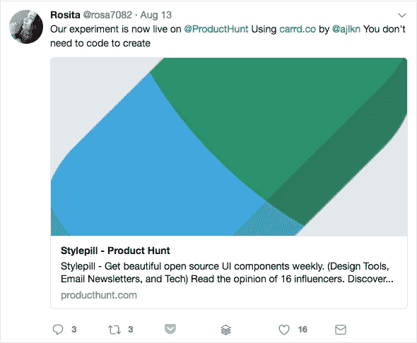
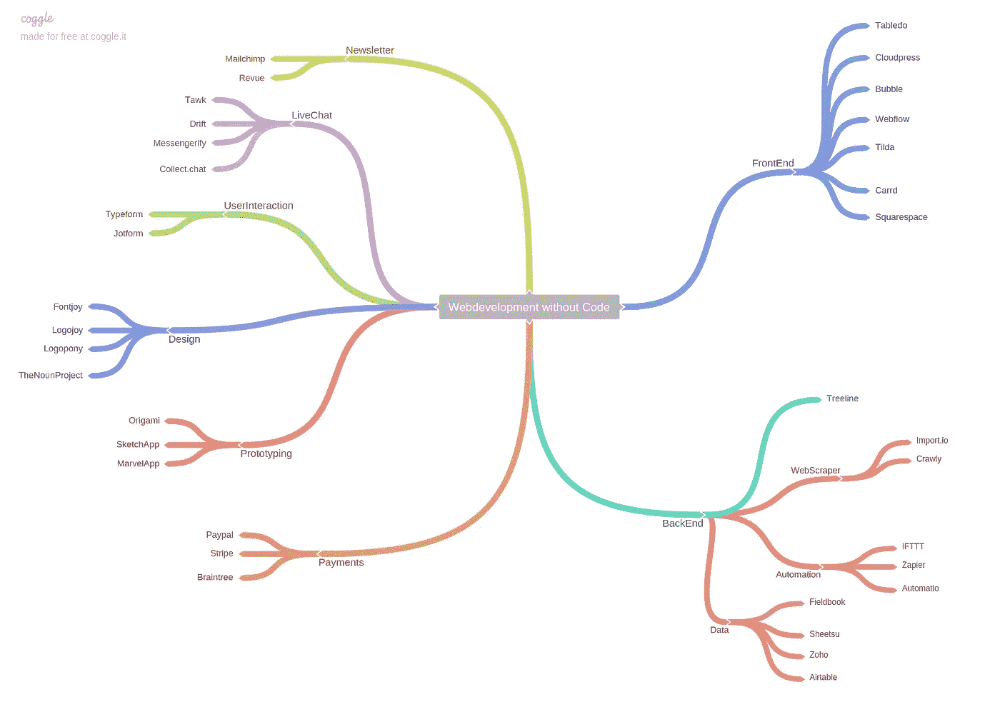
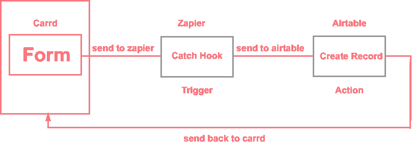
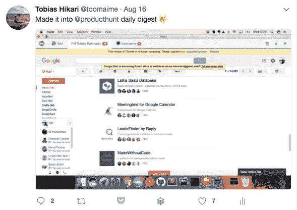
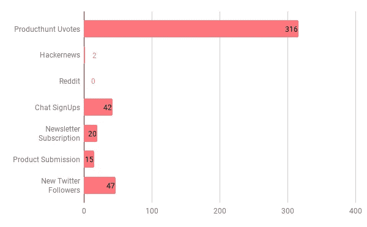
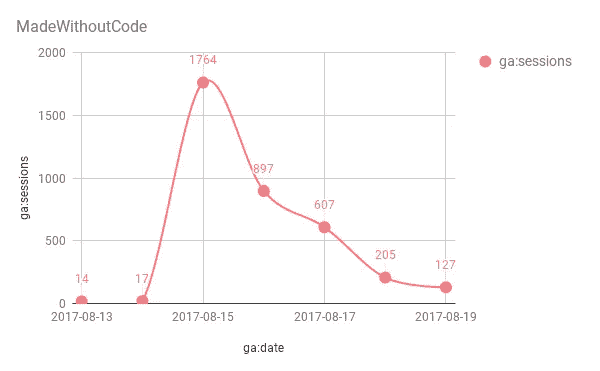
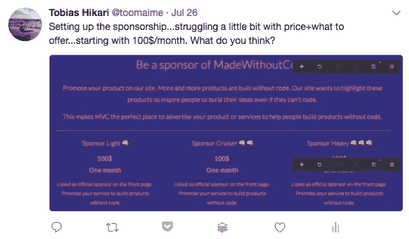
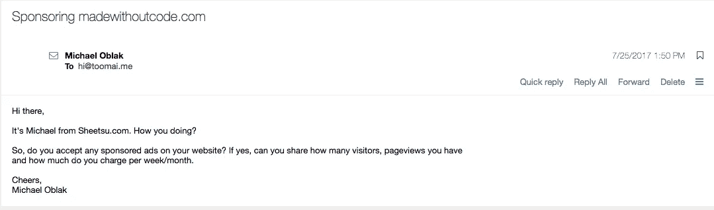
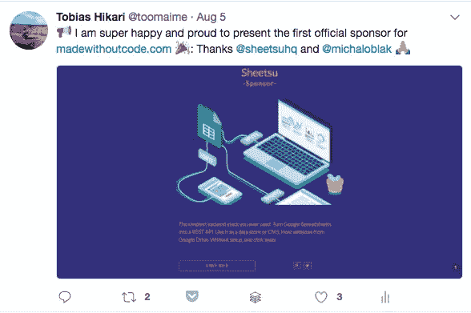

# made without code——如何建立一个创业公司🚀没有代码

> 原文：<https://medium.com/hackernoon/madewithoutcode-how-to-build-a-startup-without-code-cd1f681d4f42>

上周，我推出了一款新产品:[http://madewithoutcode.com/](http://madewithoutcode.com/)——一个连接创客、非技术型创始人、顾问和服务提供商的平台。这里是它的背景故事和一些见解，我希望对那些想要建立一个没有代码的[创业公司](https://hackernoon.com/tagged/startup)/产品的人有用。

## **史前史**

在过去的几个月里，我看到了许多新的想法、平台和产品，它们都是使用工具和服务不用代码构建的，比如[Carrd.co](https://carrd.co/)、[扎皮尔](https://zapier.com/)、 [Typeform](https://www.typeform.com/) 等等。Carrd 尤其因快速原型构建而受到广泛关注，这使得创建工作产品变得非常容易。

## **寻找利基**

像这样的帖子出现在我的时间表中，我注意到没有一个真正的好地方专注于没有代码和非技术创始人的产品。当然，也有像 [Producthunt](https://www.producthunt.com/) 和 [Betalist](https://betalist.com/) 这样的平台做得很好，但我认为有一个地方可以让你看到用第三方工具创建的创业公司、服务和产品，并且可以与其他制造商、顾问和服务提供商联系，这将是非常有用的。于是这个想法诞生了，我想挑战自己，看看在不写代码的情况下，我能把一个产品推向多远。

## 建筑物

我清楚地记得当我开始学习编码时，我不得不选择学习什么。简直是地狱！关于哪种语言是最好的，有太多的争论，对于一个新手来说，决定选择哪种语言是非常令人沮丧的。有一个关于[必须知道的网络开发技术](https://www.youtube.com/watch?v=sBzRwzY7G-k)的很棒的视频，有一个非常好的[思维导图](https://coggle.it/diagram/Vz9LvW8byvN0I38x)作为概述。我认为，当谈到可以用来构建没有代码的产品的工具时，或多或少是一样的。

有很多很棒的工具可以解决不同的问题，但是很难选择正确的。为了简化这个过程，我拼凑了一个小小的[思维导图](https://coggle.it/diagram/59996716b8c650000163413a/0d1e0a635495052c233b476458de38326206d4fb4d84ed756b84bfb9647a426d)【进行中】，这个灵感来自于必知的 web 开发技术，也许可以帮助其他非技术型创始人更好地了解现有工具。

[https://coggle.it/diagram/59996716b8c650000163413a/0d1e0a635495052c233b476458de38326206d4fb4d84ed756b84bfb9647a426d](https://coggle.it/diagram/59996716b8c650000163413a/0d1e0a635495052c233b476458de38326206d4fb4d84ed756b84bfb9647a426d)

在没有代码的情况下创建一家初创公司，最困难的技术部分是让你的产品所需的所有功能运行起来。对我来说，其中一个特点是用户可以在网站上添加有用的[食谱或工作流程](http://madewithoutcode.com/#recipes)。这对于我的设置来说相当棘手，因为 Carrd 开箱后你就无法做到这一点。为了获得这个功能，我首先使用了 Carrd 的表单功能，并将其连接到 Zapier。然后我捕获了来自 Carrd form 的 webhooks 并发送到 [Airtable](https://airtable.com/) ，我把它嵌入了 Madewithoutcode 的食谱网站。

Workflow of madewithoutcode/recipes

尽管有很棒的服务，但你仍然受限于没有代码就能构建的东西。然而，建立一个包含前端、后端、数据库和工作功能的完整产品变得越来越容易，我认为有些领域更容易建立一个没有代码的创业公司。

在线课程|市场|社区|咨询业务|按需服务|预购网站|数字服务|电子商务

## **预发布**

没有大量的 twitter 追随者，很难在早期获得关注。当然，获得对你想法的早期反馈并与潜在用户建立联系是非常重要的。我认为 Twitter 是一个很好的工具，如果你没有很多追随者，你仍然可以添加标签或添加你想吸引注意力的人。

*直到你启动*你才知道

正因为如此，我从一开始就试图记录构建过程，并从我认为可能有用的人那里获得早期反馈和关注。

## 发动

我认为有足够多的文章是关于如何建立一个网上企业，如何启动一个项目，以及在哪里提交。以下是一些值得一读的链接:

[印度黑客的故事](https://www.indiehackers.com/)

[如何启动 Producthunt](https://blog.producthunt.com/how-to-launch-on-product-hunt-7c1843e06399)

[我们如何通过从+50 次成功发布中筛选出一份清单，在产品搜索上获得+1000 次投票。](/startup-grind/how-we-got-1000-upvotes-on-product-hunt-by-curating-a-checklist-from-50-successful-launches-6b77ce29b444)

[皮特等级博客](https://levels.io/)

[如何建立网上业务](https://crew.co/how-to-build-an-online-business/)

[如何在这个周末创造百万美元的生意(例如:AppSumo、Mint、Chihuahuas)](https://tim.blog/2011/09/24/how-to-create-a-million-dollar-business-this-weekend-examples-appsumo-mint-chihuahuas/)

尽管我想给你一些关于我的发布的见解，但总的来说，对我来说最好的渠道是 Producthunt，这并不奇怪，因为显然这是我的目标群体。我从他们的社区获得了 316 次投票，这是一个好结果，并进入了他们的每日文摘，这给我的网站带来了很多流量。

黑客新闻[和 Reddit](https://news.ycombinator.com/) 总体来说是个失败。我在 Hackernews 上得到了 2 票，在 Reddit 上得到了 0 票。关于 Reddit，我只是把它发布到了错误的渠道。由于我在 reddit 社区的糟糕经历(大多是非常苛刻的 imho ),我没有花太多精力，只是把它发布到了/startup 频道。当来自 Producthunt 的人或有很多追随者的制造商喜欢你的产品并分享它时，这也很有帮助，这也不是我的情况。我认为发布会仍然是成功的，我获得了 42 个新的聊天注册，15 个产品提交，20 个时事通讯订阅和 47 个新的 Twitter 追随者。

Upvotes, SignUps, SocialMedia

在发布日，我获得了 1764 次会话，这显然是迄今为止的最高记录。在过去的几天里，大约有 120 到 200 次会议。

Goggle Analytics User Sessions

## **货币化**

我从一开始就试图将产品货币化。有一些显而易见的方法可以做到这一点，尽管在这个早期阶段并不是每一步都有意义:

**向提交产品的用户收费**——没有意义，我也不太喜欢。

**聊天/社区的订阅费** —首要目标是增加用户数量并为用户增值，因此一开始没有意义。

**为公司提供赞助**——在我看来，这种方式是从第一天开始将产品货币化的最佳方式，所以我在网站上增加了一个赞助部分，并开始在推特上发布相关信息。

当我试图在公共场合构建和分享一切时，我非常高兴和自豪地获得了一项超级酷的服务 [Sheetsu](https://sheetsu.com/) 的创始人的关注，这项服务可以让你把[谷歌](https://hackernoon.com/tagged/google)电子表格变成 [REST API](https://en.wikipedia.org/wiki/Representational_state_transfer) 。

这给了我很大的鼓舞，我正在建造的东西不仅是我头脑中的一个好主意，而且显然正在成为一个有用的产品。在交换了一些想法和电子邮件后，我说服了迈克尔成为“无代码制作”的第一个赞助商。

## **接下来的步骤**

最困难的部分现在来了。我对发布感到非常高兴，但显然这不是最困难的部分。推出一款产品很容易，但将其打造为一家盈利的初创公司却很难。以下是我为保持高吸引力和增加产品价值而尝试做的事情:

添加更多功能

*   构建用于提交的可共享功能
*   向网站添加评论功能

添加更多功能:

*   获取顾问/导师
*   获得投资
*   问答论坛

每周简讯

继续在公共场合建造它

## **结论**

总的来说，到目前为止，我对这个网站非常满意，我迫不及待地想给这个网站添加更多的功能。我想最后，你可以从我的故事中吸取四个教训。

1.  即使你没有很多追随者，也要在公共场合建立并分享你的进步。

2.不要犹豫，与你认为能帮助你的人联系，给你有用的反馈。通常他们喜欢这样做——最好的工具 Twitter。

3.从第一天开始，就想办法将你的产品货币化。

4.根据产品创意的功能性明智地选择工具。

最后但同样重要的是，我希望在我们的 [**社区**](http://madewithoutcode.com/#chat) 中见到您，或者加入我的 [**时事通讯**](http://madewithoutcode.com/#newsletter) ，获得所有关于 Madewithoutcode 的见解和新产品的最新消息。

✌️·托比亚斯

PS:我会根据你的反馈来编辑这篇文章。因此，如果你想让我给[添加一些东西，请联系我](https://twitter.com/toomaime)，或者在评论区添加你的想法。

***如果你喜欢这篇文章点击*** 👏 ***。这将告诉我写更多！***