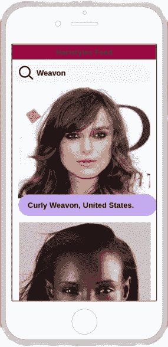

# MagicMirror.ai

> 原文：<https://medium.com/hackernoon/magicmirror-ai-510c7e934386>

## 一家增强现实和人工智能尼日利亚初创公司。

我创建 MagicMirror.ai 的动机和愿望。

变革性的技术飞跃给我留下了深刻的印象，也给了我很大的启发，在这种启发下，我创建了 MagicMirror.ai，并联系了我的亲密朋友，他们与我有着相似的愿景，与我一起将这一切变为现实。

MagicMirror.ai 是一家人工智能和增强现实初创公司，我们在这里设计和构建个性化时尚的未来。

通过增强现实和机器学习，我们将使用户在购买这些物品之前，能够看到不同的发型、服装、鞋子、眼镜和头饰在他们身上会是什么样子。

此外，通过人工智能，我们将建议适合用户风格的服装和配件。

通过这样做，我们将节省很多人的时间和金钱，我们将给他们一个神奇的体验。

## 头发交换

我们的第一个产品是一个社交网络， *Hair Swap* ，通过我们的移动应用程序访问，在这里用户可以尝试其他人的发型；你只需浏览我们的发型订阅源(有点像新闻订阅源，但现在人们通过拍摄清晰的面部照片来上传他们的发型)，选择一个想要的发型，然后系统会提示你自拍，之后你会立即看到自己的新发型。

## 德雷阿

此外，我们正在建立一个人工智能发型师 Drea，这将与我们的移动应用程序。你可以问她一些非常酷的问题，比如“什么发型最适合我？”。或者“我这个发型看起来怎么样？”。

这将伴随着一个 i-pad 的扩展&智能电视被用于发廊。所以你可以在实际制作之前尝试你想做的发型。这样你就已经知道它穿在你身上有多好看了。

这是我们正在创造的未来。

伊曼纽尔·伊森维尔，

创始人兼首席执行官 MagicMirror.ai