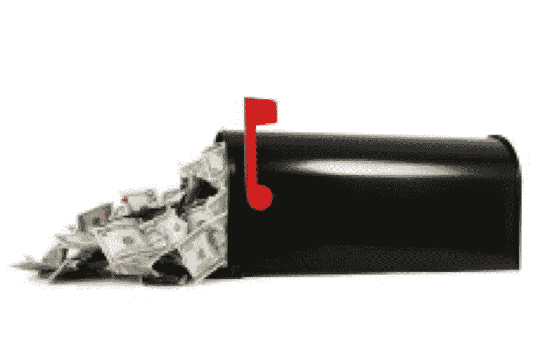
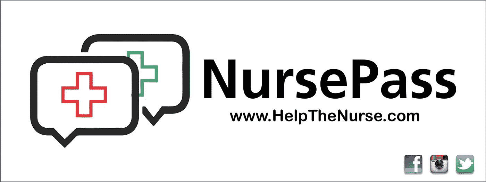

# 邮箱钱

> 原文：<https://medium.com/hackernoon/mailbox-money-83b8a93f9b96>

作为这个 NursePass 故事的一部分，我有机会与一位非常成功的商人交谈。他提供了一些很棒的建议，还把我介绍给了他的一位同事，这位同事帮助我们获得了第一项专利。回头看看那次谈话的笔记，我用比其他任何东西都要黑的墨水写下了……“邮箱钱”:仅仅是为了在我的邮箱里收一张支票而启动 NursePass。他的观点是关于“退出”和收集我的股份。

听起来很吸引人。我实话实说。我对创业非常“绿色”。我之前的创业经历是在小学课间和公交车上偷偷卖泡泡糖。我有一个展览和一切，但我会把这个故事留到以后。走向我的邮箱去找支票的想法…听起来很梦幻。直到我追溯到 2014 年创业周末的笔记。一个超现实的胜利周末，我经常回想以保持注意力。

NursePass 与交易和退出无关。这是一个指南针。一盏明灯。我们追随的星星。今晚有一位母亲感谢我和 NursePass 的合作。除了她亲切和奉承的话语之外，还有一位家长只是希望在孩子上学或日托时，我们能带给家长们内心的平静。超负荷工作的校医发来的感谢推特。那是我们夜晚的灯塔。

我不要邮箱钱。我想要一个装满感谢信或轶事的邮箱(或收件箱),讲述我们如何在四月的那个晚上帮助父母获得内心的平静。

 [## NursePass

### 适用于 iPhone、iPod Touch 和 iPad 的 NursePass 应用程序是为学校护士和教师设计的。它可以被…立即使用

www.helpthenurse.com](http://www.helpthenurse.com)