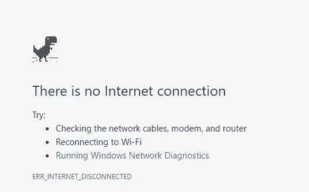
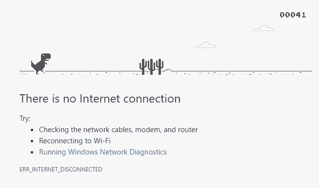

# 用 Chrome 为奔跑的恐龙制作一个机器人

> 原文：<https://medium.com/hackernoon/make-a-bot-for-a-running-dino-in-chrome-5dfd0cac29be>

不久前，我还想在 Chrome 浏览器的一个小游戏中打破记录。如果有人不知道，如果你无法访问互联网，而你的浏览器是 Chrome——按空格键，或者如果是移动电话，在屏幕上点击一下，就会出现一个小游戏。



让我们开始创建它。该机器人的原理是，我们在循环中解析距离角色一定距离的像素颜色，并检查像素的颜色是否等于仙人掌的[颜色](https://hackernoon.com/tagged/color)，然后我们跳转。否则——继续跑(什么都不做)。



首先，让我们找到正确的像素。在我的例子中，这个像素在坐标上:“775x250”。我在道路上最高的小丘上取一个正确的像素，并与通过反复试验得到的字符保持一定距离。还应该注意到，我的屏幕分辨率是 1920x1080 21.5 英寸，如果你有不同的，它会工作不稳定。
所以，让我们在 VS 中创建一个控制台应用程序

首先，我们声明像素坐标的变量。

```
**public** **static** **int** x = 775;         
**public** **static** **int** y = 250;
```

然后将一些 DLL 连接到作业。

```
[DllImport("user32.dll")]         
**public** **static** **extern** IntPtr **GetDC**(IntPtr hwnd); [DllImport("user32.dll")]         
**public** **static** **extern** **int** **ReleaseDC**(IntPtr hwnd, IntPtr hDC); [DllImport("gdi32.dll")]
**public** **static** **extern** **uint** **GetPixel**(IntPtr hDC, **int** x, **int** y);
```

现在让我们为处理程序添加一些代码。

```
IntPtr hDC = GetDC(IntPtr.Zero);             
  **while** (**true**) {
    **uint** pixel = GetPixel(hDC, x, y);                 
    **if** (pixel == 5460819) {                     
      SendKeys.SendWait("{UP}");
    }
  }
```

代码在一个无限循环中。

```
**if** (pixel == 5460819)
```

这意味着当像素的颜色等于十进制编码中仙人掌的颜色时，按下向上箭头。

```
SendKeys.SendWait("{UP}");
```

然后我们需要连接这两个环节。

```
**using** System.Diagnostics;
**using** System.Windows.Forms;
```

此刻，迪诺轻松地克服了 500 个游戏米，然后它被困在鸟类和夜晚的视线中。为了解决这些问题，我会写下面这篇文章。祝你好运！

**更新:**玩游戏不用断开连接——只需在地址栏输入 **chrome://dino/** 即可。

## ❤如果这篇文章有帮助，请点击小心脏！(在推特上关注我)

[](http://bit.ly/HackernoonFB)[](https://goo.gl/k7XYbx)[](https://goo.gl/4ofytp)

> [黑客中午](http://bit.ly/Hackernoon)是黑客如何开始他们的下午。我们是阿妹家庭的一员。我们现在[接受投稿](http://bit.ly/hackernoonsubmission)并乐意[讨论广告&赞助](mailto:partners@amipublications.com)机会。
> 
> 如果你喜欢这个故事，我们推荐你阅读我们的[最新科技故事](http://bit.ly/hackernoonlatestt)和[趋势科技故事](https://hackernoon.com/trending)。直到下一次，不要把世界的现实想当然！

