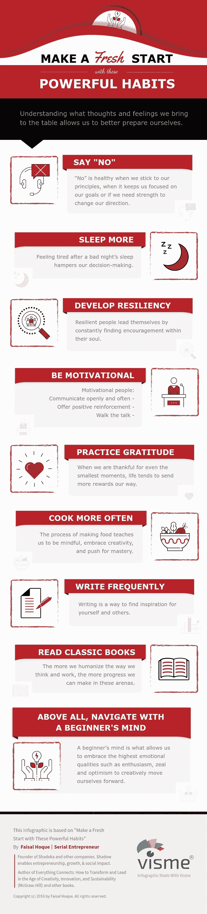

# 用这些强大的习惯重新开始

> 原文：<https://medium.com/hackernoon/make-a-fresh-start-with-these-powerful-habits-b95f7c807bcd>

[Image: Unsplash User: [Sandis Helvigs](https://unsplash.com/@sandishelvigs)]

## 初学者的心态让我们拥有最高的情感品质，如热情、热忱和乐观，从而创造性地推动自己前进。

获得成功的方式有很多种。决定走哪条路取决于一个人想从生活中得到什么。成功也是主观的；如果一个人选择量入为出，不欠任何债务，他们可能会认为自己是成功的，而另一个人可能会从银行账户的数字中看到成功。

不管定义如何，当我们想到成功人士时，通常会想到哪些特征？

开心。自信。放松。积极的。强壮。

了解我们带来了什么样的想法和感受，可以让我们更好地做好准备。这种理解源于我们经常练习的东西。

当我们准备好对新的一年说“欢迎”和对新的一年说“再见”时，我想我会分享一些我计划在来年实践的习惯，以度过我的冒险(好的和坏的):

**Infographic made with** [**Visme**](http://www.visme.co/)**.**

版权所有 2016 年由费萨尔霍克。保留所有权利。

我是一名[企业家兼作家](http://faisalhoque.com/speaking/)。 [SHADOKA](http://shadoka.com/) 等公司创始人。Shadoka 促进企业家精神、增长和社会影响。著有《 [*《万物互联——如何在创意、创新和可持续发展的时代进行变革和领导》》(McGraw Hill)和《*](http://www.amazon.com/Everything-Connects-Creativity-Innovation-Sustainability/dp/0071830758/ref=sr_1_1?ie=UTF8&qid=1376488798&sr=8-1&keywords=everything+connects%2Bfaisal+hoque) *[*生存并茁壮成长:弹性企业家、创新者和领导者的 27 种实践*](http://survivetothrive.pub/) 》(励志出版社)。在推特上关注我。*免费使用* [*万物互联*](http://app.everythingconnectsthebook.com/login.php) *领导力 app 和* [*生存茁壮*](http://app.survivetothrive.pub/login.php) *弹性 app。**

> [黑客中午](http://bit.ly/Hackernoon)是黑客如何开始他们的下午。我们是 [@AMI](http://bit.ly/atAMIatAMI) 家庭的一员。我们现在[接受投稿](http://bit.ly/hackernoonsubmission)，并乐意[讨论广告&赞助](mailto:partners@amipublications.com)机会。
> 
> 如果你喜欢这个故事，我们推荐你阅读我们的[最新科技故事](http://bit.ly/hackernoonlatestt)和[趋势科技故事](https://hackernoon.com/trending)。直到下一次，不要把世界的现实想当然！

