# 用人工智能让制药公司再次伟大:一些挑战

> 原文：<https://medium.com/hackernoon/make-pharma-great-again-with-artificial-intelligence-some-challenges-50e91ea9988d>

药物研发变得越来越困难和昂贵。尽管技术不断进步，但开发一种新药的成本每九年就会翻一番。这是 Eroom 的制药定律，反映了计算机性能的摩尔定律。

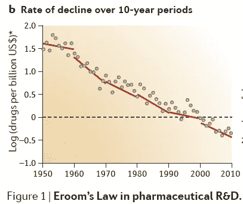

如今，开发一种新药的成本超过 28 亿美元。在这种情况下，制药公司需要对他们为数不多的成功药物定价过高，以弥补他们的药物组合在 R&D 的所有失败。例如，在美国，一种新的丙肝治疗药物 Sovaldi 的价格高达 84，000 美元。制药行业贪婪是因为这种稀缺感。

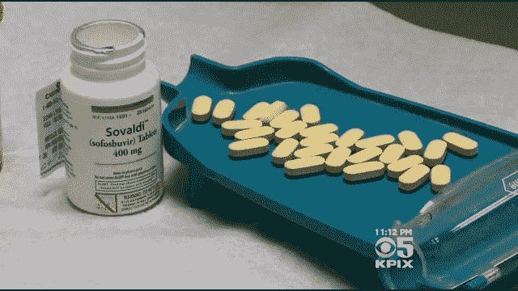

Drugs are getting more expensive

在科技行业，情况有所不同。乐观主义盛行。科技受到摩尔定律的推动，即计算机性能每 18 个月翻一番。

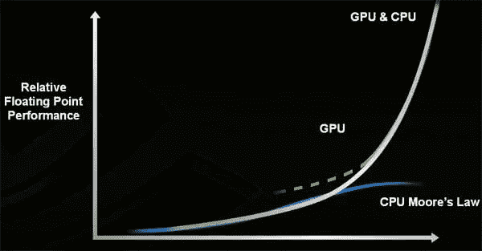

Moore’s law

这种指数级的进步使价格保持在低位。例如，谷歌为一些科学项目免费提供新的 TPU 芯片。科技公司更慷慨，因为他们感觉自己很富足。技术如何帮助制药公司，尤其是在人工智能扩张的时代？

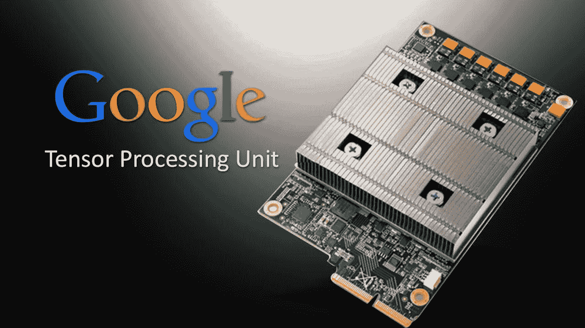

Computing power is getting cheaper

# 人工智能如何帮助药物发现？

最近发表了一篇关于医学深度学习的调查论文[。在这篇文章中，我倾向于提出一些挑战，一些未来工作的想法。对于一个接受在线课程培训的学生来说，其中一些肯定是容易接近的(](https://greenelab.github.io/deep-review/) [Coursera](https://www.coursera.org/learn/machine-learning) 、[Stanford](http://web.stanford.edu/class/cs224n/)……)。

# 甘将产生新的药物

我选择挑[一张纸](http://www.impactjournals.com/oncotarget/index.php?journal=oncotarget&page=article&op=view&path%5B%5D=14073)看怎么改进。本文提出利用[生成对抗网络](/@devnag/generative-adversarial-networks-gans-in-50-lines-of-code-pytorch-e81b79659e3f)生成抗癌新药。我觉得很牛逼。

GAN can [generate pics of new animals](https://junyanz.github.io/CycleGAN/), but also new molecules

想法是用已知的抗癌分子训练一个[对抗性自动编码器](http://hjweide.github.io/adversarial-autoencoders)，然后生成新的抗癌分子。为了衡量性能，作者试图重新发现现有的抗癌药物。

我建议用更好的训练数据、更好的分子特征来改进这篇 [GAN 论文](http://www.impactjournals.com/oncotarget/index.php?journal=oncotarget&page=article&op=view&path%5B%5D=14073)，并将模型推广到多药物和多任务设置。

网络架构也可以改进，一位作者已经在他的博客中讨论过了。

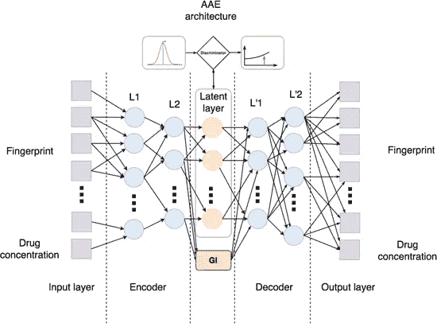

Architecture of the [molecule generator network](https://team.mail.ru/neural-networks-can-help-in-fighting-cancer/)

# **在同一模型上输入不同的数据集**

这里有一个热身练习:试试[艾滋病抗病毒筛查数据](https://wiki.nci.nih.gov/display/NCIDTPdata/AIDS+Antiviral+Screen+Data)，而不是癌症数据。只要稍加修改，它就能适应这个模型。然后尝试其他疾病和数据集(传染病……)。有很多免费的数据集，但它们分散在网络上。

对于癌症数据，论文使用了 [NCI-60 生长抑制数据](https://wiki.nci.nih.gov/display/NCIDTPdata/NCI-60+Growth+Inhibition+Data)。然而，NCI-60 已经在 2016 年初[弃用](http://www.nature.com/news/us-cancer-institute-to-overhaul-tumour-cell-lines-1.19364)。这是一组培养的 60 种人类癌细胞系，与真正的癌症几乎没有关联。新标准是'[患者来源的异种移植物](https://en.wikipedia.org/wiki/Patient-derived_tumor_xenograft) ' (PDXs)，即在小鼠体内生长的新鲜人类肿瘤样本。

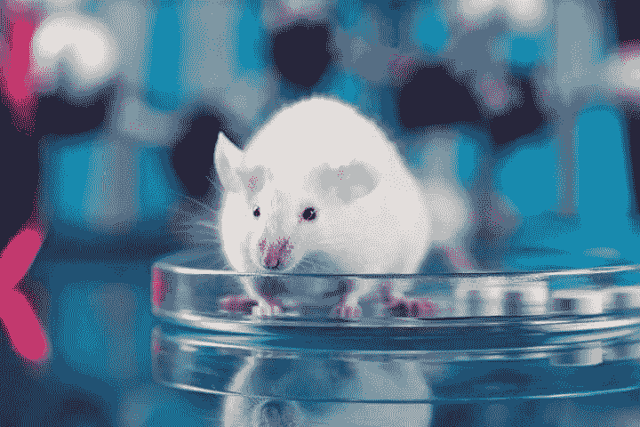

Tumors grown in mice are the [new standard](http://www.nature.com/news/us-cancer-institute-to-overhaul-tumour-cell-lines-1.19364)

然而，我没有找到关于抗癌药物对 PDX 影响的大型公共数据集。此外，许多 PDX 数据仍然隐藏在制药公司中。

# **功能:从指纹到 mol2vec**

另一种改进模型的方法是拥有更好的特性。GAN 纸使用手工制作的特征，即 [MACCS 分子指纹](http://www.dalkescientific.com/writings/NBN/fingerprints.html)。它用一个二元向量表示一个分子。是一种[一键编码](https://www.quora.com/What-is-one-hot-encoding-and-when-is-it-used-in-data-science?share=1)。

相反，最好有一种分子的密集表示，一种 mol2vec，这类似于 NLP 中的 [word2vec](https://en.wikipedia.org/wiki/Word_embedding) :如果两个分子的对应分子在化学性质上相似，则这两个分子的向量会很接近。

在这个方向，有关于分子图卷积的有趣论文(这里[这里](http://papers.nips.cc/paper/5954-convolutional-networks-on-graphs-for-learning-molecular-fingerprints)和[这里](https://arxiv.org/abs/1603.00856))。这个想法是从分子图开始的:

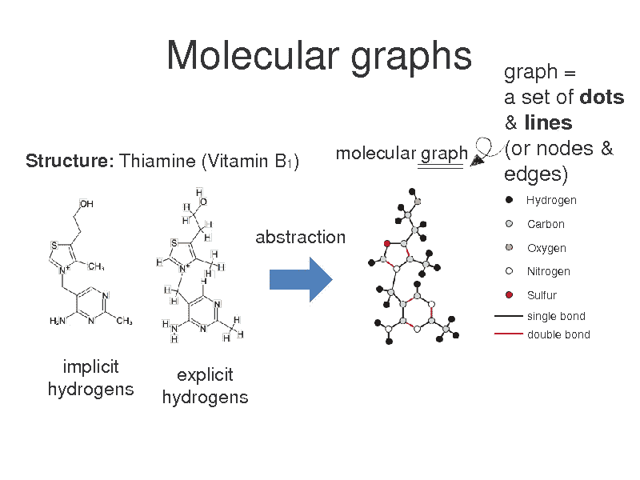

然后在这个图上执行卷积，以在矩阵上推广卷积的方式(标准的 2-D 矩阵是正方形网格图):

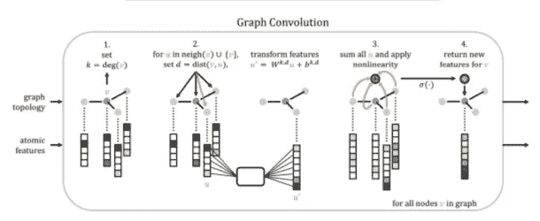

分子图似乎是表示分子的方法。然而，在实践中，它们仍然没有胜过分子指纹。所以需要做更多的工作。

此外，一篇[后续论文](http://pubs.acs.org/doi/abs/10.1021/acscentsci.6b00367)再次使用分子图卷积，但这一次，作者甚至懒得将它们与指纹进行比较。如果能执行一个基准测试就太好了。这对于初学者来说可能是可行的，因为作者也发布了一个构建在 Tensorflow 之上的 Python 库，以方便这类工作: [DeepChem](http://deepchem.io/) 。

# 超越分子图

为了超越分子指纹，也许有必要用更真实的化学来描述分子。这里有两个想法:

*   分子生活在三维空间，而分子图像在 2D。因此可以考虑三维分子结构。

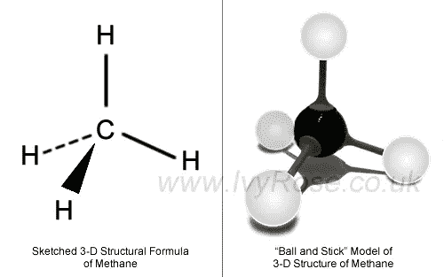

Molecules live in 3 dimensions

*   在分子图中，边代表化学键。这些键在两个原子之间有明确的定位。然而，这只是对现实的近似，因为从量子力学的观点来看，粒子是非局域的。一个粒子同时位于它所有可能的位置。

这种非局部性会影响化学性质，从而影响药物活性。例如，在一个[芳香环](https://en.wikipedia.org/wiki/Aromaticity)中，电子在环的所有原子之间是离域的。从量子的观点来看，把这个环分成边是没有意义的。

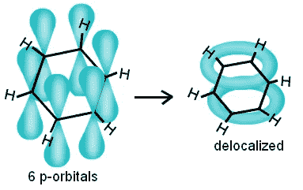

Formation of an [aromatic ring](http://chemistry.tutorvista.com/organic-chemistry/benzene-reactions.html)

分子图纸使用一键编码来表示分子图的一个边是否是芳香环的一部分(本文第 7 页[的表 2 和表 3](https://arxiv.org/pdf/1603.00856.pdf))。这留下了改进的空间。

# **超越生长抑制:临床试验和交互组**

在 GAN 的论文中，通过[生长抑制](https://en.wikipedia.org/wiki/Growth_inhibition)来测量药物的影响。这个衡量成功的标准非常粗略。在实践中，有更多的参数。例如，应该考虑副作用。这里有一个[数据库](http://sideeffects.embl.de)。考虑到疾病的预期复发也很重要。最终，将[临床试验的全部结果](https://en.wikipedia.org/wiki/Clinical_trial)输入到模型中会很有趣。

更好的方法是利用分子相互作用网络来预测药物的各种效应:相互作用组。围绕这个话题已经有[一些作品](http://www.nature.com/nbt/journal/v34/n1/full/nbt.3367.html)。

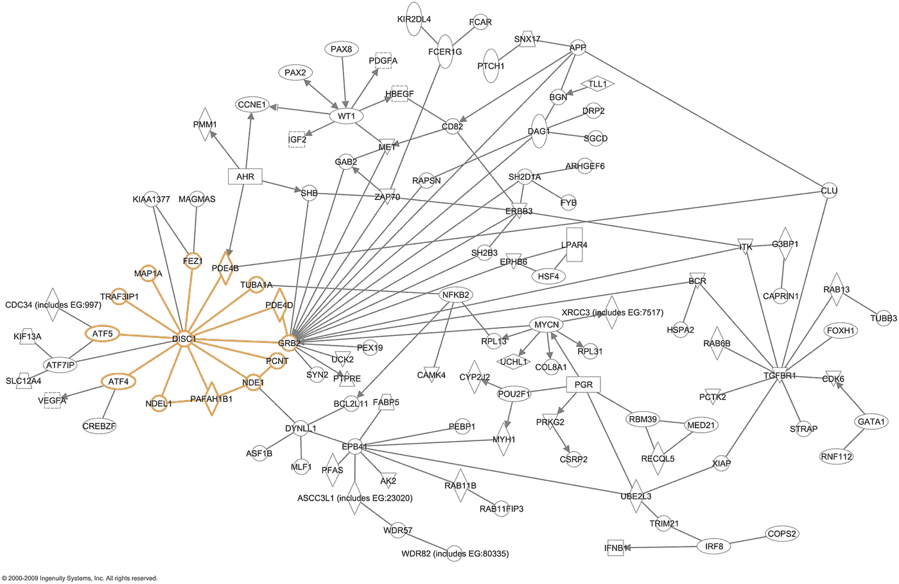

Network of interactions

# **联合疗法**

现代治疗通常涉及多种药物，以尽量减少耐药性。因此，GAN 模型应该将多个分子作为输入。然而，我没有找到关于这方面的数据集。

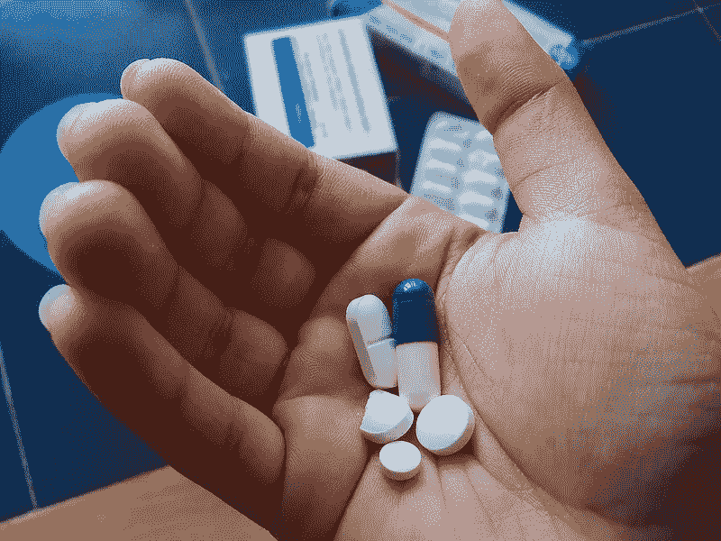

Modern treatements involve combinations of drugs

# **多任务学习**

最后，药物发现的 GAN 模型应该能够同时发现多种疾病的药物。这种[多任务学习](https://research.googleblog.com/2015/03/large-scale-machine-learning-for-drug.html)提高了性能。

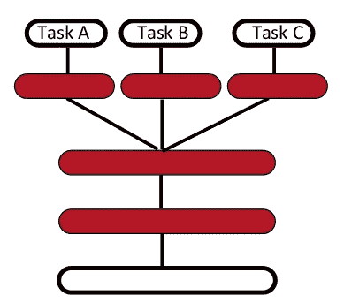

Multi-task neural network

# 总结:前面有很多挑战！

总之，对于制药和人工智能人群、学生、科学家和赞助商来说，药物发现是一个充满令人兴奋和有影响力的挑战的领域。欢迎所有人在博客上交流，或在围绕合作人工智能项目建立的社交网络上交流。

> [黑客中午](http://bit.ly/Hackernoon)是黑客如何开始他们的下午。我们是阿妹家庭的一员。我们现在[接受投稿](http://bit.ly/hackernoonsubmission)并乐意[讨论广告&赞助](mailto:partners@amipublications.com)的机会。
> 
> 如果你喜欢这个故事，我们推荐你阅读我们的[最新科技故事](http://bit.ly/hackernoonlatestt)和[趋势科技故事](https://hackernoon.com/trending)。直到下一次，不要把世界的现实想当然！

