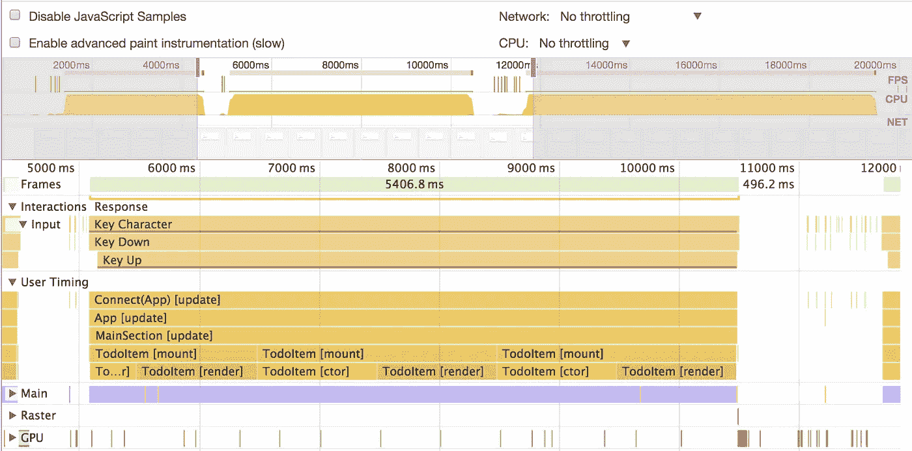

# 再次快速反应[第 1 部分]:性能时间表

> 原文：<https://medium.com/hackernoon/make-react-fast-again-part-1-performance-timeline-b70176a1df5f>

React 通常非常快，但是很容易犯小错误，导致性能问题。缓慢的组件安装、深度的组件树和不必要的渲染周期很快会让应用程序感觉很慢。

幸运的是，有很多工具可以帮助诊断性能问题，有些工具甚至是内置的。在本系列中，我们将重点介绍让 React 应用程序快速运行的工具和技术。每个帖子还会有一个互动的，有趣的演示！

# 绩效时间表

React 15.4.0 引入了一个新的性能时间线特性，可以让您准确地看到组件何时被挂载、更新和卸载。它还允许您可视化组件生命周期之间的相互关系。

**注意:**目前，该功能仅在 Chrome、Edge 和 IE 中有效，因为它利用了尚未在所有浏览器中实现的用户定时 API。

## 它是如何工作的

1.  打开您的应用程序并追加查询参数:`react_perf`。例如，`[http://localhost:3000?react_perf](http://localhost:3000?react_perf)`
2.  打开 Chrome DevTools **性能**选项卡，按下**记录**。
3.  执行您想要分析的操作。
4.  停止记录。
5.  在**用户计时下检查可视化。**

## 了解输出

每个彩色条显示组件正在“工作”的时间。由于 JavaScript 是单线程的，每当组件被装载或渲染时，它就会霸占主线程并阻止其他代码运行。

括号中的文字像`[update]`描述了组件生命周期的哪一部分正在发生。时间线分解了每一步，所以你可以看到像`[componentDidMount]` `[componentWillReceiveProps]` `[ctor]`(构造函数)和`[render].`这样的方法的细粒度计时

堆叠的条形表示组件树。虽然 React 中通常有相当深的组件树，但如果您正在优化一个频繁挂载的组件，这有助于减少包装器组件的数量，因为每个组件都会增加少量的性能和内存损失。

这里需要注意的一点是，时间线中的计时数字是针对 React 的开发构建的，它比 prod 慢得多。事实上，性能时间线本身甚至会降低应用程序的速度。虽然这些数字不应被视为真实性能的代表，但不同组件之间的*相对*时序是准确的。此外，组件是否更新根本不取决于产品版本。

# 演示！

为了好玩，我修改了 TodoMVC 应用程序，让它出现一些*严重的*性能问题。您可以在这里尝试一下:

 [## TodoMVC

### 针对极低性能进行了优化

perf-demo.firebaseapp.com](https://perf-demo.firebaseapp.com/?react_perf) 

要查看时间线，请打开 Chrome dev 工具，转到“性能”选项卡，然后单击录制。然后在应用程序中添加一些 TODOs，停止录制，检查时间线。看看您是否能发现哪些组件导致了性能问题:)

# 调试生产中的性能问题

React 中的性能时间线特性只在本地开发中起作用，因为它是在 React 的生产版本之外编译的。如果你有兴趣了解你的生产应用中的性能问题，试试 [LogRocket](https://logrocket.com) 。

LogRocket 就像是网络应用程序的 DVR，记录你网站上发生的一切。您可以重放有错误或性能问题的会话，以快速了解根本原因，而不是猜测问题发生的原因。

LogRocket 让你的应用程序记录性能计时、Redux 动作/状态、日志、错误、带有头+主体的网络请求/响应以及浏览器元数据。它还记录页面上的 HTML 和 CSS，甚至可以重建最复杂的单页面应用程序的像素级完美视频。

 [## JavaScript 应用程序的日志记录和会话重放

### LogRocket 帮助您了解影响用户的问题，以便您可以重新开始构建优秀的软件。

logrocket.com](https://logrocket.com/) 

# 结论

`react_perf`是可视化 React 组件生命周期的极好工具。它可以让你快速看到哪些组件正在更新，哪些可能会降低你的应用程序的速度。

因为`react_perf`只在开发中工作，所以请查看 [LogRocket](https://logrocket.com) ，以诊断生产中的错误和性能问题。

*很难保持前端开发的最新状态。加入我们的每周邮件列表，了解新工具、库和最佳实践，帮助您构建更好的应用:*

> [黑客中午](http://bit.ly/Hackernoon)是黑客如何开始他们的下午。我们是 AMI 家庭的一员。我们现在[接受投稿](http://bit.ly/hackernoonsubmission)并乐意[讨论广告&赞助](mailto:partners@amipublications.com)机会。
> 
> 如果你喜欢这个故事，我们推荐你阅读我们的[最新科技故事](http://bit.ly/hackernoonlatestt)和[趋势科技故事](https://hackernoon.com/trending)。直到下一次，不要把世界的现实想当然！

