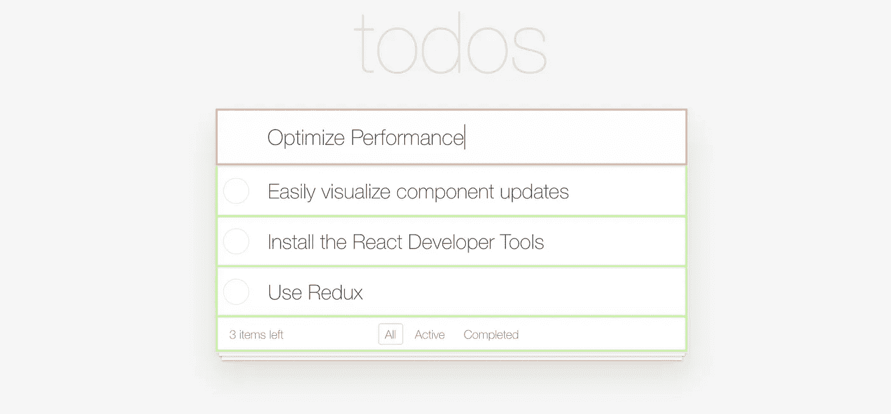
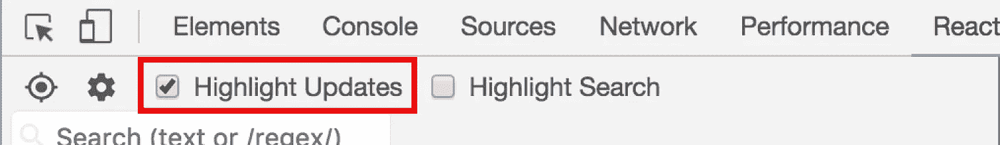

# 再次快速反应[第 3 部分]:突出组件更新

> 原文：<https://medium.com/hackernoon/make-react-fast-again-part-3-highlighting-component-updates-798e77dd08d9>

React 通常非常快，但是很容易犯小错误，导致性能问题。缓慢的组件安装、深度的组件树和不必要的渲染周期很快会让应用程序感觉很慢。

幸运的是，有很多工具可以帮助诊断性能问题，有些工具甚至是内置的。在本系列中，我们将重点介绍让 React 应用程序快速运行的工具和技术。每个帖子还会有一个互动的，有趣的演示！

# 不必要的渲染周期[续]

在我的[上一篇文章](https://blog.logrocket.com/make-react-fast-again-part-2-why-did-you-update-dd1faf79399f)中，我讨论了不必要的渲染周期如何对 React 应用的性能产生负面影响。然而，在一个大规模的应用程序中，要知道哪个组件在任何时间点都在更新是很棘手的。

## 使用 React 开发人员工具突出显示更新

幸运的是，React Developer Tools Chrome 扩展有一个可视化组件更新的内置特性。要使用它，首先确保在此安装扩展:

 [## React 开发人员工具

### 将 React 调试工具添加到 Chrome 开发者工具中。

chrome.google.com](https://chrome.google.com/webstore/detail/react-developer-tools/fmkadmapgofadopljbjfkapdkoienihi?hl=en) 

然后，通过点击 Chrome devtools 中的“React”选项卡打开扩展，并选中“高亮显示更新”。

然后，只需使用您的应用程序。与各种组件进行交互，并观看 devtools 的神奇表现。

## 了解输出

React 开发人员工具突出显示在给定时间点重新呈现的组件。根据更新的频率，使用不同的颜色。蓝色显示不频繁的更新，对于频繁更新的组件，蓝色显示为绿色、黄色和红色。

看到黄色或红色不一定是坏事*。当调整滑块或其他触发频繁更新的 UI 元素时，这是意料之中的。但是，如果你点击一个简单的按钮，看到红色-这可能意味着有什么不对劲。该工具的目的是找出不必要更新*的组件。作为应用程序开发人员，您应该大致了解在给定时间应该更新哪些组件。**

# 演示！

为了演示组件高亮显示，我修改了 TodoMVC 应用程序来更新一些不必要的组件。

 [## Redux TodoMVC 示例

### 现在有了额外的 bug！

highlight-demo.firebaseapp.com](https://highlight-demo.firebaseapp.com/) 

打开上面的链接，然后打开 React 开发人员工具并启用更新突出显示。当你在顶部输入文本时，你会看到所有待办事项被不必要的高亮显示。随着键入速度的加快，您会看到颜色发生变化，表示更新更加频繁。

# 调试生产中的性能问题

React 开发人员工具仅在您在自己的机器上运行应用程序时有效。如果你对理解用户在生产中看到的性能问题感兴趣，试试 [LogRocket](https://logrocket.com) 。

LogRocket 就像是网络应用的 DVR，记录下*字面上的* *发生在你网站上的一切*。您可以重放有错误或性能问题的会话，以快速了解根本原因，而不是猜测问题发生的原因。

LogRocket 让你的应用程序记录性能数据、Redux 动作/状态、日志、错误、带有头+主体的网络请求/响应以及浏览器元数据。它还记录页面上的 HTML 和 CSS，甚至可以重建最复杂的单页面应用程序的像素级完美视频。

 [## JavaScript 应用程序的日志记录和会话重放

### LogRocket 帮助您了解影响用户的问题，以便您可以重新开始构建优秀的软件。

logrocket.com](https://logrocket.com/) 

# 结论

React 开发人员工具中的突出显示功能是一种在您与应用程序交互时快速查看哪些组件正在更新的简单方法。

由于这只能在本地工作，请查看 [LogRocket](https://logrocket.com) ，以诊断生产中的错误和性能问题。

有关 React 性能的更多技巧，请参阅本系列的第 2 部分:

 [## 再次快速反应[第 2 部分]:你为什么更新

### React 通常非常快，但是很容易犯小错误，导致性能问题。慢速分量…

blog.logrocket.com](https://blog.logrocket.com/make-react-fast-again-part-2-why-did-you-update-dd1faf79399f) 

*很难保持前端开发的最新状态。加入我们的每周邮件列表，了解新工具、库和最佳实践，帮助您构建更好的应用:*

> [黑客中午](http://bit.ly/Hackernoon)是黑客如何开始他们的下午。我们是阿妹家庭的一员。我们现在[接受投稿](http://bit.ly/hackernoonsubmission)并乐意[讨论广告&赞助](mailto:partners@amipublications.com)机会。
> 
> 如果你喜欢这个故事，我们推荐你阅读我们的[最新科技故事](http://bit.ly/hackernoonlatestt)和[趋势科技故事](https://hackernoon.com/trending)。直到下一次，不要把世界的现实想当然！

