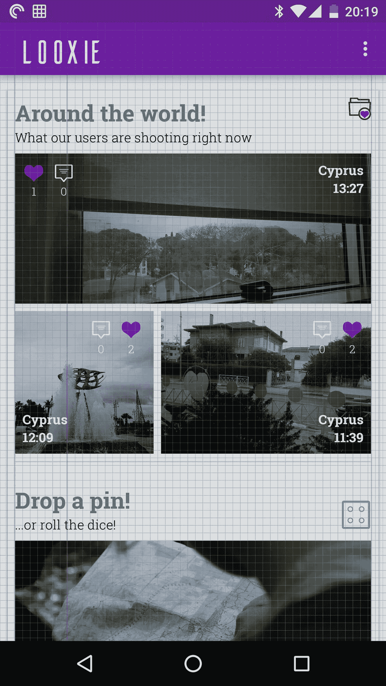

# 让你的安卓应用看起来不那么糟糕。

> 原文：<https://medium.com/hackernoon/make-your-android-app-look-less-shitty-5dd63c4938f1>


These two pilots didn’t read this article. Look where it got them.

## 是的，我在和你说话，开发者

我为你写了这篇文章，你是一个独立的应用开发者，没有设计师来帮助你。你让我想起了年轻时的自己。你和我毕竟没什么不同。

希望这篇文章的标题能让你明白，这五分钟的阅读不会让你成为一名专业设计师。

然而，我希望它能帮助你避免最常犯的与设计相关的罪行，并让你走上让你的应用看起来*好极了*的道路。

因为，让我们面对它:如果你是一个试图做一个应用程序的程序员，一开始你会出错。*真的*错了。为什么要重复我的错误，当你可以简单地阅读这篇文章，我不知道，用你节省的时间漂白你的肛门？

随着与屁股相关的强制判决的结束，让我们继续前进。

## 第一条:使用同一个图标集中的图标

走吧。这并不难。只需选择一个图标包并使用它。不要试图在一个应用程序中使用两个或更多图标包中的元素，除非它们来自同一个设计师，使用相同的风格。

当然，要做到这一点，你必须选择一个包含大量图标的图标包。要做到这一点并节省一些钱，一个简单的方法是使用谷歌的图标包。这些图标使用一致的风格，看起来非常好。

如果你愿意花些钱，我个人最喜欢的(声明:我与设计师没有任何关系。事实上，仅仅基于统计概率，我很确定他们认为我是个混蛋)是 creativemarket.com 的 [Sharpicons](https://creativemarket.com/Dreamstale/389386-Sharpicons-2300-Line-Vector-Icons) 图标。它有很多图标，它们看起来很棒，你可以使用多种格式。事实上你在。svg(可缩放矢量图形)格式意味着您也可以以您想要的分辨率导出它们。

**额外提示**:你是一名开发人员，所以你可能手头没有 Photoshop 或 Illustrator(没关系，我也没有)，这意味着，在谷歌搜索了一会儿之后，你可能会决定使用 [Gimp](https://www.gimp.org/) 或 [Inkscape](https://inkscape.org/en/) 进行搜索。svg 导入和导出。我更喜欢 Gimp，尽管它不是像 Inkscape 那样的矢量绘图程序。在我看来，出口资产的质量似乎更好。

只需拖动。svg 文件放入 Gimp 窗口，选择您希望图标呈现的分辨率，并将图标导出为. png 文件。

***奖励*奖励提示**:使用 Roman Nurik 的 [Android Asset Studio](https://romannurik.github.io/AndroidAssetStudio/) 为各种屏幕密度缩放图标。

我已经提到过 creativemarket.com 是一个购买图标的地方，但是还有很多地方可以买到图标套装。最近，我喜欢上了 [Iconscout](https://iconscout.com/) 。另一个喜欢的是 [PixelBuddha](https://pixelbuddha.net/) 。

## 第 2 项:使用材料设计指定的关键线

也许你从来没有考虑过这个问题，但是使用网格会让你的应用看起来更专业——更像一个统一的整体，而不是分散的文本和图像。

我知道“网格”这个词的声音可能会让你感到恐惧，因为它有明显的设计感。)但这真的很简单:尝试让您的资产很好地适应 8dp 网格(文本为 4dp)。说起来容易做起来难，因为有时你不能控制内容的高度或宽度(例如，在一个包装内容的文本视图中，你不能控制高度)，但至少你的填充和边距是 8dp 的倍数。

想要一个简单的方法来看看你的应用程序是否尊重网格？从 Play Store 下载 [Paul Danyliuk](https://medium.com/u/f50f9029998e?source=post_page-----5dd63c4938f1--------------------------------) 的惊人的 [Material Cue](https://play.google.com/store/apps/details?id=com.actinarium.materialcue) 应用程序，并激活它提供的各种网格中的一个。我通常使用标准网格。这是它在我的应用程序主屏幕上的覆盖图， [Looxie](https://play.google.com/store/apps/details?id=com.saladdressing.looksie)



Not too shabby, if I may say so myself

## 第三条:小心使用颜色

听着，每个人都喜欢颜色。我喜欢颜色，你也喜欢颜色，可能连希特勒也喜欢颜色，尽管最有可能是更浅的雅利安色调。

你知道大家还喜欢什么吗？食物。但是就像你不应该喝鸡汤配巧克力蛋糕面包丁一样(你呢？)，有些颜色最好还是分开。

现在，我不打算对你撒谎:色彩理论及其实践是一个庞大的课题，但这里有一些捷径，你可以采取，使你的生活更容易，尤其是如果你没有一个预先确定的品牌颜色/身份遵循

1.  像[coolors.co](https://coolors.co/)和[http://www.colourlovers.com/](http://www.colourlovers.com/)这样的网站会向你展示现成的调色板，甚至可以根据心情、季节等进行分类。选一个你喜欢的，用那个。
2.  或者，你知道谁创造了惊人的调色板吗？没错，大自然母亲！拍一张激发你灵感的照片，[从中提取调色板](http://www.pictaculous.com/)。如果你正在为冲浪者制作一个应用程序，为什么不拍一张海滩的照片并从*中提取颜色呢？*
3.  最后但同样重要的是，访问[材料设计调色板页面](https://material.io/guidelines/style/color.html)，选择您喜欢的颜色组合。[这个网站](https://www.materialpalette.com/cyan/lime)甚至会在上下文中显示你选择的颜色！

[](https://www.buymeacoffee.com/XozUExS) [## 给安东尼斯·查加利斯买杯咖啡——BuyMeACoffee.com

### 我是一名 Android 开发人员和设计师，热爱漂亮的用户界面！

www.buymeacoffee.com](https://www.buymeacoffee.com/XozUExS) 

## 第四条:做出明智的字体选择

啊，印刷术。爱它或恨它，你必须爱它。

*什么？*

总之。有很多与字体设计相关的网站，但是有一个非常有帮助:字体推荐，更重要的是，字体配对。所以去参观一下 Typewolf 吧。。

为你的应用选择字体时，你应该记住:

1.  确保你不要选择漫画或纸莎草纸，除非你正在创建正式的 Geocities 爱好者客户端。即使那样，也是一种延伸。
2.  好的，如果你在为斯蒂维·旺德制作一个应用程序，你可以使用漫画或纸莎草纸。
3.  不要依赖系统向你的用户显示有品味的字体(因为一些 devilspawn 可能会选择 Comic Sans 或 Papyrus 作为三星设备上的系统字体，只是为了扰乱你)。相反，总是加载你自己的字体:把你的。otf 或者。将 ttf 文件放入你的应用程序的 **assets/** 文件夹(最好放入 **fonts/** 子文件夹以保持整洁),并使用这个奇妙的静态方法加载它们

```
Typeface notComicSans = Typeface.**createFromAsset**(getAssets(), “fonts/notComicSans.otf”);textView.setTypeface(notComicSans);
```

> 好的，如果你在为斯蒂维·旺德制作一个应用程序，你可以使用漫画或纸莎草纸

另一件要记住的事情是:在使用一种字体之前，一定要检查**是否支持你想将你的应用程序本地化的所有语言**。例如，我很难找到支持希腊语的好字体，尽管我最终发现[是一个很棒的字体](https://creativemarket.com/kosbarts/363701-Averta-Standard-Typeface)(同样，没有从属关系)。

谷歌自己的 Roboto 系列字体(Roboto Condensed 和 Roboto Slab 是我个人的最爱)也支持多种语言，看起来很棒。

最后，检查你选择的字体是否有多种粗细可供选择(如细、轻、粗、黑等)。免费字体通常没有很多可用的权重，但是 Roboto 家族有。

如果你喜欢的字体没有很多可用的粗细，但你仍然想使用它，我发现你可以通过对应用程序的各个部分使用不同的阴影和大小的文本来模拟(但不是完全重新创建)不同粗细的效果(例如，对标题使用完全黑色的字体，对副标题使用较浅的灰色字体，可能也是较小的字体)。

那都是乡亲们！去美化你的应用吧！我整个星期都会在这里！

*我可信吗？也许我自己的应用程序看起来像狗屎！也许我是最高级的江湖骗子！你可以在 Play Store 中找到我的应用程序，所以去做自己的决定吧！*

[*Looxie*](https://play.google.com/store/apps/details?id=com.saladdressing.looksie)

[*卡古娜*](https://play.google.com/store/apps/details?id=com.threeeplusplus.karkoona)

[*凯罗斯科普昂*](https://play.google.com/store/apps/details?id=com.saladdressing.ottotest)

[*韦泰龙多*](https://play.google.com/store/apps/details?id=com.saladdressing.veterondo)

[*your book*](https://play.google.com/store/apps/details?id=com.codehousefive.yourbook)*:非常 Beta 版*

[](http://bit.ly/HackernoonFB)[](https://goo.gl/k7XYbx)[](https://goo.gl/4ofytp)

> [黑客中午](http://bit.ly/Hackernoon)是黑客如何开始他们的下午。我们是 [@AMI](http://bit.ly/atAMIatAMI) 家庭的一员。我们现在[接受投稿](http://bit.ly/hackernoonsubmission)并乐意[讨论广告&赞助](mailto:partners@amipublications.com)机会。
> 
> 如果你喜欢这个故事，我们推荐你阅读我们的[最新科技故事](http://bit.ly/hackernoonlatestt)和[趋势科技故事](https://hackernoon.com/trending)。直到下一次，不要把世界的现实想当然！

