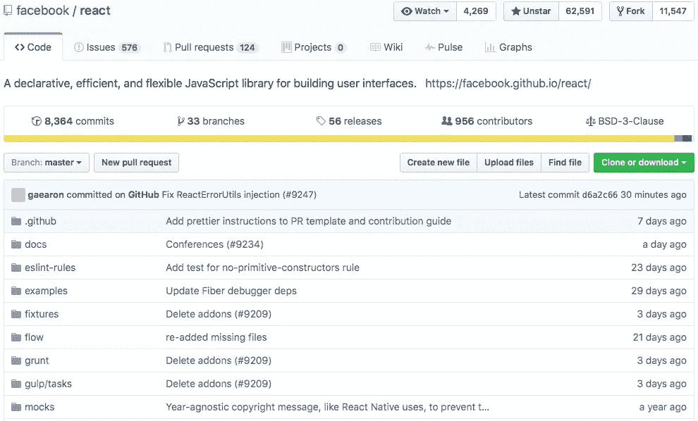
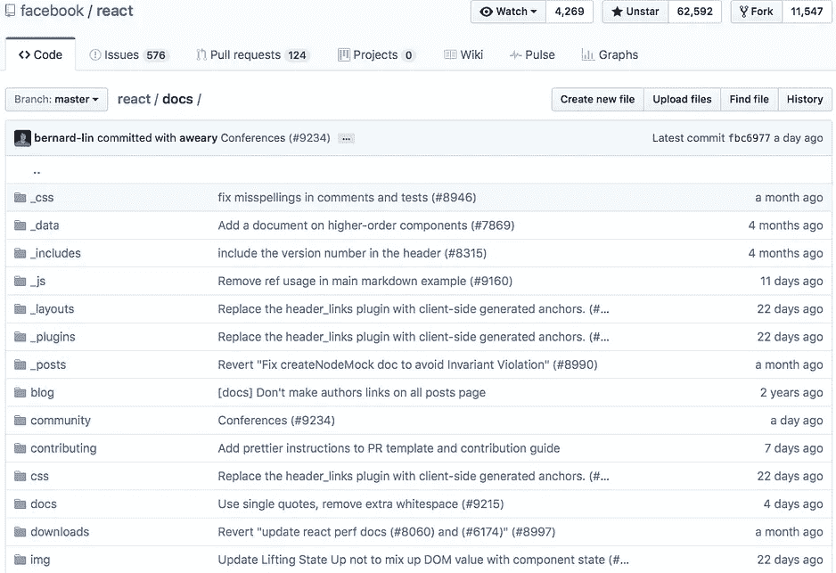

# 让您的应用程序对客户端缓存更加敏感

> 原文：<https://medium.com/hackernoon/make-your-application-more-reactive-with-a-client-side-cache-5d7c264820f>

有一个单页或移动应用程序大量使用“返回上一个列表”吗？用户每次按下“后退”按钮时，您是否都会获取完全相同的数据？

在这种情况下，您可以改善您的应用程序用户体验，同时减轻您的 API。

让我们来看看一些流行的应用程序。

在第一张图片上，你可以看到一个文件和文件夹列表。现在，让我们转到文档，这是第二个图像。当您返回到父文件夹时，第一次执行的相同请求将再次执行，这会使您的应用程序变慢，并占用服务器资源，而它本可以记住数据并立即显示出来，从而为用户提供即时结果。

需要注意的是，如果您更改了数据，或者数据被其他人更改了，并且需要显示这些更改，那么您需要相应地更新您的缓存。Github 就是这种情况。

目前，我的做法是与阿波罗客户端[http://dev.apollodata.com](http://dev.apollodata.com)

> [黑客中午](http://bit.ly/Hackernoon)是黑客如何开始他们的下午。我们是 [@AMI](http://bit.ly/atAMIatAMI) 家庭的一员。我们现在[接受投稿](http://bit.ly/hackernoonsubmission)并乐意[讨论广告&赞助](mailto:partners@amipublications.com)机会。
> 
> 如果你喜欢这个故事，我们推荐你阅读我们的[最新科技故事](http://bit.ly/hackernoonlatestt)和[趋势科技故事](https://hackernoon.com/trending)。直到下一次，不要把世界的现实想当然！

