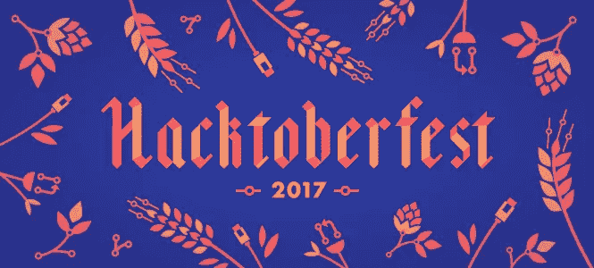

# 通过 Hacktoberfest 做出您的第一个开源贡献

> 原文：<https://medium.com/hackernoon/make-your-first-open-source-contribution-with-hacktoberfest-1460d9028293>

Courtesy: [https://www.pexels.com/photo/grayscale-photo-of-computer-laptop-near-white-notebook-and-ceramic-mug-on-table-169573/](https://www.pexels.com/photo/grayscale-photo-of-computer-laptop-near-white-notebook-and-ceramic-mug-on-table-169573/)

很多时候，热衷于为开源项目做贡献的新程序员由于各种各样的原因最终没有这样做，其中一个突出的原因是他们几乎不知道/不相信他们开始为开源做贡献不需要专家级的编码技能。新的程序员经常忘记一个事实，即使是在 github repo 的文档或 Readme markdown 文件上修复一个打字错误，也会给你的 github 活动增加一个绿色瓷砖——这正式使你进入开源贡献。

如果你从来没有这样做过，也没有跟踪过 github 库或使用过它们——现在是你为开源社区做出贡献的时候了——毕竟，[社区一直都是这样建立和发展的](https://opensource.guide/building-community/)。

Courtesy: [https://hacktoberfest.digitalocean.com/](https://hacktoberfest.digitalocean.com/)

数字海洋与 Github 合作，带来了 Hacktoberfest。

> Hacktoberfest，为期一个月的开源软件庆典。

是的，它确实带有一些奖品(T 恤衫)。但这并不是你应该提交你的[第一拉请求(PR)](http://firstpr.me/#hadley) 的理由。我们生活中发生的许多事情都是因为世界上某个地方的某个人正在做一些开源贡献，这些贡献正在影响我们的生活——无论是在我们的日常工作中，还是通过我们享受的某项服务间接影响。

Courtesy: [http://pyfound.blogspot.in/2017/09/](http://pyfound.blogspot.in/2017/09/)

考虑一下我的情况，我是一家上市公司的全职数据科学家。我的生活中几乎没有一天不使用 ***dplyr*** ，这是我的数据分析最著名的 R 包之一，由[**Hadley Wickham**](http://hadley.nz/)创建。他是数据分析和数据科学领域中许多最常用的 R 包的作者。他创作这些有报酬吗？不，他没有。但是他这么做是因为他想改善他所属的社区。推动他所属的部落前进。

这就是为什么我做出了第一个[开源](https://hackernoon.com/tagged/open-source)贡献，你也应该做出你的第一个开源贡献——它可以是一个在 github 上的 Readme markdown 中简单的错别字修复的 PR，也可以是其他更复杂的东西。但要确保不像我们周围的大多数人那样，我们不只是消费免费信息，而是为之做出贡献，以加强社区，这在许多方面推动我们的日常生活向前发展。

Courtesy: [https://hacktoberfest.digitalocean.com/](https://hacktoberfest.digitalocean.com/)

更多资源:

*   [Github 上的 Hacktoberfest 标签项目](https://github.com/search?q=label:hacktoberfest+state:open+type:issue)
*   [啤酒节——官方网站](https://hacktoberfest.digitalocean.com/)
*   [Hackernoon Opne 源已标记](https://hackernoon.com/tagged/open-source)
*   [初级开发人员首次参与开源的循序渐进指南](https://hackernoon.com/contributing-to-open-source-the-sharks-are-photoshopped-47e22db1ab86)
*   [了解更多关于如何为开源做出贡献的信息](https://opensource.guide/how-to-contribute/)