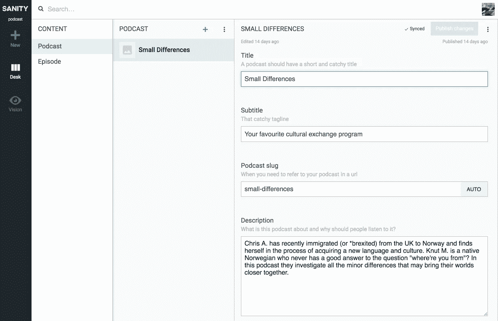
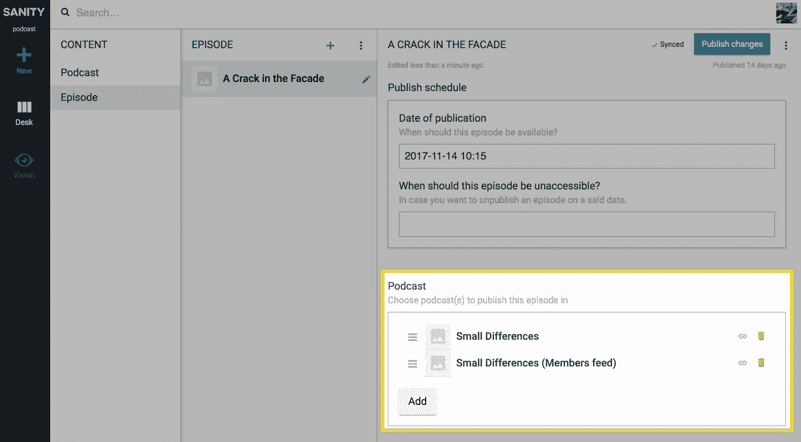
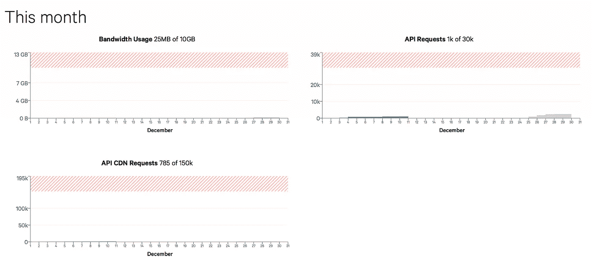
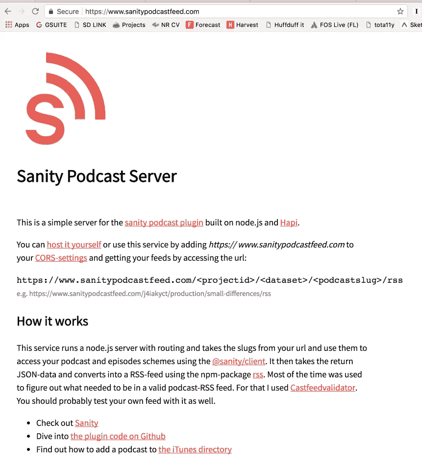

# 打造自己的播客平台！

> 原文：<https://medium.com/hackernoon/make-your-own-podcasting-platform-ab833cf16e1c>

## *在 Sanity CMS 上开始播客的简单步骤*

*TL；博士:运行* `*sanity install podcast*` *并按照*[*www.sanitypodcastfeed.com*](https://www.sanitypodcastfeed.com)上的说明进行操作

[Sanity](https://sanity.io) 是一个完全可定制的无头 [CMS](https://hackernoon.com/tagged/cms) ，如果你知道一些基本的 JavaScript，你可以在两分钟内安装并开始使用。只需运行`npm install -g @sanity/cli && sanity init`即可开始，并遵循这些[指令](https://www.sanity.io/docs/introduction/getting-started)。

为了保持理智，也可以扩展和编写插件。如果您知道 React，您可以在 Content Studio 中创建自己的自定义输入字段或自定义工具。您还可以用现成的字段和内容类型引导内容模型。我之所以知道是因为我最近这样做是为了让理智地主持你自己的播客(是的，是复数)成为可能。只要运行`sanity install podcast`[**播客**](https://hackernoon.com/tagged/podcast)**剧集**就会作为新的内容类型出现在你的工作室里。

Create as many podcasts and episodes as your heart desire

我不确定这是否有意义，但是这个设置也允许你将一集连接到多个播客。也许你想要一个只有付费支持者或类似的独家饲料？现在你可以了！

You can tie an episode to multiple podcasts.

你将理智地保存你的 mp3 文件，并通过 CDNs 在一个相当快的网络上获得它们。你也可以在[健全控制面板](https://manage.sanity.io)中很好地控制带宽的使用。

This on the free tier

然而，单靠健全性并不能真正完成所有的工作，因为它只输出 JSON。如果你做一个网站，Alexa-skill 或者其他东西，这通常是很棒的，但是大多数播客收集者和目录需要 RSS 订阅。所以我也为你做了这个。

你可以去[www.sanitypodcastfeed.com](https://http://www.sanitypodcastfeed.com/)按照那里的简单指示让你的 RSS 源立即可用，或者[如果需要更多的控制和定制，你可以自己派生、托管和调整](https://github.com/kmelve/sanity-podcast-server)它。它只是一个简单的 node.js 服务器，运行哈比神，并将来自 Sanity 的数据转换成 RSS 提要。

*该插件和播客订阅服务仍处于测试阶段。* [*随时让我知道它如何为你工作*](https://github.com/kmelve/sanity-plugin-podcast/issues) *，尤其是如果它不工作！*

Head over to [www.sanitypodcastfeed.com](https://www.sanitypodcastfeed.com)