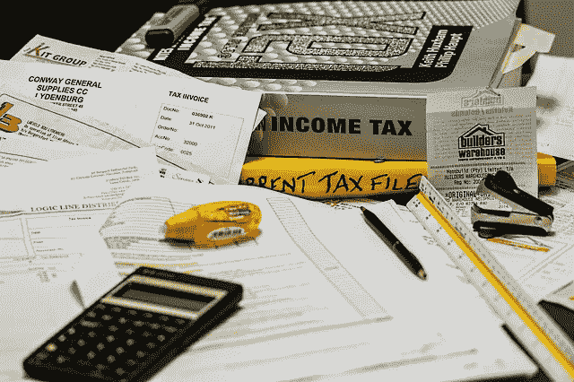

# 立即进行免税交易

> 原文：<https://medium.com/hackernoon/make-your-tax-free-trades-now-37bf9dbb4dbe>

Image courtesy of Pixabay

强制性免责声明:我不是财务或税务顾问，在没有咨询合格的专业人士之前，不应该采纳这些建议。此外，不要投资超过你愿意失去的，先做自己的研究。

你是否是新通过的美国税法的粉丝无关紧要——它将彻底改变美国公民参与加密货币交易的方式。

此前，根据 2017 年税法，大多数加密货币交易所(不是平台，交易加密的行为)都是根据[的 1031 交易所](http://lmgtfy.com/?q=what+is+a+1031+exchange%3F)进行延税的。许多秘密世界的人能够利用不明确和有些争议的税法，只有在他们“套现”成美元时才支付资本利得税。2018 年税法明确规定，这将不再是一个选项。

自 2018 年 1 月 1 日起，任何加密交易都应纳税。实际上，根据我的理解(*显然是 DYOR 并做出你自己的假设*)，事情是这样的:

*   你发一些[decreed](https://medium.com/u/98027bccde8a?source=post_page-----37bf9dbb4dbe--------------------------------)到 [ShapeShift.io](https://medium.com/u/5ee4b8323e7a?source=post_page-----37bf9dbb4dbe--------------------------------) 来换取比特币。这笔交易现在要征税。
*   你在[币安交易所](https://www.binance.com/?ref=10273605)进行交易，用比特币购买一些[涟漪](https://medium.com/u/951c695df315?source=post_page-----37bf9dbb4dbe--------------------------------)。这种交易以及在交易所进行的所有其他交易现在都要征税。
*   你决定利用[原子互换](https://bitcoinmagazine.com/articles/decred-adds-atomic-swap-support-exchange-free-cryptocurrency-trading/)——这也是要征税的。
*   你决定买卖[crypto kitties](https://medium.com/u/c8b1419b5d28?source=post_page-----37bf9dbb4dbe--------------------------------)——这是要征税的。
*   你想在替代币上套现，所以你卖出比特币。如上所述，这是要纳税的。然后，你在比特币基地卖菲亚特。不幸的是，这也是要征税的，这意味着将替代硬币兑换成纸币会导致双重征税。

那么这一切意味着什么呢？从我的角度来看，这感觉像是美国政府试图对所有诚实的人征税。我认为这很可能是因为监管机构没有意识到加密带来的极端好处，特别是对千禧一代而言。

例如，[史蒂文·麦基](https://medium.com/u/88e1f9bb5be0?source=post_page-----37bf9dbb4dbe--------------------------------)的[的故事就是一个引人注目的](https://www.marketwatch.com/story/i-started-from-the-bottom-bitcoin-investor-went-from-poverty-to-launching-a-hedge-fund-2017-12-18)。作为第一代大学生，McKie 有时会不吃饭，将资金投入加密货币投资。现在，他是秘密空间的主要人物。但想想看，如果每笔交易都被征税，作为一名努力读完大学的千禧一代，麦基从最初的收益中获利会有多难？

这项新计划的另一个问题是，像 Shapeshift 这样的公司可能会被征税而不复存在。虽然他们慷慨地不收取服务费，但从 1 月 1 日开始，他们交易所发生的每一笔交易都要缴纳美国资本利得税。对于减轻这一新的负担，变形几乎无能为力。这将需要整个社区的创造力和独创性来想出一种新的(合法的)方法，使较小的加密交易(Shapeshift 支持的那种)足够有利可图，以解决税收问题。

此外，加密交易变得更加复杂。在我们努力使加密成为主流的过程中，这是我们最不需要的。我相信，对我们所有人来说，明智的做法是保留我们使用的每个交易所的所有交易历史的详细日志(是的，这包括 crypto kitties)——如果国税局来敲门，这些日志将是我们合法性的唯一证明。

最后，监管者很可能还没有考虑到这些新限制的后果(欢迎来到国会山)。多亏了 crypto，成百上千的新百万富翁定期涌现。如果他们希望坚持己见，对每笔秘密交易征收资本利得税，将有大量的审计工作要做。这些审计会让纳税人多花多少钱？我不知道(对政府来说)收益是否真的会超过(对纳税人来说)成本。

总而言之，在 12 月 31 日晚上 11 点 59 分之前，你必须在纳税前把你的交易整理好。我的计划是在那之前做我需要的交易，然后像以前从未做过的那样去做。只对运动征税，所以保持双手强壮！

所有的希望都是*而不是*失去的。秘密社区是我曾经参与的最具创新性的部门之一。泰山、丝绸之路和中国的禁令没有阻止我们，天哪，2018 年的税收计划也不会阻止我们。

如果你知道任何在新系统下处理税务的好资源，请在下面的评论里写出来！传播意识是加强我们社区的最佳方式。

如果你还没有投资比特币，而你想加入这场运动，最简单的方法就是从比特币基地开始。 ***当您*** [***使用此链接***](https://www.coinbase.com/join/589a032d2c1f1600ed8731e2)*——这是我的推荐链接——立即开始吧！*

*如果你想开始使用交易所而不是比特币基地，* [***币安是一个很好的起点。在这里报名***](https://www.binance.com/?ref=10273605) *！*