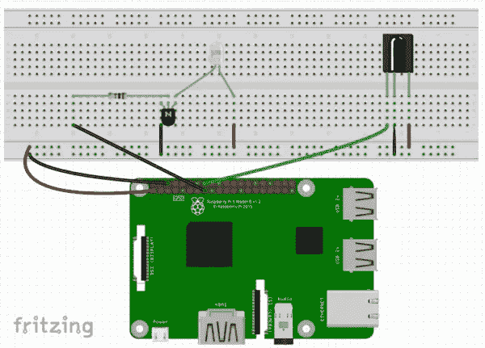
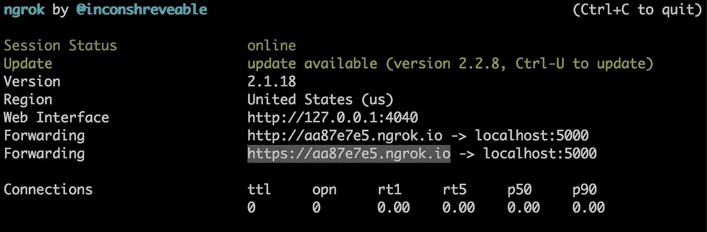
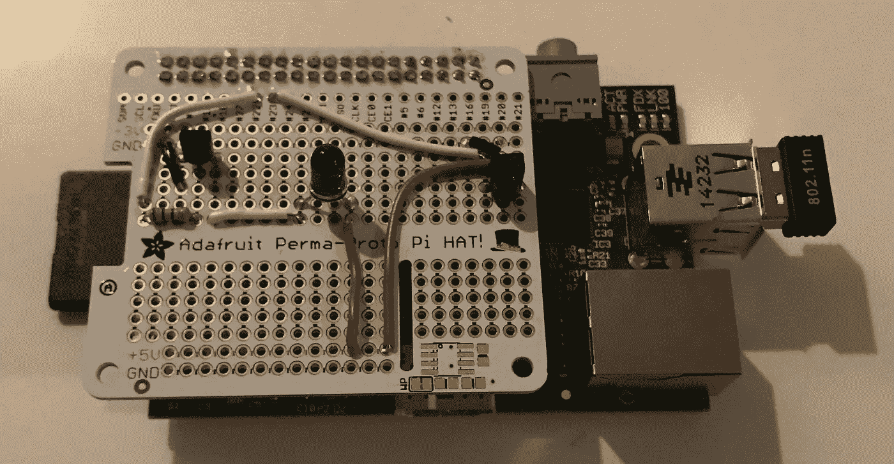

# 通过亚马逊 Alexa 和 Raspberry Pi 控制任何电视语音

> 原文：<https://medium.com/hackernoon/make-your-tv-voice-controlled-through-amazon-alexa-and-raspberry-pi-a6373b7cf871>

Turn TV on

如果你像我一样，有时找不到你的电视遥控器，你希望你可以要求你的回声关闭，打开电视，改变输入源，或增加音量。不幸的是，大多数电视都没有打包的 Alexa 技能来做这些事情；最重要的是，大多数电视都没有 API 端点来控制这些功能，从而更容易地建立自定义技能。所以，我走了很长的路来让我的电视语音控制:使用树莓 Pi 建立一个互联网连接的电视遥控器，并创建一个 Alexa 技能来与之通信。好消息是，这种方法适用于任何电视——智能电视、旧电视、新电视、哑电视。

在本教程中，我们将创建一个 Alexa 技能和伴随的 Raspberry Pi 硬件和软件，它将打开和关闭电视。本教程假设对 Raspberry Pi、Alexa 技能和 Python 有基本的了解。完成后，您可以进一步进行设置和试验，添加更多功能，如更改频道、信号源和音量。有关这些功能的工作示例，请参见[Github repo](https://github.com/tylernappy/alexa-tv-remote)。

# 这一切最终将如何进行

1.  用户说，“Alexa，让电视更新。”
2.  Alexa 回答，“电视应该如何更新？”
3.  用户回答，“打开电视。”
4.  Alexa 回答，“打开电视。”
5.  Raspberry Pi 收到命令，使红外 LED 闪烁，以执行相应的操作，从而打开电视。

# 成分

本教程假设您的 Raspberry Pi 上安装了以下硬件、软件和帐户:

## 五金器具

*   1 [Alexa 设备](https://www.amazon.com/gp/product/B06XCM9LJ4/ref=as_li_tl?ie=UTF8&tag=hack12-20&camp=1789&creative=9325&linkCode=as2&creativeASIN=B06XCM9LJ4&linkId=6535e106d4a267097c892aec0ffec6b0)(例如 Echo)
*   1 [带互联网连接的树莓派](https://www.amazon.com/gp/product/B01CD5VC92/ref=as_li_tl?ie=UTF8&tag=hack12-20&camp=1789&creative=9325&linkCode=as2&creativeASIN=B01CD5VC92&linkId=3d4f547e18ebf15cb301cb4157ad69a9)
*   1 [红外发光二极管](https://www.amazon.com/gp/product/B01HGIQ8NG/ref=as_li_tl?ie=UTF8&tag=hack12-20&camp=1789&creative=9325&linkCode=as2&creativeASIN=B01HGIQ8NG&linkId=24cc577697376b638094032aeaab6146)
*   1 [红外接收器](https://www.amazon.com/gp/product/B01HGIQ8NG/ref=as_li_tl?ie=UTF8&tag=hack12-20&camp=1789&creative=9325&linkCode=as2&creativeASIN=B01HGIQ8NG&linkId=24cc577697376b638094032aeaab6146)
*   1 [PN2222 晶体管](https://www.amazon.com/gp/product/B06XSFNYFP/ref=as_li_tl?ie=UTF8&tag=hack12-20&camp=1789&creative=9325&linkCode=as2&creativeASIN=B06XSFNYFP&linkId=fcae7622babe9344bcfa1c70f57639f3)
*   1[220ω电阻](https://www.amazon.com/gp/product/B072BL2VX1/ref=as_li_tl?ie=UTF8&tag=hack12-20&camp=1789&creative=9325&linkCode=as2&creativeASIN=B072BL2VX1&linkId=c3a6e58b307abda6ddacc07243fe68e7)

## 软件

*   Python 2.7
*   [烧瓶-问](https://github.com/johnwheeler/flask-ask)
*   [LIRC](http://www.lirc.org/)
*   [ngrok](https://ngrok.com/)

## 帐目

*   [亚马逊开发者](https://developer.amazon.com/home.html)

# 树莓 Pi 布线

*   引脚 22 连接到晶体管
*   针脚 23 连接到红外接收器



Wiring diagram for Raspberry Pi, IR LED, IR receiver, and transistor

# LIRC 构型

“LIRC 是一个软件包，可以让你解码和发送许多(但不是全部)常用遥控器的红外信号。”，根据他们的[官网](http://www.lirc.org/)。

## 为树莓 Pi 配置 LIRC

在您的 Raspberry Pi 上，运行以下命令来安装 LIRC:

```
sudo apt-get install lirc
```

通过运行以下命令并添加以下内容，将 LIRC 添加到/etc/modules 文件中:

```
sudo /etc/modules## /etc/modules
lirc_dev
lirc_rpi gpio_in_pin=23 gpio_out_pin=22
```

通过运行以下命令并添加以下内容来更改/etc/lirc/hardware.conf 文件:

```
sudo nano /etc/lirc/hardware.conf## /etc/lirc/hardware.conf
#
# Arguments which will be used when launching lircd
LIRCD_ARGS="--uinput"
# Don't start lircmd even if there seems to be a good config file
# START_LIRCMD=false
# Don't start irexec, even if a good config file seems to exist.
# START_IREXEC=false
# Try to load appropriate kernel modules
LOAD_MODULES=true
# Run "lircd --driver=help" for a list of supported drivers.
DRIVER="default"
# usually /dev/lirc0 is the correct setting for systems using udev
DEVICE="/dev/lirc0"
MODULES="lirc_rpi"
# Default configuration files for your hardware if any
LIRCD_CONF=""
LIRCMD_CONF=""
```

通过运行以下命令并添加以下内容来更改/boot/config.txt 文件:

```
sudo nano /boot/config.txt## /boot/config.txt 
dtoverlay=lirc-rpi,gpio_in_pin=23,gpio_out_pin=22
```

现在，重新启动 LIRC，使其能够接受这些更改:

```
sudo /etc/init.d/lirc stop
sudo /etc/init.d/lirc start
```

## 为您的特定遥控器配置 LIRC

这一步将配置 LIRC 以正确的节奏闪烁红外 LED，模仿遥控器发出的命令。这一步需要一点时间，并涉及到许多指向和点击红外接收器。只要按照 LIRC 在终端给出的指示。

```
# Stop LIRC
sudo /etc/init.d/lirc stop
# Create new recording in config file ~/lircd.conf
# This will take your through a series of steps to follow
# Make sure you add the power button and name it 'KEY_POWER'
irrecord -d /dev/lirc0 ~/lircd.conf
# Move the created config file to the folder where LIRC looks for the config files
sudo cp ~/lircd.conf /etc/lirc/lircd.conf
# Start LIRC
sudo /etc/init.d/lirc start
```

# 树莓 Pi 文件

我们的主文件 index.py 将控制我们的 Alexa 技能，并告诉 LIRC 对给定的命令(将是“KEY_POWER”)闪烁 LED。

## 索引. py

```
## index.pyimport osimport json
from pprint import pprintfrom flask import Flask
from flask_ask import Ask, statement, question, sessionapp = Flask(__name__)
ask = Ask(app, '/')lirc_file_conf = '~/lircd.conf'
power_button_command = 'KEY_POWER'[@ask](http://twitter.com/ask).launch
def start_skill():
    welcome_message = 'How should the t.v. update?'
    return question(welcome_message)[@ask](http://twitter.com/ask).intent('ChangePowerIntent')
def change_power(power_value):
    # Tell LIRC to send IR LED blink pattern to turn TV on/off
    os.system('irsend SEND_ONCE {} {}'.format(lirc_file_conf, power_button_command)) text = 'Turning the t.v. {}'.format(power_value)
    return statement(text)if __name__ == '__main__':
    app.run(debug=True)
```

通过从终端运行以下命令来运行该文件:

```
sudo python index.py
```

## ngrok

转到 Raspberry Pi 上有 [ngrok](https://ngrok.com/) 的地方，运行下面的命令打开一个到 index.py 文件的本地隧道

```
./ngrok http 5000
```

复制它创建的 URL(我们将在下一步中使用它，当我们告诉我们的 Alexa 在哪里通过 HTTPS 找到它的技能)。



# 亚马逊 Alexa 技能仪表板

前往[亚马逊开发者仪表板](https://developer.amazon.com/home.html)并登录。在 Alexa 下，点击“Alexa 技能工具包”，然后点击“开始使用>”。


点击右上角的“添加新技能”。


在“技能信息”选项卡中，要注意的字段是“调用名称”。这是用户在开始学习技能时会说的一句话。让它变成这样:

```
the t.v. to update
```

这样你就会对 Alexa 说:“Alexa，让电视更新一下。”

在“交互模型”选项卡中，在“意图模式”中添加以下内容，以便 Alexa 知道 index.py 文件中的什么功能对应于您可以告诉它的什么动作和什么值(这将在下一步中编程):

```
{
  "intents": [
    {
      "slots": [
        {
          "name": "power_value",
          "type": "LIST_OF_POWERS"
        }
      ],
      "intent": "ChangePowerIntent"
    }
  ]
}
```

在“自定义插槽类型”中创建一个自定义插槽，将其命名为 LIST_OF_POWERS，并向其中添加以下内容:

```
on
off
```

这样，Alexa 知道你只能告诉它“开”或“关”。

在“示例话语”中，添加以下内容，以便 Alexa 知道要响应什么命令:

```
ChangePowerIntent turn the t.v. {power_value}
```

在“配置”选项卡中，将端点更改为“HTTPS ”,并添加“默认”URL，该 URL 由 ngrok 后跟一个反斜杠组成。


这基本上是告诉 Alexa 查看[https://aa 87 e 7 e 5 . n grok . io](https://aa87e7e5.ngrok.io)/endpoint 以获取其技能的所有信息。

拯救一切。

# 试试吧！

如果一切按计划进行，问 Alexa，“Alexa，让电视更新。”她会回应“电视应该怎么更新？”你会说，“打开电视。”然后，您的电视应该可以令人满意地打开了。



All soldered together

# 离别笔记

要添加更多的功能，如调高、调低音量、更换频道、更换信号源、静音，可以尝试 LIRC 必须执行的一系列命令来完成特定的动作。这可以包括浏览菜单、按下“Ok”按钮等。使用 Python 的[“时间”库](https://docs.python.org/2/library/time.html)在“按键”之间暂停。

# 源代码

对于这个项目的完整源代码(更多功能)，见[这个 Github repo](https://github.com/tylernappy/alexa-tv-remote) 。

Increase volume

Change source

Turn TV off