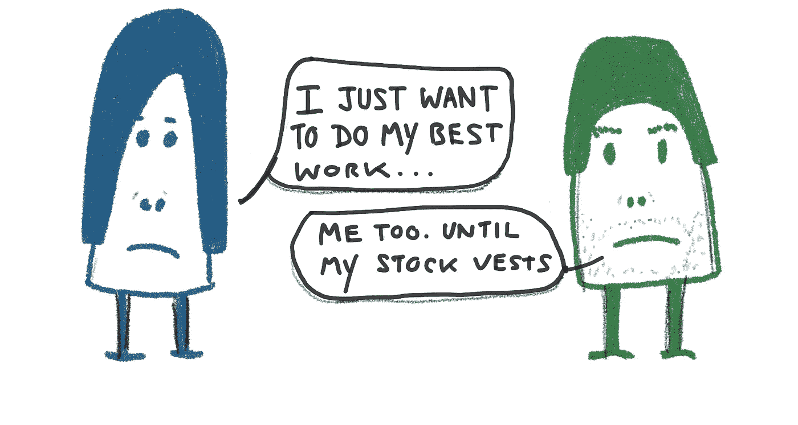

# 创造者焦虑——工作骗子和行善者

> 原文：<https://medium.com/hackernoon/maker-angst-job-flippers-and-do-gooders-467368aad888>

## 创客焦虑

一段时间以来，我一直在 Twitter 上观察一些事情。我称之为制造者焦虑。当我发布某些类型的内容时，我开始注意到它。例如:

或者我的一幅画…

任何暗示一致性、更扁平的组织、真正的工作、信任、透明度和工艺的推文都会得到我的 Twitter 受众和他们的受众(尽管是自我选择、自然过滤的受众)的回应。但这让我很好奇。

所以我们有*这些“明白”的人*。有一种明显的焦虑——人们觉得缺少了什么——但这是怎么回事呢？

## (几乎)不可避免的腐败

头脑风暴…

为了运营和*成长*，技术需要制造者、黑客、工匠、设计师、建筑者、修补者、难题制造者和科学家。让我们称这个多元化的群体为*问题解决者*。

问题解决者渴望挑战、动力、帮助他人的机会(使用他们的技能)、证明“它在工作”、解决问题的自主性以及成长的机会。他们也有一种不可思议的本领来嗅出缺乏一致性:空洞的文化价值观、拖拉、惰性的丧失、偏爱、成功的戏剧和“仅仅因为”主义。

不幸的是……除了极少数情况，大多数科技公司(尤其是那些决意快速发展的公司)都在走向死亡……有些比其他公司更优雅。他们可能在成长，可能赚了数十亿美元，但内心却在腐烂。你能感觉到流沙。人们很容易认为这是恶意的，但这主要是纯粹的组织物理学。快速增长=加速腐烂。熵是一个残酷的情妇。

解决问题的人感觉到了我们骨子里的腐败，这很糟糕。我们希望相信技术的力量，以及我们相关工艺的潜力。我们愿意相信工艺和商业是兼容的。我们希望相信，专注于要解决的问题——满意的客户、有用的设计或有弹性的组织——最终会胜出。但是，熵是一个残酷的情妇。

## 争取时间

根据你的角色，你可能会远离这种漂移。钱当然有帮助。我认识一些软件开发人员，他们通过用一些性感的新技术投入到一个大的绿地重写中，为自己赢得了几年时间(和几年的授权期)。组织经常为了这个目的开展有趣的研究项目。

设计师朋友，如果他们幸运的话，可以赶上品牌重塑或设计系统的浪潮，并乘着这股浪潮上岸一两年。对于产品经理来说，这并不容易。你坐在组织的“枢纽”上。当熵增加时，你会第一个感受到潮流的转变。

在某些时候，现实通常会赶上我们。你不能躲在问题中，也不能再突出自己。那我们该怎么办？

## 能修好吗？

自然地，问题解决者想要帮助*解决问题*！为什么事情需要这么不理智？为什么我们不能把事情搞清楚？为什么事情越来越糟糕了？为什么管理这么保守有毒？为什么公司看不到所有这些过程的疯狂、缺乏重点和仓促决策？因此，有一段时间，我们可能试图解决“问题”，或者至少召集人们来定义“问题”。

没那么快！很难完全理解的是巨大的惯性在起作用。你可以将大多数事情归结为公司是如何获得资金的，早期的合作伙伴，早期的领导者，早期的产品决策，运气，以及组织结构图的形状。一个很好的例子是增长轨迹。为了满足他们的估值，公司试图以一定的速度增长。这些估值是基于核心增长机会的假设。一家已经筹集了 60，000，000 美元的公司不可能成为 Basecamp(凭借其极高的员工保留率和深思熟虑的基于工艺的方法)…永远不可能。接受资助的决定将指导今后的所有决定。

长话短说，解决问题的努力可能会遇到[拉尔曼的组织行为法则](http://www.craiglarman.com/wiki/index.php?title=Larman%27s_Laws_of_Organizational_Behavior)。

是的，一些公司彻底改造了自己，并戏剧性地改变了路线。然而，在没有面临濒死威胁的情况下，这种情况有多常见？即使当*真的发生*，需要多长时间？3-5 年？职业生涯的八分之一？你会留下来吗？有些是。许多人不知道。钱在下一个地方更好。

## 自我反省

所有这些都导致了制造者的焦虑……这种感觉就是在我们的工作和工艺中(以及在我们目前的工作中)有更多的可能性，但是在目前的工作中更多的*可能是不可能的。它还会导致愤世嫉俗和听天由命的现象令人生畏(“我想所有的公司都是这样工作的”)，这是一件令人难以置信的悲伤的事情。*

这可不好。这真的需要一些自我反省。像这样的问题…

*   为了加薪去经受折磨值得吗？
*   我的公司真的关心我和我的成长吗？
*   我能找到一个更理智、更道德、更以人为本的工作场所吗？
*   我能开一家公司——甚至是一家生活方式公司——更符合我的价值观，让我实践我的手艺吗？如果我们从来没有超过 60 人，那又怎么样？
*   为了保持新鲜感和趣味性，我可能不介意跳槽吗？我自己是一个产品/企业吗？
*   是时候成为一名经理/执行官了吗，在那里我也许(仅仅是也许)能够真正影响系统的本质？
*   政府、教育和卫生领域是否存在可以从我的关注中受益的大问题？
*   我能做一些对当地有实际影响的事情吗？

在这里，我承认我没有答案。我不知道。

## 心脏和大脑

我们负担不起几代精疲力竭、愤世嫉俗的问题解决者。我们也不能让有才能的问题解决者戴上耳机，退回到他们组织的内部，远离他们正在创造的影响。算法“管用”，但有什么影响？

我认识的大多数创客都有一颗*心和一颗*脑。他们不是机器人。他们想要更多！那么我们该怎么办呢？我们将如何创建更多值得坚持的组织？或者答案是成为一体的公司，并适应这一现实？你怎么想呢?你知道一个似乎准备好经受时间考验的道德组织吗？他们在招人吗？

综上所述，我认为创客部落是真正关心的。我很感激认识那些深深关心他们的手艺和技术潜力的人。

好了，时间到了(我正在努力坚持写作的时间框架，我会在以后的文章中继续这样做)。