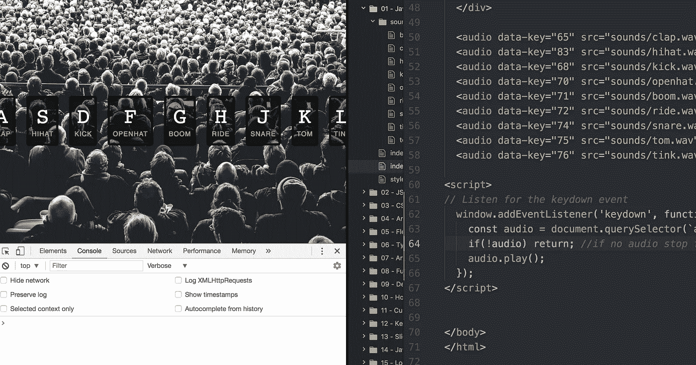

# 创客学院日 29

> 原文：<https://medium.com/hackernoon/makers-academy-day-29-f14b0778fe02>

Javascript 30 Drum Kit task

本周我们已经开始[学习](https://hackernoon.com/tagged/learning) [Javascript](https://hackernoon.com/tagged/javascript) 。熟悉了 Ruby 之后，回到完全初学者的状态，再一次与基础知识斗争，感觉很奇怪。至少周一早上我是这么想的。我现在意识到，我在创客学院学到的所有技能给了我一个出色的工具带，可以快速跟踪我的学习。我可能正在学习一门新的语言，但是我现在的角度和两个月前完全不同。

起初，用一门语言“重新开始”的前景令人生畏，后来又令人沮丧。然而，就像我在创客公司的全部时间一样，我一直在努力迎接挑战，而不是害怕挑战。我不再担心我不知道很多事情，而是努力享受我有机会学习新东西的事实。

Aaron — [https://uk.pinterest.com/explore/aaron-swartz/](https://uk.pinterest.com/explore/aaron-swartz/)

最近，我重读了艾伦·施瓦茨的博客，发现它给了我无穷的灵感。我特别喜欢[这篇关于如何更有效率的文章](http://www.aaronsw.com/weblog/productivity)。有很多关于分解问题的实用建议，也有一些更全面的观点。比如这一段:

> 生命是短暂的(至少有人这么告诉我)，所以为什么要浪费它去做一些蠢事呢？开始做某件事很容易，因为它很方便，但你应该一直质疑自己。你还有什么更重要的事情可以做吗？你为什么不这样做呢？— [*Aaron Swarzt，HOWTO:更高效*](http://www.aaronsw.com/weblog/productivity)

在创客，我每天都在接受挑战和学习，我做的不是简单或方便的事情。虽然被挑战有时会令人沮丧，但总体来说是令人振奋的。今天我想提醒自己学习新事物的兴奋感。本着这种精神，我开始了为期 30 天的普通 Javascript 编码挑战。在意识到实际上我想好奇并探索一种完全不同的学习方式之前，我权衡了进一步研究 Makers 课程材料的工作。

我没有失望。当我在早上 7 点 30 分打开笔记本电脑开始编码时，迎接我的是重金属音乐和韦斯·博斯的击掌声，然后带我进行了一次高能的 Javascript 练习，制作了一套架子鼓。20 分钟后，我带走的最有价值的东西是一种享受旅程的新感觉，而不是对学习基础知识感到沉重。相反，亚伦和韦斯提醒我，第一次尝试新事物是多么酷。把我的学习混在一起是一个令人耳目一新的举动，帮助我以积极的心态开始新的一周；拥抱挑战而不是害怕挑战。

感谢我的导师[尤金妮亚·格雷罗](https://medium.com/u/b1c8785ba580?source=post_page-----f14b0778fe02--------------------------------)建议我尝试 [Javascript 30](https://javascript30.com/) 。