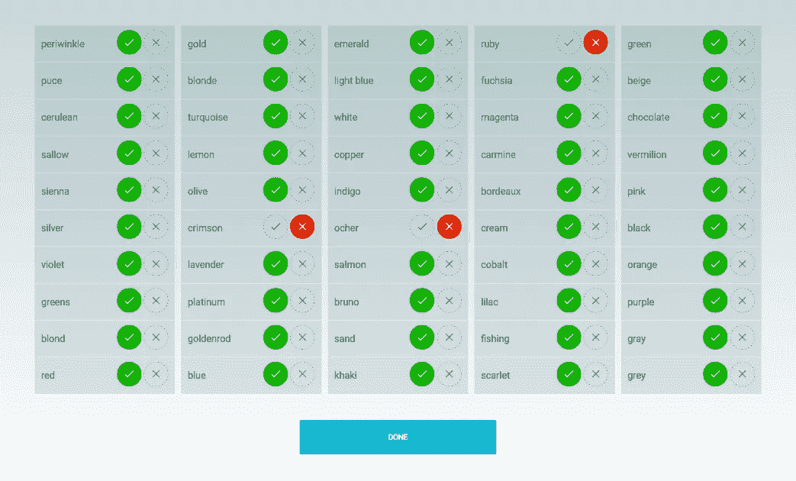
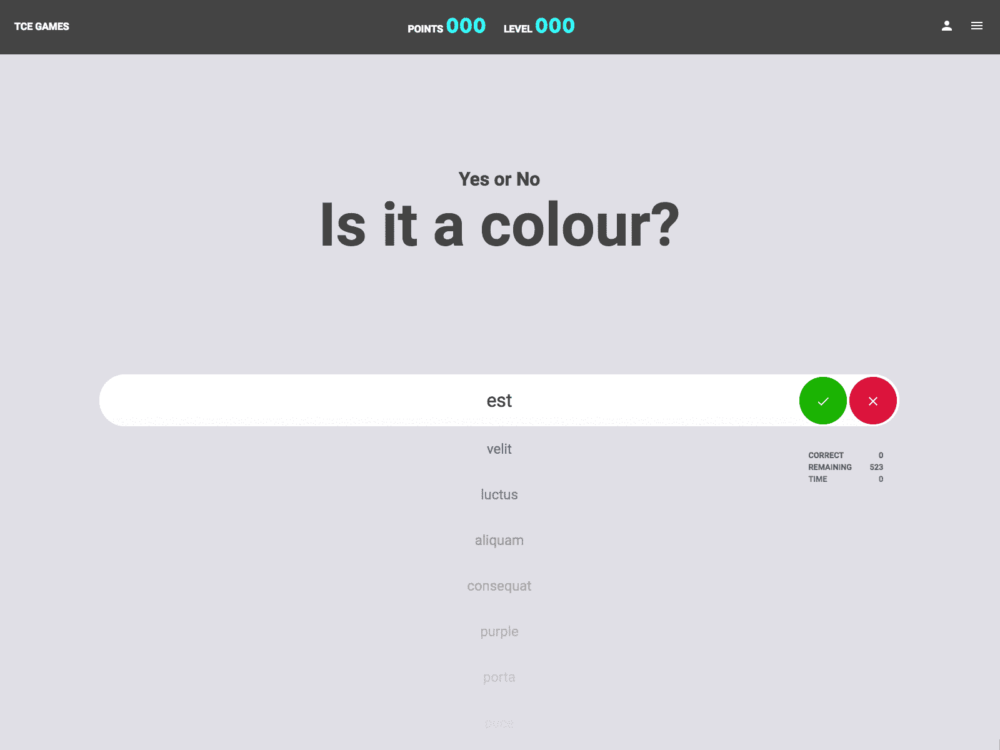
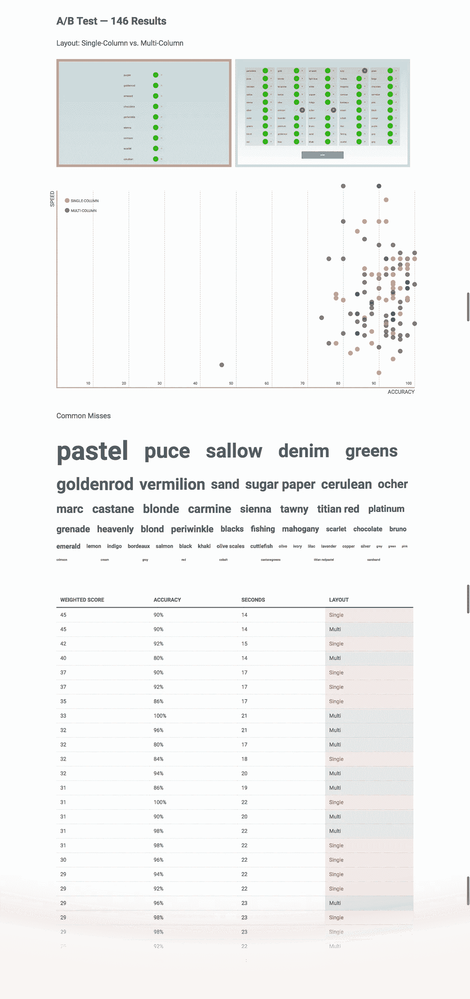

# 哪个界面在速度和准确性上“最好”？

> 原文：<https://medium.com/hackernoon/makin-faces-a-design-sprint-to-test-layouts-for-efficiency-ae85750c41b1>

## 我们目前的设计冲刺着眼于改进我们如何将语言添加到我们的文本分类系统中。

One of the final layouts we tested.

An early HTML wireframe that was DOA.

## 一些背景

翻译、l33t 说话和其他细微差别使得机器无法完成所有工作。人工验证确保了高水平的准确性，尽管这通常是一个缓慢而艰巨的过程。

一个小的(但重要的)起点是查看单词的分组是否不准确。例如，我们可以从一种新语言中提取一组翻译，并将其与一种已建立的语言进行比较。我们让机器做出一些假设，即我们可以假设的大多数单词都是“正确的”，并让人类审查这些假设。

# 验证单词列表的合适 UI 是什么？速度和准确度的平衡点在哪里？

## 思维能力

使用一组西班牙语的颜色词，通过谷歌翻译，我们原型化了我们的想法。经过一些交谈和草图，我们有了一些很好的见解，并有能力做出一些早期的决定。

## A/B 测试布局

经过一些最初的 HTML 线框，我们在两个不同的布局着陆。我们想看看**哪一个在速度和准确性上最优**。速度是一个人每秒可以“验证”多少个单词。准确性是指他们正确验证了多少单词。

抛开语言的复杂性不谈，下面是我们对第一个界面概念的了解。*虽然，常见的漏词模式激发了一些伟大的新想法。*

[但是首先……请花点时间——你能在 30 秒内获得 90%或更高的分数吗？](https://jessekorzan.github.io/qUizList/)

*测试用户:内部员工和设计师新闻、Dribbble 和黑客新闻上的发帖链接。*

The final test variants and current results.

[查看现场记分牌。](https://jessekorzan.github.io/qUizList/scoreboard/)

免费代码:[挖通回购](https://github.com/jessekorzan/qUizList)。

## 下一步我们应该做什么？还是与众不同？

非常感谢任何有助于我们的反馈或建议。

> [黑客中午](http://bit.ly/Hackernoon)是黑客如何开始他们的下午。我们是阿妹家庭的一员。我们现在[接受投稿](http://bit.ly/hackernoonsubmission)并乐意[讨论广告&赞助](mailto:partners@amipublications.com)的机会。
> 
> 如果你喜欢这个故事，我们推荐你阅读我们的[最新科技故事](http://bit.ly/hackernoonlatestt)和[趋势科技故事](https://hackernoon.com/trending)。直到下一次，不要把世界的现实想当然！

