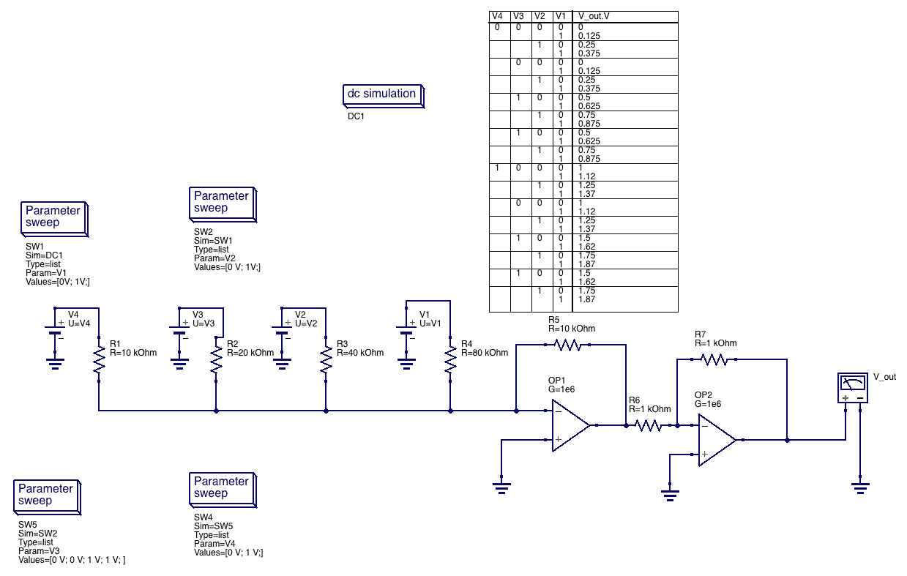

# 用运算放大器制作 DAC

> 原文：<https://medium.com/hackernoon/making-a-dac-from-an-op-amp-8960c3addc28>

带有运算放大器的数模(DAC)转换器

今天在我的线性电路 2 课上，我学习了用运算放大器制作 4 位 DAC。我假设读者知道[运算放大器](https://hackernoon.com/tagged/op-amps)(到目前为止，我的最佳定义是在电路中进行数学运算的能力:积分、导数等。)

模拟信号，例如音频，是时变的，而数字信号是离散的(计算机处理的东西)。因此，能够从数字信号转换到模拟信号以及反向转换非常重要。

例如，您希望您的计算机处理一些声音，然后将其输出到扬声器，并对信号进行一些转换。您的计算机程序需要一个 ADC 来处理数据，然后您希望使用 DAC 将转换后的信号从扬声器发回。

下面是一个 4 位 DAC，模拟显示 Vout 模拟信号的数字版本[V4、V3、V2、V1]。

编辑:在我的 [github](https://github.com/marclave/4bitDACwithOpAmp) 上增加了模拟

> [黑客中午](http://bit.ly/Hackernoon)是黑客如何开始他们的下午。我们是 [@AMI](http://bit.ly/atAMIatAMI) 家庭的一员。我们现在[接受投稿](http://bit.ly/hackernoonsubmission)并乐意[讨论广告&赞助](mailto:partners@amipublications.com)机会。
> 
> 如果你喜欢这个故事，我们推荐你阅读我们的[最新科技故事](http://bit.ly/hackernoonlatestt)和[趋势科技故事](https://hackernoon.com/trending)。直到下一次，不要把世界的现实想当然！

