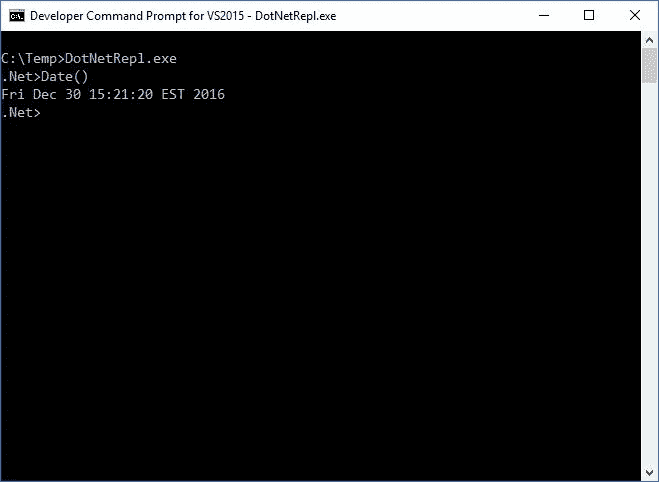

# 制作一个. Net REPL

> 原文：<https://medium.com/hackernoon/making-a-net-repl-57ca5c465081>

我第一次接触电脑是在大学，当时我在一家当地政府机构实习。那是在一台旧的康柏 386 上，而“[编程](https://hackernoon.com/tagged/programming)环境”是 dBase III。我输入的那一刻…

```
*use database
browse*
```

我完全被迷住了。在一个完全交互式的环境中，只需几个命令就能创建、浏览和操作数据，这是多么简单和多才多艺，让我大吃一惊。我喜欢认为我在 dBase 和后来的 FoxPro 的基础上建立了成功的职业生涯。

我用 FoxPro 已经很久了，但我从未失去对 REPl(read-eval-print-loop)的热爱。能够进入像 SQL、Linux 命令提示符或浏览器 [JavaScript](https://hackernoon.com/tagged/javascript) 控制台这样的交互式环境，让我感觉自己拥有了计算超能力。对我来说，我还没有找到一个编程工具或开发环境，允许我像一个交互式 REPL 一样用代码表达或演示想法。

随着最近对机器人和“对话计算”的兴趣和进步，我认为我们即将进入 REPL 的新黄金时代。也就是说，我将写一系列文章来展示从头创建一个有用的 REPL 是多么容易。第一个例子集中在微软。Net 编程环境。在我开始之前，我知道许多读者会指出大量非常好和有用的. REPLs。我知道其中的大多数，这个例子并不意味着这些 REPLs 不适合您自己的任务。这篇文章和后续文章的目的是采用“极简主义”的方法，这样你就可以创建一些功能性的东西，而不依赖于一堆外部依赖。

让我们开始吧…下面是完整的代码:

```
//let's add a few useful namespaces
import System;
import System.IO;
import System.Net;
import System.Web;
import System.Data;
import System.Xml;
import System.Windows.Forms;//create a global object/propertybag
var $={};while(true) {
   Console.Write('.Net>');
   try {
        Console.WriteLine(eval(Console.ReadLine()));
   }
   catch(e) {
        Console.WriteLine(e);
   }
}
```

将这段代码保存在一个文本文件中，例如 dotnetrepl.js

为了编译代码，我们将利用。Net 框架 javascript 编译器。这个编译器(jsc.exe)驻留在。Net Framework 目录。在我的机器上，这是

```
C:\Windows\Microsoft.NET\Framework64\v4.0.30319\jsc.exe
```

要编译 REPL，请打开 dotnetrepl.js 所在位置的命令提示符并键入:

```
C:\Windows\Microsoft.NET\Framework64\v4.0.30319\jsc.exe dotnetrepl.js
```

这将在你的目录中创建一个 dotnetrepl.exe，这样你就可以开始使用你的新 REPL 了。



REPL 使用 Javascript 语法，但您可以访问任何。Net 框架类。这里有几个例子:


我准备了一个简短的视频来说明其他几个例子:

希望这个快速介绍对你有用。在随后的文章中，我将构建一系列简单而有用的 REPL，您可以将其作为自己计算发现的起点。

[](http://bit.ly/HackernoonFB)[](https://goo.gl/k7XYbx)[](https://goo.gl/4ofytp)

> [黑客中午](http://bit.ly/Hackernoon)是黑客如何开始他们的下午。我们是 [@AMI](http://bit.ly/atAMIatAMI) 家庭的一员。我们现在[接受投稿](http://bit.ly/hackernoonsubmission)，并乐意[讨论广告&赞助](mailto:partners@amipublications.com)机会。
> 
> 如果你喜欢这个故事，我们推荐你阅读我们的[最新科技故事](http://bit.ly/hackernoonlatestt)和[趋势科技故事](https://hackernoon.com/trending)。直到下一次，不要把世界的现实想当然！

