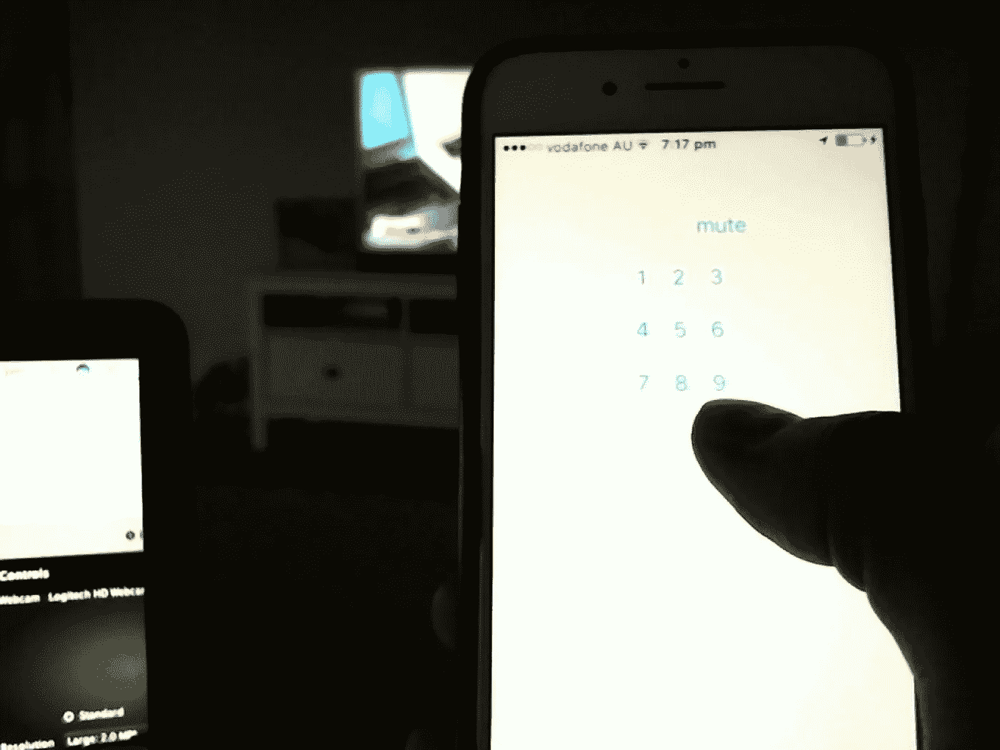
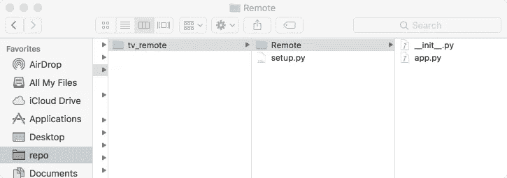
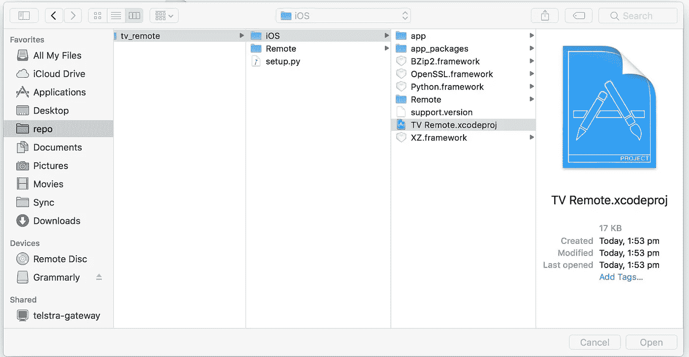
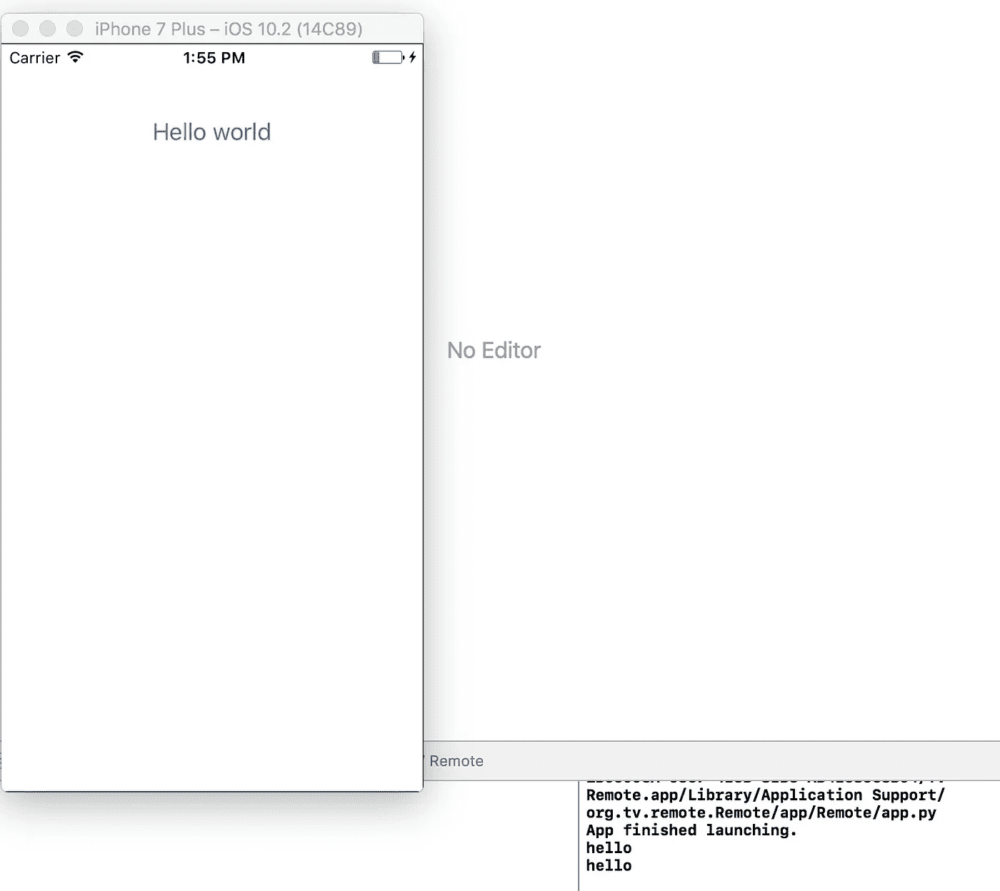
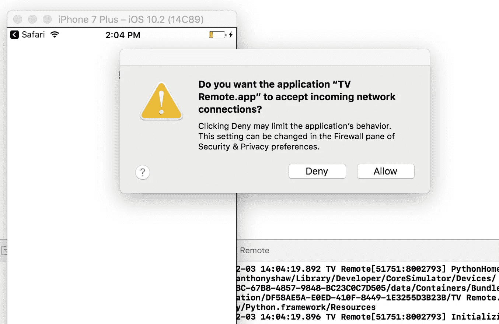
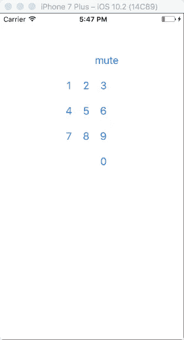

# 用 Python 制作电视遥控器

> 原文：<https://medium.com/hackernoon/making-a-tv-remote-in-python-ef1dd5409524>

在过去的一年里，我听到了很多关于 Python 的 [BeeWare](http://pybee.org/) 项目的好消息。当你想到移动应用程序开发时，你肯定不会想到 Python，但它是一种语言，并且有工具可以将其编译/转换为 iOS、Android 和 Windows 上的本机代码。

在本教程中，我将展示如何为 iPhone 上的松下维耶拉电视制作一个基本的电视遥控器。

## 对 iOS 的要求

*   Xcode(因此也是 mac ),或者你可以跟随这篇 Android 教程，最后我会指出一些不同之处
*   Python 3.5，尽管这可以在更早的版本上工作
*   一台连接到网络的松下·维耶拉电视

## 创建项目

创建一个测试项目很简单，我们下载一个名为[公文包](https://briefcase.readthedocs.io/en/latest/)的包，为我们的项目`mkdir tv_remote`创建一个新文件夹，然后在其中创建一个名为`Remote`的文件夹，里面有文件`__init__.py`和`app.py`。`__init__.py` 可以为空，`app.py`是我们的入口点，所以至少我们需要下面的锅炉板代码

还要创建一个文件`setup.py`,其中包含关于这个包的一些信息。这是我们向公文包描述我们想要构建的平台的地方。此外，非常重要的是，我们可以指定这个应用程序将需要的`pip`包。我们需要 toga UI 库和 Python 库来控制名为 PyViera 的电视。

完成所有这些后，您的目录应该如下所示。

Your directory should look like this.

现在您可以(从`tv_remote`目录中)运行一个命令来下载所有的包和组件，并构建一个 xcode 项目

`python setup.py ios`

几分钟后，你会看到一个 iOS 子目录和一个 xcodeproj 目录，可以从 XCode 打开。

进入 XCode 并构建那个项目，它将启动 iPhone 模拟器，我们有了我们的 Hello World 应用程序。你会在右下角看到一个控制台窗口，在这里你可以发送你的应用程序的调试信息。

不错！这太简单了。

## 制作电视遥控器

我们的第二个原型，我们将添加按钮来改变频道，没有什么复杂的，只是数字 5。

重新构建并启动该应用程序，一旦“发现电视”方法运行，它将请求网络许可，以便我们知道它是否正常工作。

你需要先打开电视，然后试着按数字 5！

## 构建按钮

现在通过一个完整的例子，我们想了解托加的布局模型。在托加中，你可以对边距、填充、框布局和对齐应用 CSS 样式。

在这个更详细的例子中，我们可以看到创建了 5 行按钮，并将它们对齐以绘制遥控器

继续构建项目(确保您正在 xcode 项目中编辑 app.py，而不是原始目录),瞧！能用的电视遥控器。

# “啊哈”时刻

这并不是说不必学习 Swift 或 Objective-C，Python 是一个生态系统，而不仅仅是一种语言。

使用这种模式，你可以从 PyPi 上的 90，000 多个包中选择任何一个，并把它们变成简单的移动应用。

# 安卓呢？

回顾这些步骤，只需调整 setup.py，使其具有“android”平台，然后运行`python setup.py android`，公文包将为您构建一个 Android 项目。

> [黑客中午](http://bit.ly/Hackernoon)是黑客如何开始他们的下午。我们是 [@AMI](http://bit.ly/atAMIatAMI) 家庭的一员。我们现在[接受投稿](http://bit.ly/hackernoonsubmission)并乐意[讨论广告&赞助](mailto:partners@amipublications.com)机会。
> 
> 如果你喜欢这个故事，我们推荐你阅读我们的[最新科技故事](http://bit.ly/hackernoonlatestt)和[趋势科技故事](https://hackernoon.com/trending)。直到下一次，不要把世界的现实想当然！

