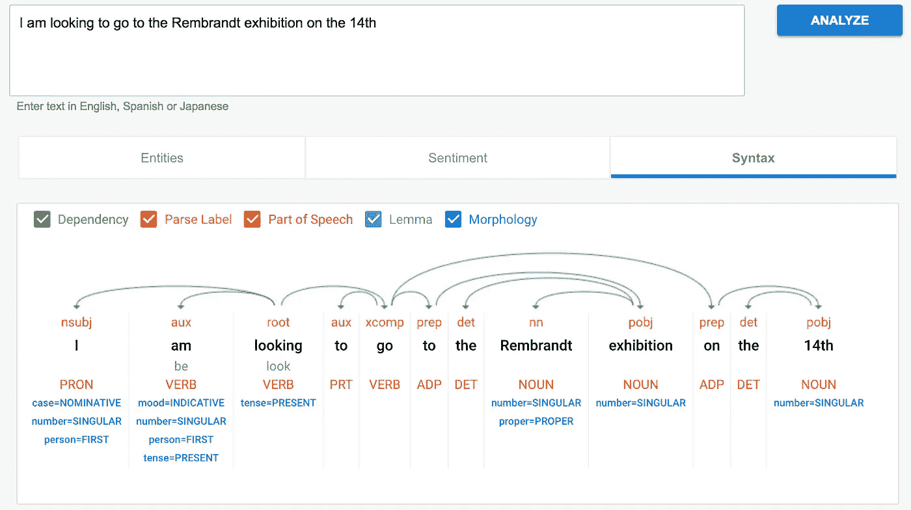
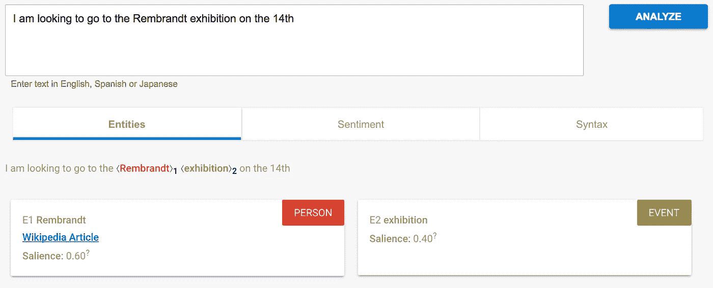

# 让人工智能为你工作——第 2 部分:理解用户所说的话

> 原文：<https://medium.com/hackernoon/making-artificial-intelligence-work-for-you-part-2-understanding-what-the-user-says-c9456b64a59d>

在我们的人工智能指南第一部分中，我们通过定义越来越复杂的智能体的过程介绍了人工智能。智能体是通过传感器感知环境并通过效应器作用于环境的程序。他们可以主动行动，自主决策。

随着我们继续建立对人工智能的理解，重点是[聊天机器人](https://www.deeson.co.uk/services/chatbot-agency-london)，我们将注意力转向*感知用户所说的话。对于对话界面，这是最重要的传感器。它结合了自然语言处理工具和聊天机器人设计者提供的训练。*

# 从沟通到行动

当一个人(或另一个代理)对聊天机器人说话时，它需要将其转换成可操作的信息。我们将这个过程分为四个不同的步骤:感知、分析、消除歧义和合并。让我们依次看一下每一个。

# 感觉

首先，我们需要实际感知对我们说的话。

在 Facebook Messenger 等平台上，这意味着我们需要访问用户输入的文本。非常简单，由 Facebook Messenger API 处理。无论是脸书、微软团队还是 Slack，每个平台都为我们的聊天机器人提供了一种感知正在说什么的方式。

在 Alexa chatbot 等基于语音的平台上，感知更加困难。虽然平台本身处理了语音识别的大部分复杂性，但是仍然存在一些问题。开发人员必须定义用户如何开始一项特定的技能(一项技能可以被认为是 Alexa 版本的你自己的机器人)，并帮助 Alexa 确定用户何时结束发言(或说够了)。看一下亚马逊 Alexa API 文档就知道要识别用户说了什么相关的东西需要做多少工作。

然而，无论是处理书面文本还是口头文本，我们都可以很有把握地理解用户所说的内容。下一步是分析所说的话。

# 分析

分析有两个方面。我们需要从句法上分析一些东西(识别单个单词，它们在句子中的目的和关系)，我们需要从语义上分析一个句子。

例如，考虑这样一句话:“我想去 14 号的伦勃朗画展”

句法分析识别单个单词、句子结构、使用的语言、哪些单词是名词或动词等。

谷歌的自然语言处理(NLP)工具很好地说明了这一点。把这个短语放进去，你会得到一个句子的分解，识别三个动词“am”，“look”，“go”，三个名词“Rembrandt”，“exhibition”，“14th”等等。

用谷歌做语义分析就差一点。

语义分析很差，因为我们缺少太多的上下文。NLP 软件确定一个人被提及并且可能是一个事件。然而，它忽略了这个短语的总体目的。

我们的聊天机器人必须弄清楚“我”是指用户，“想去”意味着用户有兴趣了解更多或购买门票，伦勃朗和展览是相关的，等等。这就是歧义消除发挥作用的地方。

# 解疑

歧义消除是确定一个特定含义的过程——通常使用上下文来帮助这个过程。作为聊天机器人开发者，我们的目标是理解用户的意图。

诸如 [api.ai](http://api.ai/) 或 [wit.ai](http://wit.ai/) 之类的工具通过将自然语言处理与训练工具相结合来帮助我们将句子明确地映射到特定的意图。

我们可以提供这样的短语:

“我想去看 14 号的伦勃朗画展”
“我想预定伦勃朗画展的门票”
“我对伦勃朗画展感兴趣”
“正在上演的伦勃朗画展——我该怎么去？”
并手动将它们全部映射到一个特定的意图——比如“购买展览门票”。

NLP 支持的工具可以处理与我们输入的短语不完全匹配，但在语义和语法上足够相似的短语。该工具将提供一个置信度值(从 0 到 1)，我们可以微调我们的机器人做出相应的反应。

再者，“伦勃朗”可以变成代表任何人或物的变量。所以同样的短语也可以用来形容“达芬奇”、“毕加索”或“印象主义”。

作为机器人设计师，我们的任务是确保整体环境足够具体，以便我们可以有效地训练我们的机器人。我们需要仔细考虑各种意图，避免将它们放在彼此太近的地方(语义上)，这样一个意图就不会渗透到另一个意图中(就解释而言)。同样有用的是有一个后备或默认的意图，这样每个短语都可以解决一些问题。

当然，如果聊天机器人交互界面允许，我们也可以通过使用基于按钮的选择来完全消除歧义。

# 公司

消除歧义后，我们现在可以将用户提供的信息整合到我们的代理对世界的总体了解中。利用这些新的信念，我们可以做出相应的反应。

例如，如果我们的聊天机器人的目标是向用户出售一张票，并且我们的聊天机器人认为用户刚刚请求了关于如何订票的信息，那么它将回复相应的订票过程。

目前的聊天机器人架构在这个层面上没有提供太多的复杂性。典型地，用户输入导致简单的反应，并且先前的动作不被考虑。随着我们在构建聊天机器人方面获得更多经验，以及用户要求更好的聊天机器人，这种情况很快就会改变。

# 相互理解比以往任何时候都容易

我们有比以前更好的工具来理解用户所说的话。结合自然语言处理来分析和消除歧义，以及上下文相关的训练，使得聊天机器人的设计非常令人兴奋。

chatbot 开发的下一步将集中在将这些工具整合到更复杂的架构中。这些应该允许我们为我们的用户创建越来越好的模型，更好地理解不仅仅是独立的交互或简短的对话，而是更长的流程。

在下一期“让人工智能为你工作”中，我们将看看除了用户输入的信息之外，聊天机器人还能感知哪些信息。

这篇文章最初出现在[deeson.co.uk](https://www.deeson.co.uk/blog/making-artificial-intelligence-work-you-part-2-understanding-what-user-says)

*同时了解更多关于我们的* [*聊天机器人机构*](https://www.deeson.co.uk/services/chatbot-agency-london) *服务。*

> [黑客中午](http://bit.ly/Hackernoon)是黑客如何开始他们的下午。我们是阿妹家庭的一员。我们现在[接受投稿](http://bit.ly/hackernoonsubmission)并乐意[讨论广告&赞助](mailto:partners@amipublications.com)机会。
> 
> 如果你喜欢这个故事，我们推荐你阅读我们的[最新科技故事](http://bit.ly/hackernoonlatestt)和[趋势科技故事](https://hackernoon.com/trending)。直到下一次，不要把世界的现实想当然！

