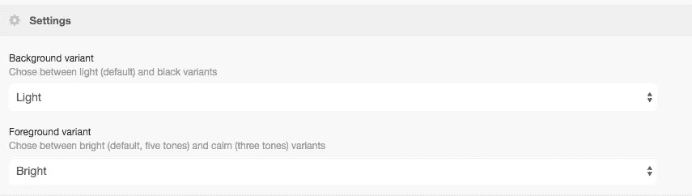
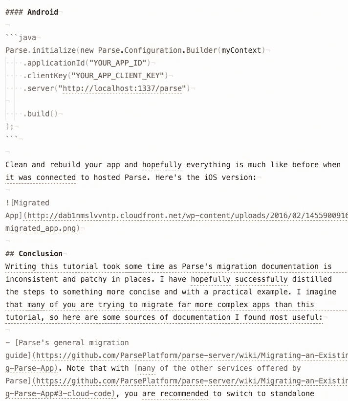
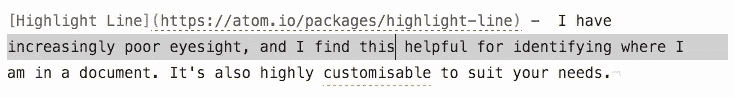
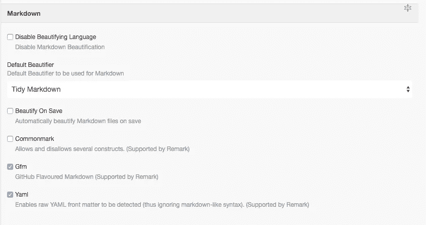

# 让 Atom(甚至更)棒——我的设置

> 原文：<https://medium.com/hackernoon/making-atom-even-more-awesome-my-setup-e7a89969a876>

我花了很长时间研究、尝试和调整文本编辑器。作为一名跨平台开发人员和技术写作人员(目前主要是写作人员),我使用不同的编程语言和文档格式，并希望有一个具有特定功能的编辑器，但这也很容易看到。理想情况下，我希望所有的功能，我在一个应用程序中寻找，而不是分为 5 个。

这是我一直在寻找的:

*   良好的降价支持。
*   能够将 markdown 导出为不同的格式(至少是 PDF 和 HTML)。
*   项目经理。
*   拼写和语法检查。
*   能够内联(在 markdown 中)以及在单独的文件中编辑代码，并正确格式化和突出显示代码。
*   一个扩展/插件架构，用于我还不知道自己想要的功能。

开源将是一个额外的好处，但它不是必不可少的。我很乐意为软件付费，但成本并不总是质量的标志。

我试着让崇高了一段时间，但是厌倦了，甚至不记得为什么。我试过[【BBEdit】](http://www.barebones.com/products/bbedit/)(还有 TextWrangler)，我喜欢它是 Mac 原生的，但是它缺少很多我所需要的功能。前一段时间我试过[括号](http://brackets.io/)，我也不记得我不喜欢它的什么，但我很快就继续了。TextMate 就快完成了，但还是不值得花这么多钱，我仍然需要其他工具。

然后我从 GitHub 找到了 [Atom](http://atom.io) 。我并没有马上被说服，版本 1 之前的版本并不可靠，某些对我来说必不可少的功能也没有很好地工作(HTML 和 PDF 导出)，但是 Atom 的一些特性让我想继续使用它。

Atom 是一个文本编辑器，所以当然可以处理任何与文本相关的东西。然而，它们通常主要针对编码人员，为更侧重于编写的工作流进行设置需要几个步骤，经过几个月的修补，我已经达到了一个接近完美的(我会后悔这么说)设置，我想分享我使用的东西，我如何配置它，以及它对我的帮助。

我正在考虑制作一个 Atom fork 或特殊的包文件，将这些特定于 writer 的插件和设置捆绑在一起，但这仍然是一个想法。

## 让 Atom 看起来更好(r)

我喜欢轻主题，在*轻*和*亮*变体中使用[一 o 八语法](https://atom.io/themes/one-o-eight-syntax)。

它看起来是这样的(加上我将在接下来介绍的其他内容)。

我曾经在我的 *styles.less* 文件中有几个自定义，但是我现在已经把它们都删除了，所以这是默认的。

我使用 [Unity UI 主题](https://atom.io/themes/unity-ui)，因为我喜欢我的 Mac 软件看起来像 Mac 软件。

[Atom HTML 预览](https://atom.io/packages/atom-html-preview)非常适合预览 HTML 文件。

我的视力越来越差，我发现[高亮线](https://atom.io/packages/highlight-line)有助于识别我在文档中的位置。它还可以根据您的需求进行定制。

Atom 美化是一个全面的包，它格式化你的代码(和文本),让你配置什么样的“美化器”用于什么样的支持语言。

然后触发该命令将为您整理代码/文本。

结合 Atom 美化，我使用了 [Tidy Markdown](https://atom.io/packages/tidy-markdown) 包，我发现它比内置包做得更好。

就我个人而言，我不太喜欢每行 80 个字符的限制，因为你可以通过相应的布局和流程来实现这一点。但是如果你和坚持这样做的项目一起工作，你可以使用[换行长度](https://atom.io/packages/line-length-break)在提交你的工作之前强制换行到一个定义的长度。

[多换行导轨](https://atom.io/packages/multi-wrap-guide)允许您在可配置的位置设置换行导轨，它也应该与上面的包一起工作，在这些位置断开文本。

[颜料](https://atom.io/packages/pigments)在线显示颜色值，简单但漂亮😀。

## 语言格式化程序、短句和摘录

其中许多是不言自明的(我不会包括截图)，它们在不同程度上为 Atom 添加了语言突出显示、格式和代码片段(代码片段是我刚开始使用的 Atom 特性之一):

*   [用于 sass 的原子语法突出显示](https://atom.io/packages/Atom-Syntax-highlighting-for-Sass)
*   [语言-液体](https://atom.io/packages/language-liquid)
*   [原子液体片段](https://atom.io/packages/atom-liquid-snippets)
*   [django-templates](https://atom.io/packages/django-templates) —我和 Jekyll 合作很多，它的模板是流动的，是基于 django 的模板。
*   [语言-迅捷](https://atom.io/packages/language-swift)
*   [语言重组文本](https://atom.io/packages/language-restructuredtext)
*   [语言-乳胶](https://atom.io/packages/language-latex)
*   [语言等级](https://atom.io/packages/language-gradle)
*   [语言-docker](https://atom.io/packages/language-docker)
*   [棉绒-swiftc](https://atom.io/packages/linter-swiftc)
*   [棉绒-scss-棉绒](https://atom.io/packages/linter-scss-lint)
*   [linter-jsonlint](https://atom.io/packages/linter-jsonlint)
*   [linter-html 提示](https://atom.io/packages/linter-htmlhint)
*   林特尔-贾瓦茨
*   [linter-js-yaml](https://atom.io/packages/linter-js-yaml)
*   [棉绒-棉绒](https://atom.io/packages/linter-csslint)
*   [linter-jshint](https://atom.io/packages/linter-jshint)
*   [哐啷哐啷声](https://atom.io/packages/linter-clang)
*   [linter-chktex](https://atom.io/packages/linter-chktex)
*   [无绒](https://atom.io/packages/linter-less)
*   [棉绒降价](https://atom.io/packages/linter-markdown)
*   [linter-package-JSON-validator](https://atom.io/packages/linter-package-json-validator)
*   [棉绒脱壳检查](https://atom.io/packages/linter-shellcheck)

## 自动化你自己

当软件包可以帮助你时，为什么要浪费时间重复你自己！

[autoclose-html](https://atom.io/packages/autoclose-html) 包为您添加到代码或代码片段中的 html 元素添加结束标记。

Atom Dash 增加了对 [Dash](https://kapeli.com/dash) 的 Atom 支持，这是一个非常有用的离线文档浏览器。

我偶尔使用 [RevealJS](https://github.com/hakimel/reveal.js/) 进行演示，使用 [Grunt Runner](https://atom.io/packages/grunt-runner) 运行 [Grunt 任务](http://gruntjs.com/)让我从 Atom 内部开始演示。

Jekyll 包是一个全面的包，它添加了 Jekyll 片段、快捷方式、语法、服务器管理，并且是配置感知的(你的 Jekyll *config.yml* 文件的内容)。我应该更多地使用这个包，但是它经常不工作，也不是很冗长🤔。

使用[颜色选择器](https://atom.io/packages/color-picker)你可以在你的文件中调用一个弹出颜色选择器。

## 项目管理

[项目管理器](https://atom.io/packages/project-manager)允许您将文件夹设置为项目，然后打开并在它们之间切换。

如果你不记得文件名或正确的路径，自动完成路径会有帮助。有时它可能过于敏锐，需要明智地使用 *esc* 键来停止在文档中到处插入文件名。

使用[文件图标](https://atom.io/packages/file-icons)中的彩色文件类型图标让你的项目视图看起来更漂亮。Unity UI 主题隐藏了这些，所以确保通过检查包设置中的*强制显示*设置来显示它们。

## 合作

git-time-machine 是一个很棒的包，可以让你在 Atom 中浏览和比较文件的 git 历史。

[Pull requests](https://atom.io/packages/pull-requests) 包非常酷，允许您在文件中查看关于 Pull requests 的评论。它偶尔会在网络连接上超时，我也遇到过私人/商业存储库的问题，但它通常会赶上。

## 写得更好

好的，这是你真正感兴趣的😉。

我使用 [linter-write-good](https://atom.io/packages/linter-write-good) 已经有一段时间了，我发现它很有用。它根据 [NPM 写作技巧模块](https://github.com/btford/write-good)提供建议，让你的写作变得更好。它不会总是正确或相关的，但它对我帮助很大。

我仍然对 [Alex Linter](https://atom.io/packages/linter-alex) 犹豫不决，它使用 [AlexJS](http://alexjs.com/) 来捕捉不体贴的写作。我发现它过于敏感，强调澳大利亚和美国这样的词是“潜在的亵渎”，这很奇怪。它还会突出具有双重含义的单词，如“拍一张照片”。我还在评估它对我有多有用。

[只说不](https://atom.io/packages/linter-just-say-no)棉绒突出'[篱字](http://theeditorsblog.net/2010/11/18/hedge-words/)'。它的功能与 Write Good linter 略有交叉，但我仍然觉得它很有用。

我替换了 Atom 内置的拼写检查器，因为[拼写提示](https://atom.io/packages/linter-spell)允许你选择字典(你可以在英式英语和美式英语之间切换😄)，添加自定义单词(对技术行话来说很棒)，它有一个更好的界面。你需要安装一个 lspell 兼容的字典(我用 Homebrew 安装了 [Aspell](http://aspell.net/) 和 [intentions](https://atom.io/packages/intentions) 包，它添加了一个关于我希望其他包使用的问题的漂亮弹出窗口。

[Typewriter](https://atom.io/packages/typewriter) “改善你的写作体验”，将布局居中，去掉滚动条(除非你滚动)和其他调整。我对这个包不是 100%满意，因为有时(这可能是包冲突)它会产生不必要的水平滚动，最后我会有很多空白，我知道这是这个包的目的，但我不喜欢它😬。

字数统计包统计字数和字符数。简单。

[Markdown Writer](https://atom.io/packages/markdown-writer) 提供了一组快捷方式和功能，使使用 Markdown 更容易。它还可以很好地与静态站点生成器一起工作，这些静态站点生成器对帖子使用 Markdown。

我喜欢 [Pandoc](http://pandoc.org/getting-started.html) ，通过 [Pandoc convert](https://atom.io/packages/pandoc-convert) 和 [Pandoc previewer](https://atom.io/packages/pandoc) 软件包，我可以利用 Pandoc 在它提供的大量选项中预览和导出文档。

它可以跳动，但[降价滚动同步](https://atom.io/packages/markdown-scroll-sync)保持您的源和预览降价彼此同步。

## 我的包裹

如果你喜欢用 Markdown 写作，但是也使用 Medium，那么我的 [Medium Export](https://atom.io/packages/medium-export) 可以让你直接导出到你的 Medium 草稿。它需要工作，但功能良好。

我也在(慢慢地)开发“编辑器朋友”包，它设置了可配置的搜索/替换字符串列表，以帮助减少你所做的重复编辑。

## 你的原子里有什么？

那就是我！我喜欢 Atom 的可扩展性，欢迎您就如何根据需要设置它发表意见。

> [黑客中午](http://bit.ly/Hackernoon)是黑客如何开始他们的下午。我们是 AMI 家庭的一员。我们现在[接受投稿](http://bit.ly/hackernoonsubmission)并乐意[讨论广告&赞助](mailto:partners@amipublications.com)机会。
> 
> 要了解更多信息，请[阅读我们的“关于”页面](https://goo.gl/4ofytp)、[喜欢/在脸书给我们发消息](http://bit.ly/HackernoonFB)，或者简单地说， [tweet/DM @HackerNoon。](https://goo.gl/k7XYbx)
> 
> 如果你喜欢这个故事，我们推荐你阅读我们的[最新科技故事](http://bit.ly/hackernoonlatestt)和[趋势科技故事](https://hackernoon.com/trending)。直到下一次，不要把世界的现实想当然！