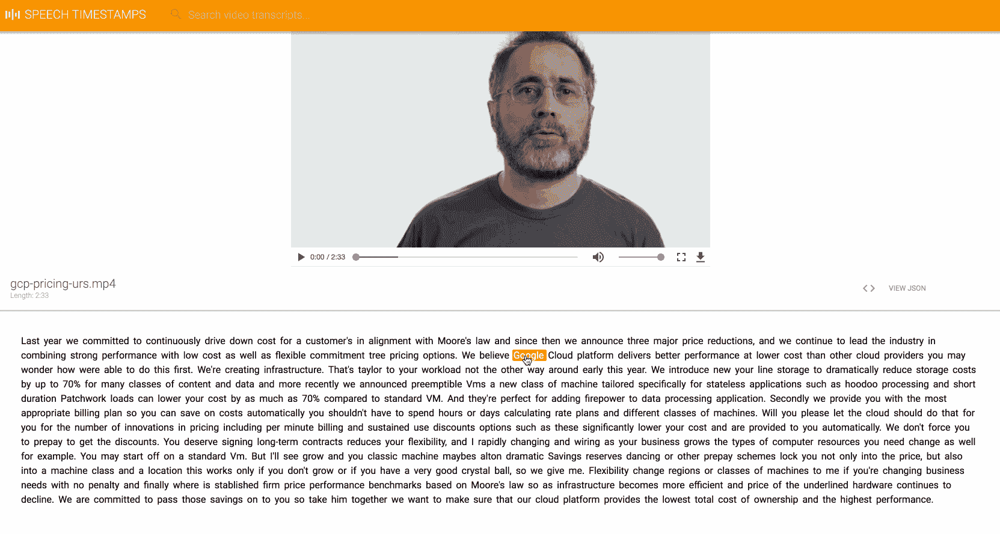
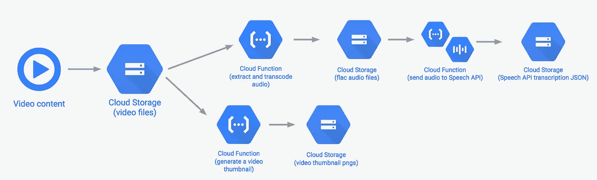

# 使用云语音使音频可搜索

> 原文：<https://medium.com/hackernoon/making-audio-searchable-with-cloud-speech-36ce63b6b4d3>

上个月，云语音[推出了](https://cloudplatform.googleblog.com/2017/08/Cloud-Speech-API-improves-longform-audio-recognition-and-adds-30-new-language-variants.html)一个新的单词级时间戳功能:音频转录现在包括每个单词的开始和结束时间戳。这带来了大量的可能性:开发人员现在可以跳到音频文件中说出某个单词的确切时刻，在播放音频时显示相关文本，或者在音频库中搜索特定术语。

有了搜索音频文件的能力，我想在视频上试试这个功能。为此，我从一个视频文件中提取了音轨，将其发送到 Cloud Speech，并构建了一个搜索音频转录 JSON 的前端。结果是下面的演示(最好在[我最近的 ML API 演示](https://youtu.be/hJtTdunppn4?t=12m49s)中用声音观看):

除了语音 API，该演示还使用云功能、云存储和应用引擎进行托管。下面是后端工作原理的示意图:

Architecture of Speech Timestamps demo

# **第一步:用 ffmpeg 和云函数提取音频**

因为 Cloud Speech 允许您为音频文件提供云存储 URL 以便转录，所以我决定将我所有的视频和音频内容存储在云存储中。然后在我的应用引擎前端，我可以直接从云存储中获得视频和相关的转录 JSON。

我希望能够将视频文件放入云存储中，并自动在另一个存储桶中显示转录。听起来很神奇，对吧？我用[云函数](https://cloud.google.com/functions/)实现了这一点:这是一个计算解决方案，用于编写由某些云事件自动触发的函数。函数是用 Node.js 编写的，您可以指定触发每个函数的事件类型。在这种情况下，每当一个新文件被添加到我的视频桶时，我就触发我的函数。我将转录过程分为两个功能:

1.  从视频中提取音频，并将其转换成语音 API 可以接受的格式(我使用了 FLAC 编码)

2.`**transcribeAudio**` **:** 将 FLAC 文件发送到 Speech API，并将转录上传到云存储

`extractAudio`功能使用 [google-cloud Node 模块](https://googlecloudplatform.github.io/google-cloud-node/#/)访问云存储，使用 [fluent-ffmpeg](https://github.com/fluent-ffmpeg/node-fluent-ffmpeg) 提取音频并转码。为了让 [ffmpeg](https://www.ffmpeg.org/) 在我的云函数环境中工作，我需要在部署我的函数时上传 ffmpeg 二进制文件，并告诉 fluent-ffmpeg 这些二进制文件的路径。

以下是 npm 依赖关系的完整列表:

我们还将为每个云存储桶定义变量:一个用于视频，一个用于 FLAC 音频文件，一个用于转录 JSON:

该功能将执行以下操作:

*   从云存储下载视频文件
*   提取音频并将其转码为 FLAC 格式，用于云语音
*   将 FLAC 文件上传到云存储

该功能接收一个`event`参数，该参数将为我们提供触发事件的文件数据。我们的功能概述如下:

接下来，我们将编写函数，将视频下载到云存储中。我们可以通过将文件写入`/tmp`目录，将其保存到我们的云功能环境中的本地磁盘上:

一旦我们在云功能中获得了本地可用的视频文件，我们就可以使用 ffmpeg 对音频进行提取和转码:

最后一步是将 flac 文件上传到新的云存储桶中。您可以在[谷歌云文档](https://googlecloudplatform.github.io/google-cloud-node/#/docs/google-cloud/0.56.0/storage/bucket?method=upload)中找到上传文件的代码。

# **第 2 步:用云语音转录音频**

为了得到我们的音频转录和时间戳数据，我们将编写一个名为`transcribeAudio`的云函数，每当 flac 文件被添加到我们的音频桶中时就会被触发。对于这个函数，我们需要用 google-cloud Node 实例化一个语音客户端，然后编写我们的转录函数:

我们只需要打电话给`longRunningRecognize()`向我们的客户云语音提出请求。这将启动一个长时间的语音操作，并在完成时返回最终的转录结果:

然后，我们可以将转录内容写入本地 JSON 文件:

最后一步是将我们的 JSON 文件上传到云存储中，就像我们在第一个函数中所做的那样。

呜哇！现在我们有了一个完全无服务器的解决方案，可以从视频中生成时间戳转录。请注意，您需要定期从您的云函数文件系统中删除`tmp/`的内容，以避免达到[的内存限制](https://cloud.google.com/functions/pricing#local_disk)。你可以用 [rimraf](https://www.npmjs.com/package/rimraf) npm 模块来完成。

# 开始

要开始在你自己的应用中使用时间戳功能，请访问语音 API [时间戳文档](https://cloud.google.com/speech/docs/async-time-offsets#speech-async-recognize-gcs-protocol)。关于云函数的细节，查看这里的[文档](https://cloud.google.com/functions/docs)或者观看我的队友 [Bret](https://twitter.com/bretmcg) 关于云函数的精彩[演讲](https://www.youtube.com/watch?v=5CZ1f6wzn4Q)。

我很想看看你用语音 API 和云函数构建了什么。请在评论中告诉我你的想法，或者在 Twitter 上找到我。