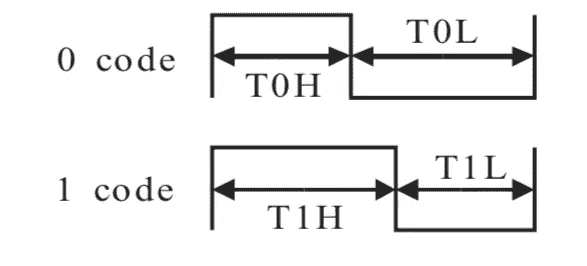
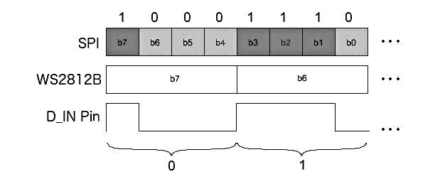
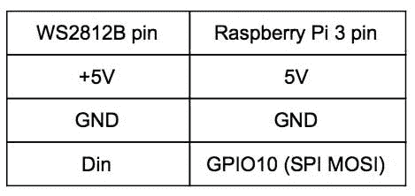
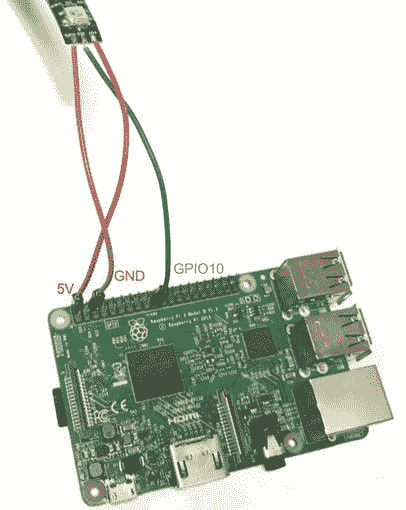
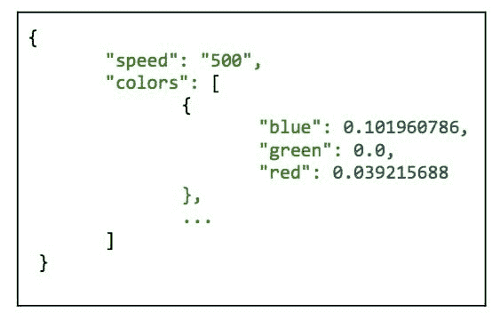
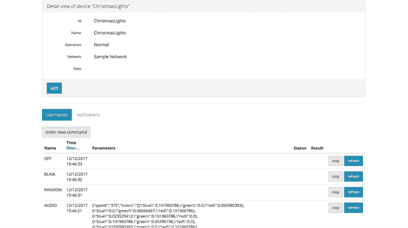

# 用 DeviceHive 制作圣诞灯

> 原文：<https://medium.com/hackernoon/making-christmas-lights-with-devicehive-feea7730b20b>

## DeviceHive 团队致以最热烈的祝愿！

这个项目解释了如何使用 Android Things、Android phone 和物联网平台 DeviceHive 来创建圣诞灯。至于灯本身，我们使用了 WS2812B led 灯条。Android 的东西将使用 Raspberry Pi 3 运行，通过任何具有 SPI 接口的板都可以使用。这些灯将由移动设备控制，并可以根据手机上记录的声音生成图案。

# 安卓的东西

Android Things 是 Google 提供的构造良好的现代操作系统，允许我们使用 Android API 和第三方 Java 和 Android 库。Raspberry Pi 3 会通过 SPI(串行外设接口)将颜色发送到 led 灯带。

[SPI](https://en.wikipedia.org/wiki/Serial_Peripheral_Interface_Bus) 是同步串行通信接口，代表设备之间的主从关系。Android Things 在 API 中有专门的[外围管理器](https://developer.android.com/things/sdk/pio/spi.html)来操作这个总线。

根据原始[文档](http://www.world-semi.com/DownLoadFile/108)，WS2812B 的数据传输协议使用单 NZR 通信模式。像素上电复位后，DIN 端口从控制器接收数据，条上的第一个 LED 接收前 24 位数据，然后通过 DO 端口将每个后续位发送给条中的下一个 LED。条带中的每个下一个 LED 以相同的方式接收 24 位，因此传输应该包含每个 LED 的数据。

该条的传输协议具有相当简单的行为，数字“1”被编码为长高脉冲，“0”被编码为“Din”上的短脉冲。

*Sequence Chart from the original documentation where T0H takes 220ns~380ns, T0L takes 580ns~1.6µs, T1H takes 580ns~1.6µs and T1L takes 220ns~420ns*

我们将模拟该协议来使用 SPI。在我们的例子中，Raspberry Pi 3 是主机，WS2812B 是从机。

为了仿真 SPI 协议，我们在 SPI 传输中使用 4 位模块来产生 WS2812B 协议的一位。SPI 速度应选择适合 WS2812B 时序的速度。我们使用 3809523 Hz，每个 4 位(一个 WS2812B 位)传输需要 1.05 s。

打造圣诞灯，我们需要:

*   覆盆子 Pi3
*   8GB microSD 卡
*   5V 电源(功率取决于条带长度)
*   WS2812B led 灯条
*   电线

Connection between the RPi3 and LED Strip

Connection between the RPi3 and LED Strip

Android Things 的安装说明在[官方文档](https://developer.android.com/things/hardware/raspberrypi.html)中提供。

基本上，从硬件方面来说就是这样！只要确保电源足够强大的 LED 条和板本身。对于长条形，5V 应直接连接到电源，无需通过 Raspberry Pi 3 板。

# 物联网平台

要将设备与主板和移动设备上的 Android Things 操作系统连接起来，我们需要一个能够提供这种连接的平台。 [DeviceHive 平台](https://devicehive.com/)提供了我们需要的一切。

DeviceHive 将任何连接的设备变成物联网的一部分。它提供通信层、控制软件和多平台库，以引导智能能源、家庭自动化、遥感、遥测、远程控制和监控软件等的开发。

# 设备配置单元平台设置

DeviceHive 平台为我们提供了支持库。为了开发客户端应用程序，我们可以使用原始的 DeviceHive 客户端 Java 库。DeviceHive 客户端库是一个基于 Java 的开源项目。它可以用来构建任何基于 Java 或 Android 的应用程序。这个库完全支持 Android 的东西。这个库的实现非常简单:

1.  将 JitPack 存储库添加到项目 build.gradle 文件中，并将依赖项添加到模块 build.gradle 文件中。
2.  调用 getInstance()。DeviceHive 对象的 init(String url，String refreshToken)方法，并传递两个参数，REST url 和 refreshToken。
3.  调用 getDevice(String id)方法来获取现有设备或创建新设备。

就是这样。现在我们已经拥有了在项目中使用 DeviceHive 所需的所有东西。在 DeviceHive 支持库建立之后，我们创建了一个包含两个模块的项目:一个 Android Things 应用程序和一个 Android mobile 应用程序。

# 事物模块

Things 模块只是侦听来自与 DeviceHive 服务器建立的 WebSocket 连接的传入命令，并执行所需的操作。这些命令是:

1.  闪烁，在控制器接收到这个命令后，它打开带有两种预先定义的“圣诞老人”颜色的纸条，红色和白色。灯带上的发光二极管从中心来回移动。
2.  随机，控制器收到该命令后，会在条带上生成随机颜色。
3.  音频，利用该命令，控制器接收两个数据对象，即在移动设备上生成的颜色列表和颜色变化的速度。

Command’s parameters in JSON format

4.关闭，只是关闭 led 灯条。

Commands look in DeviceHive admin console

# 移动应用程序

移动模块向 Raspberry Pi 3 发送命令。它有一个非常简单的 UI，包括两个屏幕，一个登录屏幕和一个主屏幕。在登录屏幕上，我们必须用 Rest URL、刷新令牌和设备 id 填充三个字段。在主屏幕上，我们有 4 个按钮来执行命令。

在我们点击执行音频命令的按钮后，智能手机开始录制来自智能手机麦克风的声音。然后，它通过快速傅立叶变换算法(FFT)将捕捉到的声音转换为傅立叶级数，并计算节拍。FFT 算法创建一系列独特的灯，为 led 灯条显示一个音频轨道。在这个预处理之后，移动应用程序基于这个 f 系列生成 HSV 颜色。我们使用 HSV 只处理 H(色调)部分，并保持 S(饱和度)和 V(值)相同，这样我们就可以得到明亮的颜色。最后，应用程序发送从 BPM 计算出的颜色和速度信息。

命令发出后，事物模块对其进行处理。

Christmas tree with the Lights

# 结论

当然，这只是一个有趣的项目，可以用于家庭装修，但因为它是一个完全开源的项目，它可以被用于一些更严重的工作。使用 Android Things 作为 LED 控制器，可以实现更复杂的逻辑，将其连接到其他物联网平台，并创建一个可从一个服务控制的电路板集群。我们希望这个项目能帮助你装饰你的家，创造更先进的照明系统。

DeviceHive 团队致以最热烈的祝愿！