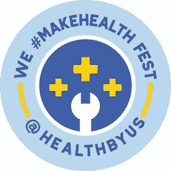
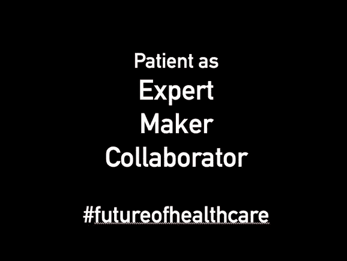
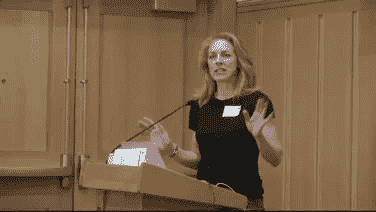
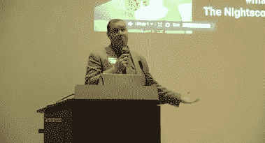
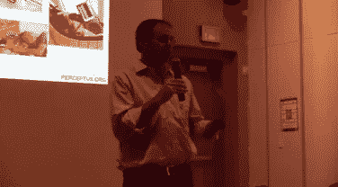
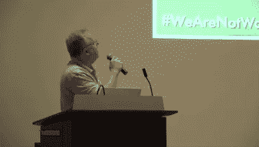
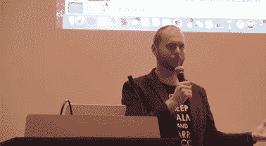
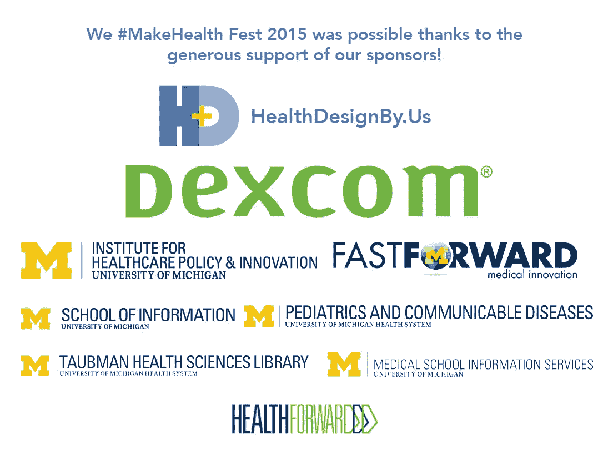

# #制造+#健康= #创新

> 原文：<https://medium.com/hackernoon/making-health-innovation-2feb8f5e00c4>

## 我们#打造 2015 健康节&夜场研讨会

# 这是[医疗保健](https://goo.gl/8FsjGa)的未来:

[https://www.youtube.com/watch?v=HyVaEASftF8](https://www.youtube.com/watch?v=HyVaEASftF8)

Hhealth care 利用患者和护理人员的洞察力和智慧，促进医疗保健的创造性解决方案，并通过协作社区扩大创新规模。**这就是我们发起健康创客运动的原因！**

# 我们#打造 2015 健康节

今年秋天，我们在密歇根大学举办了第二届年度 We #MakeHealth Fest，并有幸邀请了一群对制作和健康充满热情的杰出人士参加。以下是此次活动的精选视频:

## 苏珊娜·福克斯

[https://www.youtube.com/watch?v=JncBqNVwbuw&feature=youtu.be](https://www.youtube.com/watch?v=JncBqNVwbuw&feature=youtu.be)

美国卫生与公众服务部首席技术官苏珊娜·福克斯谈到了她在 HHS 的角色，类似于首席创新官。她在[创意(创新、设计、创业、行动)实验室](https://twitter.com/hhsidealab)工作，该实验室使用类似[设计](https://hackernoon.com/tagged/design)思考和精益[创业](https://hackernoon.com/tagged/startup)的方法为联邦政府带来创新。她 ***加盟以来有什么重大见解*** ？

> “正在被错过的机会是创客运动。”

鉴于苏珊娜在过去十年中作为“互联网地质学家/人类学家”的背景，她对创造者运动有着深刻的理解，她进行了专注于患者和护理人员所做的[健康“黑客”的实地调查和研究](http://susannahfox.com/2014/02/10/hacking-home-health-care/)。她对观众中的制作者说:

> “如果你能找到黑客，如果你能找到艺术家，如果你能找到让无路可走的人，那么你就能看到未来。你们正在做的工作是建设未来。我们需要更多来自未来的大使来与医疗机构交流。”

[点击此处观看苏珊娜的演讲视频](https://www.youtube.com/watch?v=JncBqNVwbuw&feature=youtu.be)。

## [演讲)！)，并描述了](https://medium.com/u/82356a7ebf90#MakeHealth Fest 上的<a class=)[麻省理工学院小设备实验室](http://littledevices.org/)的使命:

> “你如何让更多的人来做东西？”
> 
> "你如何使医疗设备的设计和制造民主化？"

Jose 谈到了透明设计对健康的重要性，这种设计是显而易见的，可以与更大的社区分享。这种透明性促进了大规模的快速和广泛的修改，导致设计的改进，从而加快创新的步伐。

他将这种透明设计与大多数医疗设备的**黑盒设计**进行了对比，后者完全处于保密状态。

> “我们不理解它们，它们肯定是被设计成让我们不理解的；工业设计藏在那些不吸引我们去理解它们的东西里……”

黑盒设计的潜在负面后果是什么？

1.  **剥夺用户的权利**。Jose 举了一个现代农民的例子，他们正在对抗黑箱拖拉机技术。以前模拟拖拉机坏了，农民可以自己动手 DIY 修理修理(农民才是最终的制造者！).但有了新的黑匣子专有计算机系统，他们就无法访问自己购买的设备的“内脏”，他们无法自己进行简单的维修，他们被迫与收取高额修理费的制造商合作。对于决定入侵自己设备的农民来说，尽管事实上他们拥有设备，但根据《数字千年版权法》(DMCA)，入侵可能被视为犯罪。(观看视频，了解 DMCA 咖啡。)
2.  入学机会的差异。 Jose 谈到了在获得医疗保健工具和设备方面的潜在不平等，因为公司开始对他们的“秘密”黑盒技术收取更高的费用:一个 2 美元的温度计现在卖 29 美元；一个 14 美元的血压袖带现在卖 170 美元；一个 50 美分的药瓶现在卖 300 美元。如果你拆开这些设备，除了数字化和/或它们连接到你的 iPhone 的事实，没有什么特别的东西可以证明这些产品的价格更高。在他看来，制造商可以以更大的规模和更低的成本创造出许多这样的发明。

> “别给我黑匣子，给我工具包。”

Jose 通过分享实验室的重要工作结束了他的演讲，这些工作集中在平台和系统的[开发](http://littledevices.org/research/)上，以使医疗设备设计更加透明和可访问(点击此处了解更多关于[医疗包](http://opinionator.blogs.nytimes.com/2014/01/29/playing-with-toys-and-saving-lives/?_r=0))。“制作”使用户(患者/护理者，甚至医疗保健提供者)能够破解、制作和修改医疗设计；通过这些设计的透明共享，有机会获得授权、更大的规模和可持续性。

[点击此处观看 Jose 的演讲视频。](https://www.youtube.com/watch?v=GQkUA_sCrhg)

## [John Costik](https://medium.com/u/9adcbde00c86#MakeHealth Fest 的<a class=) 主讲。用他的话说，就是:

> “我接手了一个让我儿子更健康的小项目，它有了自己的生命。”

## 詹姆斯婚礼

[https://www.youtube.com/watch?v=ytEh6kpp6xk](https://www.youtube.com/watch?v=ytEh6kpp6xk)

[James Wedding](https://twitter.com/jwinmck) 是 [Nightscout Foundation](http://www.nightscoutfoundation.org/) 的总裁，他讲述了自己在 Nightscout 社区的经历以及他帮助创建该基金会的工作。

正如他所说，

> “需要是发明之母。我们做我们该做的。这是我必须做的。基金会是我可以帮忙的地方。”
> 
> “用一种商业模式来包装人们出于爱而做的事情，这是一个有趣的困境。”

[点击此处观看詹姆斯的演讲视频。](https://www.youtube.com/watch?v=ytEh6kpp6xk)

## 肯·斯塔克

[https://www.youtube.com/watch?v=EiNbB6HLNok](https://www.youtube.com/watch?v=EiNbB6HLNok)

Ken Stack 讲述了他作为 Nightscout 社区的公民黑客的工作，为他的儿子构建糖尿病软件和硬件系统。在他的演讲中，他讨论了社区已经建立的东西，包括移动显示器、仪表板分析和探索/决策工具、硬件、远程控制和闭环系统。

根据 Ken:

> “Nightscout 是我们 10 多年来在糖尿病方面最具变革性的经历；没有什么比这更好的了。这让一切都变得不同了。”

点击此处观看 Ken 的演讲视频。

## 韦斯顿·诺德格伦

[https://www.youtube.com/watch?v=YCUnsE7guQ8](https://www.youtube.com/watch?v=YCUnsE7guQ8)

[Weston Nordgren](https://twitter.com/NightscoutFound) 是社区布道者和 Nightscout 基金会董事会成员，他讲述了当他们开始使用 Nightscout 时，他的家庭生活是如何发生巨大变化的。

韦斯表示:

> "我们收到了一些从我们这里拿走的东西。"

因此，他和他的妻子以及其他许多人都信奉社区哲学:

> " T4:尽你所能向前说."

社区中的个人共享代码，为脸书小组提供 24–7 的技术指导和支持，召集当地会议让人们建立系统，组建国际夜场脸书小组，甚至[创造迷因](https://www.instagram.com/wearenotwaiting/)！

[点击此处观看韦斯演讲视频。](https://www.youtube.com/watch?v=YCUnsE7guQ8)

## 内特·海因茨曼

[https://www.youtube.com/watch?v=Hb8uzCVQgzo](https://www.youtube.com/watch?v=Hb8uzCVQgzo)

Nate Heintzman 博士是 Dexcom 数据合作伙伴关系的高级经理。Nate 谈到了他在糖尿病方面的科学和宣传工作，以及他如何与 Nightscout 社区合作，以鼓励 Nightscout 社区的主要用户与 Dexcom 等医疗设备公司之间的合作。(我们感谢 Nate 和 Dexcom 对我们活动的慷慨支持！)

[点击此处观看内特的演讲视频。](https://www.youtube.com/watch?v=Hb8uzCVQgzo)

# 如你所见，创客运动已经在改变医疗保健。[加入我们](http://eepurl.com/XjhEX)重塑医疗保健的未来。

*我* [*推文*](https://twitter.com/joyclee) *和博客关于健康、科技、参与式设计为“* [*医生为设计师*](http://joyceisplayingontheinter.net/) *”。报名我的 Tinyletter* [*这里*](http://tinyletter.com/joyclee) *！*

*点击* [*此处*](/@joyclee/creative-commons-licensing-b162a212394) *了解有关知识共享许可的信息。*

关于我们活动的其他链接可以在我们的网站上找到，[*www . healthdesignby . us*](http://www.healthdesignby.us)*。*

*我披露的信息:谷歌生命科学*

> [黑客中午](http://bit.ly/Hackernoon)是黑客如何开始他们的下午。我们是阿妹家庭的一员。我们现在[接受投稿](http://bit.ly/hackernoonsubmission)并乐意[讨论广告&赞助](mailto:partners@amipublications.com)机会。
> 
> 如果你喜欢这个故事，我们推荐你阅读我们的[最新科技故事](http://bit.ly/hackernoonlatestt)和[趋势科技故事](https://hackernoon.com/trending)。直到下一次，不要把世界的现实想当然！

